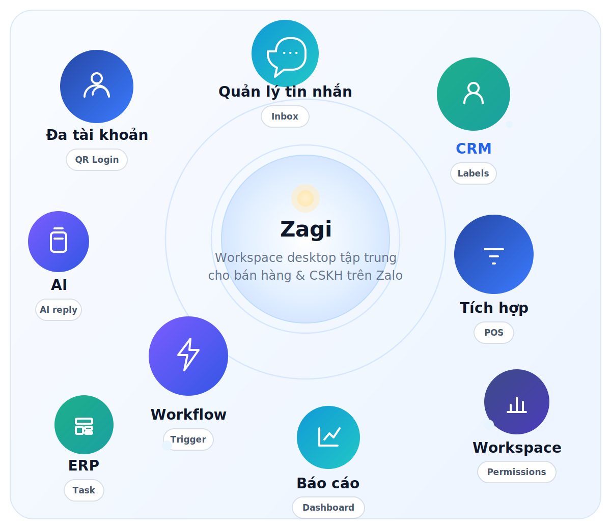
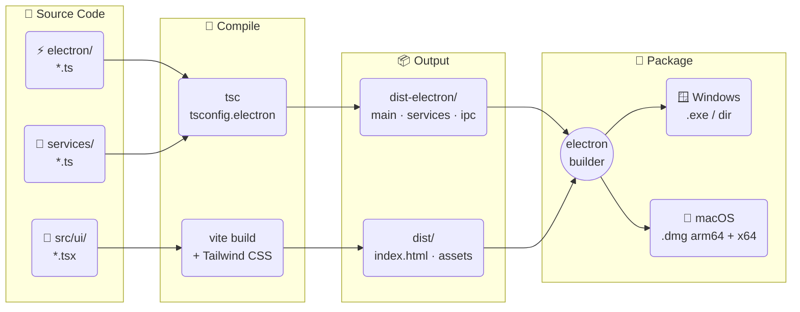
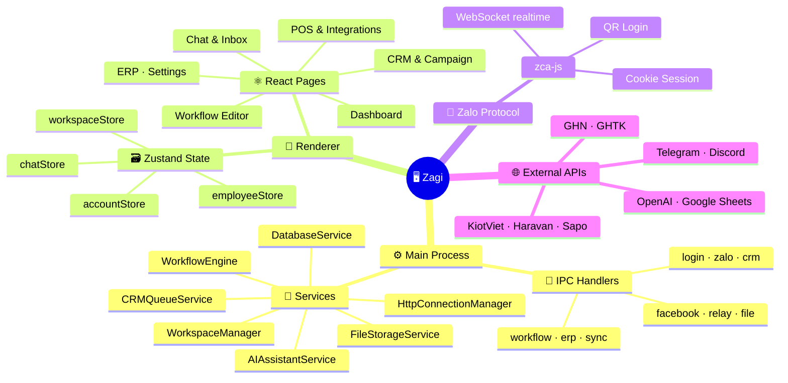
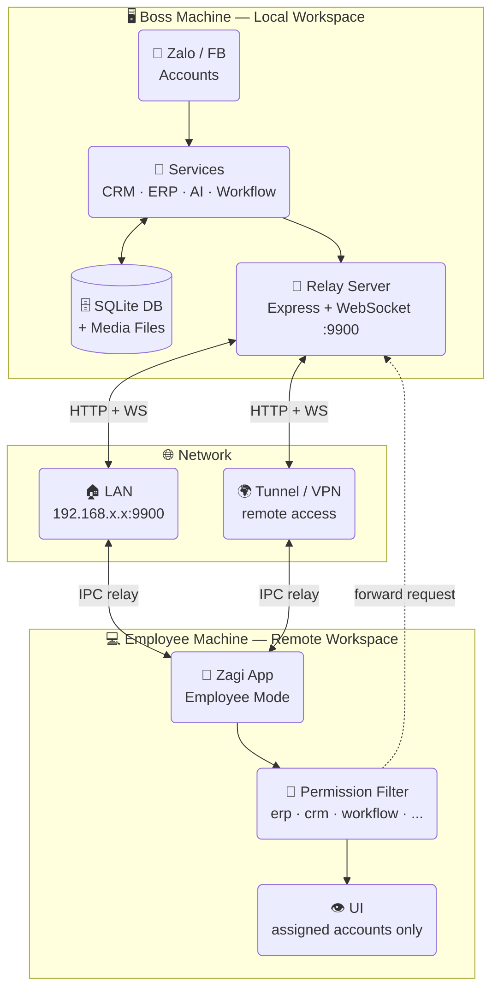
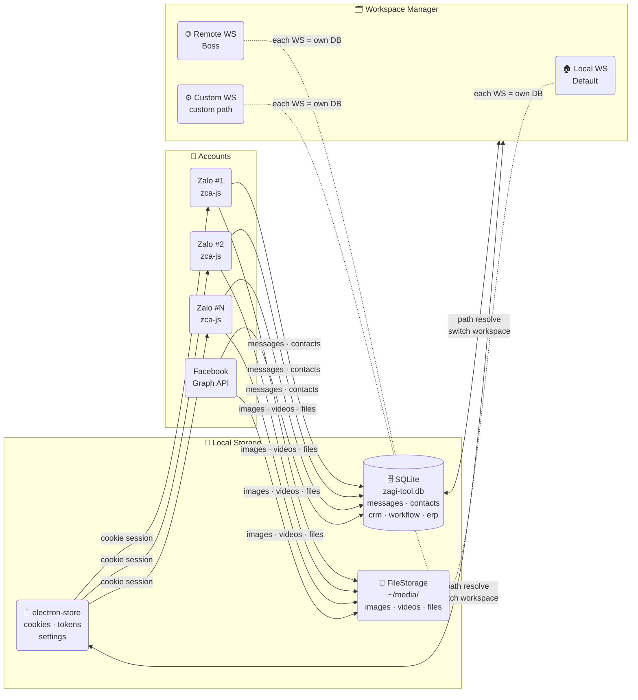

# Zagi

<p>
  <strong>🌐 Language:</strong>
  &nbsp;🇻🇳 <a href="./README.md">Tiếng Việt</a>
  &nbsp;|&nbsp;
  🇬🇧 <strong>English</strong>
</p>

*Introduction*:  https://itngon.com/zagi

---

> A multi-account Zalo desktop app with integrated CRM, ERP, POS, Workflow automation and AI Assistant — helping sales, customer care teams and marketing operate centrally in one single application.

[](#)
[](#-runtime-requirements)
[](#)
[](#)
[](#)
[](#)
[](#)
[](#)
[](#)
[](https://tlavietnam.sg.larksuite.com/share/base/form/shrlgxzOCTqFepNvhl8wms2vpWg)

### ⬇️ Quick Download

<p>
  <a href="https://github.com/trithucnen-max/zagi-builder/releases/latest/download/Zagi-Setup-26.4.3.exe">
    
  </a>
  &nbsp;
  <a href="https://github.com/trithucnen-max/zagi-builder/releases/latest/download/Zagi-26.4.3-arm64.dmg">
    
  </a>
  &nbsp;
  <a href="https://github.com/trithucnen-max/zagi-builder/releases/latest/download/Zagi-26.4.3.dmg">
    
  </a>
</p>

👉 All releases: https://github.com/trithucnen-max/zagi-builder/releases

<details>
<summary>⚠️ Security warning on first launch (blocked by Windows / macOS)</summary>

Zagi is not code-signed (we're bootstrapped), so your OS may show a warning when opening the installer.

---

### 🪟 Windows (.exe)

Windows may show **"Windows protected your PC"**:

👉 How to proceed:
1. Click **More info**
2. Click **Run anyway**

---

### 🍎 macOS (.dmg)

macOS may show **"cannot be opened because it is from an unidentified developer"**

👉 How to proceed:

**Option 1:**
- Right-click the file → **Open**
- Click **Open** again

**Option 2 (if still blocked):**
1. Go to **System Settings → Privacy & Security**
2. Scroll down to Security
3. Click **Open Anyway**

</details>

<p align="center">
  
</p>

## 🛠️ Tech Stack

- **Core library:** zca-js — https://github.com/RFS-ADRENO/zca-js
- **Languages:** TypeScript, JavaScript, SQL, HTML, CSS
- **Desktop:** Electron, React, Vite
- **UI:** Tailwind CSS, PostCSS, React Router
- **Local storage:** SQLite via `better-sqlite3`
- **State & UI:** Zustand, React Flow, Recharts, Quill
- **Backend services:** Node.js + Express
- **Integrations & automation:** Axios, Google APIs / Sheets, node-cron, Discord.js, Telegram Bot API, OpenAI API, etc.

---

## 🗺️ Architecture & Flow Diagrams

---

### 1️⃣ Build Pipeline



---

### 2️⃣ Runtime Architecture



---

### 3️⃣ Boss ↔ Employee Model



> Employees have **no local DB** — all actions are relayed to the Boss machine and filtered by the configured permission set.

---

### 4️⃣ Multi-account & Local Storage



> Each **Workspace** has its own independent DB + media folder.
> You can move the data directory to another drive without losing any data.

---

## Installation

<details>
<summary>🛠️ Build from source</summary>

### Requirements

- Windows 10/11 or macOS
- Node.js 18+ recommended
- npm 9+

### Install dependencies

```powershell
npm install --legacy-peer-deps
```

### Run in development mode

```powershell
npm run dev
```

### Build production app

```powershell
npm run production
```

### Local data

- App data uses local SQLite
- Storage directory can be changed in `Settings`

</details>

## 🚀 What is Zagi?

At a glance, Zagi is:

- **Zalo operations hub** — multi-account, unified inbox, fast reply
- **Customer management layer** — CRM, labels, interaction history, campaigns
- **Automation layer** — workflow, AI, background triggers and actions
- **Business integration layer** — POS, shipping, APIs and external tools
- **Internal management layer** — reports, ERP, permissions, employee workspaces

## ✨ Highlights

- 👤 **Multi-account Zalo** — unlimited accounts, quick switching
- 💬 **Unified inbox** — merged mode combines conversations from all accounts in one view
- 👥 **CRM & Campaigns** — manage contacts, labels, internal notes, re-engage existing customers; scan hidden group members to find new leads
- ⚙️ **Workflow automation** — drag-and-drop Trigger → Node → Action, or use AI to build flows — runs 24/7 without code
- 🤖 **AI Assistant** — reply suggestions, in-chat AI, auto-classify and respond to customers around the clock
- 🔗 **External integrations** — POS, shipping, payments, Google Sheets, Telegram, Discord, Email, HTTP Request — usable in chat and workflow
- 📈 **Reports & analytics** — track messages, contacts, labels, employees, campaigns, workflows, AI usage
- 🗂️ **Internal ERP** — tasks, calendar, notes and team operations in the same system
- 🧑‍💼 **Boss ↔ Employee workspace** — multiple devices manage one account, granular permissions, per-employee performance tracking
- 🔒 **Local-first data** — all data stays on the user's machine

### Screenshots

Screens are ordered by typical usage flow: dashboard → chat → CRM → workflow → POS / reports / ERP.

<table>
  <tr>
    <td>
      
      <br />
      <sub><strong>Multi-account dashboard</strong></sub>
    </td>
    <td>
      
      <br />
      <sub><strong>Unified inbox with AI</strong></sub>
    </td>
    <td>
      
      <br />
      <sub><strong>CRM & contacts</strong></sub>
    </td>
  </tr>
  <tr>
    <td>
      
      <br />
      <sub><strong>Group member scanning</strong></sub>
    </td>
    <td>
      
      <br />
      <sub><strong>Mass messaging campaigns</strong></sub>
    </td>
    <td>
      
      <br />
      <sub><strong>Workflow editor</strong></sub>
    </td>
  </tr>
  <tr>
    <td>
      
      <br />
      <sub><strong>Workflow node detail</strong></sub>
    </td>
    <td>
      
      <br />
      <sub><strong>AI workflow generation</strong></sub>
    </td>
    <td>
      
      <br />
      <sub><strong>POS, shipping & payments</strong></sub>
    </td>
  </tr>
  <tr>
    <td>
      
      <br />
      <sub><strong>Reports & analytics</strong></sub>
    </td>
    <td>
      
      <br />
      <sub><strong>Employee reports</strong></sub>
    </td>
    <td>
      
      <br />
      <sub><strong>Internal ERP</strong></sub>
    </td>
  </tr>
</table>

## 🎯 Who is it for?

- Online shops and sales teams closing deals via Zalo
- SMEs that need multiple staff handling the inbox simultaneously
- Marketing agencies or freelancers managing multiple client accounts
- Spas, clinics, education, F&B — any business that needs recurring customer care
- Teams wanting to combine chat, CRM, workflow, AI and ERP in one desktop app

## 🧩 Core feature groups

### 1) Multi-account & unified inbox
- Log in to multiple Zalo accounts via QR Code
- Visual account management dashboard
- Merge accounts into a single unified inbox
- Search by name, nickname, phone number
- Quick filters: unread, unanswered, labels, conversation status

### 2) Full-featured chat
- Send text, images, video, files
- Emoji, stickers, reply, mention members
- Polls, group notes, reminders, contact cards
- Quick messages — save templates and trigger by keyword
- Unlimited message pinning, media and attachment management

### 3) CRM & customer care
- Sync friends, group members and contact profiles
- Store phone, gender, birthday, internal notes
- Create and manage Zalo labels bi-directionally
- Filter contacts by multiple criteria for targeted outreach
- Create campaigns: mass message, add friend, invite to group — with real-time progress

### 4) Workflow automation
- No-code drag-and-drop workflow builder
- AI assistant generates nodes from a plain-text prompt
- Triggers: message received, label applied, reaction, cron schedule, group events…
- Actions: send message/image/file, find user, manage group, mute, forward, recall…
- Integrations: logic, Google Sheets, AI, Telegram, Discord, Email, Notion, HTTP Request
- Execution history for easy inspection and debugging

### 5) Sales integrations
- POS: KiotViet, Haravan, Sapo, Nhanh.vn, Pancake POS
- Shipping: GHN, GHTK
- AI Assistant for reply suggestions and quick in-chat responses
- Easy to combine into end-to-end sales and customer care pipelines

### 6) Reports, ERP & employee management
- Reports: messages, contacts, campaigns, workflows, AI, employees
- Internal ERP: Tasks, Calendar, Notes
- Boss ↔ employee model with relay server and module-level permissions
- Track work performance per person and per time period

## 🔒 Security & data

Zagi prioritizes a local-first architecture:

- All messages, contacts, CRM data, settings and media are stored on the user's machine
- Login via QR Code — no Zalo password stored; cookies are encrypted on-device
- Users can move the storage directory to another drive at any time
- Ideal for teams that require strict internal data control

## 💻 Runtime requirements

- Stable 24/7 internet connection for conversation sync and automation
- Keep the app running continuously when using workflows or managing a team

---

## 📣 Contact & support

- Bug reports, feature requests, questions: 👉 [Submit a ticket here](https://tlavietnam.sg.larksuite.com/share/base/form/shrlgxzOCTqFepNvhl8wms2vpWg)

## 🙏 Acknowledgements

Zagi would like to thank the project: 👉 https://github.com/RFS-ADRENO/zca-js and https://github.com/babyvibe/deplao-builder
Without the contributions and foundation from this project, Zagi would not have been possible. We deeply appreciate the value the open-source community brings 💙

---
