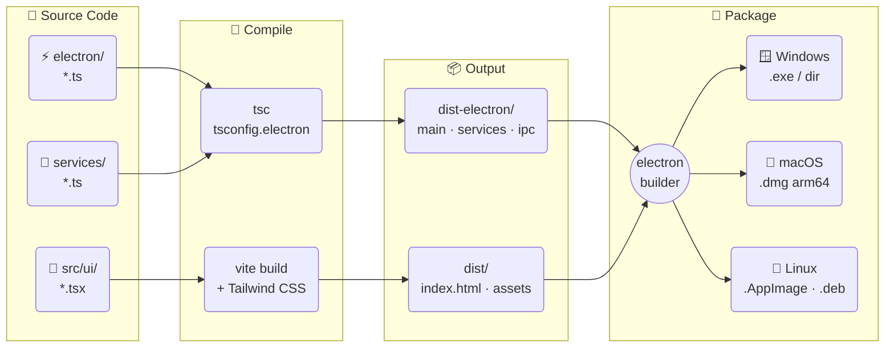
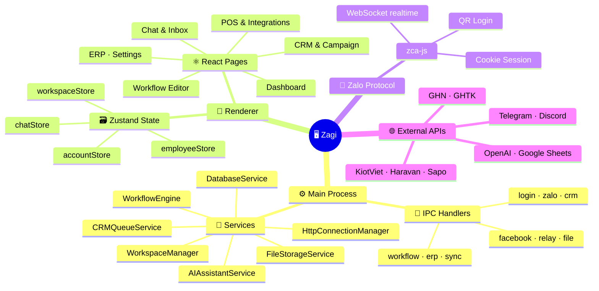
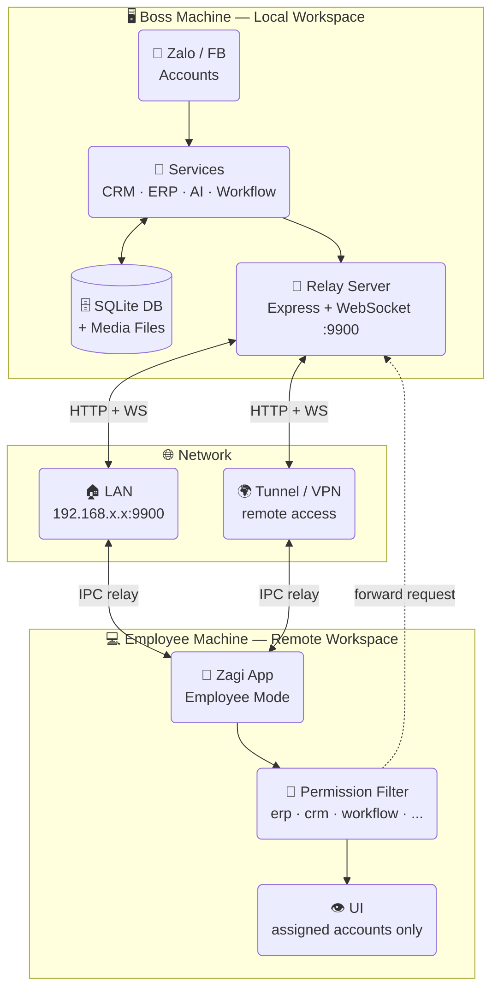
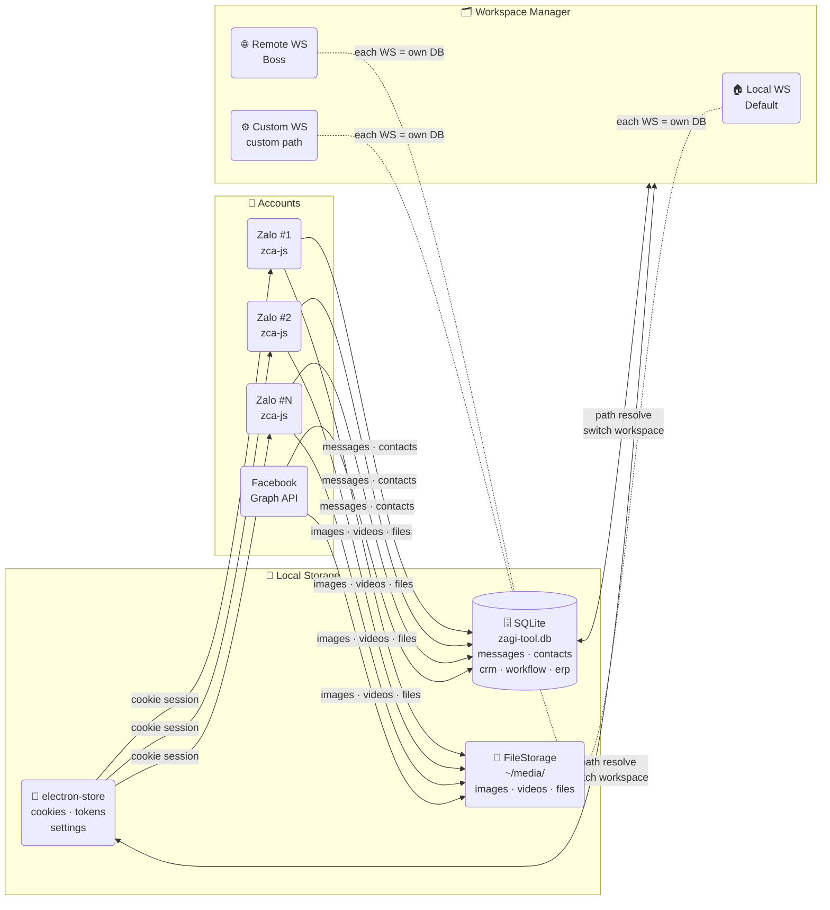

# Zagi
*Website Introduction*:  https://zagi.app/

<p>
  <strong>🌐 Language:</strong>
  &nbsp;🇻🇳 <a href="./README.md">Tiếng Việt</a>
  &nbsp;|&nbsp;
  🇬🇧 <strong>English</strong>
</p>

---

> A multi-account Zalo & Facebook desktop app with integrated CRM, ERP, POS, Workflow automation and AI Assistant — helping sales, customer care teams and marketing operate centrally on Zalo and Facebook in one single application.

[](https://github.com/trithucnen-max/zagi-builder/releases/latest)
[](https://github.com/trithucnen-max/zagi-builder/releases)
[](#-runtime-requirements)
[](#)
[](#)
[](#)
[](#)
[](#)
[](#)
[](#license)
[](https://github.com/trithucnen-max/zagi-builder/issues)

<p align="center">
  <a href="#-download">📥 Download</a> &nbsp;|&nbsp;
  <a href="#-tech-stack">🛠️ Tech Stack</a> &nbsp;|&nbsp;
  <a href="#installation">📦 Install</a> &nbsp;|&nbsp;
  <a href="#-core-feature-groups">✨ Features</a> &nbsp;|&nbsp;
  <a href="#-security-data">🔒 Security</a> &nbsp;|&nbsp;
  <a href="#-license">📝 MIT</a> &nbsp;|&nbsp;
  <a href="#-contact-support">📞 Contact</a>
</p>

---

## ⬇️ Download

<table>
<tr>
<td align="center" width="50%">

<a href="https://github.com/trithucnen-max/zagi-builder/releases/latest/download/Zagi-Setup-27.1.1.exe">

</a>

<big><strong>Zagi-Setup-27.1.1.exe</strong></big>

</td>
<td align="center" width="50%">

<a href="https://github.com/trithucnen-max/zagi-builder/releases/latest/download/Zagi-27.1.1-arm64.dmg">

</a>

<big><strong>Zagi-27.1.1-arm64.dmg</strong></big>

</td>
</tr>
<tr>
<td align="center" width="50%">

<a href="https://github.com/trithucnen-max/zagi-builder/releases/latest/download/Zagi-27.1.1.AppImage">

</a>

<big><strong>Zagi-27.1.1.AppImage</strong></big><br>
<big>works on any distro — <code>chmod +x</code> & run</big>

</td>
<td align="center" width="50%">

<a href="https://github.com/trithucnen-max/zagi-builder/releases/latest/download/Zagi-27.1.1.dmg">

</a>

<big><strong>Zagi-27.1.1.dmg</strong></big>

</td>
</tr>
</table>

<p align="center">
👉 <strong><a href="https://github.com/trithucnen-max/zagi-builder/releases">View all releases</a></strong>
</p>

<details>
<summary>⚠️ Security warning on first launch (blocked by Windows / macOS / Linux)</summary>

Zagi is not code-signed (we're bootstrapped), so your OS may show a warning when opening the installer.

---

### 🪟 Windows (.exe)

Windows may show **"Windows protected your PC"**:

👉 How to proceed:
1. Click **More info**
2. Click **Run anyway**

---

### 🍎 macOS (.dmg)

macOS may show **"cannot be opened because it is from an unidentified developer"**

👉 How to proceed:

**Option 1:**
- Right-click the file → **Open**
- Click **Open** again

**Option 2 (if still blocked):**
1. Go to **System Settings → Privacy & Security**
2. Scroll down to Security
3. Click **Open Anyway**

---

### 🐧 Ubuntu Linux (.AppImage)

After downloading the `.AppImage` file:

```bash
chmod +x Zagi-*.AppImage
./Zagi-*.AppImage
```

> If you get "FUSE: fuse2 not available", install `libfuse2`:
> ```bash
> sudo apt install libfuse2
> ```

Or install the `.deb` package:
```bash
sudo dpkg -i Zagi_*_amd64.deb
```

</details>

<p align="center">
  
</p>

## 🛠️ Tech Stack

- **Core library:** zca-js — https://github.com/RFS-ADRENO/zca-js, fbchat-v2 (Facebook E2EE bridge Go)
- **AI Gateway:** 9router
- **Languages:** TypeScript, JavaScript, SQL, HTML, CSS
- **Desktop:** Electron, React, Vite
- **UI:** Tailwind CSS, PostCSS, React Router
- **Local storage:** SQLite via `better-sqlite3`
- **State & UI:** Zustand, React Flow, Recharts, Quill
- **Backend services:** Node.js + Express
- **Integrations & automation:** Axios, Google APIs / Sheets, node-cron, Discord.js, Telegram Bot API, OpenAI API, etc.

---

## 🗺️ Architecture & Flow Diagrams

---

### 1️⃣ Build Pipeline



---

### 2️⃣ Runtime Architecture



---

### 3️⃣ Boss ↔ Employee Model



> Employees still have their **own workspace** (DB, media) on their machine. Since Zalo only allows one connection at a time, all Zalo requests are **relayed to the Boss** for processing based on the configured permissions.

---

### 4️⃣ Multi-account & Local Storage



> Each **Workspace** has its own independent DB + media folder.
> You can move the data directory to another drive without losing any data.

---

## Installation

<details>
<summary>🛠️ Build from source</summary>

### Requirements

- Windows 10/11, macOS (Apple Silicon), or Ubuntu 20.04+
- Node.js 18+ recommended
- npm 9+

### Install dependencies

```powershell
npm install --legacy-peer-deps
```

### Run in development mode

```powershell
npm run dev
```

### Build production app

```powershell
npm run production
```

### Local data

- App data uses local SQLite
- Storage directory can be changed in `Settings`

</details>

## 🚀 What is Zagi?

At a glance, Zagi is:

- **Zalo operations hub** — multi-account, unified inbox, fast reply
- **Customer management layer** — CRM, labels, interaction history, campaigns
- **Automation layer** — workflow, AI (including campaign copywriting assistant), background triggers and actions
- **Business integration layer** — POS, shipping, APIs and external tools
- **Internal management layer** — reports, ERP, permissions, employee workspaces

## ✨ Highlights

- 👤 **Multi-account Zalo** — unlimited accounts, quick switching
- 💬 **Unified inbox** — merged mode combines conversations from all accounts in one view
- 👥 **CRM & Campaigns** — manage contacts, labels, internal notes, re-engage existing customers; scan hidden group members to find new leads
- ⚙️ **Workflow automation** — drag-and-drop Trigger → Node → Action, or use AI to build flows — runs 24/7 without code
- 🤖 **AI Assistant** — reply suggestions, in-chat AI, auto-classify and respond to customers around the clock. Built-in copywriting assistant for CRM campaign content.
- 🔗 **External integrations** — POS, shipping, payments, Google Sheets, Telegram, Discord, Email, HTTP Request — usable in chat and workflow
- 📈 **Reports & analytics** — track messages, contacts, labels, employees, campaigns, workflows, AI usage
- 🗂️ **Internal ERP** — tasks, calendar, notes and team operations in the same system
- 🧑‍💼 **Boss ↔ Employee workspace** — connect over **LAN or WAN** (Cloudflare Tunnel), granular permissions, per-employee performance tracking
- 🔒 **Per-account proxy** — assign an independent HTTP/HTTPS/SOCKS5 proxy to each Zalo account before login
- 🔐 **Local-first data** — all data stays on the user's machine

### Screenshots

Screens are ordered by typical usage flow: dashboard → chat → CRM → workflow → POS / reports / ERP.

<table>
  <tr>
    <td>
      
      <br />
      <sub><strong>Multi-account dashboard</strong></sub>
    </td>
    <td>
      
      <br />
      <sub><strong>Unified inbox with AI</strong></sub>
    </td>
    <td>
      
      <br />
      <sub><strong>CRM & contacts</strong></sub>
    </td>
  </tr>
  <tr>
    <td>
      
      <br />
      <sub><strong>Group member scanning</strong></sub>
    </td>
    <td>
      
      <br />
      <sub><strong>Mass messaging campaigns</strong></sub>
    </td>
    <td>
      
      <br />
      <sub><strong>Workflow editor</strong></sub>
    </td>
  </tr>
  <tr>
    <td>
      
      <br />
      <sub><strong>Workflow node detail</strong></sub>
    </td>
    <td>
      
      <br />
      <sub><strong>AI workflow generation</strong></sub>
    </td>
    <td>
      
      <br />
      <sub><strong>POS, shipping & payments</strong></sub>
    </td>
  </tr>
  <tr>
    <td>
      
      <br />
      <sub><strong>Reports & analytics</strong></sub>
    </td>
    <td>
      
      <br />
      <sub><strong>Employee reports</strong></sub>
    </td>
    <td>
      
      <br />
      <sub><strong>Internal ERP</strong></sub>
    </td>
  </tr>
</table>

## 🎯 Who is it for?

- Online shops and sales teams closing deals via Zalo
- SMEs that need multiple staff handling the inbox simultaneously
- Marketing agencies or freelancers managing multiple client accounts
- Spas, clinics, education, F&B — any business that needs recurring customer care
- Teams wanting to combine chat, CRM, workflow, AI and ERP in one desktop app

## 🧩 Core feature groups

### 1) Multi-account & unified inbox
- Log in to multiple Zalo accounts via QR Code
- Visual account management dashboard
- Merge accounts into a single unified inbox
- Search by name, nickname, phone number
- Quick filters: unread, unanswered, labels, conversation status
- **Per-account proxy**: assign an independent HTTP/HTTPS/SOCKS5 proxy to each Zalo account before login — fully isolated IPs across accounts

### 2) Full-featured chat
- Send text, images, video, files
- Emoji, stickers, reply, mention members
- Polls, group notes, reminders, contact cards
- Quick messages — save templates and trigger by keyword
- Unlimited message pinning, media and attachment management

### 3) CRM & customer care
- Sync friends, group members and contact profiles
- Store phone, gender, birthday, internal notes
- Create and manage Zalo labels bi-directionally
- Filter contacts by multiple criteria for targeted outreach
- Create campaigns: mass message, add friend, invite to group — with real-time progress

### 4) Workflow automation
- No-code drag-and-drop workflow builder
- AI assistant generates nodes and workflows from plain-text commands (see section 7)
- Triggers: message received, label applied, reaction, cron schedule, group events…
- Actions: send message/image/file, find user, manage group, mute, forward, recall…
- Integrations: logic, Google Sheets, AI, Telegram, Discord, Email, Notion, HTTP Request
- Execution history for easy inspection and debugging

### 5) Sales integrations
- POS: KiotViet, Haravan, Sapo, Nhanh.vn, Pancake POS
- Shipping: GHN, GHTK
- AI Assistant with reply suggestions and in-chat Q&A (see section 7)
- Easy to combine into end-to-end sales and customer care pipelines

### 6) Reports, ERP & employee management
- Reports: messages, contacts, campaigns, workflows, AI, employees
- Internal ERP: Tasks, Calendar, Notes
- Boss ↔ employee model with relay server and module-level permissions
- Track work performance per person and per time period

### 7) 🤖 AI Assistant
- Smart reply suggestions in Zalo and Facebook conversations
- Real-time Q&A with AI directly in the chat window
- Create workflows using plain natural language commands — no drag-and-drop needed
- Use AI action nodes in workflows to build 24/7 auto-reply chatbots
- Multi-platform AI support: OpenAI, Claude, Gemini and 9Router (local AI gateway)

## 🔒 Security & data

Zagi prioritizes a local-first architecture:

- All messages, contacts, CRM data, settings and media are stored on the user's machine
- Login via QR Code — no Zalo password stored; cookies are encrypted on-device
- Users can move the storage directory to another drive at any time
- Ideal for teams that require strict data control

## 💻 Runtime requirements

- Stable 24/7 internet connection for conversation sync and automation
- Keep the app running continuously when using workflows or managing a team

---

## 📋 Changelog

<details>
<summary><strong>v27.1.1</strong> — 2026-06-20 · <em>Current version</em></summary>

### 🚀 Highlights

- 🎨 Full CRM UI overhaul — contact list, filters and label management redesigned
- ⚡ Optimized rendering performance for large contact lists (>10,000 contacts)
- 🤖 Improved AI Assistant — higher reply suggestion accuracy

### ✨ New features

- **Enhanced CRM**: Multi-criteria contact filter with new sidebar UI
- **Bulk actions**: Select multiple contacts and perform batch operations
- **Advanced export**: Export CRM data to properly-formatted Excel files

### ⚡ Improvements

- 3x faster contact list loading vs. previous version
- Better memory usage when running many accounts simultaneously
- More responsive UI on smaller screens

### 🐛 Bug fixes

- Fixed contact search returning no results when phone number contains spaces
- Fixed labels not updating in real-time when changed from the chat screen

</details>

<details>
<summary><strong>v26.6.4</strong> — 2026-06-20</summary>

### 🚀 Highlights

- 👤 Auto-refresh Zalo avatar on startup
- ✏️ Facebook E2EE supports viewing message edit history
- 📞 Suggest sending Zalo contact card from phone number in chat
- 🖼️ Zalo contact card supports quick friend request
- 🚫 Facebook correctly displays system notifications
- ℹ️ Auto-fetch name and avatar when opening a new conversation
- 👤 Boss–employee data loading and message sending optimized

</details>

<details>
<summary><strong>v26.6.3</strong> — 2026-06-17</summary>

### 🚀 Highlights

- 🐧 Ubuntu/Linux support (.AppImage + .deb) with automated CI/CD builds
- 📡 More stable Facebook with auto-reconnect on disconnection
- 🤖 Zalo & Facebook workflows can send messages to multiple conversations at once
- 📹 Watch Facebook videos directly in chat
- 📤 Employee Zalo auto-uploads images, videos and voice to boss before proxying

</details>

<details>
<summary><strong>v26.6.2</strong> — 2026-06-16</summary>

### ✨ New features

- 🔐 Facebook login with email/phone + password + 2FA (no manual cookie extraction)
- 🔔 Per-account notification settings (sound and corner alerts)
- 🤖 AI Assistant now supports OpenRouter

### 🐛 Bug fixes

- Fixed some free AI models on 9Router failing to connect
- Fixed Zalo forward node not forwarding messages and images
- Fixed deleted accounts still maintaining background connections
- Fixed Sapo integration connection issue

</details>

<details>
<summary><strong>v26.6.0</strong> — 2026-06-14</summary>

### 🚀 Highlights

- 🤖 Facebook Messenger E2EE integration (read/send end-to-end encrypted messages)
- 📊 CRM Facebook data scanner (groups, fanpages, posts, members, comments)
- ⚡ Facebook Workflow with multiple Triggers & Actions
- 🤖 9Router AI Gateway integration

</details>

<details>
<summary><strong>v26.4.0 → v26.4.8</strong> — 2026-05-20 to 2026-06-07</summary>

### 🎉 Official Zagi launch

First full-featured release:
- Multi-account Zalo & unified inbox
- CRM, Campaign, Workflow automation
- AI Assistant (OpenAI, Claude, Gemini, 9Router)
- POS, shipping, external integrations
- Internal ERP & Boss ↔ Employee model
- Comprehensive reports & analytics
- Screen lock, bulk message forwarding, auto image repair
- Boss–employee LAN/WAN relay with Cloudflare Tunnel
- Per-account proxy management

</details>

👉 **[View all releases on GitHub](https://github.com/trithucnen-max/zagi-builder/releases)**

---

## 📣 Contact & support

- Bug reports, feature requests, questions: 👉 [Open an issue](https://github.com/trithucnen-max/zagi-builder/issues)

## 🙏 Acknowledgements

Zagi would like to thank the project:
👉 https://github.com/RFS-ADRENO/zca-js
👉 https://github.com/m008v/fbchat-v2
Without the contributions and foundation from this project, Zagi would not have been possible.

---

## 📝 License

This project is distributed under the **MIT License**.  
See the [LICENSE](LICENSE) file for details.

---
