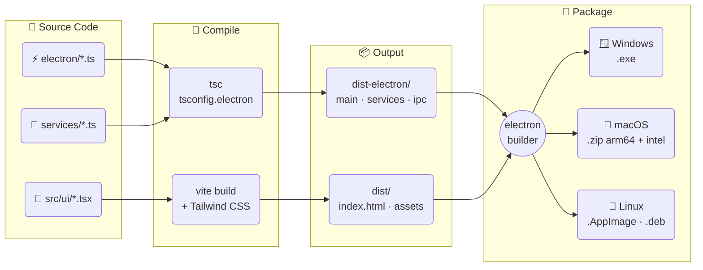
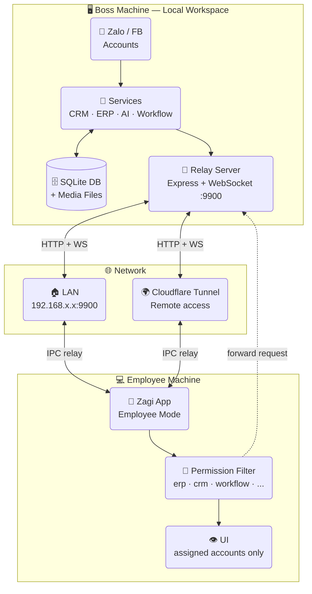

<div align="center">

# ⚡ Zagi

**Multi-account Zalo & Facebook desktop app**  
with CRM · ERP · POS · Workflow Automation · AI Assistant

<p>
  <a href="https://itngon.com/zagi/">🌐 itngon.com/zagi</a> &nbsp;|&nbsp;
  <a href="./README.md">🇻🇳 Tiếng Việt</a> &nbsp;|&nbsp;
  <strong>🇬🇧 English</strong>
</p>

[](https://github.com/trithucnen-max/zagi-builder/releases/latest)
[](https://github.com/trithucnen-max/zagi-builder/releases)
[](#download)
[](#)
[](#)
[](#)
[](#)
[](#license)

<p>
  <a href="#download">📥 Download</a> &nbsp;·&nbsp;
  <a href="#features">✨ Features</a> &nbsp;·&nbsp;
  <a href="#screenshots">📸 Screenshots</a> &nbsp;·&nbsp;
  <a href="#changelog">📋 Changelog</a> &nbsp;·&nbsp;
  <a href="#build-from-source">🛠️ Build</a> &nbsp;·&nbsp;
  <a href="#security">🔒 Security</a>
</p>

</div>

---

> 🚀 A single desktop app that lets sales, customer care, and marketing teams **centrally manage all Zalo & Facebook activity** — multi-account chat, CRM, campaigns, workflow automation, AI assistant, and internal reporting.

---

## 📥 Download

> **Latest version: v27.1.8** — [View all versions](#changelog)

<table>
<tr>
<td align="center" width="25%">

### 🪟 Windows

[](https://github.com/trithucnen-max/zagi-builder/releases/latest/download/Zagi-Setup-27.1.8-x64.exe)

**[Zagi-Setup-27.1.8-x64.exe](https://github.com/trithucnen-max/zagi-builder/releases/latest/download/Zagi-Setup-27.1.8-x64.exe)**

NSIS Installer · ~148 MB

</td>
<td align="center" width="25%">

### 🍎 macOS M1+

[](https://github.com/trithucnen-max/zagi-builder/releases/latest/download/Zagi-27.1.8-arm64-mac.zip)

**[Zagi-27.1.8-arm64-mac.zip](https://github.com/trithucnen-max/zagi-builder/releases/latest/download/Zagi-27.1.8-arm64-mac.zip)**

Apple Silicon · ~160 MB

</td>
<td align="center" width="25%">

### 🍎 macOS Intel

[](https://github.com/trithucnen-max/zagi-builder/releases/latest/download/Zagi-27.1.8-mac.zip)

**[Zagi-27.1.8-mac.zip](https://github.com/trithucnen-max/zagi-builder/releases/latest/download/Zagi-27.1.8-mac.zip)**

Intel x64 · ~165 MB

</td>
<td align="center" width="25%">

### 🐧 Linux

[](https://github.com/trithucnen-max/zagi-builder/releases/latest/download/Zagi-27.1.8.AppImage)

**[Zagi-27.1.8.AppImage](https://github.com/trithucnen-max/zagi-builder/releases/latest/download/Zagi-27.1.8.AppImage)**  
**[zagi_27.1.8_amd64.deb](https://github.com/trithucnen-max/zagi-builder/releases/latest/download/zagi_27.1.8_amd64.deb)**

AppImage + .deb · ~197 MB

</td>
</tr>
<tr>
<td align="center" colspan="4">

### 💻 Surface (Windows ARM64)

> For **Surface Pro X, Pro 9 5G, Pro 10, Pro 11, Laptop 7** (Qualcomm Snapdragon / ARM64 chip)
> 
> Surface Pro 7 and older (Intel) → use the Windows x64 build above.

[](https://github.com/trithucnen-max/zagi-builder/releases/latest/download/Zagi-Setup-27.1.8-arm64.exe)

**[Zagi-Setup-27.1.8-arm64.exe](https://github.com/trithucnen-max/zagi-builder/releases/latest/download/Zagi-Setup-27.1.8-arm64.exe)**

NSIS Installer ARM64 · ~148 MB · Native performance on Surface ARM

</td>
</tr>
</table>

<p align="center">
  👉 <strong><a href="https://github.com/trithucnen-max/zagi-builder/releases">View all releases →</a></strong>
</p>

<details>
<summary>⚠️ Security warning on first launch (Windows / macOS / Linux)</summary>

Zagi is not code-signed (we're bootstrapped), so your OS may show a warning when opening the installer.

### 🪟 Windows & Surface — "Windows protected your PC"

1. Click **More info**
2. Click **Run anyway**

> ⚠️ **Surface ARM64**: If you use **Surface Pro X / Pro 9 5G / Pro 10 / Pro 11 / Laptop 7**, download `Zagi-Setup-27.1.8-arm64.exe` for native ARM64 performance — better battery life and faster than running the x64 build under emulation.
> 
> **Surface Pro 7 and older (Intel x64)**: use the standard `Zagi-Setup-27.1.8-x64.exe`.

### 🍎 macOS — "cannot be opened because it is from an unidentified developer"

**Option 1:** Right-click the file → **Open** → **Open**

**Option 2:** System Settings → Privacy & Security → **Open Anyway**

### 🐧 Linux (AppImage)

```bash
chmod +x Zagi-27.1.8.AppImage
./Zagi-27.1.8.AppImage
```

If you get "FUSE not available":
```bash
sudo apt install libfuse2
```

Or use `.deb`:
```bash
sudo dpkg -i zagi_27.1.8_amd64.deb
```

</details>

---

## 📸 Screenshots

<p align="center">
  
</p>

<table>
  <tr>
    <td><br/><sub><strong>Multi-account dashboard</strong></sub></td>
    <td><br/><sub><strong>Unified inbox + AI</strong></sub></td>
    <td><br/><sub><strong>CRM & contacts</strong></sub></td>
  </tr>
  <tr>
    <td><br/><sub><strong>Group member scanning</strong></sub></td>
    <td><br/><sub><strong>Mass messaging campaigns</strong></sub></td>
    <td><br/><sub><strong>Workflow automation</strong></sub></td>
  </tr>
  <tr>
    <td><br/><sub><strong>Workflow node detail</strong></sub></td>
    <td><br/><sub><strong>AI workflow generation</strong></sub></td>
    <td><br/><sub><strong>POS, shipping & payments</strong></sub></td>
  </tr>
  <tr>
    <td><br/><sub><strong>Reports & analytics</strong></sub></td>
    <td><br/><sub><strong>Employee performance</strong></sub></td>
    <td><br/><sub><strong>Internal ERP</strong></sub></td>
  </tr>
</table>

---

## ✨ Features

### 1️⃣ Multi-account & Unified Inbox

- Log in to multiple Zalo accounts via QR Code
- Visual account management dashboard
- Merge all accounts into a **single unified inbox**
- Search by name, nickname, phone number
- Quick filters: unread, unanswered, labels, conversation status
- **Per-account proxy**: assign independent HTTP/HTTPS/SOCKS5 proxy per Zalo account

### 2️⃣ Full-featured Chat

- Send text, images, video, files
- Emoji, stickers, reply, mention members
- Polls, group notes, reminders, contact cards
- Quick messages — save templates and trigger by keyword
- Unlimited message pinning, media and attachment management

### 3️⃣ CRM & Customer Care

- Sync friends, group members and contact profiles
- Store phone, gender, birthday, internal notes
- Create and manage Zalo labels bi-directionally
- Filter contacts by multiple criteria for targeted outreach
- Group Management & Bulk Leave (v27.1.3): Automatically leave multiple groups, auto-owner transfer before leaving to prevent losing group control, send AI farewell message
- Campaigns: mass message, add friend, invite to group — smart safety warnings (Red/Yellow) & real-time progress tracking (v27.1.3)

### 4️⃣ Workflow Automation

- No-code drag-and-drop workflow builder
- AI generates nodes and workflows from plain-text commands
- Triggers: message received, label applied, reaction, cron schedule, group events…
- Actions: send message/image/file, find user, manage group, mute, forward, recall…
- Integrations: logic, Google Sheets, AI, Telegram, Discord, Email, Notion, HTTP Request
- Execution history for easy inspection and debugging

### 5️⃣ Sales Integrations

- POS: KiotViet, Haravan, Sapo, Nhanh.vn, Pancake POS
- Shipping: GHN, GHTK
- AI reply suggestions and in-chat Q&A
- Combine into end-to-end sales and customer care pipelines

### 6️⃣ Reports, ERP & Employee Management

- Reports: messages, contacts, campaigns, workflows, AI, employees
- Internal ERP: Tasks, Calendar, Notes
- Boss ↔ employee model with relay server and module-level permissions
- Track work performance per person and per time period

### 7️⃣ 🤖 AI Assistant

- Smart reply suggestions in Zalo and Facebook conversations
- Real-time Q&A with AI directly in the chat window
- **Conversation summary** — renders beautifully with bullet points and bold text (v27.1.2)
- Create workflows using plain natural language — no drag-and-drop needed
- Use AI action nodes in workflows to build 24/7 auto-reply chatbots
- Multi-platform AI: OpenAI, Claude, Gemini, 9Router

---

## 🔒 Security

Zagi prioritizes a **local-first** architecture:

- All messages, contacts, CRM data, settings and media are stored on the user's machine
- Login via QR Code — no Zalo password stored; cookies are encrypted on-device
- Users can move the storage directory to another drive at any time
- Ideal for teams that require strict data control

---

## 🛠️ Tech Stack

| Category | Tech |
|----------|------|
| **Core** | zca-js, fbchat-v2 (Go E2EE bridge) |
| **Desktop** | Electron 41, React 18, Vite 6 |
| **UI** | Tailwind CSS, PostCSS, React Router, Recharts, React Flow |
| **Languages** | TypeScript 5, JavaScript, SQL |
| **Storage** | SQLite (better-sqlite3), electron-store |
| **State** | Zustand |
| **Backend** | Node.js + Express |
| **AI Gateway** | 9Router, OpenAI API, Claude, Gemini |
| **Integrations** | Axios, Google Sheets, Telegram Bot, Discord.js, node-cron |

---

## 🗺️ Architecture

### Build Pipeline



### Boss ↔ Employee Model



---

## 💻 System Requirements

| | Requirement |
|---|---|
| **Windows** | Windows 10/11 (64-bit) |
| **macOS** | macOS 12+ (Apple Silicon or Intel) |
| **Linux** | Ubuntu 20.04+ or equivalent |
| **Internet** | Stable 24/7 connection for workflow & sync |
| **RAM** | 4 GB+ recommended |

---

## 🛠️ Build from Source

<details>
<summary>Build instructions</summary>

### Requirements

- Node.js 18+
- npm 9+

### Install dependencies

```bash
npm install --legacy-peer-deps
```

### Run in development

```bash
npm run dev
```

### Build production

```bash
npm run production
```

</details>

---

## 📋 Changelog

<details open>
<summary><strong>v27.1.8</strong> — 2026-06-26 · <em>🟢 Current version</em></summary>

### 🚀 Key Highlights

- 📊 **Campaign 1000-Contact Limit**: Automatically enforces a maximum of 1000 contacts per campaign. If a newly added group/list exceeds this limit, excess contacts are discarded, and a warning notification showing the added and discarded count is displayed (e.g., if a campaign has 800 contacts, adding 300 more will only append 200, discarding the remaining 100).
- 🔒 **Keyboard Shortcut Lock during Input Typing**: Automatically disables custom keyboard shortcuts (such as using Tab for layout navigation) while typing inside input fields, textareas, or contenteditable elements.
- 🏷️ **Duplicate Label Auto-Selection**: Checks case-insensitively if a newly entered local label name already exists. If a duplicate is found, the system automatically selects the existing label, clears the input box, and displays an info message instead of creating a duplicate.
- 📋 **Copy Workflow Error Details**: Added a "📋 Copy lỗi" (Copy Error) button next to workflow run-level error messages, individual node execution errors, and target picker alerts, allowing users to copy detailed error traces and response bodies to the clipboard.

</details>

<details>
<summary><strong>v27.1.7</strong> — 2026-06-26</summary>

### 🚀 Key Highlights

- 🖼️ **Workflow Multi-Image Selector & Random Sending**: Overhauled the configuration UI for sending images in Workflows (`zalo.sendImage`). Added support for picking multiple local image files via dialog, entering manual URLs, displaying a thumbnail preview grid with quick deletion buttons, and selecting a toggle checkbox to send exactly one random image or send them all as a batch.
- 🎨 **Standardized Brand Logos & Categories**: Converted brand integration panels (KiotViet, Haravan, Sapo, Nhanh.vn, Pancake, Casso, SePay, GHN, GHTK) and AI assistants to display white SVG icons on solid, brand-colored square backgrounds. DeepSeek is mapped to a sky-blue background (`bg-sky-600`) to strictly comply with the system-wide Purple Ban.
- 📖 **Built-in User Guide Tab**: Relocated the user guide modal from the sidebar to the **Settings → About → User Guide** panel with 5 organized horizontal sub-tabs, enriched with details about locked group scanning, sending multiple images/files, and POS integrations.
- 🧪 **Visual Debugger & Sandbox Simulator**: Added a "Run Sandbox" button to safely run and test workflows (no real Zalo messages sent, no real sheets written). Colorizes Canvas Edges according to execution status (green = success, red = error, gray = skipped). Enables viewing Input/Output of each Node via an info ℹ️ icon.
- 🔍 **Global CSS Zoom Engine & Button Standardization**: Added a CSS variable-based zoom handler to scale both rem elements and hardcoded Tailwind pixels cleanly without breaking the viewport height. Standardized colored buttons to always display white text/SVG icons (using `.text-white-important` in Light Mode). Exposes font zoom slider and User Guide button on the Topbar.
- 📝 **Smart Variable Auto-complete**: Support drop-down autocomplete list showing up automatically when users type the "{" character in node fields. Allows navigating and selecting variables ($trigger, $node.output) with arrow keys and Enter.
- 👥 **Zalo Group Metadata Synchronization**: Dynamically updates actual group names and composite avatars in the SQLite `contacts` database when scanning a group via link (even if members are hidden by using fallback `getGroupInfo`) and syncing individual groups, fixing raw ID display issues.
- ⏰ **Adjusted Message Timestamps & Flat SVG Icons**: Moved message sent time to be rendered right above chat bubbles (aligned left for recipients, right for senders). Replaced 3D emojis on group sidebar panels with flat, responsive SVG icons that dynamically update color according to the theme state.
- 🏠 **Real Estate Template Category**: Introduced a new "Real Estate" category in the Template Store with 8 pre-designed specialized workflows (VIP birthday, lunar 1st day group blessings, lunar 15th day group blessings, payment reminders, handover feedback...).
- 🪄 **AI Assistant Writing Integration**: Added a "🪄 AI Assistant" writing tray to configuration fields and chat input bars. Connects to `ipc.ai?.chat` to write text and insert it into active fields. Adheres to Purple Ban UI style guidelines (blue/indigo colors).
- 🐛 **Kanban Pipeline Column Fix & Preserve Files**: Solved a SQL error `NOT NULL constraint failed: crm_pipeline_stages.created_at` when creating new pipeline stages on Windows. Disabled automated deletion of source files after sending them successfully via Zalo.

</details>

<details>
<summary><strong>v27.1.6</strong> — 2026-06-24</summary>

### 🚀 Key Highlights

- 📊 **CRM Campaign Summary Reports**: Add a visual summary report at the top of the campaign detail view, displaying sent success, failure counts (grouped by detailed error reasons), total targets, and pending counts.
- 🔁 **Campaign Restart & Retry Actions**: Add "Retry Failures" (send only to failed contacts) and "Restart Campaign" (reset all contacts to pending and start over) buttons directly on the report widget.
- 🤝 **Refactored Contact Selection**: Remove "Manual" tab, set default tab to "By Label", and upgrade "Friends" and "Groups" tabs to support individual checkbox selection and a smart "Select All" toggle button.
- 👥 **Group Avatar Display**: Integrate `GroupAvatar` component with `groupInfoCache` to dynamically render composite group avatars (grid of 2-4 member avatars) just like Zalo native client.
- 🛡️ **Passive Shadow Scanning (PSS) Technology**: Fully bypass Zalo's member list visibility restrictions, automatically identifying and reconstructing hidden group member schemas from passive interaction data streams without admin privileges.
- 🐛 **Fixed Campaign Completion Bug**: Fix a critical backend bug in `CRMQueueService.ts` where a campaign would get stuck in the active state if the last contact encountered a send failure (uncaught exception).

</details>

<details>
<summary><strong>v27.1.5</strong> — 2026-06-24</summary>

### 🚀 Key Highlights

- 🔄 **Unified Multi-platform Auto-Update**: Auto-detect hardware architecture (Intel x64 vs Apple Silicon arm64) on macOS to pull the correct `.zip` file. On Windows/Surface, download updates silently in the background with `electron-updater` and install them seamlessly. Show a single notification on the Topbar, hiding duplicate alerts.
- 📅 **CRM Integration to Workflow & Vietnamese Lunar Calendar**: Automate customer care workflows flexibly: send birthday wishes, Vietnamese 1st lunar day blessings, public holiday greetings (Oct 20, Mar 8), and trigger events based on sales pipeline stages (Pipeline Stage).
- ✏️ **Direct CRM Profile Editing**: Edit contact details (Name, Phone, Birthday, Gender) directly in the conversation info panel (`ConversationInfo.tsx`), instantly syncing to the local SQLite database.
- 🔗 **Affiliate/Referral System**: Support entering a "Referral Code" during license registration (for both trials and paid packages), saving it under Column L in Google Sheets and emailing details to the Admin (excluded from client confirmation emails).
- 🔧 **Dev Port Conflict Resolution**: Fix macOS port conflict issues by binding Vite to `127.0.0.1` explicitly and adjusting `wait-on` polling delay.

</details>

<details>
<summary><strong>v27.1.4</strong> — 2026-06-24</summary>

### 🚀 Key Highlights

- 👥 **Locked Group Member Scan (View Member Locked)**: Support automatic fallback to sync group UIDs via `getGroupInfo` / `memVerList` when member list is locked (`lockViewMember = true` or `currentMems` is empty).
- 📦 **Batched Member Details API Request**: Chunked Zalo `getGroupMembersInfo` calls into batches of 50 members to prevent HTTP 431 (Request Header Fields Too Large / URL Too Long) errors on groups with large member pools.
- 🔗 **Database Contact Fallback**: Improved SQLite query for group members with a `LEFT JOIN` on the `contacts` table to resolve and display name and avatar instantly when they exist in local contact profiles (friends or active chat threads).
- 🔄 **Smart Merge-upsert Member Storage**: Transitioned all member caching storage to use `mergeGroupMembers` which preserves existing displayName and avatar when updating group member lists.
- 🏷️ **Initial Tag Selection for Phone Import**: Enable Zalo/Local label assignment and quick creation directly from the initial phone number input screen instead of keeping it hidden.
- 🎨 **Unified Blue Action Buttons**: Synchronize the confirm import and add contact submit buttons to use the brand blue color theme (`bg-blue-600 hover:bg-blue-750`).
- 🗑️ **Bulk Delete Moved to Floating Action Bar**: Relocated the bulk contact deletion option from the top-right "Actions" menu to the "Other" dropdown of the floating BulkActionBar at the bottom.

</details>

<details>
<summary><strong>v27.1.3</strong> — 2026-06-23</summary>

### 🚀 Key Highlights

- 👥 **Smart Group Management & Bulk Leave**: Support leaving multiple groups automatically from the CRM / Group Management interface.
- 👑 **Auto-owner Transfer**: Automatically transfer the Owner role to a Deputy or member before leaving if your account is currently the group Owner (prevents group abandonment).
- 👋 **AI Farewell Message**: Auto-generate a polite farewell message using the AI Assistant and send it to groups before leaving them.
- 🛡️ **Zalo Safety Handbook**: Quick-access popover on the Topbar detailing sending principles for stranger/friend chat limits, spintax tips, and automatic Zalo Business detection.
- ⚠️ **Campaign Safety Warnings**: Interactive warnings (Red/Yellow) during campaign creation if the parameters violate safe messaging limits.
- 🎨 **CRM UI Refresh**: Re-themed the CRM contact detail panel, pipeline stages Kanban board, and associated tables to a clean, highly legible black-on-white layout.

</details>

<details>
<summary><strong>v27.1.2</strong> — 2026-06-21</summary>

### 🔧 Fixes & Improvements

- 💻 **Windows ARM64 Support**: Added native Qualcomm Snapdragon/ARM64 installer (`Zagi-Setup-27.1.2-arm64.exe`) for Surface devices.
- 📝 **Version Selection Guide**: Added visual diagrams in the README to help users select the correct build for their devices.
- 🤖 **AI Quick Panel**: Proper markdown rendering — bold (`**text**`), bullet lists (`-`), numbered lists, `` `code` `` blocks, `#` headers now display beautifully instead of raw characters.
- 🔄 Updated website link → [itngon.com/zagi](https://itngon.com/zagi/)
- 📦 Updated package metadata: repository, author, homepage.
- 🔑 Standardized CI/CD to `trithucnen-max/zagi-builder`.

</details>

<details>
<summary><strong>v27.1.1</strong> — 2026-06-20</summary>

### 🔧 CI/CD Infrastructure

- 🔄 Migrated all CI/CD to `trithucnen-max/zagi-builder`
- 🔑 Switched to built-in `GITHUB_TOKEN` for all workflows
- 📝 Fixed duplicate build trigger — each platform builds only once per tag push

</details>

<details>
<summary><strong>v27.1.0</strong> — 2026-06-20</summary>

### 🚀 Highlights

- 🎨 Full CRM UI overhaul — contact list, filters and label management redesigned
- ⚡ Optimized rendering for large contact lists (>10,000 contacts)
- 🤖 Improved AI Assistant — higher reply suggestion accuracy

### ✨ New features

- **Enhanced CRM**: Multi-criteria contact filter with new sidebar UI
- **CRM Pipeline**: Kanban board for sales pipeline management
- **CRM Timeline**: View interaction history in a timeline view
- **Bulk actions**: Select multiple contacts and perform batch operations
- **Advanced export**: Export CRM data to properly-formatted Excel files

### ⚡ Improvements

- 3x faster contact list loading
- Better memory usage with multiple simultaneous accounts
- License Manager integrated in app

### 🐛 Bug fixes

- Fixed contact search returning no results when phone number has spaces
- Fixed labels not updating in real-time from the chat screen
- Fixed bulk label actions in CRM

</details>

<details>
<summary><strong>v26.6.4</strong> — 2026-06-20</summary>

- 👤 Auto-refresh Zalo avatar on startup
- ✏️ Facebook E2EE supports viewing message edit history
- 📞 Suggest sending Zalo contact card from phone number in chat
- 🖼️ Zalo contact card supports quick friend request
- 🚫 Facebook correctly displays system notifications
- ℹ️ Auto-fetch name and avatar when opening a new conversation
- 👤 Boss–employee data loading and message sending optimized

</details>

<details>
<summary><strong>v26.6.3</strong> — 2026-06-17</summary>

- 🐧 **Ubuntu/Linux** support (.AppImage + .deb) with automated CI/CD builds
- 📡 More stable Facebook with auto-reconnect on disconnection
- 🤖 Zalo & Facebook workflows can send messages to multiple conversations at once
- 📹 Watch Facebook videos directly in chat
- 📤 Employee Zalo auto-uploads images, videos and voice to boss before proxying

</details>

<details>
<summary><strong>v26.6.2</strong> — 2026-06-16</summary>

- 🔐 Facebook login with email/phone + password + 2FA (no manual cookie extraction)
- 🔔 Per-account notification settings (sound and corner alerts)
- 🤖 AI Assistant now supports OpenRouter
- Fixed some free AI models on 9Router failing to connect
- Fixed Zalo forward node not forwarding messages and images
- Fixed deleted accounts still maintaining background connections

</details>

<details>
<summary><strong>v26.6.0</strong> — 2026-06-14</summary>

- 🤖 Facebook Messenger E2EE integration (read/send end-to-end encrypted messages)
- 📊 CRM Facebook data scanner (groups, fanpages, posts, members, comments)
- ⚡ Facebook Workflow with multiple Triggers & Actions
- 🤖 9Router AI Gateway integration

</details>

<details>
<summary><strong>v26.4.0 → v26.4.8</strong> — 2026-05-20 to 2026-06-07</summary>

### 🎉 Official Zagi launch

First full-featured release:

- Multi-account Zalo & unified inbox
- CRM, Campaign, Workflow automation
- AI Assistant (OpenAI, Claude, Gemini, 9Router)
- POS, shipping, external integrations
- Internal ERP & Boss ↔ Employee model
- Comprehensive reports & analytics
- Screen lock, bulk message forwarding, auto image repair
- Boss–employee LAN/WAN relay with Cloudflare Tunnel
- Per-account proxy management

</details>

<p align="center">
  👉 <strong><a href="https://github.com/trithucnen-max/zagi-builder/releases">View all releases on GitHub →</a></strong>
</p>

---

## 🎯 Who is it for?

| Audience | Why Zagi |
|----------|----------|
| Online shops & sales teams | Close deals on Zalo with multiple accounts in parallel |
| SMEs needing shared inbox | Boss ↔ Employee model with granular permissions |
| Marketing agencies | Centrally manage multiple client accounts |
| Spas, clinics, F&B, education | Recurring customer care, re-engagement campaigns |
| Teams wanting all-in-one | Chat + CRM + Workflow + AI + ERP in one desktop app |

---

## 📣 Contact & Support

- 🐛 **Bug reports & feature requests**: [GitHub Issues](https://github.com/trithucnen-max/zagi-builder/issues)
- 🌐 **Website**: [itngon.com/zagi](https://itngon.com/zagi/)

---

## 🙏 Acknowledgements

Zagi thanks these open-source projects:

- 👉 [zca-js](https://github.com/RFS-ADRENO/zca-js) — Zalo JS library
- 👉 [fbchat-v2](https://github.com/m008v/fbchat-v2) — Facebook E2EE bridge

---

## 📝 License

This project is distributed under the **MIT License**.  
See the [LICENSE](LICENSE) file for details.

---

<div align="center">
  <sub>Made with ❤️ by the Zagi team · <a href="https://itngon.com/zagi/">itngon.com/zagi</a></sub>
</div>
