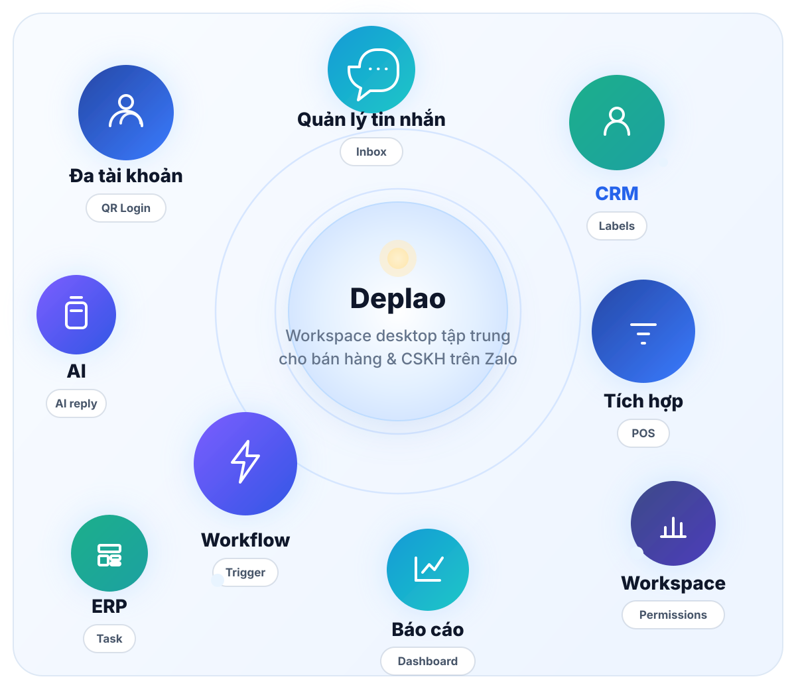
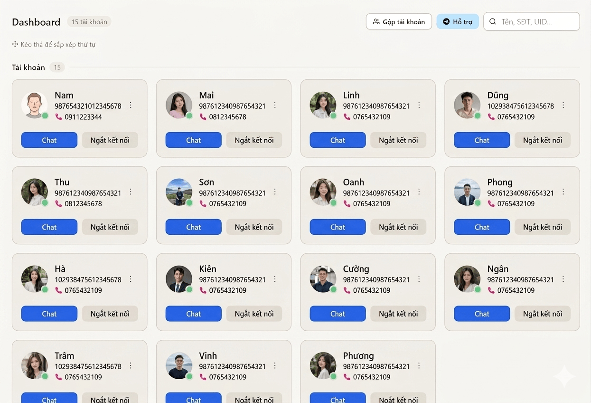
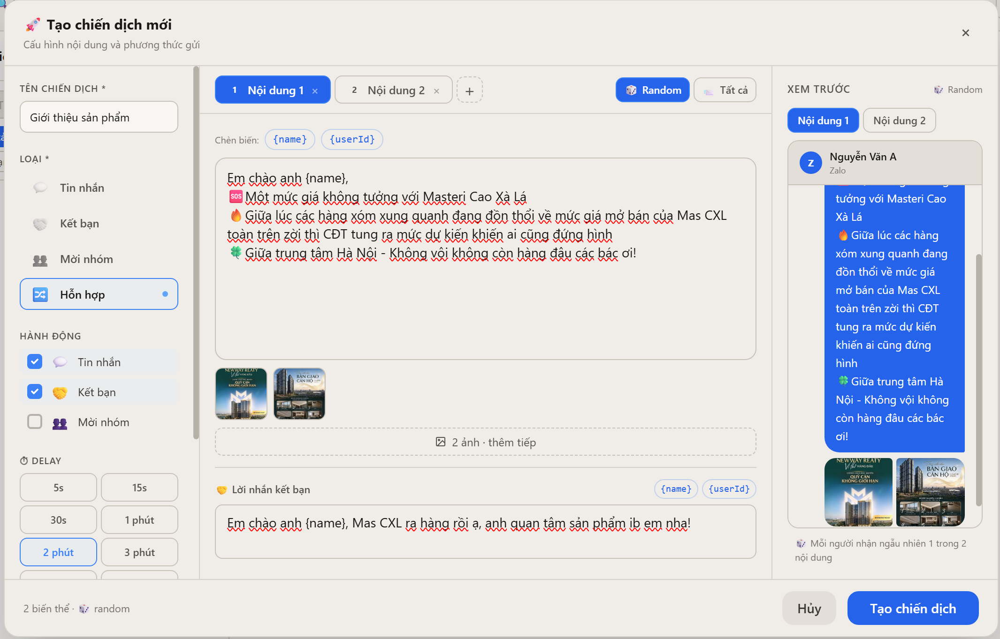
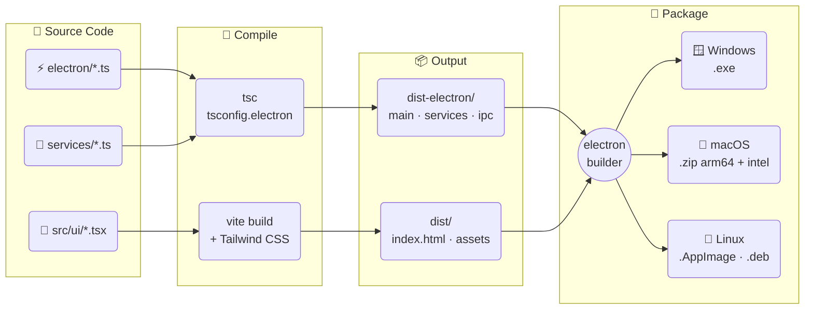
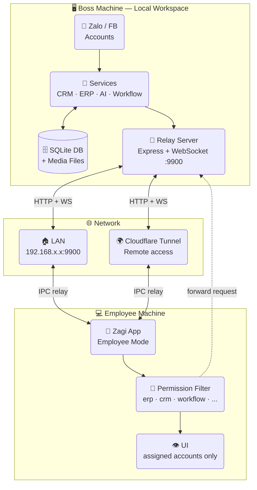

<div align="center">

# ⚡ Zagi

**Multi-account Zalo & Facebook desktop app**  
with CRM · ERP · POS · Workflow Automation · AI Assistant

<p>
  <a href="https://itngon.com/zagi/">🌐 itngon.com/zagi</a> &nbsp;|&nbsp;
  <a href="./README.md">🇻🇳 Tiếng Việt</a> &nbsp;|&nbsp;
  <strong>🇬🇧 English</strong>
</p>

[](https://github.com/trithucnen-max/zagi-builder/releases/latest)
[](https://github.com/trithucnen-max/zagi-builder/releases)
[](#download)
[](#)
[](#)
[](#)
[](#)
[](#license)

<p>
  <a href="#download">📥 Download</a> &nbsp;·&nbsp;
  <a href="#features">✨ Features</a> &nbsp;·&nbsp;
  <a href="#screenshots">📸 Screenshots</a> &nbsp;·&nbsp;
  <a href="#changelog">📋 Changelog</a> &nbsp;·&nbsp;
  <a href="#build-from-source">🛠️ Build</a> &nbsp;·&nbsp;
  <a href="#security">🔒 Security</a>
</p>

</div>

---

> 🚀 A single desktop app that lets sales, customer care, and marketing teams **centrally manage all Zalo & Facebook activity** — multi-account chat, CRM, campaigns, workflow automation, AI assistant, and internal reporting.

---

## 📥 Download

> **Latest version: v3.1.5** — [View all versions](#changelog)

<table>
<tr>
<td align="center" width="25%">

### 🪟 Windows

[](https://github.com/trithucnen-max/zagi-builder/releases/download/v3.1.5/Zagi.v3.1.5.Window.exe)

**[Zagi.v3.1.5.Window.exe](https://github.com/trithucnen-max/zagi-builder/releases/download/v3.1.5/Zagi.v3.1.5.Window.exe)**

NSIS Installer · ~164 MB

</td>
<td align="center" width="25%">

### 🍎 macOS M1+

[](https://github.com/trithucnen-max/zagi-builder/releases/download/v3.1.5/Zagi.v3.1.5.MacOS.M1%2B.arm64.dmg)

**[Zagi.v3.1.5.MacOS.M1+.arm64.dmg](https://github.com/trithucnen-max/zagi-builder/releases/download/v3.1.5/Zagi.v3.1.5.MacOS.M1%2B.arm64.dmg)**

Apple Silicon DMG · Signed & Notarized · ~231 MB

</td>
<td align="center" width="25%">

### 🍎 macOS Intel

[](https://github.com/trithucnen-max/zagi-builder/releases/download/v3.1.5/Zagi.v3.1.5.MacOS.Intel.dmg)

**[Zagi.v3.1.5.MacOS.Intel.dmg](https://github.com/trithucnen-max/zagi-builder/releases/download/v3.1.5/Zagi.v3.1.5.MacOS.Intel.dmg)**

Intel x64 DMG · Signed & Notarized · ~239 MB

</td>
<td align="center" width="25%">

### 🐧 Linux

[](https://github.com/trithucnen-max/zagi-builder/releases/download/v3.1.5/Zagi.v3.1.5.Window.exe)

**[Zagi.v3.1.5.Window.exe (Wine)](https://github.com/trithucnen-max/zagi-builder/releases/download/v3.1.5/Zagi.v3.1.5.Window.exe)**  
**[Zagi.v3.1.5.MacOS.M1+.arm64.dmg](https://github.com/trithucnen-max/zagi-builder/releases/download/v3.1.5/Zagi.v3.1.5.MacOS.M1%2B.arm64.dmg)**

Installer + macOS

</td>
</tr>
<tr>
<td align="center" colspan="4">

### 💻 Surface (Windows ARM64)

> For **Surface Pro X, Pro 9 5G, Pro 10, Pro 11, Laptop 7** (Qualcomm Snapdragon / ARM64 chip)
> 
> Surface Pro 7 and older (Intel) → use the Windows x64 build above.

[](https://github.com/trithucnen-max/zagi-builder/releases/download/v3.1.5/Zagi.v3.1.5.Surface.exe)

**[Zagi.v3.1.5.Surface.exe](https://github.com/trithucnen-max/zagi-builder/releases/download/v3.1.5/Zagi.v3.1.5.Surface.exe)**

NSIS Installer ARM64 · ~166 MB · Native optimization for Surface ARM

</td>
</tr>
</table>

<p align="center">
  👉 <strong><a href="https://github.com/trithucnen-max/zagi-builder/releases">View all releases →</a></strong>
</p>

<details>
<summary>⚠️ Security warning on first launch (Windows / macOS / Linux)</summary>

Zagi is not code-signed (we're bootstrapped), so your OS may show a warning when opening the installer.

### 🪟 Windows & Surface — "Windows protected your PC"

1. Click **More info**
2. Click **Run anyway**

> ⚠️ **Surface ARM64**: If you use **Surface Pro X / Pro 9 5G / Pro 10 / Pro 11 / Laptop 7**, download `Zagi v3.1.5 Surface.exe` for native ARM64 performance — better battery life and faster than running the x64 build under emulation.
> 
> **Surface Pro 7 and older (Intel x64)**: use the standard `Zagi v3.1.5 Window.exe`.

### 🍎 macOS — "cannot be opened because it is from an unidentified developer"

**Option 1:** Right-click the file → **Open** → **Open**

**Option 2:** System Settings → Privacy & Security → **Open Anyway**

### 🐧 Linux (AppImage)

```bash
chmod +x "Zagi v3.1.5 Linux.AppImage"
./"Zagi v3.1.5 Linux.AppImage"
```

If you get "FUSE not available":
```bash
sudo apt install libfuse2
```

Or use `.deb`:
```bash
sudo dpkg -i "Zagi v3.1.5 Linux Debian.deb"
```

</details>

---

## 📸 Screenshots

<p align="center">
  
</p>

<table>
  <tr>
    <td><br/><sub><strong>Multi-account dashboard</strong></sub></td>
    <td><br/><sub><strong>Unified inbox + AI</strong></sub></td>
    <td><br/><sub><strong>CRM & contacts</strong></sub></td>
  </tr>
  <tr>
    <td><br/><sub><strong>Group member scanning</strong></sub></td>
    <td><br/><sub><strong>Mass messaging campaigns</strong></sub></td>
    <td><br/><sub><strong>Workflow automation</strong></sub></td>
  </tr>
  <tr>
    <td><br/><sub><strong>Workflow node detail</strong></sub></td>
    <td><br/><sub><strong>AI workflow generation</strong></sub></td>
    <td><br/><sub><strong>POS, shipping & payments</strong></sub></td>
  </tr>
  <tr>
    <td><br/><sub><strong>Reports & analytics</strong></sub></td>
    <td><br/><sub><strong>Employee performance</strong></sub></td>
    <td><br/><sub><strong>Internal ERP</strong></sub></td>
  </tr>
</table>

---

## ✨ Features

### 1️⃣ Multi-account & Unified Inbox

- Log in to multiple Zalo accounts via QR Code
- Visual account management dashboard
- Merge all accounts into a **single unified inbox**
- Search by name, nickname, phone number
- Quick filters: unread, unanswered, labels, conversation status
- **Per-account proxy**: assign independent HTTP/HTTPS/SOCKS5 proxy per Zalo account

### 2️⃣ Full-featured Chat

- Send text, images, video, files
- Emoji, stickers, reply, mention members
- Polls, group notes, reminders, contact cards
- Quick messages — save templates and trigger by keyword
- Unlimited message pinning, media and attachment management

### 3️⃣ CRM & Customer Care

- Sync friends, group members and contact profiles
- Store phone, gender, birthday, internal notes
- Create and manage Zalo labels bi-directionally
- Filter contacts by multiple criteria for targeted outreach
- Group Management & Bulk Leave (v27.1.3): Automatically leave multiple groups, auto-owner transfer before leaving to prevent losing group control, send AI farewell message
- Campaigns: mass message, add friend, invite to group — smart safety warnings (Red/Yellow) & real-time progress tracking (v27.1.3)

### 4️⃣ Workflow Automation

- No-code drag-and-drop workflow builder
- AI generates nodes and workflows from plain-text commands
- Triggers: message received, label applied, reaction, cron schedule, group events…
- Actions: send message/image/file, find user, manage group, mute, forward, recall…
- Integrations: logic, Google Sheets, AI, Telegram, Discord, Email, Notion, HTTP Request
- Execution history for easy inspection and debugging
- 📦 **18 Standard Workflow Templates Library:** Pre-packaged JSON workflows for accounting alerts, order verification, shipping updates, low stock warnings, auto birthday wishes, NPS surveys, etc.

### 5️⃣ Sales Integrations

- POS: KiotViet, Haravan, Sapo, Nhanh.vn, Pancake POS
- Shipping: GHN, GHTK
- AI reply suggestions and in-chat Q&A
- Combine into end-to-end sales and customer care pipelines

### 6️⃣ Reports, ERP & Employee Management

- Reports: messages, contacts, campaigns, workflows, AI, employees
- Internal ERP: Tasks, Calendar, Notes
- Boss ↔ employee model with relay server and module-level permissions
- Track work performance per person and per time period

### 7️⃣ 🤖 AI Assistant

- Smart reply suggestions in Zalo and Facebook conversations
- Real-time Q&A with AI directly in the chat window
- **Conversation summary** — renders beautifully with bullet points and bold text (v27.1.2)
- Create workflows using plain natural language — no drag-and-drop needed
- Use AI action nodes in workflows to build 24/7 auto-reply chatbots
- Multi-platform AI: OpenAI, Claude, Gemini, 9Router
- 🧠 **Context-Aware AI Drafting & Variable Auto-Injection:** Automatically injects system variables (POS, payment, shipping, CRM) into AI drafting tools. Supports the `| formatNumber` filter for custom localized currency/number formatting.
- ⚙️ **Merged System Prompts & Optimized Zalo Styling:** Combines DB personality prompt and code prompt dynamically to prevent LLM instructions conflicts; optimizes text styling with emojis only (excluding `**` markdown tags) for native Zalo display compatibility.

---

## 🔒 Security

Zagi prioritizes a **local-first** architecture:

- All messages, contacts, CRM data, settings and media are stored on the user's machine
- Login via QR Code — no Zalo password stored; cookies are encrypted on-device
- Users can move the storage directory to another drive at any time
- Ideal for teams that require strict data control

---

## 🛠️ Tech Stack

| Category | Tech |
|----------|------|
| **Core** | zca-js, fbchat-v2 (Go E2EE bridge) |
| **Desktop** | Electron 41, React 18, Vite 6 |
| **UI** | Tailwind CSS, PostCSS, React Router, Recharts, React Flow |
| **Languages** | TypeScript 5, JavaScript, SQL |
| **Storage** | SQLite (better-sqlite3), electron-store |
| **State** | Zustand |
| **Backend** | Node.js + Express |
| **AI Gateway** | 9Router, OpenAI API, Claude, Gemini |
| **Integrations** | Axios, Google Sheets, Telegram Bot, Discord.js, node-cron |

---

## 🗺️ Architecture

### Build Pipeline


```mermaid
flowchart LR
    subgraph SRC["📁 Source Code"]
        E("⚡ electron/*.ts")
        S("🔧 services/*.ts")
        R("🎨 src/ui/*.tsx")
    end
    subgraph COMPILE["🔨 Compile"]
        TSC("tsc\ntsconfig.electron")
        VITE("vite build\n+ Tailwind CSS")
    end
    subgraph OUT["📦 Output"]
        DE("dist-electron/\nmain · services · ipc")
        D("dist/\nindex.html · assets")
    end
    subgraph PKG["🚀 Package"]
        EB(("electron\nbuilder"))
        WIN("🪟 Windows\n.exe")
        MAC("🍎 macOS\n.zip arm64 + intel")
        LIN("🐧 Linux\n.AppImage · .deb")
    end
    E & S --> TSC --> DE
    R --> VITE --> D
    DE & D --> EB --> WIN & MAC & LIN
```

### Boss ↔ Employee Model


```mermaid
flowchart TB
    subgraph BOSS["🖥️ Boss Machine — Local Workspace"]
        BZ("📱 Zalo / FB\nAccounts")
        BSV("🔧 Services\nCRM · ERP · AI · Workflow")
        BSD[("🗄️ SQLite DB\n+ Media Files")]
        BRL("🔁 Relay Server\nExpress + WebSocket :9900")
    end
    subgraph NET["🌐 Network"]
        LAN("🏠 LAN\n192.168.x.x:9900")
        WAN("🌍 Cloudflare Tunnel\nRemote access")
    end
    subgraph EMP["💻 Employee Machine"]
        EA("📲 Zagi App\nEmployee Mode")
        EP("🔐 Permission Filter\nerp · crm · workflow · ...")
        EU("👁️ UI\nassigned accounts only")
    end
    BZ --> BSV
    BSV <--> BSD
    BSV --> BRL
    BRL <-->|HTTP + WS| LAN & WAN
    LAN <-->|IPC relay| EA
    WAN <-->|IPC relay| EA
    EA --> EP --> EU
    EP -.->|forward request| BRL
```

---

## 💻 System Requirements

| | Requirement |
|---|---|
| **Windows** | Windows 10/11 (64-bit) |
| **macOS** | macOS 12+ (Apple Silicon or Intel) |
| **Linux** | Ubuntu 20.04+ or equivalent |
| **Internet** | Stable 24/7 connection for workflow & sync |
| **RAM** | 4 GB+ recommended |

---

## 🛠️ Build from Source

<details>
<summary>Build instructions</summary>

### Requirements

- Node.js 18+
- npm 9+

### Install dependencies

```bash
npm install --legacy-peer-deps
```

### Run in development

```bash
npm run dev
```

### Build production

```bash
npm run production
```

</details>

---

## 📋 Changelog

<details open>
<summary><strong>v3.1.5</strong> — 2026-07-24 · <em>🟢 Current version</em></summary>

### 🚀 Key Highlights & System Fixes

- 🏷️ **Zalo Contact Alias Renaming Rules**: Added 3 options during CRM campaign creation (Do not rename, `[Campaign] - [Name] - [Phone]`, `[Name] - [Phone]`).
- 🎨 **Redesigned Campaign Creation & Phone Scanner Modals**: Expanded campaign modal to 1360px x 832px and phone scanner modal to 1280px x 800px with CSV/Excel sample download and drag-and-drop file import.
- 🧠 **Smart Data Normalization Engine**: Automatically pads missing leading `0` for 9-digit phones, normalizes gender (`Nam`/`Nữ`) and birthdate formats.
- 🤝 **Friend Status (`is_friend`) Synchronization**: Verified friend status against actual `friends` table per account, eliminating false positive green checkmarks for unknown contacts.
- 🎨 **Dark Mode Contrast Fix**: Replaced invalid Tailwind classes with standard ones (`gray-900`, `gray-800`, `gray-700`, `gray-600`) and fixed editor contrast issues across all campaign modes.

</details>

<details>
<summary><strong>v3.1.5</strong> — 2026-07-22</summary>

### 🚀 Key Highlights & System Fixes

- 🏷️ **Unified Label Picker Modal & Bulk Labeling**: Redesigned label picker with 2-column layout for Local and Zalo cloud labels, supporting quick creation and batch tag/untagging.
- 📱 **Phone Normalization**: Auto-prefixes missing leading `0` and strips spaces/special characters system-wide.
- ⚡ **Batch Phone Lookup**: Accelerated CRM contact lookup (~20x faster) using `getMultiUsersByPhones` API (100 numbers/batch).
- ✏️ **Raw Code Edit Mode**: SmartInput editor toggle to edit raw `{{ ... }}` variable strings directly.
- 🚫 **Blocked Contact Auto-Detection**: Auto-assigns `is_blocked = 1` and `🚫 Blocked` label to contacts blocking messages.
- 🔀 **Transfer Contact to Another Zalo Account**: Bulk action to re-assign contacts to a different connected Zalo account.
- 🍏 **Official macOS Code Signing & Notarization**: Signed with Apple Developer ID (BASAN CORPORATION) and notarized with Apple.

</details>

<details>
<summary><strong>v3.1.5</strong> — 2026-07-18</summary>

### 🐛 Bug Fixes & Stability Improvements

- 🔧 **contextBridge Proxy & Static Imports**: Fixed runtime proxy crashes and `require is not defined` errors.
- 🌐 **Download Links Fix**: Direct download links to GitHub Releases for macOS and Linux packages.
- 🛡️ **LAN CORS Protection & Batch Performance**: Restricted LAN CORS origin allowlist and wrapped SQLite campaign additions in transactions (50x speedup).

</details>

<details>
<summary><strong>v3.1.5</strong> — 2026-07-14</summary>

### 🚀 Key Highlights

- 💾 **Workflow Persistent Checkpoints**: Automatically saves workflow ExecutionContext into SQLite when wait time of `logic.wait` node exceeds 5 minutes, freeing up system memory/CPU.
- 📅 **Calendar Delay Mode**: Node wait configuration now supports scheduling based on calendar day shifts (e.g., tomorrow) combined with a target dispatch time (e.g., 09:00).
- 🔄 **Recovery After Restart**: Upon Boss/Server restart, the `CheckpointScheduler` automatically detects and resumes pending or missed checkpoints.
- 📋 **"Pending" Checkpoint Management Tab**: Dedicated tab in Workflow Automation showing pending counts, countdown timers, and quick cancel actions.
- 🛡️ **Safe Serialization (contextSerializer)**: Resolves circular references and truncates large payloads.
- 🧪 **Comprehensive Automated Testing**: Added `workflowCheckpoint.test.ts` with 46 tests.

</details>

<p align="center">
  👉 <strong><a href="https://github.com/trithucnen-max/zagi-builder/releases">View all releases on GitHub →</a></strong>
</p>

---

## 🎯 Who is it for?

| Audience | Why Zagi |
|----------|----------|
| Online shops & sales teams | Close deals on Zalo with multiple accounts in parallel |
| SMEs needing shared inbox | Boss ↔ Employee model with granular permissions |
| Marketing agencies | Centrally manage multiple client accounts |
| Spas, clinics, F&B, education | Recurring customer care, re-engagement campaigns |
| Teams wanting all-in-one | Chat + CRM + Workflow + AI + ERP in one desktop app |

---

## 📣 Contact & Support

- 🐛 **Bug reports & feature requests**: [GitHub Issues](https://github.com/trithucnen-max/zagi-builder/issues)
- 🌐 **Website**: [itngon.com/zagi](https://itngon.com/zagi/)

---

## 🙏 Acknowledgements

Zagi thanks these open-source projects:

- 👉 [zca-js](https://github.com/RFS-ADRENO/zca-js) — Zalo JS library
- 👉 [fbchat-v2](https://github.com/m008v/fbchat-v2) — Facebook E2EE bridge

---

## 📝 License

This project is distributed under the **MIT License**.  
See the [LICENSE](LICENSE) file for details.

---

<div align="center">
  <sub>Made with ❤️ by the Zagi team · <a href="https://itngon.com/zagi/">itngon.com/zagi</a></sub>
</div>
