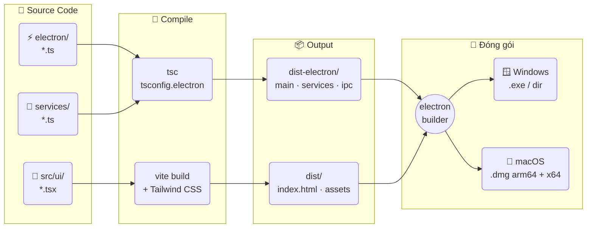
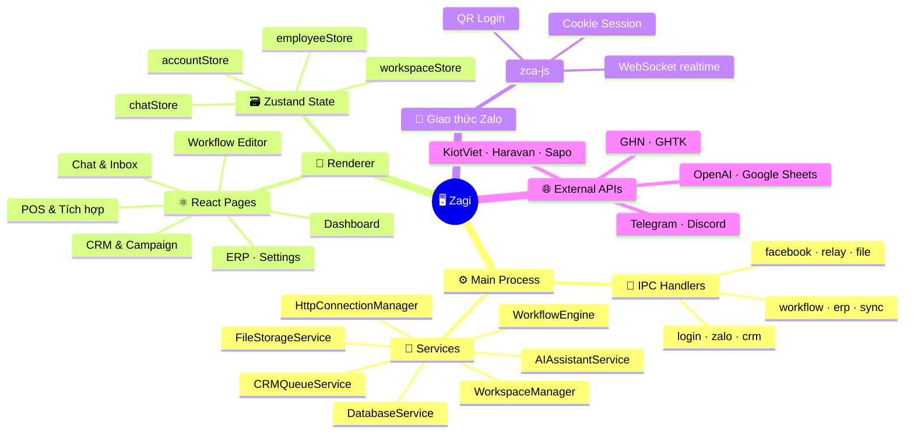

# Zagi

Phần mềm desktop quản lý Zalo Đa tài khoản tích hợp CRM, ERP, POS, Workflow và AI Assistant giúp đội nhóm bán hàng, chăm sóc khách hàng và marketing trên Zalo vận hành tập trung trong một ứng dụng duy nhất.


*Giới thiệu chính thức*: [itngon.com/zagi](https://itngon.com/zagi)

[](#)
[](#-yêu-cầu-hệ-thống)
[](#)
[](#)
[](#)
[](#)
[](#)
[](#)
[](#)
[](https://tlavietnam.sg.larksuite.com/share/base/form/shrlgxzOCTqFepNvhl8wms2vpWg)

---

## ⬇️ Tải xuống nhanh

<p>
  <a href="https://github.com/trithucnen-max/zagi-builder/releases/latest/download/Zagi-Setup-26.4.6.exe">
    
  </a>
  &nbsp;
  <a href="https://github.com/trithucnen-max/zagi-builder/releases/latest/download/Zagi-26.4.6-arm64.dmg">
    
  </a>
  &nbsp;
  <a href="https://github.com/trithucnen-max/zagi-builder/releases/latest/download/Zagi-26.4.6.dmg">
    
  </a>
</p>

👉 Xem tất cả các phiên bản phát hành: [GitHub Releases](https://github.com/trithucnen-max/zagi-builder/releases)

<details>
<summary>⚠️ Lưu ý khi mở file cài đặt (Bị chặn bởi Windows SmartScreen / macOS Gatekeeper)</summary>

Do ứng dụng Zagi hoạt động nội bộ cục bộ và chưa ký chứng chỉ số thương mại (code signing), hệ điều hành có thể hiển thị cảnh báo bảo mật ở lần chạy đầu tiên:

### 🪟 Windows (.exe)
Khi mở file `.exe`, nếu Windows hiển thị cảnh báo **"Windows protected your PC"**:
1. Nhấn **More info** (Thông tin thêm).
2. Chọn **Run anyway** (Vẫn chạy).

### 🍎 macOS (.dmg)
Khi mở file `.dmg`, nếu macOS báo **"cannot be opened because it is from an unidentified developer"**:
- *Cách 1*: Nhấp chuột phải vào file app trong Application -> chọn **Open** -> Chọn **Open** lần nữa.
- *Cách 2*: Vào **System Settings -> Privacy & Security** -> Cuộn xuống phần Security -> Chọn **Open Anyway**.
</details>

---

## ⚡ Quick Start (Chạy mã nguồn cục bộ)

### Yêu cầu hệ thống:
- Hệ điều hành: Windows 10/11 hoặc macOS.
- Môi trường: Node.js 18+ và npm 9+.

### Các bước thiết lập nhanh:
1. **Cài đặt thư viện phụ thuộc**:
   ```bash
   npm install --legacy-peer-deps
   ```
2. **Khởi chạy môi trường phát triển (Dev mode)**:
   ```bash
   npm run dev
   ```
3. **Biên dịch và đóng gói ứng dụng (Production build)**:
   ```bash
   npm run production
   ```

---

## ✨ Các tính năng nổi bật

- 👤 **Quản lý đa tài khoản Zalo** — Đăng nhập không giới hạn tài khoản bằng QR Code, chuyển đổi tài khoản tức thì.
- 💬 **Hộp thư tập trung (Unified Inbox)** — Gộp tin nhắn từ nhiều số Zalo về một giao diện chat duy nhất.
- 👥 **CRM & Chiến dịch** — Đồng bộ danh bạ bạn bè, thành viên nhóm, phân loại nhãn và chạy gửi tin nhắn hàng loạt cá nhân hoá.
- ⚙️ **Workflow Editor** — Thiết kế kịch bản tự động hóa tư vấn kéo thả hoặc ra lệnh bằng AI, chạy nền 24/7.
- 🤖 **Trợ lý AI cá nhân** — Tích hợp OpenAI, Gemini, Claude, OpenRouter và các máy chủ Custom API endpoint để tự động CSKH bằng tài liệu kiến thức nạp riêng.
- 🔗 **Đồng bộ POS & Giao vận** — Kết nối nhanh KiotViet, Sapo, Haravan, SAP và tạo đơn giao hàng trực tiếp qua GHN, GHTK.
- 🧑‍💼 **Boss ↔ Nhân viên** — Phân quyền chi tiết tài khoản Zalo và ERP, nhân viên làm việc qua Relay Server đảm bảo an toàn dữ liệu.
- 🔒 **Bảo mật & Local-first** — Lưu trữ toàn bộ dữ liệu (tin nhắn, CRM, settings) cục bộ trên ổ cứng máy khách.

---

## 🗺️ Sơ đồ kiến trúc & Quy trình hoạt động

### 1. Quy trình Đóng gói (Build Flow)


### 2. Kiến trúc Runtime


---

## ⚙️ Cài đặt cấu hình (Configuration)

### Không gian lưu trữ (Workspace):
- Zagi mặc định lưu trữ cơ sở dữ liệu `zagi-tool.db` và tài nguyên media tại thư mục AppData của hệ thống.
- Người dùng có thể thay đổi đường dẫn lưu trữ sang ổ đĩa khác tại mục **Cài đặt -> Workspace**. Mỗi Workspace độc lập có một Database và thư mục media riêng biệt.

### Môi trường phát triển:
- Tiến trình build Renderer được cấu hình qua [vite.config.ts](file:///Users/kimtrungduong/Downloads/deplao-builder-main/vite.config.ts).
- Cấu hình Electron production được định nghĩa tại [tsconfig.electron.prod.json](file:///Users/kimtrungduong/Downloads/deplao-builder-main/tsconfig.electron.prod.json).

---

## 📚 Danh mục tài liệu chính thức (Documentation)

Hãy đọc các tài liệu dưới đây để hiểu chi tiết hơn về phần mềm:

### Hướng dẫn sử dụng & Quy trình vận hành:
- **[Hướng dẫn sử dụng](file:///Users/kimtrungduong/Downloads/deplao-builder-main/docs/USER_GUIDE.md)**: Chi tiết cách vận hành từng tính năng của phần mềm cho người bán hàng và nhân viên.
- **[Quy trình vận hành](file:///Users/kimtrungduong/Downloads/deplao-builder-main/docs/WORKFLOWS.md)**: Các bước vận hành thực tế (chống khóa Zalo, cấu hình bot AI, gán việc nhân sự, di chuyển dữ liệu).

### Tài liệu kỹ thuật cho Lập trình viên:
- **[Tài liệu phát triển (Dev Guide)](file:///Users/kimtrungduong/Downloads/deplao-builder-main/docs/DEVELOPER_GUIDE.md)**: Kiến trúc mã nguồn, thiết lập môi trường C++ build tools, và cấu trúc State.
- **[Tài liệu API & IPC](file:///Users/kimtrungduong/Downloads/deplao-builder-main/docs/API.md)**: Đặc tả các kênh truyền nhận dữ liệu IPC Main-Renderer.
- **[Hướng dẫn đóng gói (Build Guide)](file:///Users/kimtrungduong/Downloads/deplao-builder-main/zagi-build-guide.md)**: Chi tiết quy trình build đóng gói ra tệp `.exe` và `.dmg`.
- **[Nhật ký thay đổi (Changelog)](file:///Users/kimtrungduong/Downloads/deplao-builder-main/CHANGELOG.md)**: Lịch sử nâng cấp và cập nhật phiên bản.
- **[AI Crawl Index (llms.txt)](file:///Users/kimtrungduong/Downloads/deplao-builder-main/llms.txt)**: Tệp hỗ trợ các mô hình AI nhanh chóng nắm bắt cấu trúc mã nguồn.

---

## 🙏 Lời cảm ơn & Bản quyền

- Dự án Zagi được phát triển dựa trên nền tảng nguồn mở và xin gửi lời cảm ơn trân trọng tới:
  - **[zca-js](https://github.com/RFS-ADRENO/zca-js)** (Thư viện kết nối Zalo)
  - **[deplao-builder](https://github.com/babyvibe/deplao-builder)** (Bộ khung xương monorepo nền tảng)
- Bản quyền sử dụng theo giấy phép **ISC License**.
