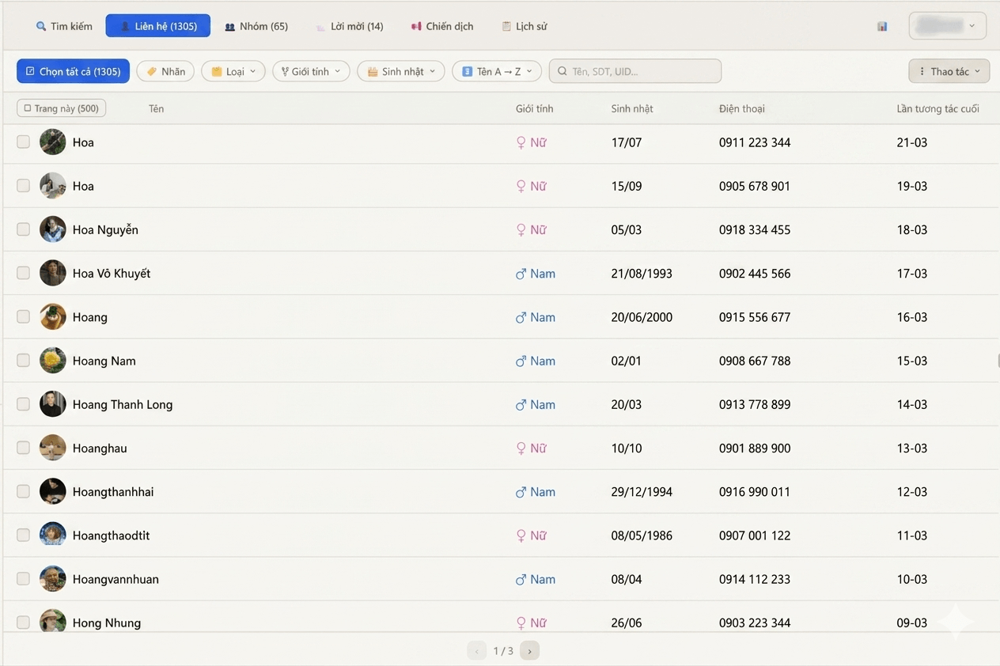
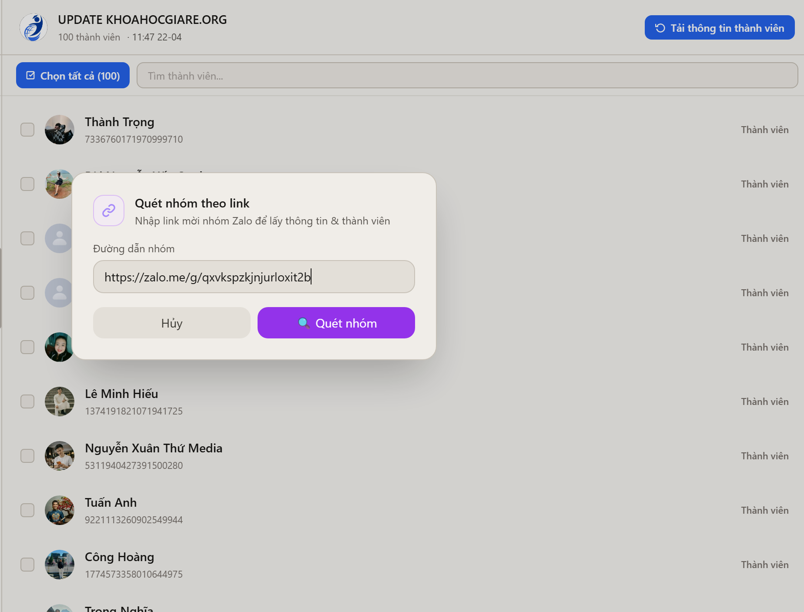
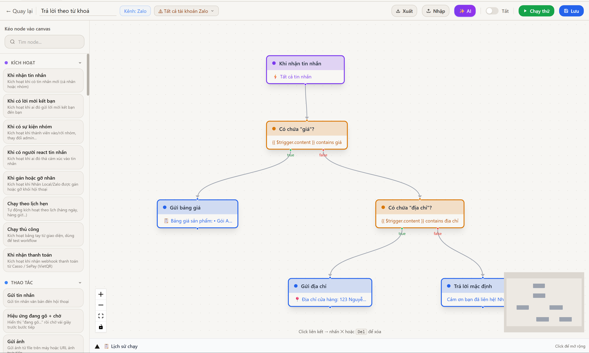
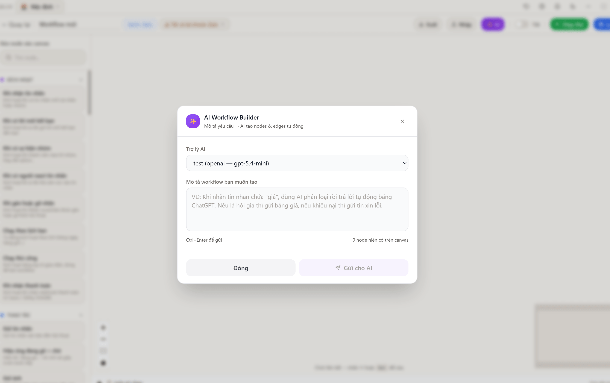
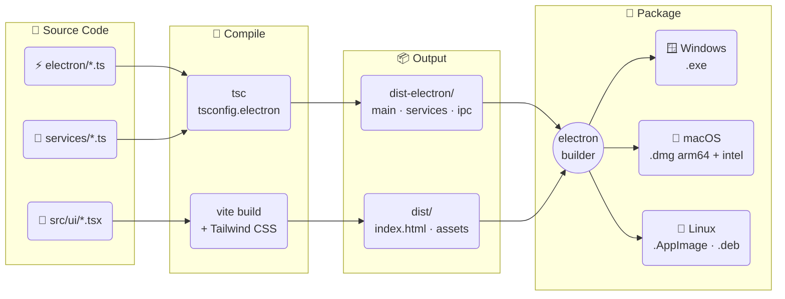
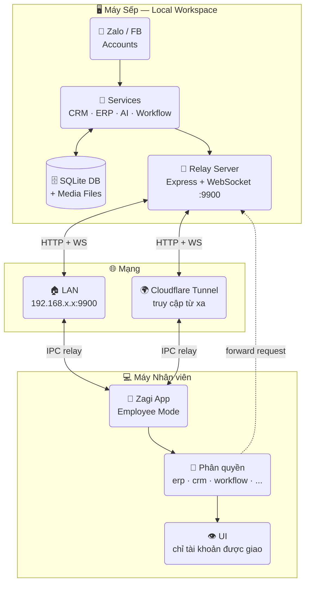

<div align="center">

# ⚡ Zagi

**Phần mềm desktop quản lý Zalo & Facebook đa tài khoản**  
tích hợp CRM · ERP · POS · Workflow · AI Assistant

<p>
  <a href="https://itngon.com/zagi/">🌐 itngon.com/zagi</a> &nbsp;|&nbsp;
  <strong>🇻🇳 Tiếng Việt</strong> &nbsp;|&nbsp;
  <a href="./README.en.md">🇬🇧 English</a>
</p>

[](https://github.com/trithucnen-max/zagi-builder/releases/latest)
[](https://github.com/trithucnen-max/zagi-builder/releases)
[](#tải-xuống)
[](#)
[](#)
[](#)
[](#)
[](#giấy-phép)

<p>
  <a href="#tải-xuống">📥 Tải xuống</a> &nbsp;·&nbsp;
  <a href="#tính-năng">✨ Tính năng</a> &nbsp;·&nbsp;
  <a href="#ảnh-chụp-màn-hình">📸 Screenshots</a> &nbsp;·&nbsp;
  <a href="#changelog">📋 Changelog</a> &nbsp;·&nbsp;
  <a href="#cài-đặt-từ-source">🛠️ Build</a> &nbsp;·&nbsp;
  <a href="#bảo-mật">🔒 Bảo mật</a>
</p>

</div>

---

> 🚀 Một ứng dụng desktop duy nhất giúp đội nhóm bán hàng, CSKH và marketing **vận hành toàn bộ Zalo & Facebook tập trung** — từ chat đa tài khoản, CRM, chiến dịch, workflow tự động đến AI trợ lý và báo cáo nội bộ.

---

## 📥 Tải xuống

> **Phiên bản mới nhất: v27.1.2** — [Xem tất cả phiên bản](#changelog)

<table>
<tr>
<td align="center" width="25%">

### 🪟 Windows

[](https://github.com/trithucnen-max/zagi-builder/releases/latest/download/Zagi-Setup-27.1.2.exe)

**[Zagi-Setup-27.1.2.exe](https://github.com/trithucnen-max/zagi-builder/releases/latest/download/Zagi-Setup-27.1.2.exe)**

NSIS Installer · ~148 MB

</td>
<td align="center" width="25%">

### 🍎 macOS M1+

[](https://github.com/trithucnen-max/zagi-builder/releases/latest/download/Zagi-27.1.2-arm64.dmg)

**[Zagi-27.1.2-arm64.dmg](https://github.com/trithucnen-max/zagi-builder/releases/latest/download/Zagi-27.1.2-arm64.dmg)**

Apple Silicon · ~177 MB

</td>
<td align="center" width="25%">

### 🍎 macOS Intel

[](https://github.com/trithucnen-max/zagi-builder/releases/latest/download/Zagi-27.1.2.dmg)

**[Zagi-27.1.2.dmg](https://github.com/trithucnen-max/zagi-builder/releases/latest/download/Zagi-27.1.2.dmg)**

Intel x64 · ~182 MB

</td>
<td align="center" width="25%">

### 🐧 Linux

[](https://github.com/trithucnen-max/zagi-builder/releases/latest/download/Zagi-27.1.2.AppImage)

**[Zagi-27.1.2.AppImage](https://github.com/trithucnen-max/zagi-builder/releases/latest/download/Zagi-27.1.2.AppImage)**  
**[zagi_27.1.2_amd64.deb](https://github.com/trithucnen-max/zagi-builder/releases/latest/download/zagi_27.1.2_amd64.deb)**

AppImage + .deb · ~197 MB

</td>
</tr>
<tr>
<td align="center" colspan="4">

### 💻 Surface (Windows ARM64)

> Dành cho **Surface Pro X, Pro 9 5G, Pro 10, Pro 11, Laptop 7** (chip Snapdragon / ARM64)
> 
> **Surface Pro 7 trở xuống (Intel)** → dùng bản Windows x64 phía trên.

[](https://github.com/trithucnen-max/zagi-builder/releases/latest/download/Zagi-Setup-27.1.2-arm64.exe)

**[Zagi-Setup-27.1.2-arm64.exe](https://github.com/trithucnen-max/zagi-builder/releases/latest/download/Zagi-Setup-27.1.2-arm64.exe)**

NSIS Installer ARM64 · ~148 MB · Tối ưu native cho Surface ARM

</td>
</tr>
</table>

<p align="center">
  👉 <strong><a href="https://github.com/trithucnen-max/zagi-builder/releases">Xem tất cả phiên bản →</a></strong>
</p>

---

## 🧭 Hướng dẫn chọn đúng phiên bản

> **Không biết tải bản nào?** Làm theo sơ đồ bên dưới — chọn sai bản vẫn chạy được nhưng hiệu năng không tối ưu.

### 🪟 Tôi dùng Windows

```
Máy tính của bạn là loại gì?
│
├─ 🖥️ PC desktop / Laptop thông thường (Dell, HP, Lenovo, Asus, Acer...)
│   └─ → Tải: Zagi-Setup-27.1.2.exe  ✅
│
├─ 💻 Surface Pro 7, Surface Laptop 1-4, Surface Go 1-2, Surface Book
│   └─ → Tải: Zagi-Setup-27.1.2.exe  ✅  (chip Intel, bản x64 chạy ok)
│
└─ 💻 Surface Pro X, Surface Pro 9 (5G), Surface Pro 10, Surface Pro 11,
       Surface Laptop 7 (chip Snapdragon / ARM64)
    └─ → Tải: Zagi-Setup-27.1.2-arm64.exe  ✅ (bản native ARM64)
```

> 💡 **Cách kiểm tra chip máy Surface:** Vào `Settings → System → About`, xem mục **Processor**:
> - Có chữ `Intel` hoặc `AMD` → dùng bản `.exe` thường (x64)
> - Có chữ `Snapdragon` hoặc `ARM` → dùng bản `-arm64.exe`

---

### 🍎 Tôi dùng macOS

```
Mac của bạn là loại gì?
│
├─ 🍎 MacBook Air/Pro M1, M2, M3, M4 (2020 trở về sau)
│   └─ → Tải: Zagi-27.1.2-arm64.dmg  ✅
│
└─ 🍎 MacBook, iMac, Mac mini chip Intel (2019 trở về trước)
    └─ → Tải: Zagi-27.1.2.dmg  ✅
```

> 💡 **Cách kiểm tra:** Click logo Apple → **About This Mac** → xem mục **Chip** hoặc **Processor**:
> - Có chữ `Apple M1/M2/M3/M4` → bản `-arm64.dmg`
> - Có chữ `Intel` → bản `.dmg` thường

---

### 🐧 Tôi dùng Linux

```
Bạn dùng distro nào?
│
├─ Ubuntu, Mint, PopOS, Zorin, ElementaryOS... → Tải .deb  ✅
│   sudo dpkg -i zagi_27.1.2_amd64.deb
│
└─ Fedora, Arch, openSUSE hoặc bất kỳ distro nào
    → Tải .AppImage  ✅
    chmod +x Zagi-27.1.2.AppImage && ./Zagi-27.1.2.AppImage
```

---

### 📊 Bảng tổng hợp nhanh

| Thiết bị | File cần tải | Ghi chú |
|---|---|---|
| PC/Laptop Windows (Intel/AMD) | `Zagi-Setup-27.1.2.exe` | Phổ biến nhất |
| Surface Pro 7 trở xuống | `Zagi-Setup-27.1.2.exe` | Chip Intel |
| Surface Pro X, 9 5G, 10, 11, Laptop 7 | `Zagi-Setup-27.1.2-arm64.exe` | 🆕 Chip ARM64 |
| MacBook M1/M2/M3/M4 | `Zagi-27.1.2-arm64.dmg` | Apple Silicon |
| MacBook/iMac Intel | `Zagi-27.1.2.dmg` | Intel x64 |
| Ubuntu/Debian Linux | `zagi_27.1.2_amd64.deb` | Cài như package |
| Fedora/Arch/Linux khác | `Zagi-27.1.2.AppImage` | Chạy mọi distro |

---

<details>
<summary>⚠️ Cảnh báo bảo mật khi cài lần đầu (Windows / macOS / Linux)</summary>

Zagi chưa ký code (chúng tôi là startup bootstrapped), nên hệ điều hành có thể hiện cảnh báo khi mở lần đầu.

### 🪟 Windows & Surface — "Windows protected your PC"

1. Nhấn **More info**
2. Nhấn **Run anyway**

### 🍎 macOS — "cannot be opened because it is from an unidentified developer"

**Cách 1:** Chuột phải vào file → **Open** → **Open**

**Cách 2:** System Settings → Privacy & Security → **Open Anyway**

### 🐧 Linux (AppImage)

```bash
chmod +x Zagi-27.1.2.AppImage
./Zagi-27.1.2.AppImage
```

Nếu lỗi "FUSE not available":
```bash
sudo apt install libfuse2
```

Hoặc dùng `.deb`:
```bash
sudo dpkg -i zagi_27.1.2_amd64.deb
```

</details>

---

## 📸 Ảnh chụp màn hình

<p align="center">
  
</p>

<table>
  <tr>
    <td><br/><sub><strong>Dashboard đa tài khoản</strong></sub></td>
    <td><br/><sub><strong>Hộp thư hợp nhất + AI</strong></sub></td>
    <td><br/><sub><strong>CRM & Quản lý liên hệ</strong></sub></td>
  </tr>
  <tr>
    <td><br/><sub><strong>Quét thành viên nhóm</strong></sub></td>
    <td><br/><sub><strong>Chiến dịch nhắn tin hàng loạt</strong></sub></td>
    <td><br/><sub><strong>Workflow tự động hóa</strong></sub></td>
  </tr>
  <tr>
    <td><br/><sub><strong>Cấu hình node chi tiết</strong></sub></td>
    <td><br/><sub><strong>Tạo workflow bằng AI</strong></sub></td>
    <td><br/><sub><strong>POS, vận chuyển & thanh toán</strong></sub></td>
  </tr>
  <tr>
    <td><br/><sub><strong>Báo cáo & phân tích</strong></sub></td>
    <td><br/><sub><strong>Hiệu suất nhân viên</strong></sub></td>
    <td><br/><sub><strong>ERP nội bộ</strong></sub></td>
  </tr>
</table>

---

## ✨ Tính năng

### 1️⃣ Đa tài khoản & Hộp thư hợp nhất

- Đăng nhập nhiều tài khoản Zalo qua QR Code
- Dashboard quản lý tài khoản trực quan
- Gộp tất cả tài khoản vào **một hộp thư chung** duy nhất
- Tìm kiếm theo tên, biệt danh, số điện thoại
- Bộ lọc nhanh: chưa đọc, chưa trả lời, nhãn, trạng thái hội thoại
- **Proxy độc lập** cho từng tài khoản Zalo (HTTP/HTTPS/SOCKS5)

### 2️⃣ Chat đầy đủ tính năng

- Gửi văn bản, ảnh, video, file
- Emoji, sticker, trả lời, mention thành viên
- Bình chọn, ghi chú nhóm, nhắc nhở, danh thiếp
- Tin nhắn nhanh — lưu mẫu và kích hoạt bằng từ khóa
- Ghim tin nhắn không giới hạn, quản lý ảnh và tệp đính kèm

### 3️⃣ CRM & Chăm sóc khách hàng

- Đồng bộ bạn bè, thành viên nhóm và hồ sơ liên hệ
- Lưu SĐT, giới tính, sinh nhật, ghi chú nội bộ
- Tạo và quản lý nhãn Zalo hai chiều
- Lọc liên hệ đa tiêu chí để tiếp cận đúng mục tiêu
- Chiến dịch: nhắn tin hàng loạt, kết bạn, mời nhóm — theo dõi tiến độ realtime

### 4️⃣ Workflow tự động hóa

- Xây dựng workflow kéo thả, không cần code
- AI tạo node và workflow từ lệnh ngôn ngữ tự nhiên
- Trigger: nhận tin nhắn, gắn nhãn, reaction, lịch trình, sự kiện nhóm…
- Hành động: gửi tin/ảnh/file, tìm user, quản lý nhóm, chặn, chuyển tiếp, thu hồi…
- Tích hợp: logic, Google Sheets, AI, Telegram, Discord, Email, Notion, HTTP Request
- Lịch sử thực thi dễ kiểm tra và debug

### 5️⃣ Tích hợp bán hàng

- POS: KiotViet, Haravan, Sapo, Nhanh.vn, Pancake POS
- Vận chuyển: GHN, GHTK
- AI gợi ý trả lời, hỏi đáp trực tiếp trong chat
- Kết hợp thành pipeline bán hàng & CSKH end-to-end

### 6️⃣ Báo cáo, ERP & Quản lý nhân viên

- Báo cáo: tin nhắn, liên hệ, chiến dịch, workflow, AI, nhân viên
- ERP nội bộ: Tasks, Lịch, Ghi chú
- Mô hình Sếp ↔ Nhân viên với relay server và phân quyền theo module
- Theo dõi hiệu suất từng người theo khoảng thời gian

### 7️⃣ 🤖 AI Assistant

- Gợi ý trả lời thông minh trong hội thoại Zalo và Facebook
- Hỏi đáp realtime với AI ngay trong cửa sổ chat
- **Tóm tắt hội thoại** — hiển thị kết quả đẹp với bullet points, bold text (v27.1.2)
- Tạo workflow bằng lệnh ngôn ngữ tự nhiên — không cần kéo thả
- Dùng AI node trong workflow để tạo chatbot tự động trả lời 24/7
- Hỗ trợ đa nền tảng AI: OpenAI, Claude, Gemini, 9Router

---

## 🔒 Bảo mật

Zagi ưu tiên kiến trúc **local-first**:

- Toàn bộ tin nhắn, liên hệ, dữ liệu CRM, cài đặt và media được lưu trên máy người dùng
- Đăng nhập qua QR Code — không lưu mật khẩu Zalo; cookie được mã hóa trên thiết bị
- Người dùng có thể chuyển thư mục lưu trữ sang ổ đĩa khác bất kỳ lúc nào
- Phù hợp cho các đội nhóm yêu cầu kiểm soát dữ liệu chặt chẽ

---

## 🛠️ Công nghệ sử dụng

| Nhóm | Công nghệ |
|------|-----------|
| **Core** | zca-js, fbchat-v2 (Go E2EE bridge) |
| **Desktop** | Electron 41, React 18, Vite 6 |
| **UI** | Tailwind CSS, PostCSS, React Router, Recharts, React Flow |
| **Ngôn ngữ** | TypeScript 5, JavaScript, SQL |
| **Lưu trữ** | SQLite (better-sqlite3), electron-store |
| **State** | Zustand |
| **Backend** | Node.js + Express |
| **AI Gateway** | 9Router, OpenAI API, Claude, Gemini |
| **Tích hợp** | Axios, Google Sheets, Telegram Bot, Discord.js, node-cron |

---

## 🗺️ Kiến trúc hệ thống

### 1️⃣ Build Pipeline



### 2️⃣ Mô hình Sếp ↔ Nhân viên



---

## 💻 Yêu cầu hệ thống

| | Yêu cầu |
|---|---|
| **Windows** | Windows 10/11 (64-bit) |
| **macOS** | macOS 12+ (Apple Silicon hoặc Intel) |
| **Linux** | Ubuntu 20.04+ hoặc tương đương |
| **Internet** | Kết nối ổn định 24/7 khi dùng workflow |
| **RAM** | 4 GB trở lên khuyến nghị |

---

## 🛠️ Cài đặt từ source

<details>
<summary>Build từ mã nguồn</summary>

### Yêu cầu

- Node.js 18+ 
- npm 9+

### Cài dependencies

```bash
npm install --legacy-peer-deps
```

### Chạy development

```bash
npm run dev
```

### Build production

```bash
npm run production
```

</details>

---

## 📋 Changelog

<details open>
<summary><strong>v27.1.2</strong> — 2026-06-21 · <em>🟢 Phiên bản hiện tại</em></summary>

### 🔧 Cải thiện & Sửa lỗi

- 🤖 **AI Quick Panel**: render markdown đúng chuẩn — bold (`**text**`), bullet list (`-`), numbered list, `code block`, header `#` hiện thị đẹp thay vì ký tự thô
- 🔄 Cập nhật website giới thiệu → [itngon.com/zagi](https://itngon.com/zagi/)
- 📦 Cập nhật metadata package: repository, author, homepage
- 🔑 Chuẩn hóa toàn bộ CI/CD sang `trithucnen-max/zagi-builder`

</details>

<details>
<summary><strong>v27.1.1</strong> — 2026-06-20</summary>

### 🔧 Cải thiện hạ tầng CI/CD

- 🔄 Migrate toàn bộ CI/CD sang repo `trithucnen-max/zagi-builder`
- 🔑 Chuyển sang `GITHUB_TOKEN` built-in cho tất cả workflow
- 📝 Fix duplicate build trigger — mỗi platform chỉ build 1 lần khi push tag

</details>

<details>
<summary><strong>v27.1.0</strong> — 2026-06-20</summary>

### 🚀 Nâng cấp nổi bật

- 🎨 Cải tiến toàn bộ giao diện CRM — danh sách liên hệ, bộ lọc và quản lý nhãn được thiết kế lại
- ⚡ Tối ưu hiệu suất render danh sách liên hệ lớn (>10,000 contacts)
- 🤖 Cải thiện AI Assistant — độ chính xác gợi ý trả lời tốt hơn

### ✨ Tính năng mới

- **CRM nâng cao**: Bộ lọc liên hệ đa tiêu chí với giao diện sidebar mới
- **CRM Pipeline**: Giao diện Kanban quản lý quy trình bán hàng
- **CRM Timeline**: Xem lịch sử tương tác theo dòng thời gian
- **Bulk actions**: Chọn nhiều liên hệ và thực hiện hành động hàng loạt
- **Export nâng cao**: Xuất dữ liệu CRM ra Excel với format chuẩn

### ⚡ Cải thiện

- Tăng tốc tải danh sách liên hệ 3x
- Cải thiện bộ nhớ khi làm việc với nhiều tài khoản đồng thời
- License Manager tích hợp trong app

### 🐛 Sửa lỗi

- Sửa lỗi tìm kiếm liên hệ không trả kết quả khi nhập SĐT có dấu cách
- Sửa lỗi nhãn không cập nhật realtime từ màn hình chat
- Sửa lỗi bulk label actions trong CRM

</details>

<details>
<summary><strong>v26.6.4</strong> — 2026-06-20</summary>

- 👤 Tự động làm mới avatar Zalo khi khởi động
- ✏️ Facebook E2EE hỗ trợ xem lịch sử chỉnh sửa tin nhắn
- 📞 Gợi ý gửi danh thiếp Zalo từ số điện thoại trong chat
- 🖼️ Danh thiếp Zalo hỗ trợ kết bạn nhanh
- 🚫 Facebook hiển thị đúng thông báo hệ thống
- ℹ️ Tự động lấy tên và avatar khi mở hội thoại mới
- 👤 Tối ưu tải dữ liệu sếp-nhân viên và gửi tin nhắn

</details>

<details>
<summary><strong>v26.6.3</strong> — 2026-06-17</summary>

- 🐧 **Ubuntu/Linux** hỗ trợ (.AppImage + .deb) với CI/CD tự động
- 📡 Facebook ổn định hơn với auto-reconnect khi mất kết nối
- 🤖 Workflow Zalo & Facebook có thể gửi tin nhắn đến nhiều hội thoại cùng lúc
- 📹 Xem video Facebook trực tiếp trong chat
- 📤 Nhân viên Zalo tự động upload ảnh, video, voice lên sếp trước khi proxy

</details>

<details>
<summary><strong>v26.6.2</strong> — 2026-06-16</summary>

- 🔐 Đăng nhập Facebook bằng email/phone + mật khẩu + 2FA (không cần copy cookie thủ công)
- 🔔 Cài đặt thông báo riêng từng tài khoản (âm thanh và cảnh báo góc)
- 🤖 AI Assistant hỗ trợ thêm OpenRouter
- Sửa lỗi một số model AI miễn phí trên 9Router không kết nối được
- Sửa lỗi node forward Zalo không chuyển tiếp tin nhắn và ảnh
- Sửa lỗi tài khoản đã xóa vẫn duy trì kết nối nền

</details>

<details>
<summary><strong>v26.6.0</strong> — 2026-06-14</summary>

- 🤖 Tích hợp Facebook Messenger E2EE (đọc/gửi tin nhắn mã hóa đầu cuối)
- 📊 CRM Scanner Facebook (nhóm, fanpage, bài đăng, thành viên, comment)
- ⚡ Facebook Workflow với nhiều Trigger & Action
- 🤖 Tích hợp 9Router AI Gateway

</details>

<details>
<summary><strong>v26.4.0 → v26.4.8</strong> — 2026-05-20 đến 2026-06-07</summary>

### 🎉 Ra mắt Zagi chính thức

Phiên bản đầy đủ tính năng đầu tiên:

- Zalo đa tài khoản & hộp thư hợp nhất
- CRM, Chiến dịch, Workflow tự động hóa
- AI Assistant (OpenAI, Claude, Gemini, 9Router)
- POS, vận chuyển, tích hợp ngoài
- ERP nội bộ & mô hình Sếp ↔ Nhân viên
- Báo cáo & phân tích toàn diện
- Khóa màn hình, chuyển tiếp tin nhắn hàng loạt, tự động sửa ảnh
- Relay LAN/WAN với Cloudflare Tunnel
- Quản lý proxy theo tài khoản

</details>

<p align="center">
  👉 <strong><a href="https://github.com/trithucnen-max/zagi-builder/releases">Xem tất cả phiên bản trên GitHub →</a></strong>
</p>

---

## 🎯 Dành cho ai?

| Đối tượng | Lý do phù hợp |
|-----------|---------------|
| Shop online & đội sale | Chốt đơn qua Zalo với nhiều tài khoản song song |
| SME cần nhiều nhân viên vào inbox | Mô hình Sếp ↔ Nhân viên với phân quyền chặt chẽ |
| Agency marketing | Quản lý nhiều tài khoản khách hàng tập trung |
| Spa, phòng khám, F&B, giáo dục | CSKH định kỳ, tái tiếp cận khách hàng cũ |
| Team muốn all-in-one | Chat + CRM + Workflow + AI + ERP trong một app |

---

## 📣 Liên hệ & Hỗ trợ

- 🐛 **Báo lỗi & góp ý**: [GitHub Issues](https://github.com/trithucnen-max/zagi-builder/issues)
- 🌐 **Website**: [itngon.com/zagi](https://itngon.com/zagi/)

---

## 🙏 Cảm ơn

Zagi trân trọng đóng góp từ các dự án mã nguồn mở:

- 👉 [zca-js](https://github.com/RFS-ADRENO/zca-js) — thư viện Zalo JS
- 👉 [fbchat-v2](https://github.com/m008v/fbchat-v2) — bridge Facebook E2EE

---

## 📝 Giấy phép

Dự án được phân phối theo **MIT License**.  
Xem file [LICENSE](LICENSE) để biết chi tiết.

---

<div align="center">
  <sub>Made with ❤️ by the Zagi team · <a href="https://itngon.com/zagi/">itngon.com/zagi</a></sub>
</div>
