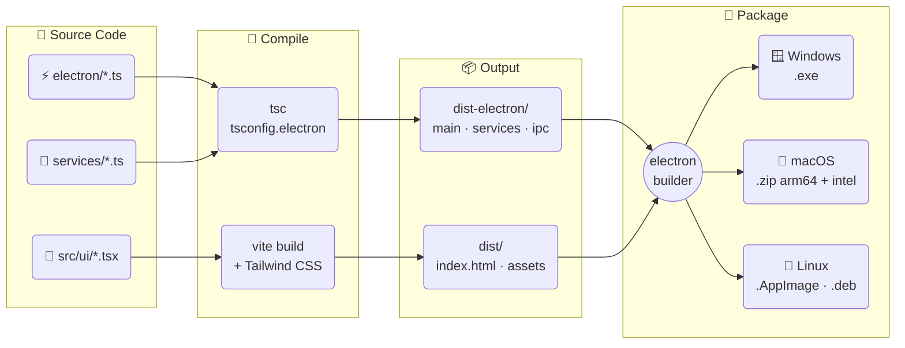
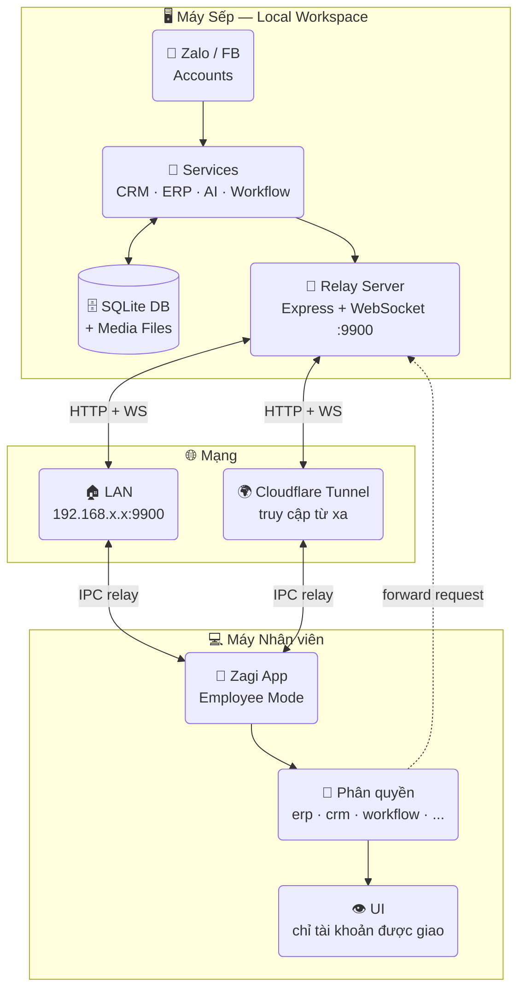

<div align="center">

# ⚡ Zagi

**Phần mềm desktop quản lý Zalo & Facebook đa tài khoản**  
tích hợp CRM · ERP · POS · Workflow · AI Assistant

<p>
  <a href="https://itngon.com/zagi/">🌐 itngon.com/zagi</a> &nbsp;|&nbsp;
  <strong>🇻🇳 Tiếng Việt</strong> &nbsp;|&nbsp;
  <a href="./README.en.md">🇬🇧 English</a>
</p>

[](https://github.com/trithucnen-max/zagi-builder/releases/latest)
[](https://github.com/trithucnen-max/zagi-builder/releases)
[](#tải-xuống)
[](#)
[](#)
[](#)
[](#)
[](#giấy-phép)

<p>
  <a href="#tải-xuống">📥 Tải xuống</a> &nbsp;·&nbsp;
  <a href="#tính-năng">✨ Tính năng</a> &nbsp;·&nbsp;
  <a href="#ảnh-chụp-màn-hình">📸 Screenshots</a> &nbsp;·&nbsp;
  <a href="#changelog">📋 Changelog</a> &nbsp;·&nbsp;
  <a href="#cài-đặt-từ-source">🛠️ Build</a> &nbsp;·&nbsp;
  <a href="#bảo-mật">🔒 Bảo mật</a>
</p>

</div>

---

> 🚀 Một ứng dụng desktop duy nhất giúp đội nhóm bán hàng, CSKH và marketing **vận hành toàn bộ Zalo & Facebook tập trung** — từ chat đa tài khoản, CRM, chiến dịch, workflow tự động đến AI trợ lý và báo cáo nội bộ.

---

## 📥 Tải xuống

> **Phiên bản mới nhất: v27.1.9** — [Xem tất cả phiên bản](#changelog)

<table>
<tr>
<td align="center" width="25%">

### 🪟 Windows

[](https://github.com/trithucnen-max/zagi-builder/releases/latest/download/Zagi-Setup-27.1.9-x64.exe)

**[Zagi-Setup-27.1.9-x64.exe](https://github.com/trithucnen-max/zagi-builder/releases/latest/download/Zagi-Setup-27.1.9-x64.exe)**

NSIS Installer · ~148 MB

</td>
<td align="center" width="25%">

### 🍎 macOS M1+

[](https://github.com/trithucnen-max/zagi-builder/releases/latest/download/Zagi-27.1.9-arm64-mac.zip)

**[Zagi-27.1.9-arm64-mac.zip](https://github.com/trithucnen-max/zagi-builder/releases/latest/download/Zagi-27.1.9-arm64-mac.zip)**

Apple Silicon · ~160 MB

</td>
<td align="center" width="25%">

### 🍎 macOS Intel

[](https://github.com/trithucnen-max/zagi-builder/releases/latest/download/Zagi-27.1.9-mac.zip)

**[Zagi-27.1.9-mac.zip](https://github.com/trithucnen-max/zagi-builder/releases/latest/download/Zagi-27.1.9-mac.zip)**

Intel x64 · ~165 MB

</td>
<td align="center" width="25%">

### 🐧 Linux

[](https://github.com/trithucnen-max/zagi-builder/releases/latest/download/Zagi-27.1.9.AppImage)

**[Zagi-27.1.9.AppImage](https://github.com/trithucnen-max/zagi-builder/releases/latest/download/Zagi-27.1.9.AppImage)**  
**[zagi_27.1.9_amd64.deb](https://github.com/trithucnen-max/zagi-builder/releases/latest/download/zagi_27.1.9_amd64.deb)**

AppImage + .deb · ~197 MB

</td>
</tr>
<tr>
<td align="center" colspan="4">

### 💻 Surface (Windows ARM64)

> Dành cho **Surface Pro X, Pro 9 5G, Pro 10, Pro 11, Laptop 7** (chip Snapdragon / ARM64)
> 
> **Surface Pro 7 trở xuống (Intel)** → dùng bản Windows x64 phía trên.

[](https://github.com/trithucnen-max/zagi-builder/releases/latest/download/Zagi-Setup-27.1.9-arm64.exe)

**[Zagi-Setup-27.1.9-arm64.exe](https://github.com/trithucnen-max/zagi-builder/releases/latest/download/Zagi-Setup-27.1.9-arm64.exe)**

NSIS Installer ARM64 · ~148 MB · Tối ưu native cho Surface ARM

</td>
</tr>
</table>

<p align="center">
  👉 <strong><a href="https://github.com/trithucnen-max/zagi-builder/releases">Xem tất cả phiên bản →</a></strong>
</p>

---

## 🧭 Hướng dẫn chọn đúng phiên bản

> **Không biết tải bản nào?** Làm theo sơ đồ bên dưới — chọn sai bản vẫn chạy được nhưng hiệu năng không tối ưu.

### 🪟 Tôi dùng Windows

```
Máy tính của bạn là loại gì?
│
├─ 🖥️ PC desktop / Laptop thông thường (Dell, HP, Lenovo, Asus, Acer...)
│   └─ → Tải: Zagi-Setup-27.1.9-x64.exe  ✅
│
├─ 💻 Surface Pro 7, Surface Laptop 1-4, Surface Go 1-2, Surface Book
│   └─ → Tải: Zagi-Setup-27.1.9-x64.exe  ✅  (chip Intel, bản x64 chạy ok)
│
└─ 💻 Surface Pro X, Surface Pro 9 (5G), Surface Pro 10, Surface Pro 11,
       Surface Laptop 7 (chip Snapdragon / ARM64)
    └─ → Tải: Zagi-Setup-27.1.9-arm64.exe  ✅ (bản native ARM64)
```

> 💡 **Cách kiểm tra chip máy Surface:** Vào `Settings → System → About`, xem mục **Processor**:
> - Có chữ `Intel` hoặc `AMD` → dùng bản `.exe` thường (x64)
> - Có chữ `Snapdragon` hoặc `ARM` → dùng bản `-arm64.exe`

---

### 🍎 Tôi dùng macOS

```
Mac của bạn là loại gì?
│
├─ 🍎 MacBook Air/Pro M1, M2, M3, M4 (2020 trở về sau)
│   └─ → Tải: Zagi-27.1.9-arm64-mac.zip  ✅
│
└─ 🍎 MacBook, iMac, Mac mini chip Intel (2019 trở về trước)
    └─ → Tải: Zagi-27.1.9-mac.zip  ✅
```

> 💡 **Cách kiểm tra:** Click logo Apple → **About This Mac** → xem mục **Chip** hoặc **Processor**:
> - Có chữ `Apple M1/M2/M3/M4` → bản `-arm64-mac.zip`
> - Có chữ `Intel` → bản `-mac.zip`

---

### 🐧 Tôi dùng Linux

```
Bạn dùng distro nào?
│
├─ Ubuntu, Mint, PopOS, Zorin, ElementaryOS... → Tải .deb  ✅
│   sudo dpkg -i zagi_27.1.9_amd64.deb
│
└─ Fedora, Arch, openSUSE hoặc bất kỳ distro nào
    → Tải .AppImage  ✅
    chmod +x Zagi-27.1.9.AppImage && ./Zagi-27.1.9.AppImage
```

---

### 📊 Bảng tổng hợp nhanh

| Thiết bị | File cần tải | Ghi chú |
|---|---|---|
| PC/Laptop Windows (Intel/AMD) | `Zagi-Setup-27.1.9-x64.exe` | Phổ biến nhất |
| Surface Pro 7 trở xuống | `Zagi-Setup-27.1.9-x64.exe` | Chip Intel |
| Surface Pro X, 9 5G, 10, 11, Laptop 7 | `Zagi-Setup-27.1.9-arm64.exe` | 🆕 Chip ARM64 |
| MacBook M1/M2/M3/M4 | `Zagi-27.1.9-arm64-mac.zip` | Apple Silicon |
| MacBook/iMac Intel | `Zagi-27.1.9-mac.zip` | Intel x64 |
| Ubuntu/Debian Linux | `zagi_27.1.9_amd64.deb` | Cài như package |
| Fedora/Arch/Linux khác | `Zagi-27.1.9.AppImage` | Chạy mọi distro |

---

<details>
<summary>⚠️ Cảnh báo bảo mật khi cài lần đầu (Windows / macOS / Linux)</summary>

Zagi là một dự án độc lập, phiên bản hiện tại chưa có chữ ký số (Code Signing) chính thức của Apple/Microsoft. Vì vậy, hệ thống bảo mật (Gatekeeper trên macOS và SmartScreen trên Windows) sẽ hiển thị cảnh báo khi cài đặt lần đầu.

### 🪟 Windows & Surface — "Windows protected your PC"

1. Nhấn **More info** (Thông tin thêm)
2. Nhấn **Run anyway** (Vẫn chạy)

### 🍎 macOS
* ⚠️ **Lưu ý:** Kể từ phiên bản v27.1.9, để phát hành nhanh chóng, bước ký số (Code Signing) tạm thời được bỏ qua. Khi chạy ứng dụng lần đầu, bạn sẽ gặp cảnh báo bảo mật từ Gatekeeper (*"Zagi is damaged and can't be opened"* hoặc *"unidentified developer"*).
* **Cách mở ứng dụng (Vượt qua Gatekeeper):**
  1. Giải nén file `.zip` đã tải về để có ứng dụng `Zagi.app` và kéo nó vào thư mục `/Applications`.
  2. Click chuột phải (hoặc nhấn giữ phím `Control` và click) vào icon `Zagi` trong thư mục `Applications` -> chọn **Open** (Mở) -> chọn tiếp **Open** ở hộp thoại xác nhận.
  3. Hoặc mở Terminal lên và chạy lệnh sau để cấp quyền mở ứng dụng:
     ```bash
     xattr -cr /Applications/Zagi.app
     ```

### 🐧 Linux (AppImage)

```bash
chmod +x Zagi-27.1.9.AppImage
./Zagi-27.1.9.AppImage
```

Nếu lỗi "FUSE not available":
```bash
sudo apt install libfuse2
```

Hoặc dùng `.deb`:
```bash
sudo dpkg -i zagi_27.1.9_amd64.deb
```

</details>

---

## 📸 Ảnh chụp màn hình

<p align="center">
  
</p>

<table>
  <tr>
    <td><br/><sub><strong>Dashboard đa tài khoản</strong></sub></td>
    <td><br/><sub><strong>Hộp thư hợp nhất + AI</strong></sub></td>
    <td><br/><sub><strong>CRM & Quản lý liên hệ</strong></sub></td>
  </tr>
  <tr>
    <td><br/><sub><strong>Quét thành viên nhóm</strong></sub></td>
    <td><br/><sub><strong>Chiến dịch nhắn tin hàng loạt</strong></sub></td>
    <td><br/><sub><strong>Workflow tự động hóa</strong></sub></td>
  </tr>
  <tr>
    <td><br/><sub><strong>Cấu hình node chi tiết</strong></sub></td>
    <td><br/><sub><strong>Tạo workflow bằng AI</strong></sub></td>
    <td><br/><sub><strong>POS, vận chuyển & thanh toán</strong></sub></td>
  </tr>
  <tr>
    <td><br/><sub><strong>Báo cáo & phân tích</strong></sub></td>
    <td><br/><sub><strong>Hiệu suất nhân viên</strong></sub></td>
    <td><br/><sub><strong>ERP nội bộ</strong></sub></td>
  </tr>
</table>

---

## ✨ Tính năng

### 1️⃣ Đa tài khoản & Hộp thư hợp nhất

- Đăng nhập nhiều tài khoản Zalo qua QR Code
- Dashboard quản lý tài khoản trực quan
- Gộp tất cả tài khoản vào **một hộp thư chung** duy nhất
- Tìm kiếm theo tên, biệt danh, số điện thoại
- Bộ lọc nhanh: chưa đọc, chưa trả lời, nhãn, trạng thái hội thoại
- **Proxy độc lập** cho từng tài khoản Zalo (HTTP/HTTPS/SOCKS5)

### 2️⃣ Chat đầy đủ tính năng

- Gửi văn bản, ảnh, video, file
- Emoji, sticker, trả lời, mention thành viên
- Bình chọn, ghi chú nhóm, nhắc nhở, danh thiếp
- Tin nhắn nhanh — lưu mẫu và kích hoạt bằng từ khóa
- Ghim tin nhắn không giới hạn, quản lý ảnh và tệp đính kèm

### 3️⃣ CRM & Chăm sóc khách hàng

- Đồng bộ bạn bè, thành viên nhóm và hồ sơ liên hệ
- Lưu SĐT, giới tính, sinh nhật, ghi chú nội bộ
- Tạo và quản lý nhãn Zalo hai chiều
- Lọc liên hệ đa tiêu chí để tiếp cận đúng mục tiêu
- Quản lý nhóm & Rời nhóm hàng loạt (v27.1.3): Rời nhiều nhóm tự động, tự chuyển quyền Trưởng nhóm tránh mất nhóm, gửi tin tạm biệt trước khi rời nhóm bằng AI
- Chiến dịch: nhắn tin hàng loạt, kết bạn, mời nhóm — cảnh báo an toàn thông minh (Đỏ/Vàng) & theo dõi tiến độ realtime (v27.1.3)

### 4️⃣ Workflow tự động hóa

- Xây dựng workflow kéo thả, không cần code
- AI tạo node và workflow từ lệnh ngôn ngữ tự nhiên
- Trigger: nhận tin nhắn, gắn nhãn, reaction, lịch trình, sự kiện nhóm…
- Hành động: gửi tin/ảnh/file, tìm user, quản lý nhóm, chặn, chuyển tiếp, thu hồi…
- Tích hợp: logic, Google Sheets, AI, Telegram, Discord, Email, Notion, HTTP Request
- Lịch sử thực thi dễ kiểm tra và debug

### 5️⃣ Tích hợp bán hàng

- POS: KiotViet, Haravan, Sapo, Nhanh.vn, Pancake POS
- Vận chuyển: GHN, GHTK
- AI gợi ý trả lời, hỏi đáp trực tiếp trong chat
- Kết hợp thành pipeline bán hàng & CSKH end-to-end

### 6️⃣ Báo cáo, ERP & Quản lý nhân viên

- Báo cáo: tin nhắn, liên hệ, chiến dịch, workflow, AI, nhân viên
- ERP nội bộ: Tasks, Lịch, Ghi chú
- Mô hình Sếp ↔ Nhân viên với relay server và phân quyền theo module
- Theo dõi hiệu suất từng người theo khoảng thời gian

### 7️⃣ 🤖 AI Assistant

- Gợi ý trả lời thông minh trong hội thoại Zalo và Facebook
- Hỏi đáp realtime với AI ngay trong cửa sổ chat
- **Tóm tắt hội thoại** — hiển thị kết quả đẹp với bullet points, bold text (v27.1.2)
- Tạo workflow bằng lệnh ngôn ngữ tự nhiên — không cần kéo thả
- Dùng AI node trong workflow để tạo chatbot tự động trả lời 24/7
- Hỗ trợ đa nền tảng AI: OpenAI, Claude, Gemini, 9Router

---

## 🔒 Bảo mật

Zagi ưu tiên kiến trúc **local-first**:

- Toàn bộ tin nhắn, liên hệ, dữ liệu CRM, cài đặt và media được lưu trên máy người dùng
- Đăng nhập qua QR Code — không lưu mật khẩu Zalo; cookie được mã hóa trên thiết bị
- Người dùng có thể chuyển thư mục lưu trữ sang ổ đĩa khác bất kỳ lúc nào
- Phù hợp cho các đội nhóm yêu cầu kiểm soát dữ liệu chặt chẽ

---

## 🛠️ Công nghệ sử dụng

| Nhóm | Công nghệ |
|------|-----------|
| **Core** | zca-js, fbchat-v2 (Go E2EE bridge) |
| **Desktop** | Electron 41, React 18, Vite 6 |
| **UI** | Tailwind CSS, PostCSS, React Router, Recharts, React Flow |
| **Ngôn ngữ** | TypeScript 5, JavaScript, SQL |
| **Lưu trữ** | SQLite (better-sqlite3), electron-store |
| **State** | Zustand |
| **Backend** | Node.js + Express |
| **AI Gateway** | 9Router, OpenAI API, Claude, Gemini |
| **Tích hợp** | Axios, Google Sheets, Telegram Bot, Discord.js, node-cron |

---

## 🗺️ Kiến trúc hệ thống

### 1️⃣ Build Pipeline



### 2️⃣ Mô hình Sếp ↔ Nhân viên



---

## 💻 Yêu cầu hệ thống

| | Yêu cầu |
|---|---|
| **Windows** | Windows 10/11 (64-bit) |
| **macOS** | macOS 12+ (Apple Silicon hoặc Intel) |
| **Linux** | Ubuntu 20.04+ hoặc tương đương |
| **Internet** | Kết nối ổn định 24/7 khi dùng workflow |
| **RAM** | 4 GB trở lên khuyến nghị |

---

## 🛠️ Cài đặt từ source

<details>
<summary>Build từ mã nguồn</summary>

### Yêu cầu

- Node.js 18+ 
- npm 9+

### Cài dependencies

```bash
npm install --legacy-peer-deps
```

### Chạy development

```bash
npm run dev
```

### Build production

```bash
npm run production
```

</details>

---

## 📋 Changelog

<details open>
<summary><strong>v27.1.9</strong> — 2026-06-29 · <em>🟢 Phiên bản hiện tại</em></summary>

### 🚀 Nâng cấp nổi bật

- ☁️ **Cloudflare Named Tunnel (Domain riêng)**: Hỗ trợ cấu hình mã Token từ Cloudflare Zero Trust để duy trì kết nối Internet cố định thông qua 3 tên miền riêng phụ (Subdomains) độc lập cho: Tích hợp thanh toán (Port 9888), Workflow Webhook (Port 9889) và Kết nối nhân viên từ xa (Port 9900). Giải quyết triệt để lỗi đổi địa chỉ URL ngẫu nhiên khi khởi động lại ứng dụng.
- 🔌 **Tự động kết nối lại khi đổi mạng (Auto-reconnect)**: Tái cấu trúc bộ kiểm tra kết nối (Health Check) trong HttpConnectionManager. Hệ thống tự động kết nối lại khi nhân viên bị ngắt kết nối Wifi, đổi mạng hoặc mất mạng IP tạm thời dựa trực tiếp trên client instance đã khởi tạo, không phụ thuộc vào trạng thái type trong cấu hình database.
- 🔑 **Ghi nhớ mật khẩu nhân viên**: Bổ sung checkbox "Ghi nhớ mật khẩu" trên màn hình đăng nhập Nhân viên, hỗ trợ mã hóa lưu trữ tự động trong localStorage và điền nhanh khi mở ứng dụng trong lần tiếp theo.
- 🔗 **Tích hợp tab Webhooks vào Cài Đặt**: Đưa module giao diện điều khiển Cloudflare Tunnel trở thành một tab chức năng chính thức (Webhooks) tại màn hình Cài Đặt giúp người dùng tiện thao tác bật/tắt và quản lý.
- 🧹 **Thay đổi nhãn hiệu Zagi & Tắt Tracking**: Rà soát, thay thế toàn bộ từ khóa "Deplao" cũ thành "Zagi" trong UI text, các đường dẫn ví dụ lưu trữ và đổi tên thư mục ảnh tạm của workflow thành zagi-workflow-images. Gỡ bỏ hoàn toàn module TrackingService thu thập dữ liệu sử dụng không cần thiết.

</details>


<details open>
<summary><strong>v27.1.8</strong> — 2026-06-26</summary>

### 🚀 Nâng cấp nổi bật

- 📊 **Giới hạn số lượng liên hệ Chiến dịch (1000 người)**: Tự động kiểm tra và chỉ thêm tối đa 1000 liên hệ cho mỗi chiến dịch. Khi số lượng liên hệ vượt quá giới hạn, phần dư thừa sẽ tự động được loại bỏ và hiển thị thông báo cảnh báo chi tiết (ví dụ: chiến dịch đang có 800 người, thêm nhóm 300 người sẽ chỉ nhận 200 người và loại bỏ 100 người).
- 🔒 **Khóa phím tắt khi đang nhập liệu**: Tự động vô hiệu hóa toàn bộ các phím tắt custom (như Tab để chuyển tiêu điểm) khi người dùng đang gõ nội dung trong các trường nhập liệu (input, textarea, contenteditable) để tránh xung đột hành vi.
- 🏷️ **Tự động chọn nhãn trùng tên**: Khi người dùng nhập trùng tên nhãn Local đã tồn tại (không phân biệt hoa thường), hệ thống sẽ tự động chọn nhãn cũ và hiển thị thông báo thay vì tạo nhãn trùng lặp. Áp dụng đồng bộ tại khung chat, bảng nhập danh bạ, import CSV/SĐT và cấu hình workflow.
- 📋 **Sao chép chi tiết lỗi Workflow**: Bổ sung nút "📋 Copy lỗi" trực quan bên cạnh các khối thông báo lỗi tại danh sách lịch sử chạy workflow (chi tiết từng node và lỗi cấp run) và panel cấu hình, giúp nhanh chóng sao chép toàn bộ thông tin chi tiết lỗi (body response, stack trace) vào clipboard.

</details>

<details>
<summary><strong>v27.1.7</strong> — 2026-06-26</summary>

### 🚀 Nâng cấp nổi bật

- 🖼️ **Trình chọn nhiều ảnh Workflow & Gửi ngẫu nhiên**: Thiết kế lại giao diện cấu hình gửi ảnh trong Workflow (`zalo.sendImage`). Hỗ trợ chọn nhiều ảnh cùng lúc từ máy tính qua Dialog, thêm URL thủ công, quản lý danh sách bằng lưới xem trước (preview grid) có nút xóa nhanh, và toggle checkbox gửi ngẫu nhiên 1 ảnh hoặc gửi đồng loạt.
- 🎨 **Chuẩn hóa Logo Tích hợp & Tiêu đề danh mục**: Chuyển các logo thương hiệu tích hợp (KiotViet, Haravan, Sapo, Nhanh.vn, Pancake, Casso, SePay, GHN, GHTK) và trợ lý AI sang dạng biểu tượng SVG màu trắng tinh khiết đặt trên ô vuông nền màu sắc đặc trưng của chính thương hiệu đó (solid brand-colored backgrounds). Riêng DeepSeek sử dụng màu nền xanh trời (`bg-sky-600`) để tuân thủ quy tắc cấm màu tím (Purple Ban).
- 📖 **Tích hợp tài liệu Hướng dẫn sử dụng**: Di chuyển toàn bộ hướng dẫn sử dụng từ popup sidebar vào trang **Cài đặt → Giới thiệu → Hướng dẫn sử dụng** với 5 tab phân mục khoa học, bổ sung thông tin chi tiết về quét nhóm ẩn `lockViewMember` và gửi nhiều ảnh/file.
- 🧪 **Trình gỡ lỗi trực quan & Giả lập Sandbox (Visual Debugger & Sandbox)**: Bổ sung nút "Chạy Sandbox" cho phép chạy thử nghiệm workflow giả lập hoàn toàn an sau (không gửi tin nhắn thật, không ghi sheets thật). Hiển thị trực quan trạng thái chạy (Xanh = Success, Đỏ = Error, Xám mờ = Skipped) và đường đi của luồng dữ liệu (Edge) trên Canvas React Flow. Cho phép click vào icon ℹ️ trên từng Node để kiểm tra nhanh cấu trúc dữ liệu Input/Output thực tế.
- 🔍 **Nâng cấp Zoom toàn cục & Thống nhất nút bấm**: Phóng to/thu nhỏ cỡ chữ toàn diện bằng CSS Variable kết hợp ghi đè pixel cứng, tránh vỡ layout viewport (100vh) trên các màn hình khác nhau. Đồng bộ nút bấm có nền màu luôn hiển thị chữ trắng/icon trắng. Cập nhật màu nền trắng tinh `#ffffff` cho các cột danh sách chat và thông tin hội thoại ở Light Mode.
- 📝 **Tự động gợi ý Biến thông minh (Smart Variable Auto-complete)**: Hỗ trợ trình gợi ý thả xuống (Dropdown) trực quan hiển thị ngay khi người dùng gõ ký tự "{" tại các ô cấu hình. Cho phép dùng phím điều hướng và Enter để chèn nhanh các biến hệ thống (`$trigger`, `$date`) và biến node (`$node.[Tên_Node].output`).
- 👥 **Đồng bộ thông tin nhóm Zalo**: Cập nhật chính xác tên nhóm và avatar thực tế vào bảng `contacts` SQLite khi quét nhóm bằng link (kể cả nhóm ẩn thành viên nhờ quét dự phòng `getGroupInfo`) và đồng bộ nhóm đơn lẻ, giải quyết triệt để lỗi hiện ID thô.
- ⏰ **Mốc hiển thị thời gian & Icon phẳng**: Di chuyển giờ phút gửi tin nhắn lên phía trên bong bóng chat và căn lề tương ứng. Thay thế các emoji 3D tại sidebar thông tin nhóm bằng các biểu tượng SVG phẳng đơn sắc tự động đổi màu dynamic.
- 🏠 **Kho Mẫu Bất động sản chuyên sâu (Real Estate Templates Category)**: Bổ sung danh mục chuyên biệt "Bất động sản" hiển thị trực quan trên giao diện Store cùng 8 kịch bản được thiết kế sẵn (chúc sinh nhật VIP, chúc mùng 1/ngày rằm âm lịch, nhắc tiến độ nộp tiền, khảo sát bàn giao, báo cáo thị trường định kỳ...).
- 🪄 **Trợ lý AI Soạn thảo (AI Assistant Writing Integration)**: Tích hợp nút và khay soạn thảo nội dung bằng AI ("🪄 Trợ lý AI") cho các trường textarea/multiline trong trình cấu hình node của Workflow và khung chat hội thoại Zalo/Facebook. Hỗ trợ gọi API qua `ipc.ai?.chat` để viết tin nhắn nhanh chóng và tự động điền vào khung soạn thảo.
- 🐛 **Sửa lỗi cột Pipeline & Không xóa file gốc**: Khắc phục lỗi `NOT NULL constraint failed: crm_pipeline_stages.created_at` khi thêm mới cột trạng thái trong bảng Pipeline CRM bằng cách tự động chạy Migration. Loại bỏ hành vi tự động xóa file gốc của người dùng sau khi gửi thành công qua Zalo.

</details>

<details>
<summary><strong>v27.1.6</strong> — 2026-06-24</summary>

### 🚀 Nâng cấp nổi bật

- 📊 **Báo cáo tổng kết chiến dịch CRM**: Thêm widget trực quan ở đầu màn hình chi tiết chiến dịch, hiển thị thống kê Thành công, Thất bại (đếm theo từng lý do lỗi chi tiết), Tổng số liên hệ và Đang chờ gửi.
- 🔁 **Tái sử dụng & Gửi bù chiến dịch**: Bổ sung hai nút hành động "Gửi bù lỗi" (chỉ gửi lại cho các liên hệ bị lỗi) và "Chạy lại" (reset trạng thái toàn bộ liên hệ về chờ gửi để chạy lại từ đầu) trực tiếp tại giao diện.
- 🤝 **Cải tiến bảng chọn liên hệ chiến dịch**: Loại bỏ tab "Thủ công", đổi tab mặc định thành "Theo nhãn", nâng cấp tab "Bạn bè" và "Nhóm" hỗ trợ tích chọn từng người/nhóm qua checkbox và nút "Chọn tất cả" thông minh.
- 👥 **Hiển thị avatar nhóm Zalo**: Tích hợp component `GroupAvatar` và `groupInfoCache` giúp tự động ghép ảnh đại diện thành viên (composite avatar) cho các nhóm Zalo y hệt giao diện gốc.
- 🛡️ **Công nghệ Quét Bóng Thụ Động (Passive Shadow Scanning - PSS)**: Vượt qua hoàn toàn cơ chế khóa danh sách thành viên (`lockViewMember`) của Zalo, tự động nhận diện và thu thập chính xác UID của các thành viên ẩn trong nhóm mà không cần quyền Quản trị viên.
- 🐛 **Sửa lỗi kẹt trạng thái gửi tin**: Khắc phục lỗi kẹt chiến dịch ở trạng thái "Đang chạy" (active) khi liên hệ cuối cùng gặp lỗi gửi tin ngầm.

</details>

<details>
<summary><strong>v27.1.5</strong> — 2026-06-24</summary>

### 🚀 Nâng cấp nổi bật

- 🔄 **Chuẩn hóa tự động cập nhật đa nền tảng (Auto-Update)**: Tự động nhận diện cấu trúc chip (Intel x64 vs Apple Silicon arm64) trên macOS để tải bộ cài phù hợp. Trên Windows/Surface, tự động tải chạy nền bằng `electron-updater` rồi tiến hành nâng cấp ngầm. Chỉ hiển thị một thông báo duy nhất trên Topbar và loại bỏ popup trùng lặp phía dưới.
- 📅 **Tích hợp CRM vào Workflow & Âm lịch Việt Nam**: Hỗ trợ quy trình chăm sóc khách hàng tự động linh hoạt: gửi tin chúc mừng sinh nhật, gửi tin ngày mùng 1 âm lịch hàng tháng (lịch âm Việt Nam), gửi tin ngày lễ 20/10, 8/3, và gửi tin tự động theo trạng thái của phễu bán hàng (Pipeline Stage).
- ✏️ **Cập nhật trực tiếp hồ sơ CRM**: Cho phép chỉnh sửa nhanh các trường thông tin Họ tên, Số điện thoại, Ngày sinh, Giới tính của khách hàng ngay trên thanh thông tin hội thoại (`ConversationInfo.tsx`) và lưu trực tiếp vào cơ sở dữ liệu SQLite cục bộ.
- 🔗 **Hệ thống giới thiệu Affiliate/Referral**: Hỗ trợ nhập "Mã giới thiệu" khi đăng ký bản quyền (cả dùng thử hoặc mua), tự động lưu trữ tại cột L trên Google Sheets và gửi thông báo qua email Quản trị viên (không gửi về mail khách hàng).
- 🔧 **Sửa lỗi Dev Port**: Khắc phục triệt để lỗi xung đột cổng 27799 khi chạy dev server trên macOS bằng cách bind explicit host `127.0.0.1` và cấu hình delay cho `wait-on`.

</details>

<details>
<summary><strong>v27.1.4</strong> — 2026-06-24</summary>

### 🚀 Nâng cấp nổi bật

- 👥 **Quét thành viên nhóm ẩn (View Member Locked)**: Hỗ trợ tự động chuyển đổi sang cơ chế đồng bộ UID qua `getGroupInfo` / `memVerList` khi danh sách thành viên nhóm bị khóa (`lockViewMember = true` hoặc `currentMems` trống).
- 📦 **Phân trang API Thành viên (Batched API Request)**: Phân tách việc gọi API `getGroupMembersInfo` của Zalo thành các lô nhỏ 50 thành viên để tránh lỗi HTTP 431 (URI Too Long) khi đồng bộ nhóm đông người.
- 🔗 **Liên kết Danh bạ Dự phòng (Database Fallback)**: Cải tiến câu truy vấn SQLite của thành viên nhóm bằng cách `LEFT JOIN` với bảng `contacts`. Giúp hiển thị ngay tên/avatar của bất kỳ thành viên nào đã có trong danh bạ (bạn bè hoặc người đã tương tác) ngay khi danh sách nhóm bị khóa.
- 🔄 **Đồng bộ gộp dữ liệu thành viên (Merge-upsert)**: Chuyển đổi toàn bộ cơ chế lưu trữ thành viên nhóm sang `mergeGroupMembers` giúp bảo toàn tên/avatar đã được đồng bộ trước đó khi cập nhật danh sách UID mới.
- 🏷️ **Chọn nhãn từ bước đầu khi nhập SĐT**: Cho phép tạo/gán nhãn Local hoặc chọn nhãn Zalo ngay từ màn hình nhập danh sách SĐT đầu tiên thay vì ẩn đi.
- 🎨 **Đồng bộ màu sắc các nút Xác nhận/Import**: Chuyển màu nút "Xác nhận Import" (CSV) và nút "Thêm liên hệ" (SĐT) sang màu xanh dương chữ trắng thương hiệu (`bg-blue-600 hover:bg-blue-750`).
- 🗑️ **Di chuyển nút Xóa liên hệ đã chọn**: Loại bỏ tùy chọn xóa hàng loạt liên hệ khỏi menu "Thao tác" bên phải, tích hợp trực quan vào dropdown "Khác" của thanh BulkActionBar nổi dưới màn hình.

</details>

<details>
<summary><strong>v27.1.3</strong> — 2026-06-23</summary>

### 🚀 Nâng cấp nổi bật

- 👥 **Quản lý nhóm & Rời nhóm hàng loạt (Smart Group Management)**: Hỗ trợ rời nhiều nhóm cùng lúc từ giao diện Liên hệ CRM hoặc Quản lý nhóm.
- 👑 **Tự động chuyển quyền Trưởng nhóm**: Tự động chuyển quyền Owner sang Phó nhóm hoặc thành viên khác trước khi rời đi để tránh nhóm bị giải tán hoặc mất kiểm soát.
- 👋 **AI tạm biệt lịch sự**: Tự động soạn tin nhắn tạm biệt tinh tế bằng trợ lý AI (AI Assistant) và gửi vào nhóm trước khi rời đi.
- 🛡️ **Cẩm nang an toàn Zalo**: Nút truy cập nhanh "Cẩm nang an toàn Zalo" trên Topbar với các nguyên tắc gửi tin cho người lạ, bạn bè, hạn mức và tự động nhận diện Zalo Business.
- ⚠️ **Cảnh báo an toàn Chiến dịch**: Hệ thống tự động phân tích và hiển thị cảnh báo đỏ/vàng khi tạo chiến dịch gửi tin nếu các tham số vi phạm quy tắc an toàn của Zalo.
- 🎨 **Đồng bộ giao diện CRM mới**: Làm mới toàn bộ giao diện CRM chi tiết (thông tin liên hệ, pipeline Kanban, các bảng biểu) sang tông nền trắng chữ đen nổi bật, chuyên nghiệp.

</details>

<details>
<summary><strong>v27.1.2</strong> — 2026-06-21</summary>

### 🔧 Cải thiện & Sửa lỗi

- 💻 **Bản cài đặt Windows ARM64 cho Surface**: Bổ sung bản build native ARM64 cho dòng Surface Pro 9/10/11/X và Laptop 7.
- 📝 **Hướng dẫn chọn phiên bản**: Thêm sơ đồ chi tiết giúp người dùng dễ chọn đúng file cài đặt theo hệ điều hành trong README.
- 🤖 **AI Quick Panel**: Render markdown đúng chuẩn — bold (`**text**`), bullet list (`-`), numbered list, `code block`, header `#` hiển thị đẹp thay vì ký tự thô.
- 🔄 Cập nhật website giới thiệu → [itngon.com/zagi](https://itngon.com/zagi/)
- 📦 Cập nhật metadata package: repository, author, homepage.
- 🔑 Chuẩn hóa toàn bộ CI/CD sang `trithucnen-max/zagi-builder`.

</details>

<details>
<summary><strong>v27.1.1</strong> — 2026-06-20</summary>

### 🔧 Cải thiện hạ tầng CI/CD

- 🔄 Migrate toàn bộ CI/CD sang repo `trithucnen-max/zagi-builder`
- 🔑 Chuyển sang `GITHUB_TOKEN` built-in cho tất cả workflow
- 📝 Fix duplicate build trigger — mỗi platform chỉ build 1 lần khi push tag

</details>

<details>
<summary><strong>v27.1.0</strong> — 2026-06-20</summary>

### 🚀 Nâng cấp nổi bật

- 🎨 Cải tiến toàn bộ giao diện CRM — danh sách liên hệ, bộ lọc và quản lý nhãn được thiết kế lại
- ⚡ Tối ưu hiệu suất render danh sách liên hệ lớn (>10,000 contacts)
- 🤖 Cải thiện AI Assistant — độ chính xác gợi ý trả lời tốt hơn

### ✨ Tính năng mới

- **CRM nâng cao**: Bộ lọc liên hệ đa tiêu chí với giao diện sidebar mới
- **CRM Pipeline**: Giao diện Kanban quản lý quy trình bán hàng
- **CRM Timeline**: Xem lịch sử tương tác theo dòng thời gian
- **Bulk actions**: Chọn nhiều liên hệ và thực hiện hành động hàng loạt
- **Export nâng cao**: Xuất dữ liệu CRM ra Excel với format chuẩn

### ⚡ Cải thiện

- Tăng tốc tải danh sách liên hệ 3x
- Cải thiện bộ nhớ khi làm việc với nhiều tài khoản đồng thời
- License Manager tích hợp trong app

### 🐛 Sửa lỗi

- Sửa lỗi tìm kiếm liên hệ không trả kết quả khi nhập SĐT có dấu cách
- Sửa lỗi nhãn không cập nhật realtime từ màn hình chat
- Sửa lỗi bulk label actions trong CRM

</details>

<details>
<summary><strong>v26.6.4</strong> — 2026-06-20</summary>

- 👤 Tự động làm mới avatar Zalo khi khởi động
- ✏️ Facebook E2EE hỗ trợ xem lịch sử chỉnh sửa tin nhắn
- 📞 Gợi ý gửi danh thiếp Zalo từ số điện thoại trong chat
- 🖼️ Danh thiếp Zalo hỗ trợ kết bạn nhanh
- 🚫 Facebook hiển thị đúng thông báo hệ thống
- ℹ️ Tự động lấy tên và avatar khi mở hội thoại mới
- 👤 Tối ưu tải dữ liệu sếp-nhân viên và gửi tin nhắn

</details>

<details>
<summary><strong>v26.6.3</strong> — 2026-06-17</summary>

- 🐧 **Ubuntu/Linux** hỗ trợ (.AppImage + .deb) với CI/CD tự động
- 📡 Facebook ổn định hơn với auto-reconnect khi mất kết nối
- 🤖 Workflow Zalo & Facebook có thể gửi tin nhắn đến nhiều hội thoại cùng lúc
- 📹 Xem video Facebook trực tiếp trong chat
- 📤 Nhân viên Zalo tự động upload ảnh, video, voice lên sếp trước khi proxy

</details>

<details>
<summary><strong>v26.6.2</strong> — 2026-06-16</summary>

- 🔐 Đăng nhập Facebook bằng email/phone + mật khẩu + 2FA (không cần copy cookie thủ công)
- 🔔 Cài đặt thông báo riêng từng tài khoản (âm thanh và cảnh báo góc)
- 🤖 AI Assistant hỗ trợ thêm OpenRouter
- Sửa lỗi một số model AI miễn phí trên 9Router không kết nối được
- Sửa lỗi node forward Zalo không chuyển tiếp tin nhắn và ảnh
- Sửa lỗi tài khoản đã xóa vẫn duy trì kết nối nền

</details>

<details>
<summary><strong>v26.6.0</strong> — 2026-06-14</summary>

- 🤖 Tích hợp Facebook Messenger E2EE (đọc/gửi tin nhắn mã hóa đầu cuối)
- 📊 CRM Scanner Facebook (nhóm, fanpage, bài đăng, thành viên, comment)
- ⚡ Facebook Workflow với nhiều Trigger & Action
- 🤖 Tích hợp 9Router AI Gateway

</details>

<details>
<summary><strong>v26.4.0 → v26.4.8</strong> — 2026-05-20 đến 2026-06-07</summary>

### 🎉 Ra mắt Zagi chính thức

Phiên bản đầy đủ tính năng đầu tiên:

- Zalo đa tài khoản & hộp thư hợp nhất
- CRM, Chiến dịch, Workflow tự động hóa
- AI Assistant (OpenAI, Claude, Gemini, 9Router)
- POS, vận chuyển, tích hợp ngoài
- ERP nội bộ & mô hình Sếp ↔ Nhân viên
- Báo cáo & phân tích toàn diện
- Khóa màn hình, chuyển tiếp tin nhắn hàng loạt, tự động sửa ảnh
- Relay LAN/WAN với Cloudflare Tunnel
- Quản lý proxy theo tài khoản

</details>

<p align="center">
  👉 <strong><a href="https://github.com/trithucnen-max/zagi-builder/releases">Xem tất cả phiên bản trên GitHub →</a></strong>
</p>

---

## 🎯 Dành cho ai?

| Đối tượng | Lý do phù hợp |
|-----------|---------------|
| Shop online & đội sale | Chốt đơn qua Zalo với nhiều tài khoản song song |
| SME cần nhiều nhân viên vào inbox | Mô hình Sếp ↔ Nhân viên với phân quyền chặt chẽ |
| Agency marketing | Quản lý nhiều tài khoản khách hàng tập trung |
| Spa, phòng khám, F&B, giáo dục | CSKH định kỳ, tái tiếp cận khách hàng cũ |
| Team muốn all-in-one | Chat + CRM + Workflow + AI + ERP trong một app |

---

## 📣 Liên hệ & Hỗ trợ

- 🐛 **Báo lỗi & góp ý**: [GitHub Issues](https://github.com/trithucnen-max/zagi-builder/issues)
- 🌐 **Website**: [itngon.com/zagi](https://itngon.com/zagi/)

---

## 🙏 Cảm ơn

Zagi trân trọng đóng góp từ các dự án mã nguồn mở:

- 👉 [zca-js](https://github.com/RFS-ADRENO/zca-js) — thư viện Zalo JS
- 👉 [fbchat-v2](https://github.com/m008v/fbchat-v2) — bridge Facebook E2EE

---

## 📝 Giấy phép

Dự án được phân phối theo **MIT License**.  
Xem file [LICENSE](LICENSE) để biết chi tiết.

---

<div align="center">
  <sub>Made with ❤️ by the Zagi team · <a href="https://itngon.com/zagi/">itngon.com/zagi</a></sub>
</div>
