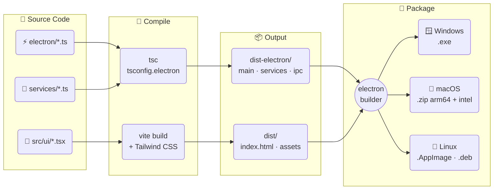
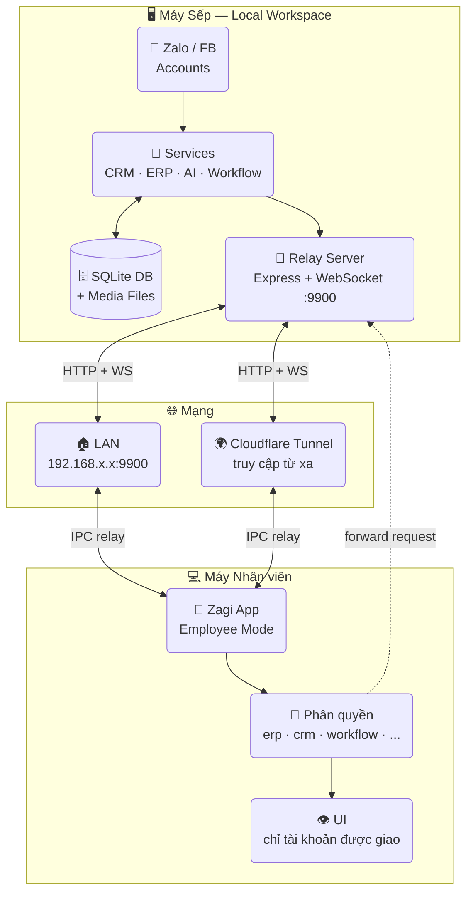

<div align="center">

# ⚡ Zagi

**Phần mềm desktop quản lý Zalo & Facebook đa tài khoản**  
tích hợp CRM · ERP · POS · Workflow · AI Assistant

<p>
  <a href="https://itngon.com/zagi/">🌐 itngon.com/zagi</a> &nbsp;|&nbsp;
  <strong>🇻🇳 Tiếng Việt</strong> &nbsp;|&nbsp;
  <a href="./README.en.md">🇬🇧 English</a>
</p>

[](https://github.com/trithucnen-max/zagi-builder/releases/latest)
[](https://github.com/trithucnen-max/zagi-builder/releases)
[](#tải-xuống)
[](#)
[](#)
[](#)
[](#)
[](#giấy-phép)

<p>
  <a href="#tải-xuống">📥 Tải xuống</a> &nbsp;·&nbsp;
  <a href="#tính-năng">✨ Tính năng</a> &nbsp;·&nbsp;
  <a href="#ảnh-chụp-màn-hình">📸 Screenshots</a> &nbsp;·&nbsp;
  <a href="#changelog">📋 Changelog</a> &nbsp;·&nbsp;
  <a href="#cài-đặt-từ-source">🛠️ Build</a> &nbsp;·&nbsp;
  <a href="#bảo-mật">🔒 Bảo mật</a>
</p>

</div>

---

> 🚀 Một ứng dụng desktop duy nhất giúp đội nhóm bán hàng, CSKH và marketing **vận hành toàn bộ Zalo & Facebook tập trung** — từ chat đa tài khoản, CRM, chiến dịch, workflow tự động đến AI trợ lý và báo cáo nội bộ.

---

## 📥 Tải xuống

> **Phiên bản mới nhất: v3.1.7** — [Xem tất cả phiên bản](#changelog)

<table>
<tr>
<td align="center" width="25%">

### 🪟 Windows

[](https://github.com/trithucnen-max/zagi-builder/releases/download/v3.1.9/Zagi.v3.1.9.Window.exe)

**[Zagi.v3.1.7.Window.exe](https://github.com/trithucnen-max/zagi-builder/releases/download/v3.1.9/Zagi.v3.1.9.Window.exe)**

NSIS Installer · ~164 MB

</td>
<td align="center" width="25%">

### 🍎 macOS M1+

[](https://github.com/trithucnen-max/zagi-builder/releases/download/v3.1.9/Zagi.v3.1.9.MacOS.M1%2B.arm64.dmg)

**[Zagi.v3.1.7.MacOS.M1+.arm64.dmg](https://github.com/trithucnen-max/zagi-builder/releases/download/v3.1.9/Zagi.v3.1.9.MacOS.M1%2B.arm64.dmg)**

Apple Silicon DMG · Signed & Notarized · ~231 MB

</td>
<td align="center" width="25%">

### 🍎 macOS Intel

[](https://github.com/trithucnen-max/zagi-builder/releases/download/v3.1.9/Zagi.v3.1.9.MacOS.Intel.dmg)

**[Zagi.v3.1.7.MacOS.Intel.dmg](https://github.com/trithucnen-max/zagi-builder/releases/download/v3.1.9/Zagi.v3.1.9.MacOS.Intel.dmg)**

Intel x64 DMG · Signed & Notarized · ~239 MB

</td>
<td align="center" width="25%">

### 🐧 Linux

[](https://github.com/trithucnen-max/zagi-builder/releases/download/v3.1.9/Zagi.v3.1.9.Linux.AppImage)

**[Zagi.v3.1.7.Linux.AppImage](https://github.com/trithucnen-max/zagi-builder/releases/download/v3.1.9/Zagi.v3.1.9.Linux.AppImage)**  
**[Zagi.v3.1.7.Linux.Debian.deb](https://github.com/trithucnen-max/zagi-builder/releases/download/v3.1.9/Zagi.v3.1.9.Linux.Debian.deb)**

AppImage + Debian .deb

</td>
</tr>
<tr>
<td align="center" colspan="4">

### 💻 Surface (Windows ARM64)

> Dành cho **Surface Pro X, Pro 9 5G, Pro 10, Pro 11, Laptop 7** (chip Snapdragon / ARM64)
> 
> Surface Pro 7 trở xuống (Intel) → dùng bản Windows x64 phía trên.

[](https://github.com/trithucnen-max/zagi-builder/releases/download/v3.1.9/Zagi.v3.1.9.Surface.exe)

**[Zagi.v3.1.7.Surface.exe](https://github.com/trithucnen-max/zagi-builder/releases/download/v3.1.9/Zagi.v3.1.9.Surface.exe)**

NSIS Installer ARM64 · ~166 MB · Tối ưu native cho Surface ARM

</td>
</tr>
</table>

<p align="center">
  👉 <strong><a href="https://github.com/trithucnen-max/zagi-builder/releases">Xem tất cả phiên bản →</a></strong>
</p>

---

## 🧭 Hướng dẫn chọn đúng phiên bản

> **Không biết tải bản nào?** Làm theo sơ đồ bên dưới — chọn sai bản vẫn chạy được nhưng hiệu năng không tối ưu.

### 🪟 Tôi dùng Windows

```
Máy tính của bạn là loại gì?
│
├─ 🖥️ PC desktop / Laptop thông thường (Dell, HP, Lenovo, Asus, Acer...)
│   └─ → Tải: Zagi v3.1.9 Window.exe  ✅
│
├─ 💻 Surface Pro 7, Surface Laptop 1-4, Surface Go 1-2, Surface Book
│   └─ → Tải: Zagi v3.1.9 Window.exe  ✅  (chip Intel, chạy ok)
│
└─ 💻 Surface Pro X, Surface Pro 9 (5G), Surface Pro 10, Surface Pro 11,
       Surface Laptop 7 (chip Snapdragon / ARM64)
    └─ → Tải: Zagi v3.1.9 Surface.exe  ✅ (bản native ARM64)
```

> 💡 **Cách kiểm tra chip máy Surface:** Vào `Settings → System → About`, xem mục **Processor**:
> - Có chữ `Intel` hoặc `AMD` → dùng bản `Zagi v3.1.9 Window.exe`
> - Có chữ `Snapdragon` hoặc `ARM` → dùng bản `Zagi v3.1.9 Surface.exe`

---

### 🍎 Tôi dùng macOS

```
Mac của bạn là loại gì?
│
├─ 🍎 MacBook Air/Pro M1, M2, M3, M4 / Mac Neo chip A18 (2020 trở về sau)
│   └─ → Tải: Zagi v3.1.9 MacOS M1+ arm64.dmg  ✅
│
└─ 🍎 MacBook, iMac, Mac mini chip Intel (2019 trở về trước)
    └─ → Tải: Zagi v3.1.9 MacOS Intel.dmg  ✅
```

> 💡 **Cách kiểm tra:** Click logo Apple → **About This Mac** → xem mục **Chip** hoặc **Processor**:
> - Có chữ `Apple M1/M2/M3/M4/A18` → bản `Zagi v3.1.9 MacOS M1+ arm64.dmg`
> - Có chữ `Intel` → bản `Zagi v3.1.9 MacOS Intel.dmg`

---

### 🐧 Tôi dùng Linux

```
Bạn dùng distro nào?
│
├─ Ubuntu, Mint, PopOS, Zorin, ElementaryOS... → Tải .deb  ✅
│   sudo dpkg -i "Zagi v3.1.9 Linux Debian.deb"
│
└─ Fedora, Arch, openSUSE hoặc bất kỳ distro nào
    → Tải .AppImage  ✅
    chmod +x "Zagi v3.1.9 Linux.AppImage" && ./"Zagi v3.1.9 Linux.AppImage"
```

---

### 📊 Bảng tổng hợp nhanh

| Thiết bị | File cần tải | Ghi chú |
|---|---|---|
| PC/Laptop Windows (Intel/AMD) | `Zagi v3.1.9 Window.exe` | Phổ biến nhất |
| Surface Pro 7 trở xuống | `Zagi v3.1.9 Window.exe` | Chip Intel |
| Surface Pro X, 9 5G, 10, 11, Laptop 7 | `Zagi v3.1.9 Surface.exe` | 🆕 Chip ARM64 |
| MacBook M1/M2/M3/M4 / Mac Neo A18 | `Zagi v3.1.9 MacOS M1+ arm64.dmg` | Apple Silicon (Signed & Notarized) |
| MacBook/iMac Intel | `Zagi v3.1.9 MacOS Intel.dmg` | Intel x64 (Signed & Notarized) |
| Ubuntu/Debian Linux | `Zagi v3.1.9 Linux Debian.deb` | Cài như package |
| Fedora/Arch/Linux khác | `Zagi v3.1.9 Linux.AppImage` | Chạy mọi distro |

---

<details>
<summary>⚠️ Cảnh báo bảo mật khi cài lần đầu (Windows / macOS / Linux)</summary>

Zagi là một dự án độc lập, phiên bản hiện tại chưa có chữ ký số (Code Signing) chính thức của Apple/Microsoft. Vì vậy, hệ thống bảo mật (Gatekeeper trên macOS và SmartScreen trên Windows) sẽ hiển thị cảnh báo khi cài đặt lần đầu.

### 🪟 Windows & Surface — "Windows protected your PC"

1. Nhấn **More info** (Thông tin thêm)
2. Nhấn **Run anyway** (Vẫn chạy)

### 🍎 macOS
* ⚠️ **Lưu ý:** Kể từ phiên bản v3.1.7, để phát hành nhanh chóng, bước ký số (Code Signing) tạm thời được bỏ qua. Khi chạy ứng dụng lần đầu, bạn sẽ gặp cảnh báo bảo mật từ Gatekeeper (*"Zagi is damaged and can't be opened"* hoặc *"unidentified developer"*).
* **Cách mở ứng dụng (Vượt qua Gatekeeper):**
  1. Giải nén file `.zip` đã tải về để có ứng dụng `Zagi.app` và kéo nó vào thư mục `/Applications`.
  2. Click chuột phải (hoặc nhấn giữ phím `Control` và click) vào icon `Zagi` trong thư mục `Applications` -> chọn **Open** (Mở) -> chọn tiếp **Open** ở hộp thoại xác nhận.
  3. Hoặc mở Terminal lên và chạy lệnh sau để cấp quyền mở ứng dụng:
     ```bash
     xattr -cr /Applications/Zagi.app
     ```

### 🐧 Linux (AppImage)

```bash
chmod +x "Zagi v3.1.9 Linux.AppImage"
./"Zagi v3.1.9 Linux.AppImage"
```

Nếu lỗi "FUSE not available":
```bash
sudo apt install libfuse2
```

Hoặc dùng `.deb`:
```bash
sudo dpkg -i "Zagi v3.1.9 Linux Debian.deb"
```

</details>

---

## 📸 Ảnh chụp màn hình

<p align="center">
  
</p>

<table>
  <tr>
    <td><br/><sub><strong>Dashboard đa tài khoản</strong></sub></td>
    <td><br/><sub><strong>Hộp thư hợp nhất + AI</strong></sub></td>
    <td><br/><sub><strong>CRM & Quản lý liên hệ</strong></sub></td>
  </tr>
  <tr>
    <td><br/><sub><strong>Quét thành viên nhóm</strong></sub></td>
    <td><br/><sub><strong>Chiến dịch nhắn tin hàng loạt</strong></sub></td>
    <td><br/><sub><strong>Workflow tự động hóa</strong></sub></td>
  </tr>
  <tr>
    <td><br/><sub><strong>Cấu hình node chi tiết</strong></sub></td>
    <td><br/><sub><strong>Tạo workflow bằng AI</strong></sub></td>
    <td><br/><sub><strong>POS, vận chuyển & thanh toán</strong></sub></td>
  </tr>
  <tr>
    <td><br/><sub><strong>Báo cáo & phân tích</strong></sub></td>
    <td><br/><sub><strong>Hiệu suất nhân viên</strong></sub></td>
    <td><br/><sub><strong>ERP nội bộ</strong></sub></td>
  </tr>
</table>

---

## ✨ Tính năng

### 1️⃣ Đa tài khoản & Hộp thư hợp nhất

- Đăng nhập nhiều tài khoản Zalo qua QR Code
- Dashboard quản lý tài khoản trực quan
- Gộp tất cả tài khoản vào **một hộp thư chung** duy nhất
- Tìm kiếm theo tên, biệt danh, số điện thoại
- Bộ lọc nhanh: chưa đọc, chưa trả lời, nhãn, trạng thái hội thoại
- **Proxy độc lập** cho từng tài khoản Zalo (HTTP/HTTPS/SOCKS5)

### 2️⃣ Chat đầy đủ tính năng

- Gửi văn bản, ảnh, video, file
- Emoji, sticker, trả lời, mention thành viên
- Bình chọn, ghi chú nhóm, nhắc nhở, danh thiếp
- Tin nhắn nhanh — lưu mẫu và kích hoạt bằng từ khóa
- Ghim tin nhắn không giới hạn, quản lý ảnh và tệp đính kèm

### 3️⃣ CRM & Chăm sóc khách hàng

- Đồng bộ bạn bè, thành viên nhóm và hồ sơ liên hệ
- Lưu SĐT, giới tính, sinh nhật, ghi chú nội bộ
- Tạo và quản lý nhãn Zalo hai chiều
- Lọc liên hệ đa tiêu chí để tiếp cận đúng mục tiêu
- Quản lý nhóm & Rời nhóm hàng loạt (v27.1.3): Rời nhiều nhóm tự động, tự chuyển quyền Trưởng nhóm tránh mất nhóm, gửi tin tạm biệt trước khi rời nhóm bằng AI
- Chiến dịch: nhắn tin hàng loạt, kết bạn, mời nhóm — cảnh báo an toàn thông minh (Đỏ/Vàng) & theo dõi tiến độ realtime (v27.1.3)

### 4️⃣ Workflow tự động hóa

- Xây dựng workflow kéo thả, không cần code
- AI tạo node và workflow từ lệnh ngôn ngữ tự nhiên
- Trigger: nhận tin nhắn, gắn nhãn, reaction, lịch trình, sự kiện nhóm…
- Hành động: gửi tin/ảnh/file, tìm user, quản lý nhóm, chặn, chuyển tiếp, thu hồi…
- Tích hợp: logic, Google Sheets, AI, Telegram, Discord, Email, Notion, HTTP Request
- Lịch sử thực thi dễ kiểm tra và debug
- 📦 **Thư viện 18 kịch bản Workflow mẫu:** Đi kèm bộ 18 kịch bản mẫu (.json) thiết lập sẵn cho CSKH, báo cáo kế toán, theo dõi vận đơn, tồn kho, chúc mừng sinh nhật tự động, khảo sát NPS... giúp triển khai ngay lập tức.

### 5️⃣ Tích hợp bán hàng

- POS: KiotViet, Haravan, Sapo, Nhanh.vn, Pancake POS
- Vận chuyển: GHN, GHTK
- AI gợi ý trả lời, hỏi đáp trực tiếp trong chat
- Kết hợp thành pipeline bán hàng & CSKH end-to-end

### 6️⃣ Báo cáo, ERP & Quản lý nhân viên

- Báo cáo: tin nhắn, liên hệ, chiến dịch, workflow, AI, nhân viên
- ERP nội bộ: Tasks, Lịch, Ghi chú
- Mô hình Sếp ↔ Nhân viên với relay server và phân quyền theo module
- Theo dõi hiệu suất từng người theo khoảng thời gian

### 7️⃣ 🤖 AI Assistant

- Gợi ý trả lời thông minh trong hội thoại Zalo và Facebook
- Hỏi đáp realtime với AI ngay trong cửa sổ chat
- **Tóm tắt hội thoại** — hiển thị kết quả đẹp với bullet points, bold text (v27.1.2)
- Tạo workflow bằng lệnh ngôn ngữ tự nhiên — không cần kéo thả
- Dùng AI node trong workflow để tạo chatbot tự động trả lời 24/7
- Hỗ trợ đa nền tảng AI: OpenAI, Claude, Gemini, 9Router
- 🧠 **Trợ lý AI Soạn tin & Nạp biến động tự động:** AI tự nhận diện tất cả biến động (thanh toán, vận chuyển, POS, CRM) để chèn chính xác. Hỗ trợ cú pháp lọc định dạng số `| formatNumber` (phân tách hàng nghìn bằng dấu phẩy).
- ⚙️ **Hợp nhất System Prompt & Tối ưu hiển thị:** Tự động gộp prompt từ DB và code client để tránh xung đột chỉ thị; tự động viết tin nhắn dạng thường kèm emoji thay vì ký tự rác markdown `**` trên Zalo.

---

## 🔒 Bảo mật

Zagi ưu tiên kiến trúc **local-first**:

- Toàn bộ tin nhắn, liên hệ, dữ liệu CRM, cài đặt và media được lưu trên máy người dùng
- Đăng nhập qua QR Code — không lưu mật khẩu Zalo; cookie được mã hóa trên thiết bị
- Người dùng có thể chuyển thư mục lưu trữ sang ổ đĩa khác bất kỳ lúc nào
- Phù hợp cho các đội nhóm yêu cầu kiểm soát dữ liệu chặt chẽ

---

## 🛠️ Công nghệ sử dụng

| Nhóm | Công nghệ |
|------|-----------|
| **Core** | zca-js, fbchat-v2 (Go E2EE bridge) |
| **Desktop** | Electron 41, React 18, Vite 6 |
| **UI** | Tailwind CSS, PostCSS, React Router, Recharts, React Flow |
| **Ngôn ngữ** | TypeScript 5, JavaScript, SQL |
| **Lưu trữ** | SQLite (better-sqlite3), electron-store |
| **State** | Zustand |
| **Backend** | Node.js + Express |
| **AI Gateway** | 9Router, OpenAI API, Claude, Gemini |
| **Tích hợp** | Axios, Google Sheets, Telegram Bot, Discord.js, node-cron |

---

## 🗺️ Kiến trúc hệ thống

### 1️⃣ Build Pipeline


```mermaid
flowchart LR
    subgraph SRC["📁 Source Code"]
        E("⚡ electron/*.ts")
        S("🔧 services/*.ts")
        R("🎨 src/ui/*.tsx")
    end
    subgraph COMPILE["🔨 Compile"]
        TSC("tsc\ntsconfig.electron")
        VITE("vite build\n+ Tailwind CSS")
    end
    subgraph OUT["📦 Output"]
        DE("dist-electron/\nmain · services · ipc")
        D("dist/\nindex.html · assets")
    end
    subgraph PKG["🚀 Package"]
        EB(("electron\nbuilder"))
        WIN("🪟 Windows\n.exe")
        MAC("🍎 macOS\n.zip arm64 + intel")
        LIN("🐧 Linux\n.AppImage · .deb")
    end
    E & S --> TSC --> DE
    R --> VITE --> D
    DE & D --> EB --> WIN & MAC & LIN
```

### 2️⃣ Mô hình Sếp ↔ Nhân viên


```mermaid
flowchart TB
    subgraph BOSS["🖥️ Máy Sếp — Local Workspace"]
        BZ("📱 Zalo / FB\nAccounts")
        BSV("🔧 Services\nCRM · ERP · AI · Workflow")
        BSD[("🗄️ SQLite DB\n+ Media Files")]
        BRL("🔁 Relay Server\nExpress + WebSocket :9900")
    end
    subgraph NET["🌐 Mạng"]
        LAN("🏠 LAN\n192.168.x.x:9900")
        WAN("🌍 Cloudflare Tunnel\ntruy cập từ xa")
    end
    subgraph EMP["💻 Máy Nhân viên"]
        EA("📲 Zagi App\nEmployee Mode")
        EP("🔐 Phân quyền\nerp · crm · workflow · ...")
        EU("👁️ UI\nchỉ tài khoản được giao")
    end
    BZ --> BSV
    BSV <--> BSD
    BSV --> BRL
    BRL <-->|HTTP + WS| LAN & WAN
    LAN <-->|IPC relay| EA
    WAN <-->|IPC relay| EA
    EA --> EP --> EU
    EP -.->|forward request| BRL
```

---

## 💻 Yêu cầu hệ thống

| | Yêu cầu |
|---|---|
| **Windows** | Windows 10/11 (64-bit) |
| **macOS** | macOS 12+ (Apple Silicon hoặc Intel) |
| **Linux** | Ubuntu 20.04+ hoặc tương đương |
| **Internet** | Kết nối ổn định 24/7 khi dùng workflow |
| **RAM** | 4 GB trở lên khuyến nghị |

---

## 🛠️ Cài đặt từ source

<details>
<summary>Build từ mã nguồn</summary>

### Yêu cầu

- Node.js 18+ 
- npm 9+

### Cài dependencies

```bash
npm install --legacy-peer-deps
```

### Chạy development

```bash
npm run dev
```

### Build production

```bash
npm run production
```

</details>

---

## 📋 Changelog

<details open>
<summary><strong>v3.1.7</strong> — 2026-08-04 · <em>🟢 Phiên bản hiện tại</em></summary>

### 🚀 Nâng cấp nổi bật & Chuẩn hóa Hệ thống Mã Lỗi Zalo

- 🛑 **Bộ Phân Loại Mã Lỗi Zalo Tập Trung (`ZaloErrorDictionary.ts`) & Tự Động Dừng An Toàn**:
  - Tích hợp bộ từ điển phân loại lỗi Zalo API tập trung cho hơn 15 mã lỗi (`-216`, `108`, `127`, `300`, `301`, `50012`, `-201`, `5001`,...).
  - **Tự động tạm dừng chiến dịch (`paused`)** ngay lập tức khi phát hiện lỗi do hạn ngạch/khóa tính năng tài khoản gửi (Mã `-216`, `108`, `300`), giúp bảo vệ nick Zalo an toàn tuyệt đối.
  - Tự động bỏ qua và tiếp tục gửi các số tiếp theo khi dính lỗi từ phía người nhận (Chặn người lạ `-201`, `-202`).
  - Giao diện **Chi tiết lỗi gửi liên hệ** hiển thị khung cảnh báo màu cam trực quan + Gợi ý hướng xử lý cụ thể cho người dùng.
- 🎯 **Nâng Cấp Hàng Đợi Quét Số Hàng Loạt (Single-Execution Batch Queue)**:
  - Loại bỏ hoàn toàn Hẹn giờ (Scheduled scan). Bổ sung 3 mức độ thực thi: **Lưu nháp (`draft`)**, **Chạy ngay (`active`)** và **Ưu tiên chạy (`priority_high`)**.
  - Khóa chặt điều kiện khởi tạo (bắt buộc đầy đủ Tên lô, Nhãn tự động, Danh sách SĐT). Banner cảnh báo nổi màu vàng/cam hiển thị trực quan **ngay phía trên nút Khởi tạo lô quét**.
- 🛠️ **Tự Động Migrations SQLite Schema & Vá Lỗi Windows Upgrade**:
  - Tự động kiểm tra `PRAGMA table_info` để bổ sung cột `is_deleted` và `deleted_at` cho các cơ sở dữ liệu nâng cấp từ bản v3.1.7 lên v3.1.7, giải quyết triệt để sự cố không tạo/lưu được chiến dịch trên Windows.

</details>

<details>
<summary><strong>v3.1.7</strong> — 2026-07-24</summary>

### 🚀 Nâng cấp nổi bật & Sửa lỗi hệ thống

- 🏷️ **Nâng Cấp Logic Gán Nhãn & Sửa Lỗi Hiển Thị Nhãn Tự Động (`PhoneScanService.ts` & `DatabaseService.ts`)**:
  - **Tự Động Mở Rộng Scope Nhãn (`page_ids` Auto-Expand)**: Nâng cấp hàm `assignLocalLabelToThread` và `getLocalLabels` tự động bổ sung tài khoản chạy quét vào danh sách scope nhãn (`page_ids`), đảm bảo mọi tài khoản Zalo nhận liên hệ đều tải về và hiển thị đúng Badge màu nhãn trực quan.
  - **Khắc Phục Lỗi Trôi Nhãn Khi Gộp SĐT (`mergeDuplicateContactsByPhone`)**: Chuyển giao 100% các nhãn thuộc `local_label_threads` từ SĐT/UID phụ sang UID chính khi gộp liên hệ trùng SĐT, bảo toàn nhãn không bị trôi hay mồ côi.
  - **Bộ Chọn Scope Trực Quan Trong Modal (`UnifiedLabelPickerModal.tsx`)**: Mặc định tạo nhãn Local là **Global (`🌐 Tất cả`)** để hệ thống phễu CRM đồng nhất giữa tất cả các tài khoản Zalo. Thêm nút chuyển đổi Scope `🌐 Tất cả` (Global) vs `👤 Nhãn riêng` trực quan.
- 🏷️ **Quản Lý Quy Tắc Đặt Tên Gợi Nhớ Zalo (Zalo Contact Alias Renaming Rules)**:
  - Thêm 3 tùy chọn khi tạo chiến dịch CRM: **Không đổi** (Mặc định - bảo vệ tên Zalo cố định của bạn bè), **`[Tên chiến dịch] - [Tên Zalo] - [SĐT]`**, và **`[Tên Zalo] - [SĐT]`**.
  - Tích hợp thuật toán `extractCoreZaloName` bóc tách tên gốc, khắc phục lặp chuỗi nối biệt danh (ví dụ `Test-VIP-Khánh Ly-0898904529-0898904529` ➔ `Test-Khánh Ly-0898904529`).
- 🎨 **Nâng Cấp Giao Diện Modal Tạo Chiến Dịch CRM & Khởi Tạo Quét SĐT Zalo**:
  - Tăng kích thước Modal Tạo chiến dịch CRM lên **1360px x 832px**, Cột trái rộng **280px** hiển thị trọn vẹn quy tắc tên gợi nhớ, mặc định dải Delay **5-15s**.
  - Thiết kế lại Modal Khởi tạo lô quét SĐT Zalo mới phẳng thoáng rộng **1280px x 800px**.
  - Bổ sung nút **`📥 Tải tệp CSV/Excel mẫu (SĐT, Giới tính, Ngày sinh)`** tự động xuất file mẫu `.xlsx` chuẩn 3 cột và Dropzone kéo thả file `.xlsx`, `.xls`, `.csv`.
- 🧠 **Động Cơ Chuẩn Hóa Dữ Liệu Tự Động (Smart Data Normalization Engine)**:
  - Tự động bổ sung số `0` cho SĐT 9 chữ số (`912345678` ➔ `0912345678`).
  - Tự động quy đổi Giới tính (`nam`, `male`, `1` ➔ `Nam`; `nữ`, `female`, `2` ➔ `Nữ`) và Ngày sinh (`15-08-1992` ➔ `15/08/1992`).
- 🤝 **Chuẩn Hóa & Đồng Bộ Trạng Thái Bạn Bè Zalo (`is_friend`)**:
  - Đối chiếu cờ `is_friend` dựa trên sự tồn tại thực tế trong bảng `friends` cho từng tài khoản Zalo, loại bỏ hoàn toàn biểu tượng dấu tích xanh (`✓`) nhầm lẫn đối với SĐT Quét/Khách lạ.
  - Tích hợp tự động reset cờ `is_friend` rác trong bảng `contacts` khi bấm nút "Dọn dẹp biệt danh dính chéo" trên Modal Rà soát lọc trùng.
- 🎨 **Sửa Lỗi Màu Sắc Giao Diện Buổi Tối (Dark Mode Contrast Fix)**:
  - Loại bỏ toàn bộ các class Tailwind không chuẩn (`gray-850`, `gray-750`, `gray-650`) thay bằng class chuẩn (`gray-900`, `gray-800`, `gray-700`, `gray-600`).
  - Sửa dứt điểm lỗi mảng màu trắng bị tràn trên cột giữa Editor và các ô nhập tin nhắn `textarea` ở tất cả các chế độ chiến dịch (**Tin nhắn**, **Kết bạn**, **Mời nhóm**, **Hỗn hợp**).

</details>

<details>
<summary><strong>v3.1.7</strong> — 2026-08-04</summary>

### 🚀 Nâng cấp nổi bật & Sửa lỗi hệ thống

- 🎂 **Bộ Lọc Dải Năm Sinh CRM (`1985 - 2000`) & Phím Tắt Thế Hệ**:
  - Hỗ trợ ô nhập dải năm sinh tùy chỉnh `[Từ năm: 1985]` - `[Đến năm: 2000]` + Nút `Lọc`.
  - Phím tắt 1-click thế hệ: `🌱 Gen Z (1997-2012)`, `🌿 9x (1990-1999)`, `🌳 8x (1980-1989)`, `👴 7x trở trước (< 1979)`.
  - Đồng bộ từ UI ➔ IPC ➔ CSDL SQLite filter (`yearrange_START_END`).
- ⚙️ **Phân loại Trạng Thái Lô Quét & Badge Lý Do Tạm Dừng (`pause_reason`)**:
  - Phân loại 10 tình huống Lô quét SĐT minh bạch với Badge màu sắc & Tooltip chi tiết:
    - 🛑 **Tạm dừng (Hạn ngạch -216)**: Zalo khóa tìm kiếm (100 số/ngày hoặc 30 số/giờ).
    - ⏸️ **Tạm dừng (Thủ công)**: Người dùng tự bấm Tắt.
    - ⏳ **Nhường Lô Ưu Tiên**: Tạm hoãn xuống hàng đợi nhường lượt cho Lô bấm `Priority High`.
    - 🌅 **Tự khôi phục ngày mới**: Tự động khôi phục chạy tiếp khi sang ngày mới (sau 00:00 đêm).
- 🌅 **Tự Động Khôi Phục Chạy Tiếp Sang Ngày Mới (Auto-Resume Next Day)**:
  - Tự động nhận diện mốc thời gian sang ngày mới (sau 00:00 đêm) cho cả Quét số hàng loạt (`PhoneScanService`) lẫn Chiến dịch CRM (`CRMQueueService`).
  - Các Lô quét / Chiến dịch bị dừng do `daily_quota` tự động chuyển về `queued` / `active` và chạy tiếp nối tiếp.
- 📉 **Smart Adaptive Quota Auto-Tuning (Tự Động Thích Ứng & Hạ Định Mức An Toàn)**:
  - Khi gặp lỗi Zalo rate limit `-216` ở tin/SĐT thứ N (ví dụ: tin #31), Zagi tự động học số lượng thành công thực tế hôm nay (ví dụ: 30) và **tự động hạ Định mức an toàn của nick Zalo đó xuống 30**.
  - Tự động áp dụng đồng bộ cho: (1) Tin nhắn người lạ; (2) Lời mời kết bạn; (3) Quét số điện thoại.
- ⚙️ **Header Định Mức Hôm Nay & Modal Cấu Hình Định Mức Nâng Cấp (`AccountQuotaModal.tsx`)**:
  - Banner `⚙️ ĐỊNH MỨC HÔM NAY` tại danh sách chiến dịch CRM.
  - Cửa sổ định mức nâng cấp với **Avatar + Tên Nick Zalo thực tế + SĐT**, dropdown chọn nick linh hoạt và tùy chọn **"Áp dụng mẫu định mức này cho tất cả tài khoản"**.
- 🖼️ **Logo Thương Hiệu Zagi PNG & Phục Hồi Sau Tắt Máy**:
  - Đồng bộ logo PNG chính thức `zagi-logo.png` toàn bộ giao diện app & landing page.
  - Tự động phục hồi trạng thái tin/SĐT dở dang (`scanning` ➔ `pending`) sau khi bật lại máy / khởi động lại app.

</details>


<details>
<summary><strong>v3.1.7</strong> — 2026-07-18</summary>

### 🐛 Sửa lỗi & Cải thiện ổn định

- 🔧 **Sửa lỗi contextBridge Proxy & require is not defined**: Khắc phục crash runtime `TypeError: 'get' on proxy...` bằng `wrapZaloApi` plain object. Đồng thời sửa triệt để lỗi `ReferenceError: require is not defined` trong Renderer bằng cách đổi dynamic require store sang static import.
- 🌐 **Sửa lỗi link tải thủ công (404 Error)**: Thay đổi các đường dẫn tải macOS/Linux thủ công ở giao diện trỏ trực tiếp về GitHub Releases với quy định đặt tên tệp thống nhất (`Zagi v3.1.9 MacOS M1+ arm64.dmg`, `Zagi v3.1.9 MacOS Intel.dmg`, `Zagi v3.1.9 Linux Debian.deb`).
- 🕵️ **Chẩn đoán lỗi Facebook Scraper**: Xác định nguyên nhân lỗi `Không thể tìm docId cho search` do Facebook thay đổi Relay Query name. Cải thiện xử lý và thông báo lỗi cho người dùng.
- 📋 **Ghi nhận kịch bản lỗi CRM Campaign**: Phân tích và tài liệu hoá 4 tình huống khiến nhân viên không thêm được người vào chiến dịch (mất kết nối LAN, nhóm chưa sync, định dạng SĐT sai, SQLite lock).
- 🔨 **Sửa lỗi TypeScript TS2305**: Bổ sung `hasUnseenChangelog()` và `markChangelogSeen()` vào `settingsSeenTabs.ts` — Settings.tsx đã import nhưng module chưa export.
- 🧹 **Dọn dẹp dead code (−116 dòng)**: Xóa `autoImportFromChat()` (bị vô hiệu hoá từ v3.1.7), `scheduleSave()` (no-op), `TEMPLATE_VARS` local copy; thêm hằng số `MAX_CAMPAIGN_CONTACTS` thay magic number.
- 🛡️ **Tối ưu Bảo mật & Hiệu năng (Code Review)**: Hạn chế CORS origin allowlist trên LAN HTTP server chặn CSRF chéo LAN; bọc SQLite transaction cho thêm liên hệ chiến dịch CRM tăng tốc độ ghi gấp 50 lần; đồng bộ CRM contacts sang `proxyToBossAsync` có báo lỗi mạng LAN; dọn dẹp các biến unused và xóa bypass License code; bổ sung unit tests `crmCampaignContacts.test.ts`.

</details>


<details>
<summary><strong>v3.1.7</strong> — 2026-08-06</summary>

### 🚀 Nâng cấp nổi bật (Official Release)

- 🛠️ **Tự Khôi Phục Tên & Avatar Thật Sang Danh Sách Chat (`healContactProfilesFromCrm`)**: Tự động phục hồi 100% Tên thật và Ảnh đại diện từ danh bạ CRM (`crm_contacts`) / Quét SĐT (`phone_scan_items`) cho các hội thoại gửi tin chiến dịch bị hiển thị dạng số Zalo UID (`9035429026671422707`).
- 🛡️ **Bộ Cách Ly Sự Cố Nạp Kênh IPC (`safeRegister` & `safeHandle`)**: Cách ly try-catch riêng biệt cho 25+ module IPC trong `main.ts` và tự động gỡ sạch kênh cũ trước khi gán kênh mới (`crmIpc.ts`, `databaseIpc.ts`). Loại bỏ hoàn toàn lỗi "No handler registered for..." trên Windows khi cài nâng cấp đè.
- ⚙️ **Cấu Hình Bộ Cài Tự Đóng Tiến Trình Cũ Windows (`killProcessOnUninstaller: true`)**: Bộ nạp NSIS installer tự động đóng các tiến trình `zagi.exe` cũ đang chạy ngầm trên Windows trước khi nâng cấp.

</details>

<details>
<summary><strong>v3.1.7</strong> — 2026-08-06</summary>

### 🚀 Nâng cấp nổi bật (Official Release)

- 🔍 **Quét SĐT Gom Mảng An Toàn 6–10 Số/Request (`PhoneScanService.ts`)**: Gom ngẫu nhiên 6 - 10 SĐT trong 1 request API `getMultiUsersByPhones`. Giảm 90% số lượng request kết nối Zalo Server và tuân thủ tuyệt đối ngạch an toàn Zalo (**30 số/giờ** & **100-200 số/ngày**).
- ⚡ **Quét song song đa tài khoản**: Động cơ quét luân phiên đa nick chạy ngầm song song cho cả 3 chế độ lưu trữ: 🟢 Phân tán theo nick quét, 🔵 Gom về 1 nick Master (Sếp), 🟣 Đồng bộ tất cả các nick Zalo active.
- 🛡️ **Vô hiệu hóa findUser API khi chạy Chiến dịch CRM (`CRMQueueService.ts`)**: 100% vắng mặt câu lệnh `findUser` khi gửi tin chiến dịch. Tự động giải mã Zalo UID từ Local DB (`crm_contacts` & `phone_scan_items`), bỏ qua hoàn toàn nguy cơ dính soft-block `5001/5004` từ Zalo Server.
- 📊 **Modal Xuất File Excel Tùy Chọn Trường Dữ Liệu (`ExportExcelColumnModal.tsx`)**: Tích chọn linh hoạt 12 trường thông tin tùy chỉnh trước khi xuất file báo cáo Excel.
- 🛑 **Badge Trạng Thái & Nguyên Nhân Lỗi Chi Tiết**: Badge phân loại nguyên nhân lỗi tạm dừng cấp chiến dịch và cấp liên hệ (`Mã 127`, `Mã 108`, `Mã 3001`, `Mã 5001/5004`, `Session expired`).
- 🧹 **Clean Code**: Loại bỏ hoàn toàn tính năng và code dư thừa `convertScanToCampaign` giúp ứng dụng mượt mà, tối ưu bộ nhớ.

</details>

<p align="center">
  👉 <strong><a href="https://github.com/trithucnen-max/zagi-builder/releases">Xem tất cả phiên bản trên GitHub →</a></strong>
</p>

---

## 🎯 Dành cho ai?

| Đối tượng | Lý do phù hợp |
|-----------|---------------|
| Shop online & đội sale | Chốt đơn qua Zalo với nhiều tài khoản song song |
| SME cần nhiều nhân viên vào inbox | Mô hình Sếp ↔ Nhân viên với phân quyền chặt chẽ |
| Agency marketing | Quản lý nhiều tài khoản khách hàng tập trung |
| Spa, phòng khám, F&B, giáo dục | CSKH định kỳ, tái tiếp cận khách hàng cũ |
| Team muốn all-in-one | Chat + CRM + Workflow + AI + ERP trong một app |

---

## 📖 Tài liệu kỹ thuật & Các bản vá lỗi (Technical Fixes)

- [Sửa lỗi bộ lọc nhãn cuộc gọi, Zalo poll trong workflow & phân quyền nhân viên](./call-analytics-zalo-poll-fix.md)
- [Cấu hình ERP Sync & Khắc phục lỗi kết nối](./erp-sync-fix.md)
- [Bản vá bảo mật & phân quyền](./security-bugfix.md)
- [Tài liệu đóng gói Docker & triển khai CI/CD](./docker-build-pack.md)
- [Khắc phục lỗi Toolbar & Thư viện trong Chat](./chat-toolbar-library-fix.md)
- [Quy chuẩn Salutation & Tên hiển thị CRM](./crm-name-salutation.md)
- [Tổng hợp các tính năng nâng cao của Zagi](./zagi-rich-features.md)

---

## 📣 Liên hệ & Hỗ trợ

- 🐛 **Báo lỗi & góp ý**: [GitHub Issues](https://github.com/trithucnen-max/zagi-builder/issues)
- 🌐 **Website**: [itngon.com/zagi](https://itngon.com/zagi/)

---

## 🙏 Cảm ơn

Zagi trân trọng đóng góp từ các dự án mã nguồn mở:

- 👉 [zca-js](https://github.com/RFS-ADRENO/zca-js) — thư viện Zalo JS
- 👉 [fbchat-v2](https://github.com/m008v/fbchat-v2) — bridge Facebook E2EE

---

## 📝 Giấy phép

Dự án được phân phối theo **MIT License**.  
Xem file [LICENSE](LICENSE) để biết chi tiết.

---

<div align="center">
  <sub>Made with ❤️ by the Zagi team · <a href="https://itngon.com/zagi/">itngon.com/zagi</a></sub>
</div>
