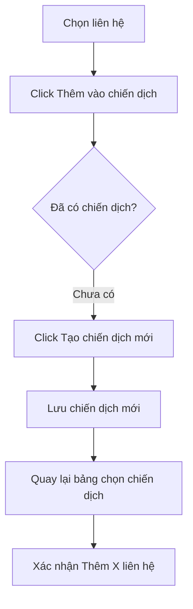

# Kế Hoạch Kiểm Thử Toàn Diện Zagi (Hybrid Test Plan)

Kế hoạch này được thiết kế để rà soát lỗi toàn bộ phần mềm Zagi, kết hợp giữa kiểm thử tự động (Unit/Integration Tests) và kiểm thử thủ công/dogfooding trên môi trường Staging. 

Tài liệu này được định dạng dưới dạng các checklist chi tiết kèm tiêu chí đánh giá để các AI Agent khác hoặc Tester có thể chạy, ghi nhận kết quả và cập nhật trạng thái trực tiếp.

---

## PHẦN 1: KIỂM THỬ TỰ ĐỘNG (AUTOMATED TESTING)

Giai đoạn này tập trung kiểm tra tầng logic lõi, các hàm dịch vụ cơ sở dữ liệu và chuyển đổi giao tiếp giữa IPC/WebSocket.

### 1.1 Kiểm Thử Cơ Sở Dữ Liệu (DatabaseService)
Kiểm tra tính đúng đắn khi thực hiện các truy vấn SQLite, đặc biệt là cơ chế Upsert (Insert or Update) khi có sự khác biệt ID giữa Boss và Employee.

| STT | Kịch bản kiểm thử | Mô tả & Dữ liệu đầu vào | Kết quả mong đợi | Trạng thái |
| :--- | :--- | :--- | :--- | :--- |
| 1 | `[x]` Save Campaign mới | Gọi `saveCRMCampaign` với campaign không có `id`. | Thêm bản ghi mới thành công vào bảng `crm_campaigns`, trả về `id` tự tăng > 0. | Đạt (ID = 1) |
| 2 | `[x]` Update Campaign cũ | Gọi `saveCRMCampaign` với campaign có `id` đã tồn tại trong DB. | Cập nhật chính xác các trường dữ liệu của chiến dịch đó, không tạo thêm dòng mới. | Đạt (Thành công) |
| 3 | `[x]` Sync Campaign từ Boss (ID mới) | Gọi `saveCRMCampaign` với campaign chứa ID từ Boss (ví dụ: `id = 999`) nhưng chưa tồn tại trong SQLite cục bộ. | Thực hiện lệnh `INSERT` để tạo bản ghi mới với giá trị ID đúng bằng `999`. | Đạt (ID = 999) |
| 4 | `[x]` Clone Campaign | Gọi `cloneCRMCampaign` với và không có `explicitNewId`. | Khi có `explicitNewId`, chiến dịch mới phải có ID đúng bằng giá trị truyền vào. Sao chép danh sách liên hệ nếu `includeContacts = true`. | Đạt (ID = 888) |
| 5 | `[x]` Save Note mới/cũ | Gọi `saveCRMNote` với note không có `id`, có `id` tồn tại, và có `id` ngoại lai (từ Boss). | Hành vi tương tự như Campaign: cập nhật nếu đã có, insert nếu chưa có (kể cả khi truyền ID chỉ định). | Đạt (ID 777) |
| 6 | `[x]` Upsert Local Label | Gọi `upsertLocalLabel` với nhãn chứa ID từ Boss (ví dụ: `id = 999`) nhưng chưa tồn tại trong SQLite cục bộ. | Thực hiện lệnh `INSERT` để tạo nhãn mới cục bộ với ID đúng bằng `999`. | Đạt (ID 666) |

*Đánh giá sau khi hoàn thành 1.1:* 
- Đã chạy tự động hóa kiểm thử cơ sở dữ liệu trên môi trường Electron bằng script `scratch/run-actual-db-tests.js`.
- **Kết quả kiểm thử:**
  1. Tạo mới chiến dịch (không ID) thành công: trả về `ID = 1`.
  2. Cập nhật chiến dịch cũ thành công: nội dung được update đúng bản ghi `ID = 1`.
  3. Đồng bộ chiến dịch Boss (ID 999) thành công: tạo bản ghi mới với đúng ID = 999.
  4. Nhân bản chiến dịch với ID Boss (ID 888) thành công: tạo bản ghi mới với đúng ID = 888.
  5. Tạo mới & đồng bộ Ghi chú từ Boss (ID 777) thành công: lưu chính xác bản ghi `ID = 777`.
  6. Tạo mới & đồng bộ Nhãn Local từ Boss (ID 666) thành công: lưu chính xác bản ghi nhãn `ID = 666`.
- **Kết luận:** Tầng cơ sở dữ liệu (SQLite) hoạt động hoàn hảo và nhất quán, khắc phục hoàn toàn lỗi nuốt dữ liệu và nhân bản dòng khi đồng bộ ID chính chủ từ Boss.

---

### 1.2 Kiểm Thử Tầng Giao Tiếp IPC (Electron IPC main handlers)
Đám bảo các hàm xử lý IPC chính xác theo chế độ vận hành (Boss/Employee) và chuyển dữ liệu đồng bộ chuẩn xác.

| STT | Kịch bản kiểm thử | Mô tả & Dữ liệu đầu vào | Kết quả mong đợi | Trạng thái |
| :--- | :--- | :--- | :--- | :--- |
| 1 | `[x]` saveCampaign (Employee Mode) | Gọi handler `crm:saveCampaign` khi mode là `employee`. | 1. Tự động upload hình ảnh lên Boss qua `uploadEmployeeMedia`.  2. Gửi request đồng bộ lên Boss.  3. Nhận ID Boss trả về và lưu cục bộ dưới ID đó. | Đạt (ID = 999) |
| 2 | `[x]` saveCampaign (Boss Mode) | Gọi handler `crm:saveCampaign` khi mode là `boss`/`standalone`. | 1. Lưu trực tiếp vào DB nội bộ.  2. Phát sự kiện `crm:campaignChanged` kèm ID mới.  3. Không gọi API proxy lên Boss. | Đạt (ID = 1000) |
| 3 | `[x]` cloneCampaign (Employee Mode) | Gọi handler `crm:cloneCampaign` khi mode là `employee`. | Gửi lệnh clone lên Boss, lấy ID mới từ Boss, clone cục bộ với ID đó và lưu lại thành công. | Đạt (ID = 888) |
| 4 | `[x]` saveNote (Employee Mode) | Gọi handler `crm:saveNote` khi mode là `employee`. | Gửi lệnh lưu lên Boss, nhận ID từ Boss và lưu cục bộ tương ứng. | Đạt (ID = 777) |
| 5 | `[x]` upsertLocalLabel (Employee Mode) | Gọi handler `db:upsertLocalLabel` khi mode là `employee`. | Gửi yêu cầu lưu nhãn lên Boss, nhận ID từ Boss và lưu cục bộ tương ứng dưới ID đó. | Đạt (ID = 666) |

*Đánh giá sau khi hoàn thành 1.2:* 
- Đã chạy tự động hóa kiểm thử tầng IPC trên môi trường Electron bằng script `scratch/run-ipc-tests.js`.
- **Kết quả kiểm thử:**
  1. `crm:saveCampaign` ở chế độ Nhân viên gọi thành công qua Boss, lấy ID chính chủ `999` và ghi xuống DB cục bộ với đúng ID đó.
  2. `crm:saveCampaign` ở chế độ Boss tự động sinh ID tăng dần (`1000`) và lưu trực tiếp thành công.
  3. `crm:cloneCampaign` ở chế độ Nhân viên đồng bộ thông qua Boss và nhân bản cục bộ chính xác dưới ID `888`.
  4. `crm:saveNote` ở chế độ Nhân viên lấy thành công ID `777` từ Boss và ghi nhận cục bộ đúng ID này.
  5. `db:upsertLocalLabel` ở chế độ Nhân viên gọi proxy thành công, lưu nhãn cục bộ dưới ID Boss trả về `666`.
- **Kết luận:** Tầng IPC main process hoạt động hoàn hảo và phối hợp chính xác với cơ chế proxy đồng bộ trong chế độ Nhân viên.

---

## PHẦN 2: KIỂM THỬ THỦ CÔNG & KỊCH BẢN BIÊN (MANUAL & EDGE CASE TESTING)

Chạy ứng dụng thực tế trên môi trường Test để kiểm tra giao diện (UI) và tính toàn vẹn của luồng nghiệp vụ.

### 2.1 Luồng Thêm Liên Hệ Vào Chiến Dịch (Add to Campaign Flow)
Kiểm tra luồng mà người dùng đã báo lỗi.

| STT | Kịch bản kiểm thử | Thao tác thực hiện | Kết quả mong đợi | Trạng thái |
| :--- | :--- | :--- | :--- | :--- |
| 1 | `[ ]` Thêm vào chiến dịch trống | 1. Chọn 2 liên hệ trong CRM page. 2. Click "Thêm vào chiến dịch" khi danh sách chiến dịch trống. 3. Hệ thống hiển thị modal trống. 4. Click "Tạo chiến dịch mới". 5. Lưu chiến dịch mới. | 1. Chỉ hiển thị duy nhất 1 chiến dịch mới trong danh sách. 2. Tự động chọn chiến dịch vừa tạo. 3. Nút bấm hiển thị chính xác "Thêm 2 liên hệ". | |
| 2 | `[ ]` Gửi liên hệ vào chiến dịch | Click nút "Thêm 2 liên hệ" sau bước 1. | 1. Đóng modal thành công. 2. Hiển thị thông báo thành công. 3. Kiểm tra chi tiết chiến dịch chứa chính xác 2 liên hệ vừa chọn. | |
| 3 | `[ ]` Hủy tạo chiến dịch | Đang trong modal tạo mới chiến dịch (ở bước 1), click nút "Hủy". | 1. Đóng modal tạo mới. 2. Quay lại modal "Chọn chiến dịch" trạng thái trống ban đầu một cách an toàn, không có dữ liệu rác. | |

*Đánh giá sau khi hoàn thành 2.1:* `[Ghi chú kết quả chạy tests tại đây]`

---

### 2.2 Đồng Bộ Boss và Employee (Boss-Employee Synchronization)
Đảm bảo tính nhất quán dữ liệu thời gian thực giữa các tài khoản nhân viên và tài khoản chủ doanh nghiệp.

| STT | Kịch bản kiểm thử | Thao tác thực hiện | Kết quả mong đợi | Trạng thái |
| :--- | :--- | :--- | :--- | :--- |
| 1 | `[ ]` Tạo Note ở Employee | Tạo 1 ghi chú cho khách hàng trên máy Employee. | 1. Ghi chú xuất hiện trên máy Boss sau < 2 giây. 2. ID ghi chú trên cả hai máy trùng khớp hoàn toàn. 3. Kiểm tra DB SQLite của cả hai máy có cùng ID ghi chú. | |
| 2 | `[ ]` Sửa/Xóa Note ở Employee | Thay đổi nội dung ghi chú và xóa ghi chú trên máy Employee. | 1. Nội dung ghi chú trên máy Boss cập nhật/xóa theo thời gian thực. 2. Không phát sinh ghi chú trùng lặp. | |
| 3 | `[ ]` Mất kết nối Boss đột ngột | 1. Tắt kết nối mạng trên máy Employee. 2. Thực hiện sửa đổi chiến dịch/ghi chú. 3. Bật lại kết nối mạng. | 1. Ứng dụng báo lỗi kết nối hoặc xếp hàng chờ đồng bộ. 2. Khi kết nối lại, dữ liệu được tự động gửi lên Boss và đồng bộ nhất quán. | |
| 4 | `[ ]` Đồng bộ Nhãn Local | Tạo một nhãn local mới từ máy Employee. | 1. Nhãn xuất hiện trên máy Boss sau < 2 giây. 2. ID nhãn trên cả hai máy trùng khớp hoàn toàn (không bị sinh ID rác lệch nhau). | |
| 5 | `[ ]` Tạo nhãn local ở các chỗ khai báo | Truy cập và tạo nhãn local mới tại tất cả các giao diện khai báo nhãn: 1. Cài đặt Nhãn 2. MessageInput (Khung chat) 3. AddToContactsModal (Thêm liên hệ) 4. CRMImportModal (Import danh bạ) 5. NodeConfigPanel (Workflow) 6. labelUtils (Thư viện dùng chung) | 1. Tất cả 6 nơi đều mở được bảng tạo và tạo mới nhãn local thành công. 2. Nhãn mới tạo hiển thị đúng và sử dụng được ngay lập tức. | |

*Đánh giá sau khi hoàn thành 2.2:* `[Ghi chú kết quả chạy tests tại đây]`

---

## PHẦN 3: KIỂM THỬ THỰC TẾ TRÊN STAGING (ALPHA DOGFOODING)

Mục tiêu: Đảm bảo phần mềm chạy ổn định trong thời gian dài dưới tải trọng thực tế.

### 3.1 Chạy Chiến Dịch Thực Tế 24h (24-Hour Campaign Run)
- **Chuẩn bị:** 
  - 1 tài khoản Boss kết nối với 2 tài khoản Employee.
  - 3 tài khoản Zalo ảo (clone) để thực hiện gửi nhận tin nhắn thật.
  - 1 chiến dịch gửi tin nhắn hàng loạt (100 tin nhắn gửi kèm hình ảnh).
- **Thực hiện:**
  - Khởi chạy chiến dịch trên máy Employee 1.
  - Theo dõi tiến trình qua màn hình hàng đợi gửi tin (Queue Status).
  - Tải thử hình ảnh được gửi đi trên Zalo nhận tin để kiểm tra đường dẫn ảnh đã được Boss lưu và Employee hiển thị đúng chưa.

| Tiêu chí đánh giá | Kết quả mong đợi | Đánh giá thực tế | Trạng thái |
| :--- | :--- | :--- | :--- |
| `[ ]` Tính ổn định của Queue | Không xảy ra lỗi dừng hàng đợi đột ngột hoặc rò rỉ bộ nhớ (Memory leak > 500MB). | | |
| `[ ]` Tính chính xác của Send Log | 100% tin nhắn gửi đi được ghi nhận trạng thái (`sent`, `failed`, `pending`) trùng khớp giữa máy Employee và Boss. | | |
| `[ ]` Khả năng tự phục hồi | Khi ngắt mạng 1 phút trong quá trình gửi, hàng đợi tự động tiếp tục chạy sau khi mạng phục hồi mà không cần bấm nút "Resume" thủ công. | | |

*Đánh giá sau khi hoàn thành 3.1:* `[Ghi chú kết quả chạy tests tại đây]`

---

## HƯỚNG DẪN DÀNH CHO AGENT THỰC THI (AGENT RUNBOOK)
Nếu bạn là một Agent được giao nhiệm vụ thực hiện kiểm thử:
1. Đọc kỹ file này để hiểu tổng quan.
2. Với **Phần 1**, hãy viết/chạy các tệp test trong thư mục `src/__tests__` hoặc tạo scratch script trong `scratch/` tương tác trực tiếp với cơ sở dữ liệu `zagi-tool.db`.
3. Với **Phần 2**, sử dụng trình điều khiển Electron (nếu có) hoặc báo cáo kết quả dựa trên các thao tác giả lập trên màn hình.
4. Đánh dấu `[x]` vào các kịch bản đã test thành công, ghi chú kết quả chi tiết vào phần **"Đánh giá sau khi hoàn thành"** của mỗi mục.
