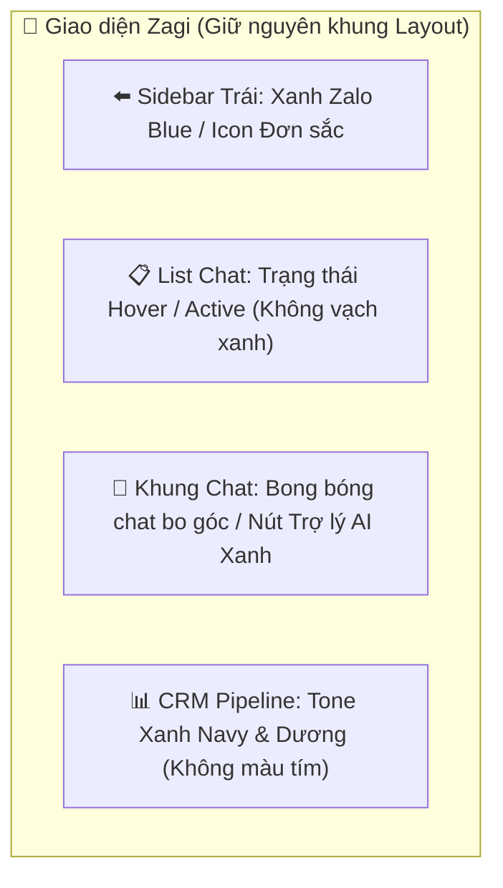

# HỆ THỐNG THIẾT KẾ GIAO DIỆN (DESIGN SYSTEM) - ZAGI DESKTOP
> **Chủ đề thiết kế:** Chuyên nghiệp (Professional) · Tin cậy (Trustworthy) · Tốc độ (High-speed)  
> **Nguyên tắc cốt lõi:** Kế thừa trải nghiệm thân quen (Zalo UI) - Giữ nguyên cấu trúc bố cục (No Layout Shift)  
> **Ngày ban hành:** 25/06/2026  

---

## 1. TINH THẦN THIẾT KẾ & TỪ KHÓA PHONG CÁCH

Zagi là một phần mềm ERP & CRM vận hành trên nền tảng Zalo. Để giúp người dùng (nhân viên trực chat, chủ doanh nghiệp) không mất thời gian làm quen và tạo sự tin tưởng tuyệt đối ngay từ cái nhìn đầu tiên, giao diện của Zagi được tái thiết kế dựa trên 3 từ khóa:

*   **Chuyên nghiệp (Professional):** Sử dụng các đường nét mảnh tinh tế, khoảng cách (spacing) đồng đều, loại bỏ các chi tiết màu mè bừa bãi. Giao diện phẳng hiện đại, tương phản cao và hỗ trợ đầy đủ chế độ Sáng/Tối (Light/Dark Mode).
*   **Tin cậy (Trustworthy):** Sử dụng tông màu xanh dương đậm (Zagi Navy) kết hợp với xanh Zalo chính thống. Không sử dụng các màu sắc sặc sỡ hoặc các màu tím/hồng (tuân thủ quy tắc **Purple Ban**).
*   **Tốc độ (High-speed):** Thiết kế tối giản, loại bỏ các hiệu ứng chuyển động (transition) rườm rà gây trễ mắt. Chỉ sử dụng các micro-animations nhẹ (150ms) ở hover states để tăng phản hồi trực quan mà không làm chậm ứng dụng.

---

## 2. HỆ THỐNG MÀU SẮC THƯƠNG HIỆU (COLOR TOKENS)

Màu sắc của Zagi được lấy cảm hứng trực tiếp từ logo chính thức (chữ `zagi` xanh navy đậm và bong bóng chat `Zalo` màu xanh dương tươi).

```
🔴 QUY TẮC CỐT LÕI: Không sử dụng màu tím (Purple Ban) trong bất kỳ linh hồn thiết kế nào của Zagi.
```

### 2.1. Màu sắc chủ đạo (Primary & Brand Colors)

| Token Màu | Mã HEX | Vai trò trên giao diện | Trạng thái sử dụng |
| :--- | :--- | :--- | :--- |
| **Zalo Blue** (Primary) | `#0068FF` | Màu thương hiệu chính, nút hành động nổi bật, thẻ biến động. | Default |
| **Zalo Blue Hover** | `#005AE0` | Trạng thái hover của nút bấm màu xanh chính. | Hover |
| **Zalo Light Blue** | `#E5F0FF` | Nền mờ của tin nhắn của tôi, nền hội thoại đang chọn (Light Mode). | Active / Highlight |
| **Zagi Navy** (Secondary) | `#0A3064` | Màu thương hiệu phụ, thanh tiêu đề lớn, text quan trọng. | Brand Default |
| **Zagi Dark Blue** | `#072247` | Thanh trạng thái hoặc các chi tiết đặc biệt (Dark Mode). | Dark Background |

### 2.2. Màu trung tính & Nền (Neutral Colors)

#### Chế độ Sáng (Light Mode):
*   **Nền ứng dụng chính:** `#F4F5F7` (Xám rất nhẹ)
*   **Nền nội dung (Card, Chat Window):** `#FFFFFF` (Trắng tinh)
*   **Đường viền/Phân cách (Border):** `#E5E7EB` (Xám nhạt mảnh)
*   **Chữ tiêu đề chính:** `#0F172A` (Slate 900 - Tương phản cực cao)
*   **Chữ nội dung phụ:** `#475569` (Slate 600 - Rõ ràng, dễ đọc)

#### Chế độ Tối (Dark Mode):
*   **Nền ứng dụng chính:** `#111827` (Gray 900)
*   **Nền nội dung (Card, Chat Window):** `#1F2937` (Gray 800)
*   **Đường viền/Phân cách (Border):** `#374151` (Gray 700)
*   **Chữ tiêu đề chính:** `#F9FAFB` (Trắng xám nhẹ)
*   **Chữ nội dung phụ:** `#9CA3AF` (Xám trung tính)

Để hiển thị các thương hiệu liên kết một cách tự nhiên và sinh động nhất, Zagi áp dụng các màu sắc đặc trưng của từng thương hiệu làm nền cho biểu tượng SVG màu trắng:
*   **KiotViet:** `#F15A24` (Cam đặc trưng)
*   **Haravan:** `#4F46E5` (Xanh chàm/Indigo)
*   **Sapo:** `#10B981` (Xanh lá/Emerald)
*   **Pancake POS & Casso:** `#3B82F6` (Xanh dương)
*   **Nhanh.vn:** `#E11D48` (Đỏ hồng/Rose)
*   **Giao Hàng Nhanh (GHN):** `#F97316` (Cam đất)
*   **Giao Hàng Tiết Kiệm (GHTK):** `#15803D` (Xanh lá đậm)
*   **SePay:** `#EF4444` (Đỏ tươi)
*   **AI (OpenAI, Gemini, Claude, DeepSeek, Grok, OpenRouter):** Sử dụng nền màu sắc tương ứng của từng hãng (ví dụ OpenAI màu xanh lá, Gemini màu xanh dương, DeepSeek màu xanh trời để tuân thủ Purple Ban).

**Quy tắc hiển thị (Visual Tile Rule):** Tất cả logo thương hiệu tích hợp và trợ lý AI đều được hiển thị dưới dạng biểu tượng SVG màu trắng tinh khiết đặt trên ô vuông nền màu sắc đặc trưng của thương hiệu đó (solid brand-colored backgrounds) để đảm bảo tính đồng bộ, thẩm mỹ hiện đại và cao cấp. Riêng nền tảng DeepSeek được cấu hình sử dụng màu nền xanh bầu trời (`bg-sky-600`) và màu text (`text-sky-500`) thay vì màu tím để tuân thủ quy tắc cấm màu tím (Purple Ban) của hệ thống.

---

## 3. PHÔNG CHỮ & KIỂU DÁNG (TYPOGRAPHY)

Để tạo sự đồng điệu 100% với giao diện Zalo, Zagi sử dụng hệ thống font mặc định của hệ điều hành (System Font Stack), đảm bảo tốc độ tải tức thì (không tốn thời gian tải font từ Google Fonts) và hiển thị sắc nét nhất trên cả Windows và macOS:

```css
font-family: -apple-system, BlinkMacSystemFont, "Segoe UI", Roboto, "Helvetica Neue", Arial, sans-serif;
```

### 3.1. Các thông số Typography chuẩn:
*   **Tên cuộc hội thoại / Tiêu đề card:** `font-weight: 600` (Semi-bold), kích thước `14px` (`text-sm`) hoặc `15px`.
*   **Nội dung tin nhắn / Ghi chú:** `font-weight: 400` (Regular), kích thước `14px` (`text-sm`), khoảng cách dòng `line-height: 1.5`.
*   **Thời gian / Số lượng tin nhắn chưa đọc:** `font-weight: 500`, kích thước `12px` (`text-xs`).
*   **Đoạn trích tin nhắn mới nhất trong danh sách chat:** `font-weight: 400`, màu `#657786` (Light) / `#8899A6` (Dark) để tạo sự tương phản nhẹ so với tên người gửi.

---

## 4. HIỆU ỨNG TƯƠNG TÁC GẦN GIỐNG ZALO NHẤT (INTERACTION & EFFECTS)

Các hiệu ứng tương tác được thiết kế nhằm mô phỏng hoàn hảo trải nghiệm trên Zalo PC:

*   **Hiệu ứng Hover trên Danh sách hội thoại:**
    *   *Light Mode:* Khi di chuột qua item, nền đổi nhẹ sang màu `#F1F2F4` (Gray 100), chuyển tiếp mượt trong `150ms`.
    *   *Dark Mode:* Nền đổi nhẹ sang màu `#2D3748` (Gray 750).
    *   *Con trỏ:* Luôn hiển thị `cursor-pointer`.
*   **Hiệu ứng Active (Hội thoại đang chọn):**
    *   Nền hội thoại đổi sang màu `#E5F0FF` (Light Blue) ở Light Mode, hoặc `#1A3B66` ở Dark Mode.
*   **Bong bóng chat (Chat Bubbles):**
    *   **Tin nhắn của tôi (Sender):** Nền màu xanh `#E5F0FF` (Zalo Light Blue) với chữ màu đen đen ở Light Mode; hoặc nền màu xanh `#0068FF` với chữ màu trắng ở Dark Mode. Góc bo tròn nhẹ `12px` ở tất cả các góc, riêng góc dưới bên phải bo sát lại `4px`.
    *   **Tin nhắn của khách (Recipient):** Nền màu trắng tinh `#FFFFFF` với viền xám mỏng `#E5E7EB` (Light Mode), hoặc nền `#374151` (Dark Mode). Chữ màu đen hoặc trắng xám.
*   **Thẻ Pill Biến động (Smart Variables):**
    *   Được định dạng bo tròn hoàn toàn (`rounded-full`), nền xám mờ nền nhe (`bg-blue-50 text-blue-600` hoặc `bg-gray-100 text-gray-700`) để nổi bật biến động dạng `{gender_greeting}` hoặc `{alias}` trong khung soạn thảo mà không làm rối mắt.

---

## 5. HƯỚNG DẪN ÁP DỤNG CHI TIẾT (BỐ CỤC GIỮ NGUYÊN)

Chúng ta thực hiện thay đổi toàn bộ visual style nhưng **tuyệt đối giữ nguyên vị trí, thứ tự và lưới chia (grid layout) của các màn hình**:



### 5.1. Sidebar Điều hướng (Thanh Menu Trái)
*   *Bố cục:* Giữ nguyên cột hẹp bên trái ngoài cùng.
*   *Visual:* Nền màu **Zalo Blue (`#0068FF`)**. Các icon điều hướng (Home, Chat, CRM, Workflow, Settings) sử dụng màu trắng mờ 70% (`text-white/70`).
*   *Hover:* Khi di chuột, icon sáng lên 100% và nền chuyển sang màu xanh dương nhạt mờ (`bg-white/10`).
*   *Active:* Icon được chọn sẽ đổi sang màu trắng sáng 100%, nền đổi sang màu xanh đậm thương hiệu `bg-zalo-blue-dark` (`#0052CC`) để tạo độ tương phản rõ rệt và chiều sâu đẹp mắt.

### 5.2. Danh sách hội thoại (Conversation List)
*   *Bố cục:* Giữ nguyên cột giữa.
*   *Visual:* Nền màu `#FFFFFF` (Sáng) / `#111827` (Tối). Đường phân cách giữa các hội thoại là đường border mảnh `1px` màu `#E5E7EB` (Sáng) / `#374151` (Tối).
*   *Avatar:* Giữ nguyên avatar tròn. Nhóm Zalo sử dụng ảnh ghép avatar thành viên (Composite Avatar) dạng lưới bo tròn tinh tế.
*   *Tiêu đề:* Chữ tiêu đề dùng font chuẩn hệ điều hành hiển thị sắc nét.

### 5.3. Khung Chat & Trình soạn thảo (Chat Window)
*   *Bố cục:* Giữ nguyên cột phải bên trong.
*   *Visual:* Nền khung chat màu xám siêu nhẹ `#F4F5F7` để làm nổi bật các bong bóng chat màu trắng và xanh dương.
*   *Nút Trợ lý AI:* Nút biểu tượng chiếc đũa thần `🪄` kế bên emoji được thiết kế tinh gọn dạng icon SVG đơn sắc, không sử dụng màu tím, khi di chuột hiển thị popup gợi ý AI với màu nền xanh dương mờ chàm lịch sự.

### 5.4. Giao diện CRM Kanban & Sơ đồ Workflow Canvas
*   *Bố cục:* Giữ nguyên lưới Kanban và vị trí các Node kéo thả.
*   *Visual:* Thay thế toàn bộ các chi tiết thiết kế liên quan đến màu tím bằng màu xanh dương thương hiệu.
*   *Kanban Stages:* Các cột phễu CRM sử dụng các thẻ border nhẹ bo góc `8px`, không đổ bóng quá dày để giữ độ mượt (tốc độ tải).
*   *Workflow Nodes:* Trigger Node đổi sang màu xanh chàm (`indigo`), Action Node đổi sang màu xanh dương (`blue`), Logic Node đổi sang màu vàng cam (`amber`). Toàn bộ canvas React Flow sử dụng grid xám mảnh tối giản nhất.

### 5.5. Trình cấu hình Gửi ảnh/tệp trong Workflow
*   *Bố cục:* Tích hợp trực tiếp tại thanh cấu hình bên phải của Node `zalo.sendImage`.
*   *Trình chọn ảnh (`MultiImageSelector`):*
    *   **Nút Thêm ảnh:** Thiết kế nút bấm `Chọn ảnh từ máy` màu xanh dương (`bg-blue-600 hover:bg-blue-700`) và trường nhập link URL thủ công có nút `Thêm URL`.
    *   **Lưới Preview:** Lưới ảnh thu nhỏ (Grid Preview) bo góc `6px`, có nút xóa (icon `x` nền đỏ mờ) đặt ở góc trên bên phải của từng ảnh để người dùng dễ dàng xóa bớt.
    *   **Checkbox tùy chọn:** Checkbox "Gửi ngẫu nhiên 1 ảnh" nằm dưới lưới preview, sử dụng màu xanh Zalo Blue khi được tick chọn.
    *   *Visual:* Đồng bộ tuyệt đối theo quy tắc Purple Ban.

### 5.6. Vị trí & Bố cục Trung tâm Hướng dẫn sử dụng
*   *Bố cục:* Nằm hoàn toàn trong trang **Cài đặt → Giới thiệu** dưới dạng tab phụ `"userguide"`.
*   *Thanh tab phụ:* Thiết kế thanh điều hướng ngang gồm 5 tab (Tổng quan, CRM, Workflow, Tích hợp, Kết hợp) sử dụng font phông hệ thống, khi tab active hiển thị chữ đen đậm (hoặc trắng xám ở Dark Mode) kèm đường viền dưới màu xanh Zalo Blue dày `2px`.
*   *Visual:* Nền trắng tinh `#FFFFFF` (Sáng) / `#1F2937` (Tối), viền mảnh phân cách rõ ràng, văn bản markdown được render định dạng sắc nét, dễ đọc.
