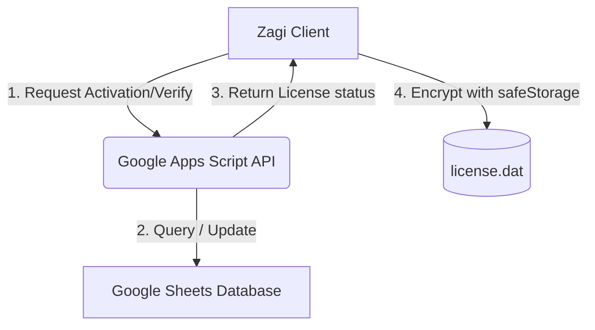

# 🔑 Hệ thống Quản lý Bản quyền (License Management System) - Zagi

Tài liệu này mô tả chi tiết kiến trúc, luồng hoạt động, cấu trúc dữ liệu và cơ chế bảo mật của hệ thống quản lý bản quyền hiện tại trên ứng dụng **Zagi**.

---

## 1. Tổng quan Kiến trúc (Architecture Overview)

Hệ thống quản lý bản quyền của Zagi hoạt động theo mô hình **Local-first kết hợp Hybrid Cloud Verification**, bao gồm hai thành phần chính:
1. **Client-side (Electron Main Process):** Được điều khiển bởi lớp [LicenseManager.ts](file:///Users/kimtrungduong/Downloads/deplao/src/services/license/LicenseManager.ts). Chịu trách nhiệm mã hóa, lưu trữ thông tin bản quyền cục bộ, định kỳ đồng bộ và thực thi quyền hạn (chặn tính năng hoặc chuyển sang chế độ Chỉ đọc - Read-only).
2. **Server-side (Google Apps Script API):** Web app trung gian nhận các yêu cầu xác thực (`verify`), đăng ký mới (`register`) và lấy bảng giá (`get_plans`). Dữ liệu gốc của key được quản lý tập trung tại Google Sheets của Basan Corporation.



---

## 2. Cấu hình & Kết nối API (API Configuration)

Thông tin kết nối server được quản lý động qua `LICENSE_CONFIG` trong [LicenseManager.ts](file:///Users/kimtrungduong/Downloads/deplao/src/services/license/LicenseManager.ts):

*   **Đường dẫn API (API URL):**
    *   *Mặc định (Fallback):* `https://script.google.com/macros/s/AKfycbwfAp3H9lUTrFLDakhpCmLZB6h9V9bViGSmCTMtp49MbujLK-vT6aPbSQhsJZNs0T4qVg/exec`
    *   *Thứ tự ưu tiên cấu hình:* Cấu hình động khi chạy (`zagi-config.json`) > Biến môi trường (`process.env.LICENSE_API_URL`) > Fallback mặc định.
*   **Mã bí mật (API Secret):**
    *   *Mặc định:* `YOUR_SECRET_KEY_HERE_hanoi@123a`
    *   Được gửi kèm trong mọi API request dưới dạng trường `secret` để xác thực quyền truy cập từ Client hợp lệ.

---

## 3. Các Luồng Nghiệp Vụ Chính (Core Workflows)

### 3.1. Đăng ký License Mới (`register`)
*   **Khi kích hoạt dùng thử (Trial):** Client gửi yêu cầu kèm gói `trial`. Nếu thành công, server trả về License dùng thử và Client tự động lưu trữ, kích hoạt ứng dụng ngay.
*   **Khi mua gói trả phí trực tuyến:** Gửi thông tin cá nhân và gói mua. Server lưu trạng thái `pending` và trả về thông tin thanh toán ngân hàng.
*   **Cơ chế dự phòng Ngoại tuyến (Offline Fallback):** Nếu không có kết nối internet hoặc API lỗi, Client tự động sinh một mã Key dự phòng ngẫu nhiên (ví dụ: `A1B2-C3D4-E5F6-G7H8`), tính toán số tiền tương ứng với gói và hiển thị mã QR VietQR (Techcombank) hướng dẫn người dùng chuyển khoản thủ công để kích hoạt sau.

### 3.2. Xác thực bản quyền (`verifyEmail`)
Mỗi lần khởi động hoặc khi định kỳ xác thực, Client gọi API với `action: 'verify'`:
1.  **Nếu Server xác nhận Key hợp lệ & còn hạn (`active`):** Cập nhật file bản quyền cục bộ.
2.  **Nếu Server báo hết hạn (`expired`):** Xóa quyền truy cập cục bộ hoặc chuyển sang chế độ hạn chế.
3.  **Hỗ trợ định dạng ngày linh hoạt:** Client phân tích ngày hết hạn (`expiryDate`) từ Server hỗ trợ cả định dạng Apps Script (`dd/MM/yyyy`), ISO chuẩn (`yyyy-MM-dd`) và định dạng ISO đầy đủ.

### 3.3. Xác thực ngầm (Background Re-verification)
Để tối ưu hóa trải nghiệm người dùng, Client tránh chặn ứng dụng ngay khi kết nối mạng chập chờn:
*   Nếu cache hết hạn hoặc đang trong thời gian ân hạn, Client sẽ kích hoạt xác thực ngầm (`reVerifyInBackground`) mà không block giao diện người dùng. Việc kiểm tra online này bị giới hạn tần suất (throttle) tối đa **1 lần mỗi 24 giờ**.

---

## 4. Cơ chế Bộ nhớ đệm & Ngoại tuyến (Caching & Offline Logic)

Zagi được thiết kế để hoạt động tốt ngay cả khi mất kết nối mạng tạm thời bằng cơ chế cache chặt chẽ:

| Tham số | Giá trị | Ý nghĩa |
| :--- | :--- | :--- |
| **`CACHE_DAYS`** | 3 ngày | Thời gian tối đa cho phép sử dụng bản quyền offline mà không cần kết nối mạng để xác thực lại. |
| **`GRACE_PERIOD_DAYS`** | 7 ngày | Thời gian ân hạn sau khi hết hạn chính thức. Trong thời gian này, app không bị khóa hoàn toàn mà chuyển sang **chế độ Chỉ đọc (Read-only)**. |
| **`EXPIRY_WARN_DAYS`** | 7 ngày | Bắt đầu hiển thị banner cảnh báo màu vàng khi bản quyền sắp hết hạn (còn dưới 7 ngày). |

### Luồng kiểm tra tính hợp lệ của Cache (`isCacheValid`)
Cache chỉ được coi là hợp lệ khi thỏa mãn đồng thời các điều kiện:
1.  Có ghi nhận thời điểm lưu cache (`cachedAt`).
2.  Thời gian offline từ thời điểm lưu cache đến hiện tại không quá **3 ngày**.
3.  Ngày hết hạn bản quyền cục bộ (`expiryDate`) chưa trôi qua (trừ trường hợp dùng gói Vĩnh viễn `isLifetime`).

---

## 5. Lưu trữ và Bảo mật Cục bộ (Data Storage & Security)

*   **Đường dẫn file lưu trữ:** File bản quyền được lưu trữ tại thư mục dữ liệu người dùng (`App Data`):
    *   *Đường dẫn:* `<UserData>/license.dat` (Ví dụ trên macOS: `/Users/<username>/Library/Application Support/zagi/license.dat`)
*   **Mã hóa phần cứng (Hardware-bound Encryption):**
    *   Client sử dụng API mã hóa của hệ điều hành thông qua module **`electron.safeStorage`** để mã hóa chuỗi JSON của License trước khi ghi xuống ổ đĩa.
    *   *Đặc tính:* Dữ liệu chỉ có thể giải mã thành công trên chính thiết bị và tài khoản người dùng hệ điều hành đã mã hóa nó. Nếu copy file `license.dat` sang máy khác, việc giải mã sẽ thất bại và bắt buộc phải kích hoạt lại.
    *   *Fallback:* Nếu hệ thống không hỗ trợ mã hóa an toàn (ví dụ: một số bản phân phối Linux thiếu dịch vụ keyring), dữ liệu sẽ được ghi dưới dạng plain text JSON.

---

## 6. Cấu trúc Dữ liệu chính (Core Data Interfaces)

```typescript
export interface LicenseInfo {
  email: string;        // Email chủ sở hữu bản quyền
  licenseKey: string;   // Khóa kích hoạt bản quyền
  plan: string;         // Mã gói (ví dụ: 'solo_12m', 'team_lifetime')
  expiryDate?: string;  // Ngày hết hạn (định dạng dd/MM/yyyy hoặc ISO)
  isLifetime: boolean;  // Đánh dấu gói vĩnh viễn
  status: 'active' | 'expired' | 'pending'; // Trạng thái bản quyền
  fullName?: string;    // Họ tên người mua
  phone?: string;       // Số điện thoại liên hệ
  cachedAt?: string;    // Thời điểm đồng bộ offline gần nhất
  daysLeft?: number | null; // Số ngày sử dụng còn lại (tính toán động)
}
```

---

## 7. Các điểm hạn chế & Đề xuất Nâng cấp

Dù hệ thống hiện tại chạy rất ổn định và bảo mật cục bộ tốt bằng `safeStorage`, nhưng vẫn tồn tại một số điểm yếu cần lưu ý khi mở rộng quy mô:

1.  **Quản lý số lượng máy (Device Seat Limitation):**
    *   *Hiện tại:* Server Google Sheets chưa quản lý được danh sách các thiết bị (`machineId`) đang sử dụng chung một License Key. Một key lý thuyết có thể bị chia sẻ và kích hoạt trên nhiều máy khác nhau do Client chỉ mã hóa cục bộ mà không đăng ký phần cứng lên server.
    *   *Đề xuất:* Đính kèm thêm mã vân tay phần cứng (`machineId` được hash từ CPU serial và MAC address) khi gọi API `verify` hoặc `register`. Server sẽ từ chối nếu số lượng `machineId` kích hoạt đồng thời vượt quá giới hạn của gói (ví dụ: gói Solo cho phép tối đa 1 máy, gói Team cho phép tối đa 5 máy).
2.  **Đồng bộ realtime (Realtime Revocation):**
    *   *Hiện tại:* Do có cache 3 ngày, nếu Admin khóa/thu hồi key trên Google Sheets, người dùng vẫn có thể ngắt mạng và dùng tiếp ứng dụng tối đa 3 ngày trước khi bị bắt buộc xác thực lại.
    *   *Đề xuất:* Rút ngắn thời gian `CACHE_DAYS` hoặc tích hợp Web Socket/Server-Sent Events (SSE) để đẩy lệnh thu hồi key tức thì đến Client khi máy chủ thay đổi trạng thái key.
