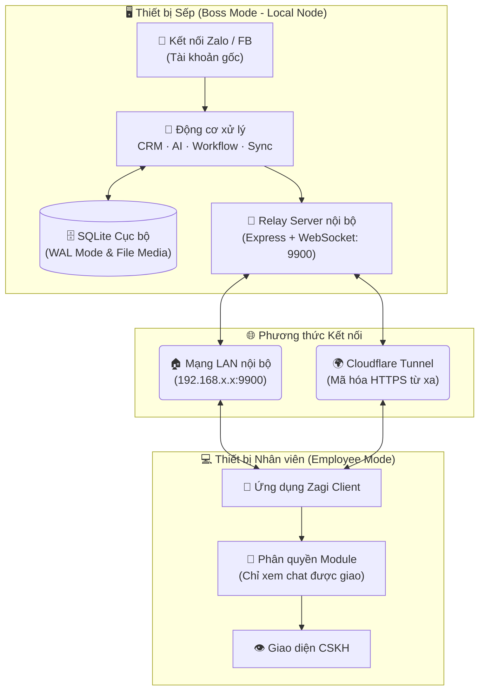
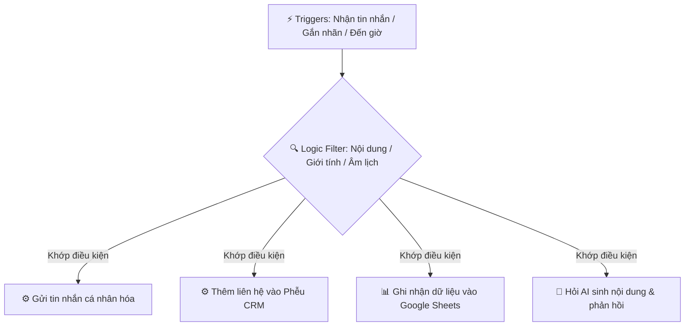

# TÀI LIỆU YÊU CẦU SẢN PHẨM (PRD) - HỆ THỐNG ZAGI DESKTOP
> **Phiên bản tài liệu:** 1.0  
> **Ngày cập nhật:** 29/06/2026  
> **Trạng thái sản phẩm hiện tại:** v27.1.9 (Stable)  
> **Chủ quản:** Product Management Team  

---

## 1. TỔNG QUAN DỰ ÁN & MỤC TIÊU SẢN PHẨM

### 1.1. Bối cảnh & Vấn đề (Problem Statement)
Các doanh nghiệp vừa và nhỏ (SMEs), đội nhóm kinh doanh (Sales), Chăm sóc khách hàng (CSKH) và Marketing tại Việt Nam đang gặp khó khăn lớn trong việc vận hành và quản lý tương tác trên các nền tảng mạng xã hội phổ biến (chủ yếu là Zalo và Facebook):
*   **Quản lý manh mún:** Phải chuyển đổi thủ công qua lại giữa hàng chục tài khoản Zalo/Facebook khác nhau, dễ bỏ sót tin nhắn của khách hàng.
*   **Bảo mật dữ liệu kém:** Hầu hết các giải pháp hiện tại đều chuyển dữ liệu chat lên máy chủ đám mây bên thứ ba, làm gia tăng nguy cơ rò rỉ thông tin khách hàng nhạy cảm.
*   **Thiếu tự động hóa:** Các quy trình gửi tin hàng loạt, chúc mừng sinh nhật, gán nhãn, chuyển tiếp tin nhắn, hay cập nhật phễu CRM đa phần vẫn thực hiện thủ công, tốn nhiều nhân lực và dễ bị Zalo khóa tài khoản do spam.
*   **Khó kiểm soát hiệu suất:** Quản lý không có công cụ đo lường hiệu quả làm việc của nhân viên trực chat realtime.

### 1.2. Giải pháp Zagi (Product Solution)
**Zagi** là một ứng dụng Desktop duy nhất chạy đa nền tảng (Windows, macOS, Linux) hoạt động theo mô hình **Local-first** giúp doanh nghiệp quản lý tập trung và tự động hóa toàn diện hoạt động tương tác khách hàng trên Zalo & Facebook Messenger:
*   **Hộp thư hợp nhất:** Gom tất cả tài khoản chat Zalo & Facebook về một giao diện quản lý duy nhất.
*   **Local-first Database:** Lưu trữ cục bộ toàn bộ tin nhắn, liên hệ, cơ sở dữ liệu CRM ngay trên máy tính của người dùng nhằm bảo mật tối đa.
*   **Workflow Engine:** Động cơ tự động hóa no-code cho phép tự thiết kế kịch bản xử lý tin nhắn, gửi tin, đồng bộ Google Sheets bằng cách kéo thả trực quan.
*   **Trợ lý AI:** Tích hợp AI hỗ trợ trả lời tự động, tóm tắt hội thoại, và soạn thảo tin nhắn chuyên nghiệp.
*   **Mô hình Sếp ↔ Nhân viên (Boss/Employee):** Máy chủ local (Boss) làm nhiệm vụ kết nối và lưu trữ dữ liệu, các máy nhân viên (Employee) kết nối từ xa để làm việc theo sự phân quyền chi tiết.

### 1.3. Đối tượng mục tiêu (Target Audience)
1.  **Doanh nghiệp bán lẻ/SMEs:** Có nhu cầu quản lý từ 3-20 tài khoản Zalo/Facebook bán hàng và CSKH.
2.  **Đội ngũ Sales & CSKH:** Nhân viên trực chat cần giao diện phản hồi nhanh, tích hợp sẵn CRM phễu bán hàng (Kanban Pipeline), tìm kiếm liên hệ nhanh và gợi ý AI.
3.  **Bộ phận Marketing & Growth:** Cần chạy các chiến dịch gửi tin chăm sóc, chúc mừng ngày lễ/sinh nhật tự động đến tệp khách hàng theo nhãn mà không bị nền tảng quét spam.

---

## 2. KIẾN TRÚC HỆ THỐNG & CÔNG NGHỆ CỐT LÕI

Zagi được xây dựng trên mô hình Client-side Desktop app tích hợp Relay Server cục bộ:

### 2.1. Ngăn xếp Công nghệ (Technology Stack)
*   **Framework chính:** Electron 41 + React 18 + Vite 6 + TypeScript 5.
*   **Lưu trữ:** SQLite thông qua thư viện `better-sqlite3` chạy ở chế độ WAL (Write-Ahead Logging) cho tốc độ đọc ghi song song cao.
*   **Tương tác Nền tảng:** `zca-js` (đối với Zalo API) và `fbchat-v2` kết hợp bridge E2EE tự viết bằng Go (`fbchat-bridge-e2ee.exe`) để xử lý tin nhắn mã hóa đầu cuối trên Facebook.
*   **Quản lý trạng thái:** Zustand Store.
*   **Giao diện:** Tailwind CSS v4, React Flow (thiết kế Canvas Workflow), Recharts (biểu đồ báo cáo).
*   **Tích hợp AI:** OpenAI API, Claude, Gemini, OpenRouter, và 9Router proxy gateway.

### 2.2. Triết lý Bảo mật dữ liệu
*   **Zero-Knowledge Host:** Dữ liệu hoàn toàn thuộc sở hữu của người dùng. Cookie, Access Token và khóa mã hóa được lưu trong tệp SQLite local, không gửi về bất kỳ máy chủ trung gian nào của Zagi.
*   **Cơ chế mã hóa trên máy:** Hỗ trợ khóa bảo vệ ứng dụng (App Lock) bằng mật khẩu và recovery key để tránh truy cập trái phép trên thiết bị cục bộ.

---

## 3. CÁC TÍNH NĂNG CỐT LÕI (FUNCTIONAL REQUIREMENTS)

### 3.1. Hộp thư hợp nhất & Đa tài khoản Zalo / Facebook
*   **Đăng nhập QR & Cookie:** Cho phép đăng nhập song song không giới hạn tài khoản Zalo (quét mã QR) và Facebook Messenger (nhập tài khoản/mật khẩu/2FA hoặc cookie).
*   **Gộp tin nhắn tập trung:** Giao diện cho phép xem tin nhắn từ tất cả tài khoản Zalo/Facebook đổ về một màn hình duy nhất hoặc lọc theo từng tài khoản.
*   **Proxy độc lập:** Mỗi tài khoản mạng xã hội có thể cấu hình một proxy riêng (HTTP/SOCKS5) để tránh việc Zalo/Facebook quét dải IP bất thường và khóa tài khoản hàng loạt.

### 3.2. Quản lý liên hệ & Phễu CRM (CRM & Kanban Pipeline)
*   **Kanban Pipeline bán hàng:** Hỗ trợ quản lý phễu bán hàng (ví dụ: Tiếp cận → Tư vấn → Báo giá → Chốt đơn → Chăm sóc).
*   **Hệ thống Nhãn độc lập:** Nhãn Zalo (đồng bộ trực tiếp từ tài khoản Zalo) và nhãn Local (tạo cục bộ và lưu trên SQLite của ứng dụng) hoạt động hoàn toàn độc lập và không đồng bộ chéo, phục vụ các mục đích phân loại và quản lý khách hàng nâng cao.
*   **Quản lý nhóm hàng loạt (Bulk Group Manage):**
    *   Thêm/xóa hàng loạt liên hệ ra/vào nhiều nhóm Zalo cùng lúc.
    *   **Công nghệ Quét Bóng Thụ Động (Passive Shadow Scanning - PSS):** Tự động nhận diện và thu thập chính xác UID của các thành viên ẩn trong nhóm Zalo có cơ chế khóa danh sách thành viên (`lockViewMember`), giúp doanh nghiệp bóc tách tệp khách hàng tương tác.
    *   **Rời nhóm thông minh:** Hỗ trợ tự động chuyển quyền trưởng nhóm (Owner) cho phó nhóm/thành viên khác trước khi rời nhóm và kích hoạt AI viết tin nhắn tạm biệt lịch sự để gửi vào nhóm trước khi rời.

### 3.3. Chiến dịch nhắn tin & Kết bạn tự động (CRM Campaign)
*   **Tạo chiến dịch linh hoạt:** Thiết lập chiến dịch gửi tin nhắn hàng loạt theo nhãn dán, danh sách SĐT (CSV) hoặc tệp UID khách hàng.
*   **Ngưỡng bảo vệ tài khoản (Safety Rules):**
    *   Tự động chia đợt gửi tin (tối đa 20 nhóm/liên hệ một đợt) và nghỉ giãn cách 30 giây giữa các đợt.
    *   Cơ chế trễ ngẫu nhiên (1-2s hoặc 2-3s tùy quy mô nhóm) để mô phỏng thao tác của người thật.
    *   Cảnh báo an toàn (Đỏ/Vàng) hiển thị trực quan cho người dùng nếu phát hiện cài đặt chiến dịch dễ gây quét tài khoản.
*   **Cá nhân hóa nâng cao:** Tự động nhận diện danh xưng xưng hô (`{gender_greeting}`: Anh/Chị/Bạn dựa trên giới tính), biệt danh khách hàng `{alias}`, tên chiến dịch `{campaign_name}`, ngày tháng hiện tại `{date}`, `{time}`, sinh nhật...

### 3.4. Động cơ Workflow tự động hóa (No-code Automation)
Cho phép người dùng xây dựng các luồng làm việc tự động hóa bằng cách kéo thả các node trên Canvas hoặc ra lệnh bằng ngôn ngữ tự nhiên cho AI tạo sơ đồ:

*   **Bộ giả lập Sandbox & Debug trực quan (Visual Debugger):** Hỗ trợ chế độ chạy thử nghiệm an toàn (Sandbox dry-run) để kiểm tra workflow mà không gửi tin nhắn thật hay ghi dữ liệu thật. Hiển thị đường đi của dữ liệu (Edges) và trạng thái từng Node (Success/Error/Skipped) trực quan bằng màu sắc trên sơ đồ.
*   **Smart Variable Auto-complete:** Hỗ trợ gõ ký tự `{` tại các ô cấu hình để hiển thị danh sách biến gợi ý thả xuống và chèn nhanh biến hệ thống hoặc đầu ra của node trước đó.
*   **Gửi nhiều ảnh & file nâng cao (Workflow Multi-Image/File Sending):** 
    *   Hỗ trợ cấu hình gửi nhiều ảnh/tệp cùng lúc cho các hành động Zalo (`zalo.sendImage` và `zalo.sendFile`).
    *   Trình chọn ảnh (`MultiImageSelector`) hỗ trợ chọn nhiều file từ hệ điều hành qua hộp thoại mở file (`ipc.file?.openDialog` với `multiSelect: true`), nhập thêm địa chỉ URL thủ công, hiển thị danh sách dạng lưới hình thu nhỏ (image preview grid) có nút xóa nhanh từng ảnh.
    *   Cung cấp tùy chọn cấu hình gửi toàn bộ danh sách cùng lúc hoặc gửi ngẫu nhiên đúng 1 ảnh trong danh sách (`sendMode` hỗ trợ chế độ `random` hoặc `multiple`).

### 3.5. Trợ lý AI Assistant
*   **Soạn thảo tin nhắn AI (AI Assistant Writing Integration):** Tích hợp nút và khay nhập prompt "🪄 Trợ lý AI" ngay tại khung chat MessageInput và trong Node cấu hình Workflow.
*   **Tóm tắt hội thoại:** Khả năng phân tích cuộc hội thoại dài và xuất ra bản tóm tắt định dạng Markdown trực quan chỉ sau một cú click.
*   **Model AI đa dạng:** Kết nối linh hoạt tới OpenAI, Anthropic Claude, Google Gemini, OpenRouter và 9Router.

### 3.6. Tích hợp Hệ thống & Định vị Logo Thương hiệu (POS, ERP, Payment Gateway & Shipping)
*   **Tích hợp đa dạng hệ thống bán hàng & vận chuyển:** Hỗ trợ kết nối và đồng bộ dữ liệu với các POS/ERP lớn (KiotViet, Haravan, Sapo, Nhanh.vn, Pancake POS), cổng thanh toán (Casso, SePay), và đơn vị vận chuyển (Giao Hàng Nhanh - GHN, Giao Hàng Tiết Kiệm - GHTK).
*   **Giao diện Brand Logo cao cấp:** Thiết kế lại toàn bộ ô hiển thị logo thương hiệu tích hợp (bao gồm cả các đối tác AI). Sử dụng biểu tượng/icon SVG màu trắng tinh khiết đặt trên nền ô vuông có màu sắc đặc trưng của chính thương hiệu đó (solid brand-colored backgrounds) (ví dụ: nền cam cho KiotViet, nền indigo cho Haravan, nền emerald cho Sapo, v.v.). Riêng DeepSeek sử dụng màu nền xanh trời (`bg-sky-600`) để tuân thủ quy tắc cấm màu tím (Purple Ban) của hệ thống. Phong cách thiết kế này mang lại cảm giác trực quan, hiện đại và sang trọng vượt trội.

### 3.7. Hệ thống Hướng dẫn sử dụng Tích hợp (Built-in User Guide)
*   **Trung tâm tài liệu nội bộ:** Di chuyển toàn bộ tài liệu hướng dẫn sử dụng từ popup sidebar vào tab dedicated trong trang **Cài đặt → Giới thiệu → Hướng dẫn sử dụng**.
*   **Phân mục khoa học:** Tài liệu được phân chia thành 5 tab riêng biệt (Tổng quan, CRM, Workflow, Tích hợp, Kết hợp) giúp người dùng học nhanh cách thiết lập các tác vụ nâng cao như quét nhóm ẩn, cấu hình gửi nhiều ảnh/file, đồng bộ POS, hoặc thiết lập tự động hóa.

---

## 4. YÊU CẦU PHI CHỨC NĂNG (NON-FUNCTIONAL REQUIREMENTS)

### 4.1. Hiệu năng & Dung lượng
*   **Tối ưu SQLite WAL:** Đảm bảo khả năng xử lý lên tới 100.000+ tin nhắn và 10.000+ liên hệ cục bộ mà không bị trễ UI.
*   **Batch Insert:** Khi đồng bộ dữ liệu lớn giữa máy Sếp và máy Nhân viên, sử dụng batch 200 rows/INSERT để tránh treo cơ sở dữ liệu.
*   **Thiết bị yếu:** Hỗ trợ đóng gói native cho cả Windows ARM64 giúp tiết kiệm pin và tối ưu hiệu suất cho các thiết bị Surface Pro dùng chip Snapdragon.

### 4.2. Khả năng tương thích & Đóng gói (Cross-platform Deployment)
*   **Đa hệ điều hành:**
    *   Windows: Đóng gói dạng NSIS Installer (`.exe`) hỗ trợ cả x64 và ARM64.
    *   macOS: Đóng gói dạng `.zip` hỗ trợ cả Apple Silicon (M1/M2/M3/M4) và Intel x64.
    *   Linux: Hỗ trợ đóng gói dạng `.AppImage` và `.deb` cho các bản phân phối Ubuntu/Debian.
*   **Cài đặt macOS (Chạy không ký số):** Tạm thời bỏ qua khâu ký số tự động (Code Signing) và đóng gói dạng `.zip` để tránh lỗi build của runner macOS. Người dùng giải nén và mở ứng dụng thông qua nhấp chuột phải (Right-Click -> Open) để vượt qua Gatekeeper.

---

## 5. LỊCH SỬ CẬP NHẬT CÁC PHIÊN BẢN (CHANGELOG)
Dưới đây là tổng hợp lịch sử các phiên bản từ `v27.1.0` đến phiên bản mới nhất `v27.2.0`:

| Phiên bản | Ngày cập nhật | Loại cập nhật | Điểm nhấn chính (Highlights) |
| :--- | :--- | :--- | :--- |
| **v27.2.0** | 30/06/2026 | Patch | CRM AI Đa Trợ Lý và tự động tổng hợp hồ sơ khách hàng theo bộ đếm tin nhắn chạy ngầm ở Main Process; Bổ sung các cột cấu hình AI vào bảng danh sách CRM hỗ trợ inline-edit trực tiếp; Sửa lỗi đồng bộ tin nhắn nhóm Zalo (lỗi 404 do thiếu tiền tố g); Khắc phục lỗi ẩn phần tin nhắn chiến dịch và GroupPicker trống trong modal tạo chiến dịch từ nhóm. |
| **v27.1.9** | 29/06/2026 | Patch | Tích hợp Cloudflare Named Tunnel (Token-based & Domain riêng); Sửa lỗi tự động kết nối lại (Auto-reconnect) cho toàn bộ Client của nhân viên khi thay đổi kết nối mạng; Bổ sung chức năng Ghi nhớ mật khẩu đăng nhập của nhân viên; Sửa lỗi ẩn tab Webhooks trong mục Cài Đặt; Loại bỏ hoàn toàn nhãn hiệu cũ Deplao và tắt dịch vụ TrackingService thu thập dữ liệu sử dụng không cần thiết. |
| **v27.1.8** | 28/06/2026 | Minor | Workflow Webhook, Google Maps Location, Sidebar mới, Lọc nhãn AND/OR, Trễ ngẫu nhiên; Sửa lỗi tạo chiến dịch (Database placeholder & clone phone), Sửa lỗi quét nhóm ẩn (changed_groups); Tự nhận diện API tài khoản theo Group (`resolveApiForThread`), Nâng cấp modal chạy thử hỗ trợ chọn nhóm và chế độ chạy thực tế không đè. Cải tiến sửa nhanh CRM trực tiếp (Inline Edit), bổ sung cột Xưng hô, biến chiến dịch `{salutation}`, và cho phép sửa Xưng hô trực tiếp ngay khi đang Chat. |

| **v27.1.7** | 06/2026 | Patch | Thiết kế lại UI/UX (Zalo PC style, Zagi Navy, Purple Ban); Tài liệu hướng dẫn Gatekeeper macOS; Nâng cấp Workflow (gửi nhiều ảnh/file, trình chọn ảnh, gửi ngẫu nhiên, sandbox debugger, kịch bản BĐS); Hướng dẫn sử dụng tích hợp Settings; Chuẩn hóa giao diện Brand Logo (SVG trắng trên nền màu gốc) và các tiêu đề danh mục; Sửa lỗi SQLite & đồng bộ thông tin nhóm Zalo; Chuẩn hóa phóng to/thu nhỏ cỡ chữ (CSS Variable) & thống nhất nút bấm. |
| **v27.1.6** | 06/2026 | Patch | Báo cáo gửi tin chiến dịch CRM; Tính năng Gửi bù lỗi & Chạy lại chiến dịch; Quét bóng thụ động (PSS) lấy UID thành viên ẩn nhóm khóa; Composite avatar cho nhóm Zalo. |
| **v27.1.5** | 06/2026 | Patch | Tự động cập nhật ngầm đa hệ điều hành; Lịch âm Việt Nam và CRM tích hợp vào Workflow; Sửa thông tin CRM trực tiếp trên chat; Hệ thống Affiliate lưu Google Sheets. |
| **v27.1.4** | 06/2026 | Patch | Gán/tạo nhãn ngay khi nhập SĐT; Đồng bộ nút tác vụ sang màu xanh dương; Di chuyển tác vụ xóa liên hệ vào thanh BulkActionBar nổi dưới màn hình. |
| **v27.1.3** | 06/2026 | Patch | Rời nhóm Zalo hàng loạt; Tự động chuyển quyền Trưởng nhóm trước khi rời; AI tạm biệt lịch sự; Cẩm nang an toàn Zalo trên TopBar; Cẩm nang an toàn Chiến dịch. |
| **v27.1.2** | 06/2026 | Patch | Bản cài native Windows ARM64 cho Surface; Hướng dẫn chọn phiên bản trên README; Render chuẩn markdown trong AI Quick Panel. |
| **v27.1.0** | 06/2026 | Major | Quản lý nhóm Zalo hàng loạt; Cơ chế trễ ngẫu nhiên & phân đợt gửi tin; Realtime Progress Log; Trợ lý AI trong CRM Campaign; Biến cá nhân hóa động. |

---

### Chi tiết các cập nhật từng phiên bản

#### 🤖 v27.2.0 — CRM AI Multi-Assistant & Auto-Summary, CRM AI Columns & Zalo Group/Campaign Fixes
*   **Tính năng mới (New):**
    *   **CRM AI Đa Trợ lý & Tự động tổng hợp:** Chỉ định trợ lý AI cụ thể cho từng khách hàng và tự động cập nhật hồ sơ khi đạt ngưỡng tin nhắn (ví dụ: 30 tin) chạy ngầm ở Main Process.
    *   **Quản lý AI trực tiếp trên bảng CRM:** Bổ sung cột Trợ lý AI và Tự động tổng hợp hỗ trợ chỉnh sửa nhanh (inline-edit) tại chỗ.
*   **Cải tiến (Improved):**
    *   **Merge Prompt thông minh:** AI tự động trộn thông tin mới vào hồ sơ cũ, đồng thời giữ chú thích lịch sử biến động giá trị.
*   **Sửa lỗi (Fixed):**
    *   **Đồng bộ tin nhắn nhóm:** Tự động thêm tiền tố "g" trước Group ID Zalo để tránh lỗi 404.
    *   **Tạo chiến dịch từ nhóm:** Sửa lỗi giao diện ẩn phần tin nhắn và GroupPicker trống trong modal tạo chiến dịch.

#### 🌐 v27.1.9 — Cloudflare Named Tunnel, Employee Auto-Reconnect, Remember Password, Webhook Settings Integration & Brand Alignment
*   **Tính năng mới (New):**
    *   **Tích hợp Cloudflare Named Tunnel (Token-based & Domain riêng):** Hỗ trợ khai báo Token từ Cloudflare Zero Trust để duy trì duy nhất 1 tiến trình cloudflared chạy ngầm kết nối 3 tên miền phụ cố định độc lập (cho thanh toán, workflow, kết nối nhân viên).
    *   **Chức năng Ghi nhớ mật khẩu cho Nhân viên:** Bổ sung checkbox lưu mật khẩu an toàn trong localStorage tại EmployeeLoginScreen.tsx, tự động điền thông tin đăng nhập trong các phiên làm việc tiếp theo.
*   **Cải tiến (Improved):**
    *   **Tích hợp giao diện Webhooks:** Đưa component TunnelSettings vào làm tab chức năng chính thức trong màn hình Cài Đặt (Webhooks) ngay sau tab Workspace, sửa lỗi giao diện cấu hình tunnel bị ẩn ở các bản trước.
    *   **Thống nhất nhãn hiệu Zagi:** Rà soát và thay đổi toàn bộ chuỗi ký tự hiển thị từ "Deplao" sang "Zagi" trong UI text, các đường dẫn ví dụ lưu trữ và đổi tên thư mục hình ảnh tạm của workflow thành zagi-workflow-images.
*   **Sửa lỗi (Fixed):**
    *   **Khắc phục lỗi đứt kết nối Client của nhân viên:** Sửa hàm startHealthCheck() trong HttpConnectionManager.ts, chuyển sang tự động đọc và thực hiện kết nối lại dựa trên client.service instance thay vì dựa vào thuộc tính workspace.type, giúp duy trì kết nối bền vững khi đổi mạng Wifi hoặc rớt IP.
    *   **Tắt TrackingService thu thập dữ liệu:** Vô hiệu hóa hoàn toàn module TrackingService khởi động khi chạy Electron app và gỡ bỏ các đoạn logic gửi dữ liệu tracking không cần thiết.

#### 🌐 v27.1.8 — Workflow Webhooks, Zalo Location Maps, Expanded Sidebar, AND/OR Label Filters, CRM Jitter Delays, CRM Inline Edit, Custom Salutation, Chat Salutation Editing & Critical Bug Fixes
*   **Tính năng mới (New):**
    *   **Workflow hỗ trợ Node Webhooks & Kho template:** Tích hợp bộ cổng Webhook Trigger (`trigger.webhook`), Tunnel Gateway và Http Relay Service, cho phép nhận và phản hồi các cuộc gọi HTTP request từ bên thứ ba.
    *   **Hiển thị vị trí & Bản đồ Google Maps cho tin nhắn Location Zalo:** Hỗ trợ render bong bóng tin nhắn chứa thông tin toạ độ và địa chỉ chi tiết gửi từ Zalo, đính kèm liên kết mở nhanh Google Maps trên trình duyệt.
    *   **Sidebar trái chế độ mở rộng & Tìm kiếm nhanh:** Thêm panel danh sách tài khoản mở rộng `AccountPanel.tsx` giúp tìm kiếm tài khoản, kéo thả sắp xếp thứ tự và ẩn/hiện nhanh chóng.
    *   **Lọc hội thoại theo Tất cả hoặc Một trong số các nhãn đã chọn (AND/OR):** Bổ sung dropdown cấu hình logic so khớp AND (thỏa mãn tất cả nhãn) hoặc OR (chứa một trong các nhãn) cho cả nhãn local lẫn nhãn Zalo.
    *   **CRM Campaign hỗ trợ random delay & trễ giữa các tin nhắn (tối thiểu 5s):** Nâng cấp logic hàng chờ gửi tin nhắn chiến dịch tự nhiên hơn với khoảng trễ ngẫu nhiên (Jitter range) và trễ giữa các block tin nhắn gửi tới cùng một liên hệ. Đồng thời mở rộng giới hạn trễ tối thiểu linh hoạt xuống còn 5 giây.
    *   **Động cơ Workflow tự động tìm tài khoản gửi đúng:** Cơ chế `resolveApiForThread` tự động truy vấn thông tin trong cơ sở dữ liệu `contacts` để tìm tài khoản Zalo đang kết nối thực tế sở hữu nhóm hoặc cuộc trò chuyện, loại bỏ hoàn toàn lỗi Zalo API 161 "Nhóm này không tồn tại" khi pageId/zaloId rỗng hoặc sai tài khoản gửi.
    *   **Nâng cấp giao diện Chạy thử (Modal Test-run) trong Workflow Editor:**
        *   Hỗ trợ tab **Bạn bè** và **Nhóm** giúp người dùng chọn đích chạy thử linh hoạt, tự động xác định chính xác `threadType` (1 cho nhóm, 0 cho bạn bè).
        *   Tích hợp toggle **"Gửi thực tế theo cấu hình Node"**: Khi bật, luồng sẽ gửi trực tiếp đến các nhóm/cá nhân đã gán cứng cấu hình trong các Node (mô phỏng chạy thật) thay vì ghi đè gửi test.
    *   **Chỉnh sửa CRM trực tiếp (CRM Inline Edit) & Chế độ Sửa nhanh:**
        *   Nháy đúp vào các trường (Tên/Biệt danh, Xưng hô, Sinh nhật, SĐT) trên bảng lớn CRM để chỉnh sửa trực tiếp, hỗ trợ lưu tạm thời nhiều dòng và nút "Lưu thay đổi" hàng loạt giúp cập nhật DB trong 1 lần.
        *   Nút bật/tắt **"Sửa nhanh"** (Edit Mode) trên thanh công cụ giúp click chuột 1 lần là sửa được ngay, đồng thời tạm vô hiệu hóa việc mở bảng chi tiết khi đang ở chế độ này.
        *   Cho phép click chỉnh sửa trực tiếp thông tin (Tên/Biệt danh, SĐT, Xưng hô, Ngày sinh) trên bảng chi tiết khách hàng (Detail Panel) và tự động lưu lập tức khi Enter hoặc blur chuột.
    *   **Hỗ trợ cột Xưng hô tùy chỉnh & Biến chiến dịch `{salutation}`:**
        *   Thêm cột **Xưng hô (salutation)** tự động tính từ giới tính (Nam -> Anh, Nữ -> Chị, Chưa rõ -> Bạn), cho phép sửa đổi thủ công tùy ý sang bất cứ giá trị nào khác (Cô, Chú, Em, Cháu...). Xóa trắng sẽ reset về mặc định.
        *   Bổ sung biến `{salutation}` vào bộ biến chiến dịch CRM với cơ chế tự động tìm trường tùy chỉnh trong DB, nếu không có sẽ tự động suy luận theo giới tính giúp gửi tin chuyên nghiệp.
    *   **Cập nhật Xưng hô trực tiếp trong khung Chat:**
        *   Bổ sung trường nhập **Xưng hô (tùy chỉnh)** vào form chỉnh sửa hồ sơ khách hàng bên tay phải khung chat (Zalo ConversationInfo Panel) giúp thêm danh xưng nhanh khi đang nhắn tin.
        *   Đồng bộ dữ liệu thời gian thực giữa Database, danh sách Chat (`chatStore`) và danh sách CRM (`crmStore`).
*   **Sửa lỗi (Fixed):**
    *   **Sửa lỗi tạo chiến dịch:** Khắc phục lỗi thiếu placeholder `?` trong câu lệnh INSERT bảng `crm_campaigns` và sửa lỗi mất số điện thoại (`phone`) khi nhân bản (clone) chiến dịch trong `DatabaseService.ts`.
    *   **Sửa lỗi quét nhóm bị khóa ẩn thành viên:** Bổ sung xử lý khóa `changed_groups` khi parse danh sách nhóm và bọc try-catch chống crash ứng dụng khi đồng bộ thông tin nhóm bị khóa.
    *   **Gộp kéo chọn nhiều tin nhắn & phím ESC:** Sửa lỗi chọn vùng tin nhắn, cộng dồn lựa chọn khi kéo chuột nhiều lần và bắt sự kiện phím `Escape` để thoát nhanh chế độ chọn hoặc thoát trình xem ảnh.
    *   **Lỗi tải thông tin nhóm:** Khắc phục lỗi `TypeError: list.map is not a function` khi đồng bộ thành viên nhóm ẩn trong `GroupInfoPanel.tsx` bằng cách kiểm tra kiểu dữ liệu của `memVerList` (đề phòng trường hợp trả về Map/Object).
    *   **Sửa lỗi crash trắng trang CRM**: Khắc phục lỗi thiếu `onPatchContact` trong destructuring props của `CRMContactList.tsx` gây lỗi runtime React làm trắng màn hình CRM.
    *   **Sửa lỗi lệch pha Giới tính trong khung Chat**: Cấu hình lại các tùy chọn chọn giới tính của chat profile (0 = Nam, 1 = Nữ, null = Chưa xác định) khớp chuẩn xác với Database.

#### 🍎 v27.1.7 — Sandbox Debugger, Workflow Enhancements, UI/UX, Built-in User Guide & macOS Gatekeeper Guide
*   **Tính năng mới (New):**
    *   **Trình chọn nhiều ảnh & Gửi ngẫu nhiên trong Workflow:** Thiết kế lại giao diện cấu hình gửi ảnh trong Workflow (`zalo.sendImage`) hỗ trợ chọn nhiều ảnh cùng lúc từ máy tính qua Dialog, nhập thêm URL thủ công, quản lý danh sách ảnh bằng lưới preview có nút xóa, và toggle checkbox "Gửi ngẫu nhiên 1 ảnh" (sendMode: random) hoặc gửi đồng loạt.
    *   **Trung tâm Hướng dẫn sử dụng Tích hợp:** Di chuyển toàn bộ tài liệu hướng dẫn sử dụng công cụ nâng cao (CRM, Workflow, Tích hợp, kịch bản phối hợp) từ popup Sidebar vào trong trang **Cài đặt → Giới thiệu → Hướng dẫn sử dụng** để tối ưu hóa và tập trung nội dung. Đồng thời cập nhật bổ sung các thông tin chi tiết về cơ chế quét nhóm ẩn `lockViewMember` và tối ưu gửi nhiều ảnh/file.
    *   **Chuẩn hóa giao diện Brand Logo & Tiêu đề danh mục:** Cập nhật toàn bộ các ô logo thương hiệu tích hợp (KiotViet, Haravan, Sapo, Nhanh.vn, Pancake, GHN, GHTK, Casso, SePay), logo các trợ lý AI (OpenAI, Gemini, Claude, DeepSeek, Grok, OpenRouter) cũng như tiêu đề các danh mục (POS/Bán hàng, Trợ lý AI, Thanh toán, Vận chuyển) thành biểu tượng SVG màu trắng tinh khiết đặt trên ô vuông nền màu sắc đặc trưng của thương hiệu/danh mục (solid backgrounds). Riêng DeepSeek được cấu hình sử dụng màu xanh trời (`bg-sky-600` / `text-sky-500`) thay vì màu tím để tuân thủ quy tắc Purple Ban.
    *   **Trình gợi ý biến thông minh:** Tích hợp component `SmartInput` và `SmartTextarea` tự động bắt ký tự `{` để gợi ý biến và thay thế đúng vị trí con trỏ.
    *   **Sandbox Debugger trong Workflow:** Bổ sung logic `dryRun` (sandbox) vào [WorkflowEngineService.ts](file:///Users/kimtrungduong/Downloads/deplao/src/services/workflow/WorkflowEngineService.ts) cho phép chạy workflow mô phỏng an toàn mà không tác động dữ liệu thực. Thêm nút "Chạy Sandbox" trên thanh công cụ và nút "Debug trực quan trên sơ đồ" trong lịch sử chạy workflow. Hiển thị viền trạng thái (Xanh = Success, Đỏ = Error, Xám = Skipped) kèm nút xem nhanh Input/Output/Lỗi trên node React Flow.
    *   **Kho kịch bản Bất động sản:** Định nghĩa 8 mẫu kịch bản chuyên dụng cho ngành Bất động sản (chúc sinh nhật VIP, chúc ngày mùng 1/ngày rằm âm lịch, nhắc tiến độ đóng tiền...).
    *   **Trợ lý AI Soạn thảo văn bản:** Tích hợp nút soạn thảo nội dung bằng AI ("🪄 Trợ lý AI") gọi API qua `ipc.ai?.chat` cho các trường nhập liệu của Node Workflow và MessageInput trong khung chat.
    *   **Tài liệu hướng dẫn cài đặt macOS (Bỏ qua ký số):** Tạm thời bỏ qua khâu ký số tự động (Code Signing & Notarization) trên macOS để phát hành nhanh chóng. Bổ sung tài liệu hướng dẫn người dùng vượt qua cảnh báo Gatekeeper (Right-Click -> Open, hoặc lệnh xattr -cr) khi cài đặt lần đầu.
    *   **Nâng cấp thu phóng cỡ chữ (Scale Zoom):** Nâng cấp tính năng phóng to/thu nhỏ cỡ chữ hiển thị sang cơ chế **CSS Variable (`--zagi-font-scale`) kết hợp ghi đè các class pixel cứng (`text-[Xpx]`)** trong CSS, giải quyết triệt để lỗi không co giãn đồng bộ các văn bản dùng kích cỡ pixel tĩnh, đồng thời giữ toàn bộ giao diện luôn nằm trọn trong khung màn hình (không vỡ layout viewport/100vh). Thanh trượt cỡ chữ và nút Hướng dẫn sử dụng được đưa trực tiếp lên TopBar.
*   **Cải tiến & Sửa lỗi (Improved & Fixed):**
    *   **Thiết kế lại UI/UX:** Áp dụng bảng màu thương hiệu (Zalo Blue & Zagi Navy), phông chữ hệ thống, và các micro-interactions (hover, active vạch xanh dọc 3px, bong bóng chat có đuôi) mô phỏng Zalo PC.
    *   **Đồng bộ màu sắc bong bóng chat & Nền:** Đồng bộ màu sắc bong bóng chat gửi đi (Sender) ở Light Mode sang màu xanh nhạt `#E5F0FF` và chữ tối `#0F172A` (thay vì khóa cứng ở xanh đậm `#0068FF` chữ trắng) mô phỏng chuẩn xác giao diện Zalo PC. Đảm bảo nền trắng tinh khiết cho cột danh sách chat (trái), thông tin hội thoại (phải), chat header (trên) và khung soạn thảo (dưới), giữ nguyên nền scroller chat ở giữa màu xám nhạt `#f4f5f7`.
    *   **Thống nhất màu sắc nút bấm:** Chuẩn hóa toàn bộ nút bấm có nền màu (`bg-blue-600`, `bg-red-600`, `bg-emerald-600`, `.btn-primary`, v.v.) luôn có chữ màu trắng `#ffffff` và icon SVG màu trắng (qua `currentColor`), kể cả trong Light Mode. Bổ sung lớp `.text-white-important` cho các biểu tượng SVG trên nút primary trong Light Mode.
    *   **Đồng bộ thông tin nhóm Zalo:** Cập nhật thông tin thực tế (tên nhóm và ảnh đại diện) vào bảng `contacts` trong SQLite khi quét nhóm bằng link (ngay cả đối với nhóm khóa ẩn thành viên nhờ quét dự phòng `getGroupInfo`) và khi thực hiện đồng bộ nhóm đơn lẻ (`_syncSingleGroup`), giúp khắc phục lỗi hiển thị ID thô và avatar mặc định.
    *   **Không xóa file sau khi gửi:** Loại bỏ hoàn toàn hành vi tự động xóa file gốc của người dùng sau khi gửi thành công qua Zalo, đảm bảo an toàn dữ liệu tuyệt đối.
    *   **Dịch chuyển mốc thời gian:** Di chuyển mốc hiển thị giờ phút gửi tin nhắn (ví dụ: `17:44`) lên phía trên bong bóng chat, căn lề phải cho tin nhắn đi và lề trái cho tin nhắn đến.
    *   **Tối ưu Center Date Separator:** Chỉ hiển thị pill phân cách ở giữa màn hình khi bắt đầu ngày mới (hiển thị `Hôm nay`, `Hôm qua`, hoặc ngày cụ thể như `25/06/2026`).
    *   **Icon hành động nhóm phẳng:** Thay thế toàn bộ các emoji 3D (`🔔`/`🔕`, `📌`/`📍`, `👥`, `⚙️`) tại sidebar thông tin nhóm (`GroupInfoPanel.tsx`) thành các biểu tượng SVG phẳng đơn sắc tinh tế, tự động đổi màu dynamic theo trạng thái.
    *   **Ghép lưới composite avatar:** Tự động bổ sung chữ cái đầu cho các thành viên thiếu avatar và loại bỏ màu tím.
    *   **Khử hoàn toàn các màu tím (Purple Ban):** Đảm bảo không còn màu tím trong giao diện (Trợ lý AI, Workflow Node, Group Avatar, Sidebar...), chuyển sang tông xanh dương/xanh chàm và cam, chỉ giữ lại màu biểu đồ Analytics để tạo sự đa dạng báo cáo.
    *   **Chuẩn hóa các nút bấm hệ thống:** Nút primary giữ chữ trắng trong Light Mode, nút Đăng xuất chuyển sang dạng solid danger đỏ-trắng và khử màu tím ở bộ lọc Phân tích (Tất cả/Cá nhân/Nhóm) và Nhãn Local.
    *   **Khắc phục lỗi Database:** Khắc phục lỗi `"NOT NULL constraint failed: crm_pipeline_stages.created_at"` trên SQLite của Windows khi thêm trạng thái Pipeline CRM mới.
    *   **Hợp nhất nút Báo lỗi:** Loại bỏ nút báo lỗi trùng lặp trong menu để giữ duy nhất 1 nút Báo lỗi (icon con bọ `🐛`) trực tiếp trên thanh TopBar.

#### 📊 v27.1.6 — Báo cáo CRM Campaign & Công nghệ Quét Bóng Thụ Động (PSS)
*   **Tính năng mới (New):**
    *   Thống kê báo cáo tổng kết chi tiết gửi tin thành công/thất bại và gom nhóm các lỗi gửi phổ biến trong màn hình chi tiết chiến dịch.
    *   Nút hành động "Gửi bù lỗi" và "Chạy lại" kết nối qua các hàm IPC `crm:retryFailedContacts` và `crm:restartCampaign`.
    *   Tích hợp thuật toán Quét Bóng Thụ Động (Passive Shadow Scanning - PSS) cho các nhóm khóa thành viên giúp bóc tách và thu thập UID thành viên ẩn từ luồng dữ liệu tương tác mà không cần quyền quản trị.
*   **Cải tiến (Improved):**
    *   Tab Bạn bè và Nhóm trong `TargetSelector.tsx` cho phép chọn từng người/nhóm qua checkbox và duy trì trạng thái khi đổi tab.
    *   Tích hợp `GroupAvatar` và `groupInfoCache` hiển thị avatar nhóm ghép y hệt giao diện Zalo gốc.
*   **Sửa lỗi (Fixed):**
    *   Khắc phục lỗi bỏ qua kiểm tra hoàn thành chiến dịch khi quá trình gửi tin bị ném ra ngoại lệ trong [CRMQueueService.ts](file:///Users/kimtrungduong/Downloads/deplao/src/services/crm/CRMQueueService.ts).

#### 🔄 v27.1.5 — Tự động cập nhật ngầm & Âm lịch Việt Nam
*   **Tính năng mới (New):**
    *   Tích hợp thuật toán chuyển đổi Dương lịch sang Âm lịch Việt Nam (`lunarCalendar.ts`) và đưa biến hệ thống `$system.lunarDay` vào ngữ cảnh của Workflow Engine.
    *   Bổ sung bộ lọc CRM contacts trong Workflow Engine cho phép lọc liên hệ theo nhãn local, nhãn Zalo, giới tính, trạng thái phễu bán hàng (pipeline), và lọc ngày sinh.
    *   Thêm giao diện chỉnh sửa nhanh hồ sơ khách hàng trực tiếp (Edit Mode) vào panel `ConversationInfo.tsx`.
    *   Bổ sung trường nhập "Mã giới thiệu (nếu có)" vào giao diện đăng ký bản quyền và đẩy dữ liệu về cột L trên Google Sheets.
*   **Cải tiến (Improved):**
    *   Nhận diện kiến trúc CPU thiết bị qua IPC (`process.arch`) để tải bản nâng cấp phù hợp trên Mac (Apple Silicon arm64 / Intel x64).
    *   Tích hợp tải nâng cấp ngầm trên Windows qua `electron-updater`, tự động đóng ứng dụng và thực hiện cài đặt khi người dùng nhấn đồng ý trên TopBar.
*   **Sửa lỗi (Fixed):**
    *   Khắc phục triệt để lỗi xung đột cổng `"Port 27799 is already in use"` khi khởi chạy dev server trên macOS bằng cách cấu hình delay cho wait-on.

#### 🏷️ v27.1.4 — Tối ưu hóa UI gán nhãn & Thao tác hàng loạt
*   **Tính năng mới (New):**
    *   Cho phép chọn nhãn local hoặc Zalo trực tiếp trong `AddToContactsModal` ngay khi vừa mở lên (giao đoạn nhập SĐT).
    *   Tích hợp tùy chọn Xóa liên hệ đã chọn vào danh sách tác vụ Khác trên thanh BulkActionBar hành động nổi dưới màn hình.
*   **Cải tiến (Improved):**
    *   Đồng bộ hóa màu nền và màu hover của nút Xác nhận Import (CSV) và nút Thêm liên hệ (SĐT) sang tông màu xanh dương thương hiệu.
    *   Lược bỏ nút xóa hàng loạt ở menu Thao tác cũ để tối giản hóa giao diện.

#### 👥 v27.1.3 — Quản lý nhóm, Rời nhóm hàng loạt & AI Farewell
*   **Tính năng mới (New):**
    *   Tích hợp `SmartGroupModal` và `BulkLeaveGroupModal` để xử lý rời nhóm hàng loạt chuyên nghiệp.
    *   Thêm cơ chế tự động chuyển quyền Trưởng nhóm cho phó nhóm hoặc thành viên khác trước khi rời đi để tránh mất nhóm.
    *   Thêm tính năng gửi tin nhắn Tạm biệt tự động soạn thảo bằng AI Assistant trước khi rời nhóm.
    *   Tích hợp Popover "Cẩm nang an toàn Zalo" trên TopBar hiển thị các nguyên tắc gửi tin và tự động nhận diện Zalo Business.
    *   Bổ sung cảnh báo màu Đỏ/Vàng khi tạo chiến dịch gửi tin dựa trên các quy định an toàn của Zalo (gửi người lạ, chứa link lạ, delay quá ngắn).
*   **Cải tiến (Improved):**
    *   Đồng bộ thiết kế lại toàn bộ giao diện chi tiết CRM, pipeline Kanban và các bảng dữ liệu liên quan sang theme đen/trắng sang trọng.

#### 💻 v27.1.2 — Bản cài Windows ARM64 cho Surface & Render Markdown AI
*   **Tính năng mới (New):**
    *   Bổ sung bản cài đặt `Zagi-Setup-27.1.2-arm64.exe` chạy native cho các thiết bị Windows ARM64 (Surface Pro 9 5G, 10, 11, Laptop 7).
*   **Cải tiến (Improved):**
    *   Thêm bảng so sánh và sơ đồ chọn phiên bản chi tiết trong tài liệu hướng dẫn và README.
    *   Sửa tên artifact NSIS thêm biến kiến trúc `${arch}` để tự phân biệt file build x64 và arm64.
*   **Sửa lỗi (Fixed):**
    *   Khắc phục lỗi hiển thị markdown thô trong AI Quick Panel, hỗ trợ render danh sách, in đậm và code block trực quan.

#### 🚀 v27.1.0 — Quản lý nhóm hàng loạt & Cơ chế chống khóa tài khoản Zalo
*   **Tính năng mới (New):**
    *   Tích hợp `BulkGroupManageModal` để quản lý nhóm Zalo hàng loạt từ hành động CRM và danh sách thành viên nhóm.
    *   Độ trễ ngẫu nhiên chống khóa Zalo (1-2s cho ≤ 40 nhóm, 2-3s cho > 40 nhóm).
    *   Tự động phân đợt tối đa 20 nhóm/lần và nghỉ 30s giữa các lần với giao diện countdown trực quan.
    *   Thêm trường Chiến dịch khi import liên hệ CRM qua `AddToContactsModal` để phân loại tệp khách hàng.
    *   Bảng log cập nhật tiến độ thời gian thực (realtime Progress Log) hiển thị chi tiết kết quả chạy của tác vụ.
    *   Khởi tạo và cập nhật schema `crm_pipeline_stages` và `group_pin_schedules` trong SQLite.
    *   Tích hợp trợ lý AI (AI Assistant) trực tiếp vào màn hình tạo chiến dịch CRM giúp soạn nội dung bằng AI.
    *   Bổ sung phím tắt chèn nhanh các biến động (`{gender_greeting}`, `{alias}`, `{campaign_name}`, `{date}`, `{time}`, `{birthday_day}`, `{birthday_month}`).
*   **Sửa lỗi (Fixed):**
    *   Khắc phục lỗi thiếu hàm `savePipelineStage`, `getPipelineStages`, `deletePipelineStage` ở tầng IPC.
    *   Khắc phục lỗi danh sách liên hệ CRM hiển thị cả nhóm Zalo vào tab liên hệ cá nhân.
    *   Khắc phục lỗi chuyển tiếp tin nhắn Zalo bị lỗi format payload khiến server báo *Missing message content*.
