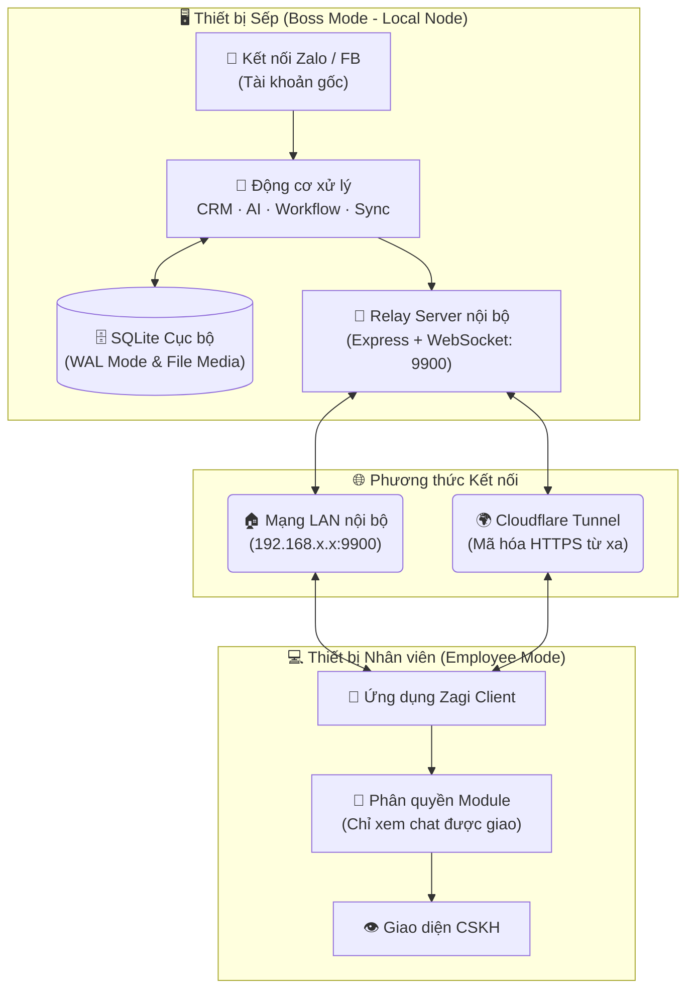
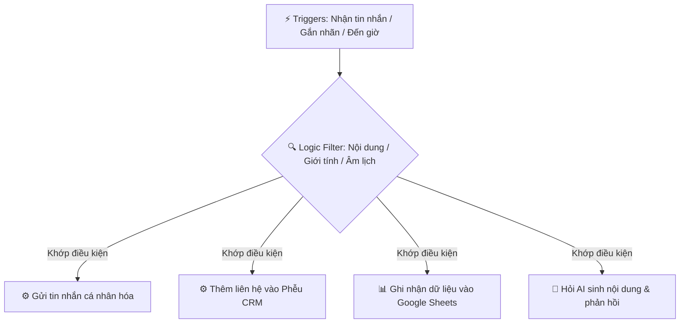

# TÀI LIỆU YÊU CẦU SẢN PHẨM (PRD) - HỆ THỐNG ZAGI DESKTOP
> **Phiên bản tài liệu:** 1.0  
> **Ngày cập nhật:** 25/06/2026  
> **Trạng thái sản phẩm hiện tại:** v27.1.7 (Stable)  
> **Chủ quản:** Product Management Team  

---

## 1. TỔNG QUAN DỰ ÁN & MỤC TIÊU SẢN PHẨM

### 1.1. Bối cảnh & Vấn đề (Problem Statement)
Các doanh nghiệp vừa và nhỏ (SMEs), đội nhóm kinh doanh (Sales), Chăm sóc khách hàng (CSKH) và Marketing tại Việt Nam đang gặp khó khăn lớn trong việc vận hành và quản lý tương tác trên các nền tảng mạng xã hội phổ biến (chủ yếu là Zalo và Facebook):
*   **Quản lý manh mún:** Phải chuyển đổi thủ công qua lại giữa hàng chục tài khoản Zalo/Facebook khác nhau, dễ bỏ sót tin nhắn của khách hàng.
*   **Bảo mật dữ liệu kém:** Hầu hết các giải pháp hiện tại đều chuyển dữ liệu chat lên máy chủ đám mây bên thứ ba, làm gia tăng nguy cơ rò rỉ thông tin khách hàng nhạy cảm.
*   **Thiếu tự động hóa:** Các quy trình gửi tin hàng loạt, chúc mừng sinh nhật, gán nhãn, chuyển tiếp tin nhắn, hay cập nhật phễu CRM đa phần vẫn thực hiện thủ công, tốn nhiều nhân lực và dễ bị Zalo khóa tài khoản do spam.
*   **Khó kiểm soát hiệu suất:** Quản lý không có công cụ đo lường hiệu quả làm việc của nhân viên trực chat realtime.

### 1.2. Giải pháp Zagi (Product Solution)
**Zagi** là một ứng dụng Desktop duy nhất chạy đa nền tảng (Windows, macOS, Linux) hoạt động theo mô hình **Local-first** giúp doanh nghiệp quản lý tập trung và tự động hóa toàn diện hoạt động tương tác khách hàng trên Zalo & Facebook Messenger:
*   **Hộp thư hợp nhất:** Gom tất cả tài khoản chat Zalo & Facebook về một giao diện quản lý duy nhất.
*   **Local-first Database:** Lưu trữ cục bộ toàn bộ tin nhắn, liên hệ, cơ sở dữ liệu CRM ngay trên máy tính của người dùng nhằm bảo mật tối đa.
*   **Workflow Engine:** Động cơ tự động hóa no-code cho phép tự thiết kế kịch bản xử lý tin nhắn, gửi tin, đồng bộ Google Sheets bằng cách kéo thả trực quan.
*   **Trợ lý AI:** Tích hợp AI hỗ trợ trả lời tự động, tóm tắt hội thoại, và soạn thảo tin nhắn chuyên nghiệp.
*   **Mô hình Sếp ↔ Nhân viên (Boss/Employee):** Máy chủ local (Boss) làm nhiệm vụ kết nối và lưu trữ dữ liệu, các máy nhân viên (Employee) kết nối từ xa để làm việc theo sự phân quyền chi tiết.

### 1.3. Đối tượng mục tiêu (Target Audience)
1.  **Doanh nghiệp bán lẻ/SMEs:** Có nhu cầu quản lý từ 3-20 tài khoản Zalo/Facebook bán hàng và CSKH.
2.  **Đội ngũ Sales & CSKH:** Nhân viên trực chat cần giao diện phản hồi nhanh, tích hợp sẵn CRM phễu bán hàng (Kanban Pipeline), tìm kiếm liên hệ nhanh và gợi ý AI.
3.  **Bộ phận Marketing & Growth:** Cần chạy các chiến dịch gửi tin chăm sóc, chúc mừng ngày lễ/sinh nhật tự động đến tệp khách hàng theo nhãn mà không bị nền tảng quét spam.

---

## 2. KIẾN TRÚC HỆ THỐNG & CÔNG NGHỆ CỐT LÕI

Zagi được xây dựng trên mô hình Client-side Desktop app tích hợp Relay Server cục bộ:

### 2.1. Ngăn xếp Công nghệ (Technology Stack)
*   **Framework chính:** Electron 41 + React 18 + Vite 6 + TypeScript 5.
*   **Lưu trữ:** SQLite thông qua thư viện `better-sqlite3` chạy ở chế độ WAL (Write-Ahead Logging) cho tốc độ đọc ghi song song cao.
*   **Tương tác Nền tảng:** `zca-js` (đối với Zalo API) và `fbchat-v2` kết hợp bridge E2EE tự viết bằng Go (`fbchat-bridge-e2ee.exe`) để xử lý tin nhắn mã hóa đầu cuối trên Facebook.
*   **Quản lý trạng thái:** Zustand Store.
*   **Giao diện:** Tailwind CSS v4, React Flow (thiết kế Canvas Workflow), Recharts (biểu đồ báo cáo).
*   **Tích hợp AI:** OpenAI API, Claude, Gemini, OpenRouter, và 9Router proxy gateway.

### 2.2. Triết lý Bảo mật dữ liệu
*   **Zero-Knowledge Host:** Dữ liệu hoàn toàn thuộc sở hữu của người dùng. Cookie, Access Token và khóa mã hóa được lưu trong tệp SQLite local, không gửi về bất kỳ máy chủ trung gian nào của Zagi.
*   **Cơ chế mã hóa trên máy:** Hỗ trợ khóa bảo vệ ứng dụng (App Lock) bằng mật khẩu và recovery key để tránh truy cập trái phép trên thiết bị cục bộ.

---

## 3. CÁC TÍNH NĂNG CỐT LÕI (FUNCTIONAL REQUIREMENTS)

### 3.1. Hộp thư hợp nhất & Đa tài khoản Zalo / Facebook
*   **Đăng nhập QR & Cookie:** Cho phép đăng nhập song song không giới hạn tài khoản Zalo (quét mã QR) và Facebook Messenger (nhập tài khoản/mật khẩu/2FA hoặc cookie).
*   **Gộp tin nhắn tập trung:** Giao diện cho phép xem tin nhắn từ tất cả tài khoản Zalo/Facebook đổ về một màn hình duy nhất hoặc lọc theo từng tài khoản.
*   **Proxy độc lập:** Mỗi tài khoản mạng xã hội có thể cấu hình một proxy riêng (HTTP/SOCKS5) để tránh việc Zalo/Facebook quét dải IP bất thường và khóa tài khoản hàng loạt.

### 3.2. Quản lý liên hệ & Phễu CRM (CRM & Kanban Pipeline)
*   **Kanban Pipeline bán hàng:** Hỗ trợ quản lý phễu bán hàng (ví dụ: Tiếp cận → Tư vấn → Báo giá → Chốt đơn → Chăm sóc).
*   **Hệ thống Nhãn độc lập:** Nhãn Zalo (đồng bộ trực tiếp từ tài khoản Zalo) và nhãn Local (tạo cục bộ và lưu trên SQLite của ứng dụng) hoạt động hoàn toàn độc lập và không đồng bộ chéo, phục vụ các mục đích phân loại và quản lý khách hàng nâng cao.
*   **Quản lý nhóm hàng loạt (Bulk Group Manage):**
    *   Thêm/xóa hàng loạt liên hệ ra/vào nhiều nhóm Zalo cùng lúc.
    *   **Công nghệ Quét Bóng Thụ Động (Passive Shadow Scanning - PSS):** Tự động nhận diện và thu thập chính xác UID của các thành viên ẩn trong nhóm Zalo có cơ chế khóa danh sách thành viên (`lockViewMember`), giúp doanh nghiệp bóc tách tệp khách hàng tương tác.
    *   **Rời nhóm thông minh:** Hỗ trợ tự động chuyển quyền trưởng nhóm (Owner) cho phó nhóm/thành viên khác trước khi rời nhóm và kích hoạt AI viết tin nhắn tạm biệt lịch sự để gửi vào nhóm trước khi rời.

### 3.3. Chiến dịch nhắn tin & Kết bạn tự động (CRM Campaign)
*   **Tạo chiến dịch linh hoạt:** Thiết lập chiến dịch gửi tin nhắn hàng loạt theo nhãn dán, danh sách SĐT (CSV) hoặc tệp UID khách hàng.
*   **Ngưỡng bảo vệ tài khoản (Safety Rules):**
    *   Tự động chia đợt gửi tin (tối đa 20 nhóm/liên hệ một đợt) và nghỉ giãn cách 30 giây giữa các đợt.
    *   Cơ chế trễ ngẫu nhiên (1-2s hoặc 2-3s tùy quy mô nhóm) để mô phỏng thao tác của người thật.
    *   Cảnh báo an toàn (Đỏ/Vàng) hiển thị trực quan cho người dùng nếu phát hiện cài đặt chiến dịch dễ gây quét tài khoản.
*   **Cá nhân hóa nâng cao:** Tự động nhận diện danh xưng xưng hô (`{gender_greeting}`: Anh/Chị/Bạn dựa trên giới tính), biệt danh khách hàng `{alias}`, tên chiến dịch `{campaign_name}`, ngày tháng hiện tại `{date}`, `{time}`, sinh nhật...

### 3.4. Động cơ Workflow tự động hóa (No-code Automation)
Cho phép người dùng xây dựng các luồng làm việc tự động hóa bằng cách kéo thả các node trên Canvas hoặc ra lệnh bằng ngôn ngữ tự nhiên cho AI tạo sơ đồ:

*   **Bộ giả lập Sandbox & Debug trực quan (Visual Debugger):** Hỗ trợ chế độ chạy thử nghiệm an toàn (Sandbox dry-run) để kiểm tra workflow mà không gửi tin nhắn thật hay ghi dữ liệu thật. Hiển thị đường đi của dữ liệu (Edges) và trạng thái từng Node (Success/Error/Skipped) trực quan bằng màu sắc trên sơ đồ.
*   **Smart Variable Auto-complete:** Hỗ trợ gõ ký tự `{` tại các ô cấu hình để hiển thị danh sách biến gợi ý thả xuống và chèn nhanh biến hệ thống hoặc đầu ra của node trước đó.

### 3.5. Trợ lý AI Assistant
*   **Soạn thảo tin nhắn AI (AI Assistant Writing Integration):** Tích hợp nút và khay nhập prompt "🪄 Trợ lý AI" ngay tại khung chat MessageInput và trong Node cấu hình Workflow.
*   **Tóm tắt hội thoại:** Khả năng phân tích cuộc hội thoại dài và xuất ra bản tóm tắt định dạng Markdown trực quan chỉ sau một cú click.
*   **Model AI đa dạng:** Kết nối linh hoạt tới OpenAI, Anthropic Claude, Google Gemini, OpenRouter và 9Router.

---

## 4. YÊU CẦU PHI CHỨC NĂNG (NON-FUNCTIONAL REQUIREMENTS)

### 4.1. Hiệu năng & Dung lượng
*   **Tối ưu SQLite WAL:** Đảm bảo khả năng xử lý lên tới 100.000+ tin nhắn và 10.000+ liên hệ cục bộ mà không bị trễ UI.
*   **Batch Insert:** Khi đồng bộ dữ liệu lớn giữa máy Sếp và máy Nhân viên, sử dụng batch 200 rows/INSERT để tránh treo cơ sở dữ liệu.
*   **Thiết bị yếu:** Hỗ trợ đóng gói native cho cả Windows ARM64 giúp tiết kiệm pin và tối ưu hiệu suất cho các thiết bị Surface Pro dùng chip Snapdragon.

### 4.2. Khả năng tương thích & Đóng gói (Cross-platform Deployment)
*   **Đa hệ điều hành:**
    *   Windows: Đóng gói dạng NSIS Installer (`.exe`) hỗ trợ cả x64 và ARM64.
    *   macOS: Đóng gói dạng `.dmg` hỗ trợ cả Apple Silicon (M1/M2/M3/M4) và Intel x64.
    *   Linux: Hỗ trợ đóng gói dạng `.AppImage` và `.deb` cho các bản phân phối Ubuntu/Debian.
*   **macOS Code Signing & Notarization:** Tích hợp khâu ký số bảo mật của Apple và chạy Notarize tự động trên GitHub Actions CI/CD. Điều này đảm bảo ứng dụng vượt qua cảnh báo Gatekeeper của macOS mà không cần người dùng cấp quyền thủ công trong System Settings.

---

## 5. LẠCH SỬ CẬP NHẬT CÁC PHIÊN BẢN (CHANGELOG)

Dưới đây là tổng hợp lịch sử các phiên bản từ `v27.1.0` đến phiên bản mới nhất `v27.1.7`:

| Phiên bản | Ngày cập nhật | Loại cập nhật | Điểm nhấn chính (Highlights) |
| :--- | :--- | :--- | :--- |
| **v27.1.7** | 06/2026 | Patch | macOS Code Signing & Notarization tự động; Trình gợi ý biến thông minh `{`; Sandbox giả lập workflow; Kho kịch bản Bất động sản; Trợ lý AI Soạn thảo văn bản; Sửa lỗi SQLite Windows. |
| **v27.1.6** | 06/2026 | Patch | Báo cáo gửi tin chiến dịch CRM; Tính năng Gửi bù lỗi & Chạy lại chiến dịch; Quét bóng thụ động (PSS) lấy UID thành viên ẩn nhóm khóa; Composite avatar cho nhóm Zalo. |
| **v27.1.5** | 06/2026 | Patch | Tự động cập nhật ngầm đa hệ điều hành; Lịch âm Việt Nam và CRM tích hợp vào Workflow; Sửa thông tin CRM trực tiếp trên chat; Hệ thống Affiliate lưu Google Sheets. |
| **v27.1.4** | 06/2026 | Patch | Gán/tạo nhãn ngay khi nhập SĐT; Đồng bộ nút tác vụ sang màu xanh dương; Di chuyển tác vụ xóa liên hệ vào thanh BulkActionBar nổi dưới màn hình. |
| **v27.1.3** | 06/2026 | Patch | Rời nhóm Zalo hàng loạt; Tự động chuyển quyền Trưởng nhóm trước khi rời; AI tạm biệt lịch sự; Cẩm nang an toàn Zalo trên TopBar; Cẩm nang an toàn Chiến dịch. |
| **v27.1.2** | 06/2026 | Patch | Bản cài native Windows ARM64 cho Surface; Hướng dẫn chọn phiên bản trên README; Render chuẩn markdown trong AI Quick Panel. |
| **v27.1.0** | 06/2026 | Major | Quản lý nhóm Zalo hàng loạt; Cơ chế trễ ngẫu nhiên & phân đợt gửi tin; Realtime Progress Log; Trợ lý AI trong CRM Campaign; Biến cá nhân hóa động. |

---

### Chi tiết các cập nhật từng phiên bản

#### 🍎 v27.1.7 — macOS Code Signing, Sandbox Debugger & AI Writing
*   **Tính năng mới (New):**
    *   Tích hợp component `SmartInput` và `SmartTextarea` tự động bắt ký tự `{` để gợi ý biến và thay thế đúng vị trí con trỏ.
    *   Bổ sung logic `dryRun` (sandbox) vào [WorkflowEngineService.ts](file:///Users/kimtrungduong/Downloads/deplao/src/services/workflow/WorkflowEngineService.ts) cho phép chạy workflow mô phỏng an sau mà không tác động dữ liệu thực.
    *   Thêm nút "Chạy Sandbox" trên thanh công cụ và nút "Debug trực quan trên sơ đồ" trong lịch sử chạy workflow.
    *   Hiển thị viền trạng thái (Xanh = Success, Đỏ = Error, Xám = Skipped) kèm nút xem nhanh Input/Output/Lỗi trên node React Flow.
    *   Tạo mới file `realEstateTemplates.ts` định nghĩa 8 mẫu kịch bản chuyên dụng cho ngành Bất động sản (chúc sinh nhật VIP, chúc ngày mùng 1/ngày rằm âm lịch, nhắc tiến độ đóng tiền...).
    *   Tích hợp nút soạn thảo nội dung bằng AI ("🪄 Trợ lý AI") gọi API qua `ipc.ai?.chat` cho các trường nhập liệu của Node Workflow và MessageInput trong khung chat.
    *   Cấu hình bảo mật Hardened Runtime cho macOS thông qua tệp `entitlements.mac.plist` và `entitlements.mac.inherit.plist`.
*   **Cải tiến (Improved):**
    *   Cấu hình chuyển tiếp tự động các secrets ký số và tài khoản Apple Developer sang `electron-builder` trong CI/CD.
    *   Tô màu đường nối (Edges) trên canvas động theo luồng chạy thực tế.
    *   Khử hoàn toàn các màu tím (Purple Ban) trong giao diện Trợ lý AI tại [CampaignCreateModal.tsx](file:///Users/kimtrungduong/Downloads/deplao/src/ui/components/crm/campaigns/CampaignCreateModal.tsx) và [MessageInput.tsx](file:///Users/kimtrungduong/Downloads/deplao/src/ui/components/chat/MessageInput.tsx), chuyển sang tông xanh dương/xanh chàm.
*   **Sửa lỗi (Fixed):**
    *   Khắc phục lỗi `"NOT NULL constraint failed: crm_pipeline_stages.created_at"` trên SQLite của Windows khi thêm trạng thái Pipeline CRM mới.

#### 📊 v27.1.6 — Báo cáo CRM Campaign & Công nghệ Quét Bóng Thụ Động (PSS)
*   **Tính năng mới (New):**
    *   Thống kê báo cáo tổng kết chi tiết gửi tin thành công/thất bại và gom nhóm các lỗi gửi phổ biến trong màn hình chi tiết chiến dịch.
    *   Nút hành động "Gửi bù lỗi" và "Chạy lại" kết nối qua các hàm IPC `crm:retryFailedContacts` và `crm:restartCampaign`.
    *   Tích hợp thuật toán Quét Bóng Thụ Động (Passive Shadow Scanning - PSS) cho các nhóm khóa thành viên giúp bóc tách và thu thập UID thành viên ẩn từ luồng dữ liệu tương tác mà không cần quyền quản trị.
*   **Cải tiến (Improved):**
    *   Tab Bạn bè và Nhóm trong `TargetSelector.tsx` cho phép chọn từng người/nhóm qua checkbox và duy trì trạng thái khi đổi tab.
    *   Tích hợp `GroupAvatar` và `groupInfoCache` hiển thị avatar nhóm ghép y hệt giao diện Zalo gốc.
*   **Sửa lỗi (Fixed):**
    *   Khắc phục lỗi bỏ qua kiểm tra hoàn thành chiến dịch khi quá trình gửi tin bị ném ra ngoại lệ trong [CRMQueueService.ts](file:///Users/kimtrungduong/Downloads/deplao/src/services/crm/CRMQueueService.ts).

#### 🔄 v27.1.5 — Tự động cập nhật ngầm & Âm lịch Việt Nam
*   **Tính năng mới (New):**
    *   Tích hợp thuật toán chuyển đổi Dương lịch sang Âm lịch Việt Nam (`lunarCalendar.ts`) và đưa biến hệ thống `$system.lunarDay` vào ngữ cảnh của Workflow Engine.
    *   Bổ sung bộ lọc CRM contacts trong Workflow Engine cho phép lọc liên hệ theo nhãn local, nhãn Zalo, giới tính, trạng thái phễu bán hàng (pipeline), và lọc ngày sinh.
    *   Thêm giao diện chỉnh sửa nhanh hồ sơ khách hàng trực tiếp (Edit Mode) vào panel `ConversationInfo.tsx`.
    *   Bổ sung trường nhập "Mã giới thiệu (nếu có)" vào giao diện đăng ký bản quyền và đẩy dữ liệu về cột L trên Google Sheets.
*   **Cải tiến (Improved):**
    *   Nhận diện kiến trúc CPU thiết bị qua IPC (`process.arch`) để tải bản nâng cấp phù hợp trên Mac (Apple Silicon arm64 / Intel x64).
    *   Tích hợp tải nâng cấp ngầm trên Windows qua `electron-updater`, tự động đóng ứng dụng và thực hiện cài đặt khi người dùng nhấn đồng ý trên TopBar.
*   **Sửa lỗi (Fixed):**
    *   Khắc phục triệt để lỗi xung đột cổng `"Port 27799 is already in use"` khi khởi chạy dev server trên macOS bằng cách cấu hình delay cho wait-on.

#### 🏷️ v27.1.4 — Tối ưu hóa UI gán nhãn & Thao tác hàng loạt
*   **Tính năng mới (New):**
    *   Cho phép chọn nhãn local hoặc Zalo trực tiếp trong `AddToContactsModal` ngay khi vừa mở lên (giao đoạn nhập SĐT).
    *   Tích hợp tùy chọn Xóa liên hệ đã chọn vào danh sách tác vụ Khác trên thanh BulkActionBar hành động nổi dưới màn hình.
*   **Cải tiến (Improved):**
    *   Đồng bộ hóa màu nền và màu hover của nút Xác nhận Import (CSV) và nút Thêm liên hệ (SĐT) sang tông màu xanh dương thương hiệu.
    *   Lược bỏ nút xóa hàng loạt ở menu Thao tác cũ để tối giản hóa giao diện.

#### 👥 v27.1.3 — Quản lý nhóm, Rời nhóm hàng loạt & AI Farewell
*   **Tính năng mới (New):**
    *   Tích hợp `SmartGroupModal` và `BulkLeaveGroupModal` để xử lý rời nhóm hàng loạt chuyên nghiệp.
    *   Thêm cơ chế tự động chuyển quyền Trưởng nhóm cho phó nhóm hoặc thành viên khác trước khi rời đi để tránh mất nhóm.
    *   Thêm tính năng gửi tin nhắn Tạm biệt tự động soạn thảo bằng AI Assistant trước khi rời nhóm.
    *   Tích hợp Popover "Cẩm nang an toàn Zalo" trên TopBar hiển thị các nguyên tắc gửi tin và tự động nhận diện Zalo Business.
    *   Bổ sung cảnh báo màu Đỏ/Vàng khi tạo chiến dịch gửi tin dựa trên các quy định an toàn của Zalo (gửi người lạ, chứa link lạ, delay quá ngắn).
*   **Cải tiến (Improved):**
    *   Đồng bộ thiết kế lại toàn bộ giao diện chi tiết CRM, pipeline Kanban và các bảng dữ liệu liên quan sang theme đen/trắng sang trọng.

#### 💻 v27.1.2 — Bản cài Windows ARM64 cho Surface & Render Markdown AI
*   **Tính năng mới (New):**
    *   Bổ sung bản cài đặt `Zagi-Setup-27.1.2-arm64.exe` chạy native cho các thiết bị Windows ARM64 (Surface Pro 9 5G, 10, 11, Laptop 7).
*   **Cải tiến (Improved):**
    *   Thêm bảng so sánh và sơ đồ chọn phiên bản chi tiết trong tài liệu hướng dẫn và README.
    *   Sửa tên artifact NSIS thêm biến kiến trúc `${arch}` để tự phân biệt file build x64 và arm64.
*   **Sửa lỗi (Fixed):**
    *   Khắc phục lỗi hiển thị markdown thô trong AI Quick Panel, hỗ trợ render danh sách, in đậm và code block trực quan.

#### 🚀 v27.1.0 — Quản lý nhóm hàng loạt & Cơ chế chống khóa tài khoản Zalo
*   **Tính năng mới (New):**
    *   Tích hợp `BulkGroupManageModal` để quản lý nhóm Zalo hàng loạt từ hành động CRM và danh sách thành viên nhóm.
    *   Độ trễ ngẫu nhiên chống khóa Zalo (1-2s cho ≤ 40 nhóm, 2-3s cho > 40 nhóm).
    *   Tự động phân đợt tối đa 20 nhóm/lần và nghỉ 30s giữa các lần với giao diện countdown trực quan.
    *   Thêm trường Chiến dịch khi import liên hệ CRM qua `AddToContactsModal` để phân loại tệp khách hàng.
    *   Bảng log cập nhật tiến độ thời gian thực (realtime Progress Log) hiển thị chi tiết kết quả chạy của tác vụ.
    *   Khởi tạo và cập nhật schema `crm_pipeline_stages` và `group_pin_schedules` trong SQLite.
    *   Tích hợp trợ lý AI (AI Assistant) trực tiếp vào màn hình tạo chiến dịch CRM giúp soạn nội dung bằng AI.
    *   Bổ sung phím tắt chèn nhanh các biến động (`{gender_greeting}`, `{alias}`, `{campaign_name}`, `{date}`, `{time}`, `{birthday_day}`, `{birthday_month}`).
*   **Sửa lỗi (Fixed):**
    *   Khắc phục lỗi thiếu hàm `savePipelineStage`, `getPipelineStages`, `deletePipelineStage` ở tầng IPC.
    *   Khắc phục lỗi danh sách liên hệ CRM hiển thị cả nhóm Zalo vào tab liên hệ cá nhân.
    *   Khắc phục lỗi chuyển tiếp tin nhắn Zalo bị lỗi format payload khiến server báo *Missing message content*.
