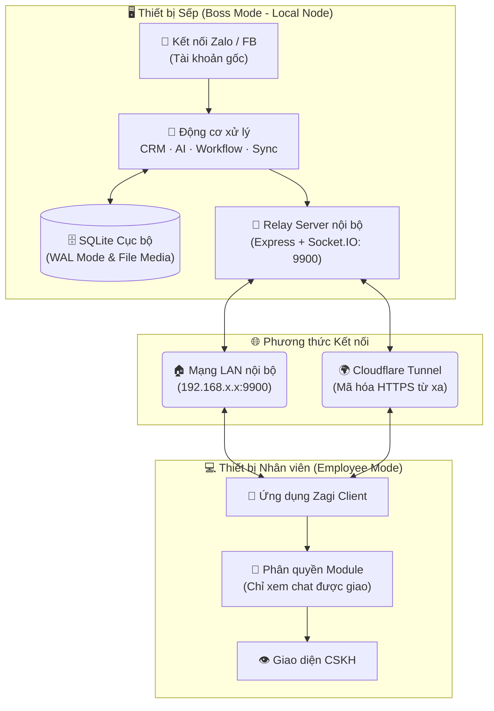
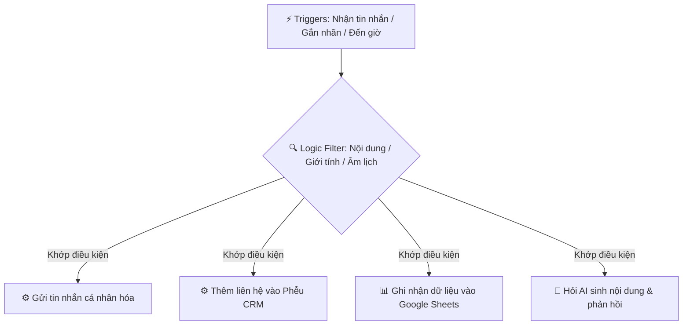

# TÀI LIỆU YÊU CẦU SẢN PHẨM (PRD) - HỆ THỐNG ZAGI DESKTOP
> **Phiên bản tài liệu:** 3.1.1  
> **Ngày cập nhật:** 02/08/2026  
> **Trạng thái sản phẩm hiện tại:** v3.1.1 (Official Release)  
> **Chủ quản:** Product Management Team  

---

#### 🚀 v3.1.1 — Quản Lý Định Mức Quét SĐT Theo Tài Khoản, Sửa Lỗi Tin Nhắn Nhanh Media & Đồng Bộ Real-time Máy Trạm (Official Release)
* **Tính năng mới & Sửa lỗi nổi bật:**
  * **🔍 Định Mức Quét SĐT Zalo Theo Tài Khoản (Option A)**: Tách riêng hạn mức Ngày & Giờ độc lập theo từng nick Zalo. Tự động san đều tải danh sách SĐT khi quét.
  * **📱 Tinh Gọn Giao Diện Phone Scan**: Tích hợp ô báo cáo Định mức Quét Ngày/Giờ vào Thẻ thống kê #4 (thay thế ô `KHÔNG CÓ ZALO`), tự động liên kết dữ liệu theo tài khoản Zalo được chọn.
  * **⚡ Khắc Phục Lỗi Tin Nhắn Nhanh Đính Kèm Ảnh**: Sửa handler `local-media` protocol trên macOS và quy đổi đường dẫn trong `FileStorageService.resolveAbsolutePath()`, giúp ảnh thumbnail và ảnh gửi đính kèm hoạt động 100% mượt mà.
  * **🔄 Tự Động Khởi Tạo Cấu Trúc Bảng Workspace DB & Bỏ Qua Bộ Lọc Event Máy Trạm**: Tự động chạy `ensureTablesOnSecondaryDb()` tạo bảng SQLite cho các workspace DB; bỏ qua bộ lọc unowned account trong Employee/Remote mode giúp toàn bộ dữ liệu real-time từ Boss đồng bộ tức thì.

#### 🚀 v3.0.8 — Khử Trùng Thành Viên Nhóm, Xưng Hô Thông Minh, Loại Trừ 3 Tiêu Chí & Giờ Nghỉ Đêm CRM (Official Release)
* **Tính năng mới (New):**
  * **👨‍👩‍👧‍👦 Chọn Nhiều Nhóm Zalo & Khử Trùng Thành Viên Tự Động (`TargetSelector.tsx`)**:
    * Cho phép tích chọn nhiều Nhóm Zalo cùng lúc ở tab `Theo nhóm` (`☑️ Chọn tất cả` / `☒ Bỏ chọn`).
    * Tự động giải nén toàn bộ thành viên từ các nhóm được chọn và thực thi khử trùng 100% (Deduplicate by Member ID). Đảm bảo mỗi cá nhân chỉ đứng 1 vị trí duy nhất và chỉ nhận 1 tin nhắn.
    * Thống kê trực quan thời gian thực: `✓ Đã chọn X nhóm ➔ Y thành viên độc nhất`.
  * **🚫 Bộ Lọc Loại Trừ 3 Tiêu Chí Nâng Cao & Tìm Kiếm Nhanh (`TargetSelector.tsx`)**:
    * Tích hợp ô tìm kiếm nhóm Zalo (`exGroupSearch`) và ô tìm kiếm bạn bè (`exContactSearch`) trong khối loại trừ.
    * Tự động loại trừ toàn bộ thành viên thuộc các nhóm Zalo chỉ định hoặc loại trừ từng cá nhân cụ thể với mác đỏ `🚫 [Tên liên hệ] (✕)` trực quan.
  * **🎯 Động Cơ Phân Phát Tin Nhắn Chờ Ngẫu Nhiên Từng Tin CRM (`CRMQueueService.ts`)**:
    * Tính toán khoảng delay ngẫu nhiên hoàn toàn MỚI (`nextAllowedSendTime`) cho từng tin nhắn/liên hệ riêng biệt trong dải `[delay_min_seconds, delay_max_seconds]`, loại bỏ hiện tượng bị gửi dồn ở mốc tối thiểu.
  * **🌙 Giờ Nghỉ Đêm Tự Động Tránh Khóa Tài Khoản CRM (Quiet Hours)**:
    * Tự động nghỉ gửi tin từ `23:30` đến `07:00` sáng hôm sau (hỗ trợ bật/tắt, cài đặt giờ tùy chỉnh và tự động phát tín hiệu trạng thái `quiet_hours`).
  * **🗣️ Quản Lý Xưng Hô & Tự Xưng Thông Minh (Smart Salutation & Self-Reference)**:
    * Thêm tab *"🗣️ Xưng hô & Tự xưng"* vào Cài đặt Hội thoại (`SalutationSettings.tsx`). Cho phép Xem, Tìm kiếm, Thêm mới, Sửa, Xóa và Khôi phục bảng quy tắc tự xưng tiếng Việt.
    * Tích hợp bộ thử nghiệm Live Preview theo thời gian thực giúp người dùng thử chọn danh xưng (`Anh`, `Chị`, `Sếp`, `Thầy`...) và xem ngay kết quả tự xưng (`em`, `cháu`, `con`, `mình`...) viết Hoa đầu câu hay viết thường giữa câu.
    * Đưa biến **`[Tự xưng]`** (`{tu_xung}` / `$item.tu_xung`) ra ngoài Thanh công cụ chèn nhanh (`Quick Toolbar`) bên cạnh `[Xưng hô]` trong CRM Campaign Editor, Workflow Node Config và Popup chọn biến.
    * Đồng bộ bảng quy tắc tự xưng tùy chỉnh vào SQLite `app_settings` (`custom_salutation_map`), tự động áp dụng cho Boss, Employee, CRM Campaigns và Workflow Engine.
  * **🚀 Tự Động Cập Nhật 1-Click Đa Nền Tảng & Bảo Vệ An Toàn 2 Bước (1-Click Auto-Updater & Safety Guard)**:
    * Tích hợp Modal *"Có gì mới"* (`UpdateModal.tsx`) hiển thị Release Notes + thanh tiến trình tải ngầm (% MB, tốc độ). Tự động nhận diện hệ điều hành (`Windows 🪟`, `macOS 🍎`, `Linux 🐧`).
  * **📅 Bộ Lọc Khoảng Thời Gian Quét SĐT Linh Hoạt (`PhoneScanPanel.tsx`)**:
    * Cho phép chọn ngày bắt đầu & ngày kết thúc (`Từ ngày` ➔ `Đến ngày`). Thống kê chính xác số lượng SĐT tải lên, đã quét, có Zalo, không Zalo và số còn lại chưa quét theo đúng khoảng thời gian.
* **Sửa lỗi & Chuẩn hóa Hệ thống (Bug Fixes & Optimization):**
  * **🏷️ Chuẩn Hóa Hiển Thị Modal Chọn Nhãn (`UnifiedLabelPickerModal.tsx`)**: Sửa triệt để lỗi avatar/tên tài khoản Zalo hiển thị số `2` và dãy Zalo ID 18 chữ số ➔ Khôi phục hiển thị `[Avatar Người Dùng] + Tên Người Dùng` chuẩn xác 100% theo thiết kế.
  * **📊 Báo Cáo Chiến Dịch Card Phản Quang (`CampaignDetail.tsx`)**: Dọn dẹp dòng tiến độ mảnh dư thừa, chuyển màu chữ/số/icon trên 4 card thống kê (Tổng số, Thành công, Thất bại, Đang chờ) sang trắng phản quang nổi bật trên nền tối.
  * **👤 Tự Chọn Tài Khoản Nhận CRM Mặc Định (`CRMPage.tsx`)**: Tự chọn Zalo Account đầu tiên có sẵn khi gom về 1 tài khoản, tránh lỗi quên chọn.
  * **Sửa Lỗi Hiển Thị Bong Bóng Ảnh & Thumbnail (`mediaUtils.ts` & `ChatWindow.tsx`)**: Chuẩn hóa bóc tách toàn bộ trường CDN URL Zalo (`hdUrl`, `normalUrl`, `thumbUrl`, `url`), dọn dẹp bong bóng ảnh tạm (`temp_xxx`) khi tin nhắn thật từ Zalo API trả về, triệt tiêu hoàn toàn lỗi lặp 2 hình ảnh hỏng.
  * **Sửa Lỗi Thứ Tự Tin Nhắn (`normalizeTimestamp`)**: Tự động quy đổi timestamp 10 chữ số (số giây) từ Zalo Event Listener ➔ 13 chữ số (ms), sắp xếp tin nhắn chuẩn xác 100% theo thời gian thực.
  * **Tối Ưu Rà Soát Trùng Lặp & Đối Chiếu Zalo Thực Tế (`DatabaseService.ts` & `crmIpc.ts`)**: Khớp bạn bè Zalo theo Zalo UID duy nhất (bỏ so sánh SĐT mơ hồ); Nạp danh bạ sống từ Zalo API qua `replaceFriendsForAccount()` và thực thi xóa triệt để liên hệ khỏi tài khoản cũ khi Chuyển/Gộp liên hệ thành công.

#### 🏆 v3.0.7 — Bản Phân Quyền Sếp/Nhân Viên, License Gate & Tối Ưu Bảo Mật Triệt Để (Official Release)

## 1. TỔNG QUAN DỰ ÁN & MỤC TIÊU SẢN PHẨM

### 1.1. Bối cảnh & Vấn đề (Problem Statement)
Các doanh nghiệp vừa và nhỏ (SMEs), đội nhóm kinh doanh (Sales), Chăm sóc khách hàng (CSKH) và Marketing tại Việt Nam đang gặp khó khăn lớn trong việc vận hành và quản lý tương tác trên các nền tảng mạng xã hội phổ biến (chủ yếu là Zalo và Facebook):
*   **Quản lý manh mún:** Phải chuyển đổi thủ công qua lại giữa hàng chục tài khoản Zalo/Facebook khác nhau, dễ bỏ sót tin nhắn của khách hàng.
*   **Bảo mật dữ liệu kém:** Hầu hết các giải pháp hiện tại đều chuyển dữ liệu chat lên máy chủ đám mây bên thứ ba, làm gia tăng nguy cơ rò rỉ thông tin khách hàng nhạy cảm.
*   **Thiếu tự động hóa:** Các quy trình gửi tin hàng loạt, chúc mừng sinh nhật, gán nhãn, chuyển tiếp tin nhắn, hay cập nhật phễu CRM đa phần vẫn thực hiện thủ công, tốn nhiều nhân lực và dễ bị Zalo khóa tài khoản do spam.
*   **Khó kiểm soát hiệu suất:** Quản lý không có công cụ đo lường hiệu quả làm việc của nhân viên trực chat realtime.

### 1.2. Giải pháp Zagi (Product Solution)
**Zagi** là một ứng dụng Desktop duy nhất chạy đa nền tảng (Windows, macOS, Linux) hoạt động theo mô hình **Local-first** giúp doanh nghiệp quản lý tập trung và tự động hóa toàn diện hoạt động tương tác khách hàng trên Zalo & Facebook Messenger:
*   **Hộp thư hợp nhất:** Gom tất cả tài khoản chat Zalo & Facebook về một giao diện quản lý duy nhất.
*   **Local-first Database:** Lưu trữ cục bộ toàn bộ tin nhắn, liên hệ, cơ sở dữ liệu CRM ngay trên máy tính của người dùng nhằm bảo mật tối đa.
*   **Workflow Engine:** Động cơ tự động hóa no-code cho phép tự thiết kế kịch bản xử lý tin nhắn, gửi tin, đồng bộ Google Sheets bằng cách kéo thả trực quan.
*   **Trợ lý AI:** Tích hợp AI hỗ trợ trả lời tự động, tóm tắt hội thoại, và soạn thảo tin nhắn chuyên nghiệp.
*   **Mô hình Sếp ↔ Nhân viên (Boss/Employee):** Máy chủ local (Boss) làm nhiệm vụ kết nối và lưu trữ dữ liệu, các máy nhân viên (Employee) kết nối từ xa để làm việc theo sự phân quyền chi tiết.

### 1.3. Đối tượng mục tiêu (Target Audience)
1.  **Doanh nghiệp bán lẻ/SMEs:** Có nhu cầu quản lý từ 3-20 tài khoản Zalo/Facebook bán hàng và CSKH.
2.  **Đội ngũ Sales & CSKH:** Nhân viên trực chat cần giao diện phản hồi nhanh, tích hợp sẵn CRM phễu bán hàng (Kanban Pipeline), tìm kiếm liên hệ nhanh và gợi ý AI.
3.  **Bộ phận Marketing & Growth:** Cần chạy các chiến dịch gửi tin chăm sóc, chúc mừng ngày lễ/sinh nhật tự động đến tệp khách hàng theo nhãn mà không bị nền tảng quét spam.

---

## 2. KIẾN TRÚC HỆ THỐNG & CÔNG NGHỆ CỐT LÕI

Zagi được xây dựng trên mô hình Client-side Desktop app tích hợp Relay Server cục bộ:

```mermaid
flowchart TB
    subgraph BOSS["🖥️ Thiết bị Sếp (Boss Mode - Local Node)"]
        BZ["📱 Kết nối Zalo / FB\n(Tài khoản gốc)"]
        BSV["🔧 Động cơ xử lý\nCRM · AI · Workflow · Sync"]
        BSD[("🗄️ SQLite Cục bộ\n(WAL Mode & File Media)")]
        BRL["🔁 Relay Server nội bộ\n(Express + Socket.IO: 9900)"]
    end
    subgraph NET["🌐 Phương thức Kết nối"]
        LAN("🏠 Mạng LAN nội bộ\n(192.168.x.x:9900)")
        WAN("🌍 Cloudflare Tunnel\n(Mã hóa HTTPS từ xa)")
    end
    subgraph EMP["💻 Thiết bị Nhân viên (Employee Mode)"]
        EA["📲 Ứng dụng Zagi Client"]
        EP["🔐 Phân quyền Module\n(Chỉ xem chat được giao)"]
        EU["👁️ Giao diện CSKH"]
    end
    BZ --> BSV
    BSV <--> BSD
    BSV --> BRL
    BRL <--> LAN & WAN
    LAN & WAN <--> EA
    EA --> EP --> EU
```

### 2.1. Ngăn xếp Công nghệ (Technology Stack)
*   **Framework chính:** Electron 41 + React 18 + Vite 6 + TypeScript 5.
*   **Lưu trữ:** SQLite thông qua thư viện `better-sqlite3` chạy ở chế độ WAL cho máy Boss/Standalone. Đối với máy Nhân viên (Remote Workspace), hệ thống vận hành theo cơ chế Thin Client (Zero-SQLite) không tạo tệp dữ liệu cục bộ.
*   **Giao tiếp Real-time:** Socket.IO v4 (transport duy nhất truyền tải sự kiện thời gian thực từ Boss đến Nhân viên).
*   **Tương tác Nền tảng:** `zca-js` (đối với Zalo API) và `fbchat-v2` kết hợp bridge E2EE tự viết bằng Go (`fbchat-bridge-e2ee.exe`) để xử lý tin nhắn mã hóa đầu cuối trên Facebook.
*   **Quản lý trạng thái:** Zustand Store.
*   **Giao diện:** Tailwind CSS v4, React Flow (thiết kế Canvas Workflow), Recharts (biểu đồ báo cáo).
*   **Tích hợp AI:** OpenAI API, Claude, Gemini, OpenRouter, và 9Router proxy gateway.

### 2.2. Triết lý Bảo mật dữ liệu
*   **Zero-Knowledge Host:** Dữ liệu hoàn toàn thuộc sở hữu của người dùng. Cookie, Access Token và khóa mã hóa được lưu trong tệp SQLite local, không gửi về bất kỳ máy chủ trung gian nào của Zagi.
*   **Cơ chế mã hóa trên máy:** Hỗ trợ khóa bảo vệ ứng dụng (App Lock) bằng mật khẩu và recovery key để tránh truy cập trái phép trên thiết bị cục bộ.

---

## 3. CÁC TÍNH NĂNG CỐT LÕI (FUNCTIONAL REQUIREMENTS)

### 3.1. Hộp thư hợp nhất & Đa tài khoản Zalo / Facebook
*   **Đăng nhập QR & Cookie:** Cho phép đăng nhập song song không giới hạn tài khoản Zalo (quét mã QR) và Facebook Messenger (nhập tài khoản/mật khẩu/2FA hoặc cookie).
*   **Gộp tin nhắn tập trung:** Giao diện cho phép xem tin nhắn từ tất cả tài khoản Zalo/Facebook đổ về một màn hình duy nhất hoặc lọc theo từng tài khoản.
*   **Proxy độc lập:** Mỗi tài khoản mạng xã hội có thể cấu hình một proxy riêng (HTTP/SOCKS5) để tránh việc Zalo/Facebook quét dải IP bất thường và khóa tài khoản hàng loạt.

### 3.2. Quản lý liên hệ & Phễu CRM (CRM & Kanban Pipeline)
*   **Kanban Pipeline bán hàng:** Hỗ trợ quản lý phễu bán hàng (ví dụ: Tiếp cận → Tư vấn → Báo giá → Chốt đơn → Chăm sóc).
*   **Hệ thống Nhãn độc lập:** Nhãn Zalo (đồng bộ trực tiếp từ tài khoản Zalo) và nhãn Local (tạo cục bộ và lưu trên SQLite của ứng dụng) hoạt động hoàn toàn độc lập và không đồng bộ chéo, phục vụ các mục đích phân loại và quản lý khách hàng nâng cao.
*   **Quản lý nhóm hàng loạt (Bulk Group Manage):**
    *   Thêm/xóa hàng loạt liên hệ ra/vào nhiều nhóm Zalo cùng lúc.
    *   **Công nghệ Quét Bóng Thụ Động (Passive Shadow Scanning - PSS):** Tự động nhận diện và thu thập chính xác UID của các thành viên ẩn trong nhóm Zalo có cơ chế khóa danh sách thành viên (`lockViewMember`), giúp doanh nghiệp bóc tách tệp khách hàng tương tác.
    *   **Rời nhóm thông minh:** Hỗ trợ tự động chuyển quyền trưởng nhóm (Owner) cho phó nhóm/thành viên khác trước khi rời nhóm và kích hoạt AI viết tin nhắn tạm biệt lịch sự để gửi vào nhóm trước khi rời.

### 3.3. Chiến dịch nhắn tin & Kết bạn tự động (CRM Campaign)
*   **Tạo chiến dịch linh hoạt:** Thiết lập chiến dịch gửi tin nhắn hàng loạt theo nhãn dán, danh sách SĐT (CSV) hoặc tệp UID khách hàng.
*   **Ngưỡng bảo vệ tài khoản (Safety Rules):**
    *   Tự động chia đợt gửi tin (tối đa 20 nhóm/liên hệ một đợt) và nghỉ giãn cách 30 giây giữa các đợt.
    *   Cơ chế trễ ngẫu nhiên (1-2s hoặc 2-3s tùy quy mô nhóm) để mô phỏng thao tác của người thật.
    *   Cảnh báo an toàn (Đỏ/Vàng) hiển thị trực quan cho người dùng nếu phát hiện cài đặt chiến dịch dễ gây quét tài khoản.
*   **Cá nhân hóa nâng cao:** Tự động nhận diện danh xưng xưng hô (`{gender_greeting}`: Anh/Chị/Bạn dựa trên giới tính), biệt danh khách hàng `{alias}`, tên chiến dịch `{campaign_name}`, ngày tháng hiện tại `{date}`, `{time}`, sinh nhật...

### 3.4. Động cơ Workflow tự động hóa (No-code Automation)
Cho phép người dùng xây dựng các luồng làm việc tự động hóa bằng cách kéo thả các node trên Canvas hoặc ra lệnh bằng ngôn ngữ tự nhiên cho AI tạo sơ đồ:

```mermaid
graph TD
    Trigger[⚡ Triggers: Nhận tin nhắn / Gắn nhãn / Đến giờ] --> Logic{🔍 Logic Filter: Nội dung / Giới tính / Âm lịch}
    Logic -- Khớp điều kiện --> Action1[⚙️ Gửi tin nhắn cá nhân hóa]
    Logic -- Khớp điều kiện --> Action2[⚙️ Thêm liên hệ vào Phễu CRM]
    Logic -- Khớp điều kiện --> Action3[📊 Ghi nhận dữ liệu vào Google Sheets]
    Logic -- Khớp điều kiện --> Action4[🤖 Hỏi AI sinh nội dung & phản hồi]
```

*   **Bộ giả lập Sandbox & Debug trực quan (Visual Debugger):** Hỗ trợ chế độ chạy thử nghiệm an toàn (Sandbox dry-run) để kiểm tra workflow mà không gửi tin nhắn thật hay ghi dữ liệu thật. Hiển thị đường đi của dữ liệu (Edges) và trạng thái từng Node (Success/Error/Skipped) trực quan bằng màu sắc trên sơ đồ.
*   **Smart Variable Auto-complete:** Hỗ trợ gõ ký tự `{` tại các ô cấu hình để hiển thị danh sách biến gợi ý thả xuống và chèn nhanh biến hệ thống hoặc đầu ra của node trước đó.
*   **Gửi nhiều ảnh & file nâng cao (Workflow Multi-Image/File Sending):** 
    *   Hỗ trợ cấu hình gửi nhiều ảnh/tệp cùng lúc cho các hành động Zalo (`zalo.sendImage` và `zalo.sendFile`).
    *   Trình chọn ảnh (`MultiImageSelector`) hỗ trợ chọn nhiều file từ hệ điều hành qua hộp thoại mở file (`ipc.file?.openDialog` với `multiSelect: true`), nhập thêm địa chỉ URL thủ công, hiển thị danh sách dạng lưới hình thu nhỏ (image preview grid) có nút xóa nhanh từng ảnh.
    *   Cung cấp tùy chọn cấu hình gửi toàn bộ danh sách cùng lúc hoặc gửi ngẫu nhiên đúng 1 ảnh trong danh sách (`sendMode` hỗ trợ chế độ `random` hoặc `multiple`).

### 3.5. Trợ lý AI Assistant
*   **Soạn thảo tin nhắn AI (AI Assistant Writing Integration):** Tích hợp nút và khay nhập prompt "🪄 Trợ lý AI" ngay tại khung chat MessageInput và trong Node cấu hình Workflow.
*   **Tóm tắt hội thoại:** Khả năng phân tích cuộc hội thoại dài và xuất ra bản tóm tắt định dạng Markdown trực quan chỉ sau một cú click.
*   **Model AI đa dạng:** Kết nối linh hoạt tới OpenAI, Anthropic Claude, Google Gemini, OpenRouter và 9Router.

### 3.6. Tích hợp Hệ thống & Định vị Logo Thương hiệu (POS, ERP, Payment Gateway & Shipping)
*   **Tích hợp đa dạng hệ thống bán hàng & vận chuyển:** Hỗ trợ kết nối và đồng bộ dữ liệu với các POS/ERP lớn (KiotViet, Haravan, Sapo, Nhanh.vn, Pancake POS), cổng thanh toán (Casso, SePay), và đơn vị vận chuyển (Giao Hàng Nhanh - GHN, Giao Hàng Tiết Kiệm - GHTK).
*   **Giao diện Brand Logo cao cấp:** Thiết kế lại toàn bộ ô hiển thị logo thương hiệu tích hợp (bao gồm cả các đối tác AI). Sử dụng biểu tượng/icon SVG màu trắng tinh khiết đặt trên nền ô vuông có màu sắc đặc trưng của chính thương hiệu đó (solid brand-colored backgrounds) (ví dụ: nền cam cho KiotViet, nền indigo cho Haravan, nền emerald cho Sapo, v.v.). Riêng DeepSeek sử dụng màu nền xanh trời (`bg-sky-600`) để tuân thủ quy tắc cấm màu tím (Purple Ban) của hệ thống. Phong cách thiết kế này mang lại cảm giác trực quan, hiện đại và sang trọng vượt trội.

### 3.7. Hệ thống Hướng dẫn sử dụng Tích hợp (Built-in User Guide)
*   **Trung tâm tài liệu nội bộ:** Di chuyển toàn bộ tài liệu hướng dẫn sử dụng từ popup sidebar vào tab dedicated trong trang **Cài đặt → Giới thiệu → Hướng dẫn sử dụng**.
*   **Phân mục khoa học:** Tài liệu được phân chia thành 5 tab riêng biệt (Tổng quan, CRM, Workflow, Tích hợp, Kết hợp) giúp người dùng học nhanh cách thiết lập các tác vụ nâng cao như quét nhóm ẩn, cấu hình gửi nhiều ảnh/file, đồng bộ POS, hoặc thiết lập tự động hóa.

### 3.8. Hệ Thống Thống Kê Máy Cài Đặt, Hệ Điều Hành & Telemetry (Supabase Telemetry)
*   **Định danh duy nhất máy tính (Hardware Machine ID):** Tự động khởi tạo mã định danh duy nhất cố định (`machine_id`) dựa trên MAC Address + Hostname + CPU Seed và lưu trữ cố định tại `userData/machine_id.txt`.
*   **Thu thập thông tin ẩn danh:** Tự động ghi nhận loại Hệ điều hành (`macOS Apple Silicon M1/M2/M3`, `macOS Intel`, `Windows 11/10 x64`, `Linux`), phiên bản kernel/Darwin, phiên bản ứng dụng Zagi (`v3.0.6`), Tên máy tính (Hostname) và Danh sách các Tài khoản Zalo đang hoạt động trên máy đó.
*   **Tự động gửi Ping định kỳ:** Tự động gửi request Upsert báo danh về bảng `device_telemetry` trên CSDL Supabase qua REST API 10 giây sau khi mở app và định kỳ 6 giờ/lần.
*   **Bảo mật phân quyền mã hóa RLS 100%:**
    *   **Máy khách/Thành viên (`Publishable Key / anon`):** CHỈ CÓ QUYỀN `INSERT` và `UPDATE` (Gửi Ping ẩn danh). Bị cấm hoàn toàn quyền `SELECT` (Không thể đọc/xem danh sách máy của những người khác).
    *   **Quản trị viên/Admin (`Secret Key / service_role`):** Được cấp quyền `SELECT` để xem và tải về toàn bộ danh sách báo cáo các máy active.
*   **Bảng Báo Cáo Quản Trị Trực Quan (`DeviceTelemetryPanel.tsx`):** Thêm tab **"💻 Thống kê máy"** trong phần Cài đặt của Zagi. Hiển thị tổng số máy active, phân loại biểu đồ OS Mac/Windows/Linux, bảng danh sách chi tiết các máy và tài khoản Zalo tương ứng kèm nút **Copy SQL 1-Click** tạo bảng Supabase.

### 3.9. Cơ Chế Kiểm Tra Phiên Bản Mới v3.x.x Cảnh Báo Không Tải Ngầm (Option A Release Checker)
*   **Bộ lọc dải phiên bản `v3.x.x`:** Tự động fetch danh sách thẻ phát hành từ GitHub Releases API (`https://api.github.com/repos/trithucnen-max/zagi-builder/releases`). Lọc và chỉ so sánh dải phiên bản mới `v3.x.x`, bỏ qua 100% các tag `v27.x.x` cũ trên GitHub repository.
*   **Chế độ Cảnh báo Thông minh (Notification Banner):** Khi có phiên bản `v3.x.x` mới hơn phiên bản hiện tại (`v3.0.6`), hiển thị một Card thông báo nổi ở góc dưới màn hình: *"🚀 Có phiên bản mới Zagi v3.0.7!"*.
*   **Tuyệt đối không tự động tải ngầm hay cài đè:** Đảm bảo quyền chủ động 100% cho người dùng. Người dùng bấm *"Xem & Tải về"* để mở trực tiếp trang GitHub Release trên trình duyệt hoặc bấm *"Bỏ qua"* để ẩn thông báo.

### 3.10. Quản Lý & Rà Soát Lọc Trùng Liên Hệ Đa Tài Khoản & Phân Lập Bạn Bè Zalo
*   **Phân lập trạng thái Bạn bè theo từng tài khoản Zalo:** Nâng cấp truy vấn SQL `getDuplicateContactsAcrossAccounts` để so khớp danh sách bạn bè `friends` chính xác theo từng tài khoản sở hữu `owner_zalo_id` (so khớp cả Zalo UID và SĐT).
*   **Phân biệt rành mạch `🤝 Bạn bè Zalo` vs `👤 SĐT Quét / Khách lạ`:** Liên hệ CHỈ được gắn nhãn Bạn bè Zalo đối với tài khoản thực sự có kết bạn Zalo. Nếu nằm ở tài khoản khác do Quét SĐT hoặc Khách nhắn tin, hệ thống trả về đúng nhãn SĐT Quét/Khách lạ.
*   **Cơ chế Dọn dẹp cờ `is_friend` dính chéo:** Tự động quét lại CSDL và reset cờ `is_friend = 0` cho các bản ghi `contacts` bị gán nhầm cờ từ các đợt import cũ.

### 3.11. Tái Thiết Kế Toàn Diện Giao Diện Mobile Web & Trải Nghiệm Di Động
*   **Tự động ẩn TopBar:** Tự động ẩn thanh công cụ TopBar trên thiết bị di động (`isMobile === true`), giải phóng 100% chiều cao màn hình cho các chức năng chính.
*   **Sidebar dạng Slide-Over Drawer:** Chuyển Sidebar màu xanh cố định thành Menu trượt nổi mượt mà, kích hoạt bằng nút Hamburger `☰` trên đầu trang Chat, CRM và Dashboard.
*   **Full-Screen Overlay:** Khung xem thông tin cuộc trò chuyện và bảng tin nhóm tự động tràn 100% màn hình di động, giải quyết triệt để sự cố bị cắt viền thông tin.
*   **Tối ưu danh sách CRM Mobile:** Mặc định chỉ hiển thị 2 cột chính (Biệt danh & SĐT). Chuyển menu CRM Sub-tabs thành Dropdown Selector gọn gàng.
*   **Form Đăng Nhập Nhân Viên Tinh Gọn:** Tự động lấy URL máy Boss từ địa chỉ trình duyệt (`window.location.origin`). Nhân viên đăng nhập chỉ cần gõ Username + Password và tự động chuyển về màn hình Chat (`setView('chat')`).

### 3.12. Luồng Khởi Động & Phân Quyền Bảo Mật Sếp ↔ Nhân Viên (Boss/Employee Role & Security Isolation)
*   **Màn hình Onboarding Lựa chọn Vai trò:** Lần đầu mở app hiển thị cửa sổ Onboarding chọn vai trò (Máy BOSS vs Máy Nhân viên).
    *   **Máy BOSS (Sếp / Chủ shop):** Bắt buộc trải qua màn hình kích hoạt bản quyền (`popup.html`) gồm 2 tab **Nhập key** (Kích hoạt bản quyền hiện có) và **Nhận key** (đăng ký dùng thử 14 ngày miễn phí hoặc mua gói).
    *   **Máy Nhân Viên:** Bỏ qua bước License Key, mở thẳng giao diện kết nối tới máy BOSS.
*   **Tự động Nhớ Trạng thái & Boot Mượt mà:** Tự động phát hiện active workspace (`remote` vs `local`), tự động mở thẳng giao diện tương ứng khi khởi động lại ứng dụng mà không bắt chọn lại vai trò thủ công.
*   **Chuyển sang Chế độ BOSS & License Gate:** Người dùng nhấp nút `👑 Chuyển sang máy BOSS (Sếp)` ở Header TopBar hoặc Cài đặt. IPC `license:switchToBoss` ngắt kết nối session nhân viên, switch workspace về `default`, đồng thời mở cửa sổ License Gate bắt buộc Nhập Key / Nhận Key trước khi truy cập Chế độ BOSS.
*   **Cô lập Bảo mật Giao diện Nhân viên:** Tự động ẩn Workspace `Default (Boss)`, ẩn các nút Thêm/Quản lý workspace trong `WorkspaceSwitcher`, và ẩn hẳn tab **🗂️ Lưu trữ (storage)** khỏi Cài đặt trên máy Nhân viên.

### 3.13. Kết Nối Nhân Viên Ổn Định — Zero Flicker Connection Guard (v3.0.8)

Đây là cơ chế đảm bảo máy nhân viên **không bao giờ thấy trạng thái mất kết nối giả** khi chuyển màn hình trong ứng dụng.

*   **Vấn đề gốc rễ đã giải quyết:** Sự kiện `visibilitychange` và `online` của trình duyệt/Electron kích hoạt `connectRemote()` không có điều kiện — kể cả khi kết nối đang hoàn toàn ổn định. Điều này khiến `HttpConnectionManager` destroy client SSE cũ và tạo mới, gây hiện tượng **nhấp nháy kết nối** (~1-2 giây) mỗi lần người dùng chuyển tab, màn hình hoặc minimize/restore cửa sổ.
*   **Kiến trúc 3 lớp bảo vệ:**
    1.  **Guard UI tầng Renderer (`App.tsx`):** Trước khi gọi `connectRemote`, kiểm tra `connectionStatuses[wsId].connected`. Nếu đang kết nối → bỏ qua hoàn toàn. Nếu thực sự mất kết nối → mới trigger reconnect.
    2.  **Getter Zustand (`workspaceStore.ts`):** Bổ sung `getConnectionStatus(wsId)` để các component đọc trạng thái kết nối tức thì từ store mà không cần IPC roundtrip.
    3.  **Guard tầng Core (`HttpConnectionManager.ts`):** Thêm kiểm tra `existingStatus.connected && sameUrl && sameToken` trong `connect()`. Dù bị gọi từ bất kỳ đâu, nếu client đang healthy → skip và return `{ success: true }` ngay lập tức.
*   **Hành vi sau khi fix:**
    *   Chuyển màn hình bình thường → **Zero reconnect, zero flicker**.
    *   Mạng thực sự bị mất (disconnect) → Hệ thống vẫn tự động reconnect bình thường khi có kết nối trở lại.
    *   Token hoặc bossUrl thay đổi → Vẫn trigger reconnect đúng hành vi.

### 3.14. Xưng Hô Thông Minh & Tự Xưng Tự Động (Smart Salutation & Self-Reference v3.0.9)

*   **Tự động Viết Hoa / Viết Thường theo Chuẩn Tiếng Việt:**
    *   Tự động phát hiện vị trí của `{salutation}` và `{tu_xung}` trong câu:
        *   **Viết Hoa đầu câu:** Khi nằm ở vị trí 0 (đầu chuỗi), sau dấu ngắt câu (`.`, `!`, `?`, `…`), hoặc sau ký tự xuống dòng (`\n`). VD: `"Chị ơi!..."`, `"Bố khỏe không?"`, `"Cháu kính chào..."`.
        *   **Viết thường giữa câu:** Khi nằm giữa câu sau dấu phẩy, chữ thường, dấu hai chấm. VD: `"Dạ em chào chị ạ"`, `"Con kính chúc bố sức khỏe"`.
*   **Bảng Mapping Tự Xưng Phù Hợp (`{tu_xung}`):**
    *   Tự động tính từ tự xưng của người gửi dựa trên danh xưng khách hàng:
        *   `Bố` / `Mẹ` / `Ba` / `Má` → **con**
        *   `Ông` / `Bà` / `Cụ` → **cháu**
        *   `Chú` / `Cô` / `Dì` / `Thím` / `Bác` / `Mợ` → **con** / **cháu**
        *   `Anh` / `Chị` → **em**
        *   `Em` → **anh**
        *   `Bạn` → **mình**
        *   `Quý khách` → **chúng tôi**

---

## 4. YÊU CẦU PHI CHỨC NĂNG (NON-FUNCTIONAL REQUIREMENTS)

### 4.1. Hiệu năng & Dung lượng
*   **Tối ưu SQLite WAL:** Đảm bảo khả năng xử lý lên tới 100.000+ tin nhắn và 10.000+ liên hệ cục bộ mà không bị trễ UI.
*   **Batch Insert:** Khi đồng bộ dữ liệu lớn giữa máy Sếp và máy Nhân viên, sử dụng batch 200 rows/INSERT để tránh treo cơ sở dữ liệu.
*   **Thiết bị yếu:** Hỗ trợ đóng gói native cho cả Windows ARM64 giúp tiết kiệm pin và tối ưu hiệu suất cho các thiết bị Surface Pro dùng chip Snapdragon.

### 4.2. Khả năng tương thích & Đóng gói (Cross-platform Deployment)
*   **Đa hệ điều hành:**
    *   Windows: Đóng gói dạng NSIS Installer (`.exe`) hỗ trợ cả x64 và ARM64.
    *   macOS: Đóng gói dạng `.zip` hỗ trợ cả Apple Silicon (M1/M2/M3/M4) và Intel x64.
    *   Linux: Hỗ trợ đóng gói dạng `.AppImage` và `.deb` cho các bản phân phối Ubuntu/Debian.
*   **Cài đặt macOS (Chạy không ký số):** Tạm thời bỏ qua khâu ký số tự động (Code Signing) và đóng gói dạng `.zip` để tránh lỗi build của runner macOS. Người dùng giải nén và mở ứng dụng thông qua nhấp chuột phải (Right-Click -> Open) để vượt qua Gatekeeper.

---

## 5. LỊCH SỬ CẬP NHẬT CÁC PHIÊN BẢN (CHANGELOG)
Dưới đây là tổng hợp lịch sử các phiên bản từ `v27.1.0` đến phiên bản mới nhất `v3.0.1`:

| Phiên bản | Ngày cập nhật | Loại cập nhật | Điểm nhấn chính (Highlights) |
| :--- | :--- | :--- | :--- |
| **v3.1.1** | 02/08/2026 | Major Feature | **Hệ Thống Định Mức An Toàn Tùy Chọn Theo Tài Khoản Zalo (Per-Account Safety Quotas):** Quản lý riêng 2 định mức độc lập (Tin nhắn người lạ/ngày & Lời mời kết bạn/ngày) cho từng nick Zalo. Tự động loại trừ đối tượng bạn bè (`is_friend = 1`). Tự động phanh chiến dịch Hỗn hợp (`mixed`) khi chạm bất kỳ định mức nào. **Chặn Cứng 1 Chiến Dịch / 1 Tài Khoản Zalo:** Chặn kích hoạt chiến dịch thứ 2 trên cùng một nick Zalo để đảm bảo an toàn tuyệt đối. **Khôi Phục Tự Động Ngày Mới:** Tự chạy lại lúc 07:00 AM sáng hôm sau hoặc theo khung giờ nghỉ (`quiet_hours`) & giờ hẹn (`scheduled_time_of_day`) người dùng cài đặt. **Nâng Cấp Giao Diện UI & 1-Touch Presets:** Thêm nút Badge `⚙️ Cài định mức` nổi bật, Popup Hướng dẫn An toàn Zalo (Nút ⓘ) và 3 nút chọn nhanh định mức 1-touch (`🌱 Nick mới 15`, `🌿 Nick thường 30`, `🌳 Nick cũ 50`) trong `AccountQuotaModal.tsx`. |
| **v3.0.7** | 27/07/2026 | Major Feature | **Luồng Khởi Động & Phân Quyền Bảo Mật Sếp ↔ Nhân Viên (Boss/Employee Role & Security Isolation):** Lần đầu mở app hiển thị màn hình Onboarding chọn vai trò (Máy BOSS vs Máy Nhân viên). Khởi chạy máy BOSS yêu cầu trải qua bước **Nhập key** hoặc **Nhận key** dùng thử/mua gói (`popup.html`). Khởi chạy máy Nhân viên mở thẳng màn hình kết nối không cần License Key. Tự động ghi nhớ vai trò và boot thẳng vào giao diện tương ứng khi khởi động lại app. **Chuyển đổi Sang Chế độ BOSS & License Gate:** Nút `👑 Chuyển sang máy BOSS (Sếp)` trên TopBar & Cài đặt ngắt kết nối session nhân viên, switch workspace về `default` và mở cửa sổ License Gate bắt buộc Nhập/Xác thực Key hợp lệ trước khi truy cập Chế độ BOSS. Cô lập tuyệt đối giao diện Nhân viên (Ẩn workspace Default/Boss, ẩn nút Thêm/Quản lý workspace và tab Lưu trữ storage). **Nâng Cấp Quản Lý Chiến Dịch CRM:** Hỗ trợ **Sao chép chiến dịch 2 tùy chọn** (👥 Sao chép CẢ Người Nhận vs 📝 KHÔNG sao chép Người Nhận); Tự động giải mã chuỗi JSON Spin block thành **Định dạng Kịch bản Tin nhắn thân thiện người dùng**; Nâng cấp **Dashboard Báo cáo Chiến dịch Vibrant Gradient** với 4 thẻ chỉ số nổi bật (Tổng số, Thành công, Thất bại, Đang chờ). **Bộ lộc Thời gian Quét Zalo:** Bổ sung bộ lọc thời gian quét (Hôm nay, Tuần này, Tháng này, Tùy chọn) giúp thống kê chính xác số lượng SĐT quét được. |
| **v3.0.6** | 24/07/2026 | Minor | **Trình duyệt Web Nhân viên (Employee Web Client) & Progressive Web App (PWA):** Đồng bộ 100% tính năng cho Nhân viên chạy qua Trình duyệt Web (`http://127.0.0.1:27799`). Tích hợp `manifest.json` & Service Worker `sw.js` cho phép cài đặt Zagi Web thành **App Cửa sổ Độc lập** có Icon riêng trên màn hình Desktop/Taskbar mà không cần cài file `.dmg`/`.exe`. **Thống Kê Máy & Telemetry Supabase:** Tự động báo danh hardware machine_id, hệ điều hành (macOS Apple Silicon/Intel, Windows, Linux) và danh sách tài khoản Zalo active về Supabase với phân quyền RLS an toàn 100% (Khách hàng chỉ ghi Ping, Admin xem báo cáo toàn bộ). **Nút Quay Về Chế Độ Sếp (Độc Lập) Khi Mất Kết Nối Boss:** Tích hợp nút bấm `🏠 Quay về Chế độ Sếp (Độc lập)` ngay trên Modal Mất kết nối tới Boss, giúp người dùng không bị kẹt khi máy Boss tắt hoặc mất kết nối hoàn toàn. **Động cơ Realtime SSE Stream & Hiển thị Tức thì 0.05s:** Đồng bộ tức thì các lệnh gửi tin nhắn văn bản, ảnh từ Thư viện Media, video, tệp tin từ Trình duyệt Web lên khung chat trong 0.05s không cần nhấn F5. **Cơ chế Cảnh báo Version mới v3.x.x:** Lọc tag `v3.x.x` từ GitHub Release API và hiển thị banner thông báo nổi (chủ động tải về trên trình duyệt, không cài ngầm). **Chuẩn hóa & Đồng bộ Trạng thái Bạn bè Zalo (`is_friend`):** Ép gán cờ `is_friend` dựa trên đối chiếu thực tế với bảng `friends` của từng tài khoản Zalo (`owner_zalo_id`). |
| **v3.0.5** | 21/07/2026 | Minor | **Node Workflow CRM `crm.addToCampaign` & Chuỗi Chiến Dịch Tự Động (Auto-Nurture Pipeline):** Bổ sung Node mới `[Hành động CRM] ➔ Thêm vào Chiến dịch` trong Workflow Editor giúp tự động đưa khách hàng từ tin nhắn, gán nhãn, quét SĐT vào Chiến dịch CRM chỉ định. Triển khai cơ chế **Chuỗi Chiến Dịch Tự Động (Auto-Nurture Pipeline)** tự động kiểm tra tương tác khách hàng khi xong chiến dịch: gán nhãn và tự động chuyển tiếp khách chưa phản hồi sang Chiến dịch tiếp theo hoặc gán nhãn khách đã phản hồi. **Cập nhật Bulk Phone Scanner:** Hẹn giờ chạy lô quét, tự động đẩy lô active lên #1, nút Bật/Dừng 1-click, lọc 4 tab trạng thái, bỏ qua SĐT trùng CRM, báo cáo % Zalo Active và tự đẩy số tìm thấy sang Workflow. **Sửa 12 lỗi Workflow Engine:** Fallback xưng hô khách lạ, tuần tự hóa sâu `contextSerializer` (Date/Buffer/BigInt/Map/Set), tự khôi phục timer bị lỡ sau khi máy ngủ, timeout AI 25s, dọn dẹp file tạm `/tmp` media và biến loop `forEach`, hủy checkpoint mồ côi, giới hạn loop 200 bước và kiểm tra webhook secret key. |
| **v3.0.4** | 20/07/2026 | Minor | **Tính năng Quét thành viên nhóm Nâng cao (Premium Zalo Group Scan):** Tích hợp phân hệ Quét nâng cao vào tab Quản lý Nhóm Zalo với giao diện đồng nhất chuẩn Zagi Theme (Card Light Mode, Alert Warning box, Accent Blue button, 4-Feature Highlights grid). Hỗ trợ tự động bóc tách danh sách thành viên nhóm Zalo ẩn hoặc chưa tham gia qua Link/ID nhóm. Tự động kiểm tra bản quyền Premium và lưu trực tiếp kết quả vào CSDL máy Boss (`contact_profile` và `group_members`) giúp nhân viên quét dữ liệu đẩy về hệ thống chung an toàn, sẵn sàng phục vụ cho các chiến dịch CRM Marketing & Workflow. |
| **v3.0.3** | 20/07/2026 | Patch | **Khắc phục dứt điểm Bộ lọc CRM & Nâng cấp Node Workflow CRM Query:** Chuẩn hóa luồng phát lệnh lọc từ giao diện máy Nhân viên về Máy Boss qua IPC Proxy. Tích hợp hàm `sanitizeCRMContactsOpts` ép kiểu an toàn cho `tagIds`, `gender`, `birthdayFilter`, `salutation`, `hasPhone`, `hasNotes`. Nâng cấp Node Truy vấn CRM trong Workflow (`crm_query` / `crm.getContacts`) hỗ trợ lọc `hasPhone`/`hasNotes` và tự động bổ sung danh sách Ghi chú CRM (`notes`, `notesText`), bước phễu (`pipelineStageName`, `pipelineStageColor`), và các nhãn cá nhân hóa (`genderLabel`, `salutationLabel`) cho các Node phía sau. |
| **v3.0.1** | 18/07/2026 | Minor | **Persistent Delayed Execution & Checkpoint Engine:** Triển khai cơ chế lưu checkpoint khi chờ > 5 phút; Hỗ trợ chế độ chờ Ngày thực tế + Khung giờ cố định (Calendar wait) tránh gửi tin ban đêm; CheckpointScheduler tự động khôi phục luồng chạy khi khởi động lại máy; Tab "Đang Chờ" hiển thị danh sách, countdown thời gian thực và nút huỷ bước chờ. **Hỗ trợ kết nối Sapo Private App & Chuẩn hóa đồng bộ đơn hàng:** Tích hợp xác thực Basic Auth (API Key + API Secret) và cải tiến giao diện kết nối Sapo/Haravan. Sửa lỗi đồng bộ đơn hàng: bổ sung đối tượng `customer`, chuẩn hóa họ tên khách hàng dạng `first_name`/`last_name` ở address, làm phẳng sản phẩm theo Variant level để gửi đúng Variant ID và điền thông tin người nhận chuẩn xác, hỗ trợ "Đẩy vận chuyển" trực tiếp từ Sapo Admin. **Tham gia nhóm Zalo trực tiếp:** Tự động chặn link nhóm zalo.me để join trực tiếp trên Zagi, và nút Vào nhóm nhanh bằng Link ở Sidebar. **Thư viện Media LAN Fix, Phân loại Âm thanh, Dọn dẹp Database & Sửa lỗi thêm nhóm:** Sửa lỗi tải thư mục/tag của nhân viên qua LAN; hỗ trợ loại tệp Âm thanh chuyên biệt với tab riêng; loại bỏ hoàn toàn cơ chế tự động đồng bộ ảnh chat vào Thư viện dùng chung nhằm tránh rác dung lượng ổ cứng. Đồng thời tích hợp đồng bộ Database dọn dẹp (Option B) cập nhật SQLite `local_paths = '{"cleaned":true}'` khi xoá tệp vật lý cũ, giúp hiển thị nhãn chữ thay thế thân thiện trên khung chat (`[Ảnh/Video/File đã dọn dẹp...]`) thay vì hiển thị hình ảnh lỗi; tích hợp bộ lọc sự kiện tại Main Process (`EventBroadcaster.ts`) để cách ly tin nhắn chéo và chặn lặp kết bạn; tự động chuẩn hóa Group ID loại bỏ tiền tố `'g'` trước khi gọi Zalo API (`zca-js`). **Sửa lỗi Bảo mật LAN, Hiệu năng & Ổn định (Code Review updates):** Giới hạn CORS origin allowlist chặn CSRF chéo LAN; hỗ trợ bọc SQLite transaction cho thêm hàng loạt liên hệ chiến dịch CRM (DatabaseService.ts) tăng hiệu năng ghi gấp 50 lần; chuyển đổi đồng bộ CRM contacts sang `proxyToBossAsync` có báo lỗi mạng LAN; sửa lỗi runtime TypeError `getPinConversations` bằng plain object mapper `wrapZaloApi`; fix lỗi TypeScript TS2305 bằng export đầy đủ `hasUnseenChangelog`/`markChangelogSeen` trong `settingsSeenTabs.ts`. |
| **v27.2.11** | 10/07/2026 | Minor | **5 AI Agent & Expose IPC Bridge:** Triển khai hệ thống 5 AI Agent độc lập gán theo vai trò; Bong bóng chat hỗ trợ Zagi (AI 5) nạp tài liệu đào tạo; Đại tu Notification Center, đồng bộ giao diện & sửa lỗi forward tệp máy nhân viên. |
| **v27.2.8** | 09/07/2026 | Minor | **Thin Client & Socket.IO:** Loại bỏ hoàn toàn SQLite cục bộ trên máy Nhân viên (Zero SQLite); Thay thế hoàn toàn SSE bằng Socket.IO v4 làm transport thời gian thực chính; Tích hợp form đổi cấu hình kết nối trực tiếp trên màn hình khóa. |
| **v27.2.7** | 08/07/2026 | Patch | **Tự động tối ưu kết nối & Khôi phục nhanh:** Tự phát hiện IP LAN của Boss và chuyển đổi luồng kết nối active/SSE sang cục bộ; Tự động kết nối lại tức thì khi Sleep/Wake-up (powerMonitor) hoặc khôi phục WiFi. |
| **v27.2.6** | 08/07/2026 | Patch | **Nâng cấp hạ tầng mạng Boss–Nhân viên:** Chunked Upload file lớn (phân đoạn 2MB, không OOM), SSE Last-Event-ID Recovery (phục hồi sự kiện bị lỡ khi mất mạng), AI Assistant Read-Only cho Nhân viên, Đồng bộ 2 chiều phân hệ Facebook, Workflow Real-time 2 chiều Boss ↔ Nhân viên. |
| **v27.2.5** | 06/07/2026 | Patch | Sửa lỗi crash `n.startsWith is not a function` khi mở chiến dịch có ảnh; Gán/Xóa nhãn Local đồng loạt (Bulk Local Label Sync) hỗ trợ sync 2 chiều và cảnh báo xóa trắng nhãn. |
| **v27.2.4** | 04/07/2026 | Patch | **ERP Task UX Upgrade:** Thay thế bộ chọn emoji bằng hệ thống 12 icon SVG tối giản (Project SVG Icon System), sidebar dự án luôn hiển thị màu nền liên tục (Always-colored sidebar), chữ & icon trắng tương phản chuẩn. Sửa lỗi màn hình trắng khi vào ERP Tasks (`useMemo is not defined`), sửa lỗi tạo project bị nhân đôi (race condition), cải tiến ErrorBoundary hiển thị lỗi rõ ràng hơn. |
| **v27.2.3** | 03/07/2026 | Patch | Đồng bộ trạng thái trực tuyến CRM, nâng cấp quét nhóm ẩn (PSS) với 3 luồng quét sâu, sửa lỗi ERP & Nhãn 2 chiều. **Bổ sung ẩn danh Ghost Mode (Online/Read), gửi đa phương tiện nâng cao (Voice, Bank Card, Card), gộp Album ảnh tự động, tự động phát hiện video và 4 Node Workflow mới.** |
| **v27.2.2** | 01/07/2026 | Patch | Nâng cấp Workflow Editor nâng cao: phím nóng và nút bấm Hoàn tác/Làm lại (Undo/Redo), nút ✨ Căn chỉnh node (BFS Layout), kiểm tra vòng lặp vô hạn (Cycle Detection), tự động lưu ngầm (Silent Auto-save), xem nhanh biến động (Tooltip preview), tối ưu hóa nhãn chào CRM Zalo-native và mở rộng 3 kịch bản mẫu nâng cao (AI Lead Scoring, Event Followup BĐS, POS Appointment Reminder). Fix lỗi Smart Connect (định vị điểm nhả qua elementFromPoint). |
| **v27.2.1** | 01/07/2026 | Patch | Dọn dẹp dứt điểm Zalo Group History (lỗi 404); Đồng bộ hóa CRM từ nhân viên lên Boss; Ẩn tab Webhooks với nhân viên; Đồng bộ theme Sáng (System Theme) của Workflow; Mở rộng bộ lọc CRM nâng cao và tích hợp nút Xem trước (Preview) danh sách đối tượng lọc được trong Workflow (vẽ composite GroupAvatar và việt hóa nhãn, icon); Kiểm định thành công 100% kho 86 workflow mẫu ở Sandbox; Tích hợp tính năng giải tán nhóm hàng loạt (Bulk Disperse Group) cho các nhóm Owner vào SmartGroupModal.tsx. |
| **v27.2.0** | 30/06/2026 | Patch | CRM AI Đa Trợ Lý và tự động tổng hợp hồ sơ khách hàng theo bộ đếm tin nhắn chạy ngầm ở Main Process; Bổ sung các cột cấu hình AI vào bảng danh sách CRM hỗ trợ inline-edit trực tiếp; Sửa lỗi đồng bộ tin nhắn nhóm Zalo (lỗi 404 do thiếu tiền tố g); Khắc phục lỗi ẩn phần tin nhắn chiến dịch và GroupPicker trống trong modal tạo chiến dịch từ nhóm. |
| **v27.1.9** | 29/06/2026 | Patch | Tích hợp Cloudflare Named Tunnel (Token-based & Domain riêng); Sửa lỗi tự động kết nối lại (Auto-reconnect) cho toàn bộ Client của nhân viên khi thay đổi kết nối mạng; Bổ sung chức năng Ghi nhớ mật khẩu đăng nhập của nhân viên; Sửa lỗi ẩn tab Webhooks trong mục Cài Đặt; Loại bỏ hoàn toàn nhãn hiệu cũ Deplao và tắt dịch vụ TrackingService thu thập dữ liệu sử dụng không cần thiết. |
| **v27.1.8** | 28/06/2026 | Minor | Workflow Webhook, Google Maps Location, Sidebar mới, Lọc nhãn AND/OR, Trễ ngẫu nhiên; Sửa lỗi tạo chiến dịch (Database placeholder & clone phone), Sửa lỗi quét nhóm ẩn (changed_groups); Tự nhận diện API tài khoản theo Group (`resolveApiForThread`), Nâng cấp modal chạy thử hỗ trợ chọn nhóm và chế độ chạy thực tế không đè. Cải tiến sửa nhanh CRM trực tiếp (Inline Edit), bổ sung cột Xưng hô, biến chiến dịch `{salutation}`, và cho phép sửa Xưng hô trực tiếp ngay khi đang Chat. |

| **v27.1.7** | 06/2026 | Patch | Thiết kế lại UI/UX (Zalo PC style, Zagi Navy, Purple Ban); Tài liệu hướng dẫn Gatekeeper macOS; Nâng cấp Workflow (gửi nhiều ảnh/file, trình chọn ảnh, gửi ngẫu nhiên, sandbox debugger, kịch bản BĐS); Hướng dẫn sử dụng tích hợp Settings; Chuẩn hóa giao diện Brand Logo (SVG trắng trên nền màu gốc) và các tiêu đề danh mục; Sửa lỗi SQLite & đồng bộ thông tin nhóm Zalo; Chuẩn hóa phóng to/thu nhỏ cỡ chữ (CSS Variable) & thống nhất nút bấm. |
| **v27.1.6** | 06/2026 | Patch | Báo cáo gửi tin chiến dịch CRM; Tính năng Gửi bù lỗi & Chạy lại chiến dịch; Quét bóng thụ động (PSS) lấy UID thành viên ẩn nhóm khóa; Composite avatar cho nhóm Zalo. |
| **v27.1.5** | 06/2026 | Patch | Tự động cập nhật ngầm đa hệ điều hành; Lịch âm Việt Nam và CRM tích hợp vào Workflow; Sửa thông tin CRM trực tiếp trên chat; Hệ thống Affiliate lưu Google Sheets. |
| **v27.1.4** | 06/2026 | Patch | Gán/tạo nhãn ngay khi nhập SĐT; Đồng bộ nút tác vụ sang màu xanh dương; Di chuyển tác vụ xóa liên hệ vào thanh BulkActionBar nổi dưới màn hình. |
| **v27.1.3** | 06/2026 | Patch | Rời nhóm Zalo hàng loạt; Tự động chuyển quyền Trưởng nhóm trước khi rời; AI tạm biệt lịch sự; Cẩm nang an toàn Zalo trên TopBar; Cẩm nang an toàn Chiến dịch. |
| **v27.1.2** | 06/2026 | Patch | Bản cài native Windows ARM64 cho Surface; Hướng dẫn chọn phiên bản trên README; Render chuẩn markdown trong AI Quick Panel. |
| **v27.1.0** | 06/2026 | Major | Quản lý nhóm Zalo hàng loạt; Cơ chế trễ ngẫu nhiên & phân đợt gửi tin; Realtime Progress Log; Trợ lý AI trong CRM Campaign; Biến cá nhân hóa động. |

---

### Chi tiết các cập nhật từng phiên bản

#### 🚀 v3.0.1 — Thư viện Media LAN Fix, Phân loại Âm thanh, Lọc sự kiện chéo & Bảo mật, Hiệu năng (Code Review final patch)

- **LAN Client Fix**: Sửa lỗi DataAccessor giải nén mảng folders/tags từ REST API của Boss.
- **Audio Classification**: Hỗ trợ nhận diện tệp audio/ghi âm với tab "Âm thanh" riêng và biểu tượng nhạc 🎵.
- **Dọn dẹp & Tối ưu Thư viện**: Loại bỏ hoàn toàn cơ chế tự động đồng bộ ảnh chat vào Thư viện dùng chung để tránh rác dung lượng ổ cứng. Clean-code loại bỏ hàm `autoImportFromChat` thừa không có caller.
- **Biểu tượng Emoji sinh động**: Thay thế icon text PDF/DOC thành icon emoji 📄/📝/🎵 trực quan.
- **Middleware lọc sự kiện (Layer 0 Event Filter)**: Tích hợp bộ lọc sự kiện tại Main Process (`EventBroadcaster.ts`) chặn tin nhắn/thông báo chéo giữa các nhân viên và lọc trùng lặp thông báo kết bạn cũ lúc login/reconnect.
- **Sửa lỗi thêm thành viên nhóm (Group ID Normalization)**: Tự động chuẩn hóa và loại bỏ tiền tố `'g'` (ví dụ: `g123456` -> `123456`) trước khi truyền sang Zalo API (`zca-js`), khắc phục hoàn toàn lỗi "Tham số không hợp lệ".
- **Sửa lỗi contextBridge Proxy TypeError**: Khắc phục crash runtime `TypeError: 'get' on proxy...` bằng plain object mapper `wrapZaloApi` thay cho `new Proxy`.
- **Bảo mật mạng LAN (CORS Restriction)**: Thay thế CORS wildcard `*` bằng allowlist origins (Electron production & dev renderer), hạn chế rủi ro CSRF trong mạng LAN cho máy chủ Boss.
- **SQLite Transaction cho CRM Campaign**: Bọc vòng lặp thêm liên hệ chiến dịch (`addCampaignContacts`) trong database transaction giúp tăng hiệu năng ghi gấp 50 lần và ngăn ngừa lỗi partial-write.
- **Sửa lỗi TypeScript TS2305**: Triển khai đầy đủ và export `hasUnseenChangelog` / `markChangelogSeen` trong `settingsSeenTabs.ts` để sửa lỗi build.
- **Báo lỗi proxy mạng LAN**: Chuyển đổi cuộc gọi `proxyToBoss` của CRM contacts sang `proxyToBossAsync` có xử lý lỗi chi tiết để tránh lỗi im lặng khi mất kết nối mạng LAN.

\n#### 🚀 v3.0.1 — Persistent Delayed Execution, Checkpoint Engine, Tab Đang Chờ & Quản lý Bước Chờ Workflow, Sapo Private App & Zalo Group Join
*   **Tính năng mới (New):**
    *   **Persistent Workflow Checkpoint (Phương án C):** Triển khai cơ chế checkpoint lưu trạng thái hoạt động của workflow vào SQLite khi gặp node Chờ (`logic.wait`) có thời gian chờ dài (> 5 phút), giải phóng bộ nhớ RAM và CPU thay vì giữ luồng chờ dài ngày trong bộ nhớ.
    *   **Chế độ Chờ Ngày thực tế & Khung giờ đích (Calendar Delays):** Node Chờ hỗ trợ cấu hình theo ngày thực tế dịch chuyển (ví dụ: 0 là hôm nay, 1 là ngày mai) kết hợp khung giờ gửi cố định mong muốn (ví dụ: 09:00). Có bộ lọc an toàn tự động thực thi ngay nếu giờ đích trong ngày hôm nay đã trôi qua.
    *   **Động cơ Tự động Khôi phục (CheckpointScheduler):** Quét cơ sở dữ liệu định kỳ mỗi 60 giây để resume các workflow đến hạn. Tự động phục hồi và chạy tiếp các kịch bản đang chờ dở dang khi khởi động lại máy Boss/máy chủ.
    *   **Tab Quản lý "Đang Chờ" trên UI:** Tích hợp tab chuyên biệt trong phân hệ Workflow Automation hiển thị số lượng badge pending, danh sách chi tiết các workflow đang tạm dừng chờ chạy tiếp kèm countdown thời gian thực.
    *   **Hủy bước chờ linh hoạt:** Cung cấp nút Hủy (Cancel) trực tiếp trên giao diện để kết thúc sớm các kịch bản chờ không cần thiết, tự động dọn dẹp dữ liệu tương ứng trong SQLite.
    *   **Tuần tự hóa ngữ cảnh thông minh (contextSerializer):** Hỗ trợ chuyển đổi ExecutionContext phức tạp thành dạng JSON an toàn (Set ↔ Array), loại bỏ các tham chiếu vòng (circular refs), thu gọn văn bản quá dài (>10KB) giúp tối ưu hóa dung lượng lưu trữ DB.
    *   **Xử lý lỗi & Tự dọn dẹp:** Tự động phát hiện và dọn dẹp các checkpoint của workflow bị xoá hoặc vô hiệu hoá trong lúc chờ, tự động hủy checkpoint quá hạn 90 ngày và định kỳ dọn dẹp bản ghi cũ (done > 7 ngày, failed/expired > 30 ngày).
    *   **Tích hợp Sapo Private App & Chuẩn hóa đồng bộ đơn hàng:** 
        *   Nâng cấp `SapoAdapter.ts` hỗ trợ xác thực Basic Auth (API Key + API Secret) cho các app riêng tư, tách biệt các trường xác thực tùy chọn (optional fields) và fix lỗi validation khi không có access token.
        *   Sửa lỗi đồng bộ đơn hàng Sapo: làm phẳng (flatten) các phiên bản (variants) sản phẩm trong `getProducts` và `lookupProduct` giúp Zagi hiển thị chi tiết và gửi đúng `variant_id` sang Sapo API thay vì gửi `product_id` của sản phẩm cha.
        *   Chuẩn hóa thông tin gửi sang Sapo: bổ sung đối tượng `customer` và map Họ & Tên của khách hàng vào các trường `first_name` và `last_name` ở cả `customer`, `billing_address` và `shipping_address` để Sapo tự động tạo/liên kết hồ sơ khách hàng có đủ số điện thoại/email và tự điền thông tin giao nhận, hỗ trợ thao tác "Đẩy vận chuyển" trực tiếp từ Sapo Admin.
    *   **Tham gia nhóm Zalo trực tiếp:** Tự động chặn và bắt các link nhóm zalo.me được click trong bong bóng chat, thực hiện join ngầm trực tiếp trên Zagi sử dụng tài khoản hoạt động thay vì bật ra Chrome ngoài. Bổ sung thêm nút **🔗 (Vào nhóm bằng link)** ở Sidebar bên cạnh nút "Tạo nhóm".
*   **Kiểm thử & Đảm bảo chất lượng (QA & Test):**
    *   **Bộ kiểm thử `workflowCheckpoint.test.ts`:** Bổ sung 46 ca kiểm thử tự động (100% pass) kiểm tra toàn bộ vòng đời checkpoint, tính đúng đắn của serializer, cơ chế scheduler hoạt động đồng thì và thuật toán tính giờ thực tế (Calendar wait type).
    *   **Bộ kiểm thử `zaloGroupJoin.test.ts`:** Bổ sung 8 ca kiểm thử tự động (100% pass) bao quát regex tìm kiếm group link và luồng interceptor IPC shell.

#### 🚀 v27.2.11 — Tích hợp Dify Chatbot cho Hỗ trợ Zagi, Hệ thống 5 AI Agent chuyên biệt, Expose IPC Bridge, Cải tiến UX & Sửa lỗi chuyển tiếp tệp tin
*   **Tính năng mới (New):**
    *   **Hệ thống 5 AI Agent chuyên biệt:** Triển khai cơ cấu phân chia 5 Trợ lý AI độc lập (AI 1: Tư vấn sản phẩm, AI 2: Soạn tin & Workflow, AI 3: Tóm tắt & Bộ nhớ, AI 4: Chân dung khách hàng, AI 5: Giải thích hướng dẫn Zagi).
    *   **Bong bóng Trợ lý Zagi (AI 5) kết nối Dify Chatbot:** Tích hợp Floating Action Button bong bóng chat nổi toàn cục ở góc dưới phải màn hình, sử dụng biểu tượng robot phẳng chuẩn của Zagi. Kết nối trực tiếp với API Dify (`http://chatbot.itngon.com/v1`, API Key: `app-Shoio3nzmEVuoJJOBUsycsp9`) qua Electron Backend. Người dùng không cần cấu hình API key hay gán AI assistant thủ công cho AI 5 nữa.
    *   **Đồng bộ ngữ cảnh qua Dify conversation_id:** Widget tự động lưu trữ và truyền `conversationId` qua cổng IPC giúp Dify duy trì mạch hội thoại thông minh xuyên suốt phiên.
    *   **Bảng điều khiển vai trò AI tinh gọn (AI Roles config):** Bổ sung Modal cho phép Boss gán chi tiết trợ lý AI nào đảm nhận vai trò AI 2, AI 3, AI 4 của hệ thống. Tự động ẩn cấu hình AI 5 vì đã kết nối sẵn với Dify.
    *   **Hiển thị động Chân dung khách hàng (AI 4) theo System Prompt:** Loại bỏ cấu trúc gán cứng tĩnh cũ. Toàn bộ thông tin chân dung khách hàng được trích xuất động bằng regex từ câu trả lời của AI dựa theo đúng cấu trúc tiêu chí (1-5 chỉ số) được định nghĩa trong System Prompt của người dùng (ví dụ: `1. Nhu cầu:`, `2. Khả năng tài chính:`, v.v.). AI 4 sẽ phân tích và phác họa chân dung khách hàng **chỉ dựa trên Ghi chú & Nhật ký** (đã loại bỏ hoàn toàn lịch sử chat gần đây khỏi prompt để tránh lẫn tạp âm, từ ngữ cũ, hoặc gây lặp thẻ/nhiễu thông tin).
*   **Cải tiến & Sửa lỗi (Improved & Fixed):**
    *   **Hỗ trợ Markdown AI 5**: Tích hợp MarkdownText render tin nhắn AI 5 đẹp mắt (bôi đen, danh sách, code).
    *   **Đồng bộ & phơi bày IPC (Preload Bridge):** Đăng ký đầy đủ 3 API IPC mới qua tệp `electron/preload.ts` khắc phục triệt để lỗi mất hàm phía Renderer.
    *   **Đại tu Notification Center**: Thiết kế lại giao diện trực quan, trực tiếp bổ sung vòng tròn màu sắc và icon emoji đại diện cho từng loại task/sắp tới hạn. Hỗ trợ hiển thị nền xanh nhạt cho thông báo chưa đọc, khắc phục triệt để lỗi in thừa số `0` dư thừa do đánh giá SQLite.
    *   **Khắc phục lỗi tối giao diện ban ngày**: Đồng bộ hiển thị sáng/tối của Menu kết nối (TopBar) theo cấu hình hệ thống bằng cách kiểm tra biến `resolvedTheme`.
    *   **Ẩn nhãn đã xóa**: Tự động lọc và không hiển thị các huy hiệu nhãn dán trên tệp/hình ảnh trong Thư viện nếu nhãn dán đó đã bị xóa.
    *   **Sửa lỗi forward file đính kèm máy nhân viên**: Tự động điều hướng và bỏ qua kiểm tra tệp local tại máy nhân viên, thực hiện gửi trực tiếp tệp gốc được lưu trữ trên Boss Machine khi chuyển tiếp PDF, ảnh, video, âm thanh sang hội thoại đích.
    *   **Đồng bộ & Cấu hình AI từ xa**: Chuyển tiếp toàn bộ 14 kênh thao tác đọc/ghi của AI (`ai:*`) từ máy nhân viên về máy Boss. Nhân viên có thể tải và xem toàn bộ danh sách trợ lý AI cấu hình trên Boss, đồng thời tạo mới hoặc chỉnh sửa trợ lý AI từ xa.
    *   **Mở hình ảnh/file Media đầy đủ**: Tự động chuyển tiếp các yêu cầu kiểm tra sự tồn tại của tệp, đọc dữ liệu ảnh base64, lấy metadata video, và sửa chữa ảnh hỏng (`file:repairImage`, `file:validateLocalImages`, `file:readImageAsBase64`, `file:getVideoMeta`, `file:exists`) từ máy nhân viên về máy Boss nơi tệp tin được lưu trữ vật lý. Sửa triệt để lỗi nhân viên nhìn thấy ảnh thumbnail nhưng bấm mở xem ảnh lớn không được.
    *   **Nạp ngữ cảnh biến tự động & Bộ lọc formatNumber cho Trợ lý AI**: AI khi soạn tin tự động hiểu toàn bộ các biến động của hệ thống (Zalo, thanh toán, vận chuyển, POS/bán hàng, CRM...) và hỗ trợ bộ lọc `formatNumber` để định dạng tiền tệ có dấu phẩy phân tách hàng nghìn. AI được hướng dẫn sử dụng text thường kèm emoji (không dùng ký tự `**` để bôi đậm) để tương thích hiển thị tối đa trên Zalo.
    *   **Sửa lỗi gửi trùng 2 tin nhắn**: Loại bỏ trigger bridge trùng lặp của sự kiện `integration:payment` trong `electron/main.ts`, đảm bảo chỉ gửi đúng 1 tin nhắn duy nhất khi nhận webhook thanh toán.
    *   **Sửa lỗi trùng lặp/xung đột System Prompt**: Gộp System Prompt từ Database và prompt chuyên biệt từ client khi gọi AI để tránh xung đột chỉ dẫn hoặc làm AI bối rối.
    *   **Thư viện 18 kịch bản Workflow mẫu**: Xây dựng hoàn chỉnh 18 mẫu kịch bản Workflow `.json` lưu tại thư mục `zagi-workflows/` phục vụ đa dạng các nhu cầu vận hành, tài chính, kho bãi và CSKH.

#### 🚀 v27.2.8 — Kiến trúc Thin Client (Zero SQLite) & Giao thức Socket.IO
*   **Tính năng mới (New):**
    *   **Kiến trúc Thin Client (Zero SQLite) trên máy Nhân viên:** Loại bỏ hoàn toàn tệp SQLite `zagi-tool.db` và quá trình ghi đĩa đồng bộ dữ liệu ngầm trên máy nhân viên. Chuyển sang cơ chế truy vấn API REST trực tiếp (gọi `DataAccessor.getConversations`) từ máy Boss cho các thông tin danh sách hội thoại, liên hệ và nhãn.
    *   **Socket.IO làm Transport truyền tải Real-time chính thức:** Thay thế hoàn toàn SSE truyền thống bằng thư viện Socket.IO v4. Cả máy Boss (`SocketIOService`) và Nhân viên (`SocketIOClient`) đều giao tiếp song công bền bỉ qua giao thức WebSocket Socket.IO, hỗ trợ tự động kết nối lại ngầm và phân loại room nhân viên.
    *   **Màn hình khóa mất kết nối thông minh:** Tích hợp nút kết nối lại thủ công và form cấu hình địa chỉ BOSS/Đăng nhập lại trực tiếp trên giao diện màn hình khóa overlay khi bị mất kết nối mạng hoặc đổi thông tin BOSS, tránh tình trạng bị treo cứng màn hình.
*   **Cải tiến & Sửa lỗi (Improved & Fixed):**
    *   **Tắt Timers ERP ngầm:** Chặn chạy các bộ ghim lịch hẹn và quét công việc overdue ngầm trên máy nhân viên để tránh spam cảnh báo lỗi ghi nhật ký DB rỗng.
    *   **Vô hiệu hóa IPC Sync:** Bỏ qua các lệnh IPC gọi đồng bộ toàn bộ và đồng bộ delta, trả về success ngay lập tức.

#### 🚀 v27.2.7 — Tự động tối ưu kết nối & Tự động kết nối lại tức thì
*   **Tính năng mới (New):**
    *   **Tự động chuyển kết nối mạng LAN (LAN Auto-Switching):** Boss server cung cấp thông tin LAN IPs và port. Client tự động dò quét các IP LAN và chuyển luồng SSE/requests sang cục bộ khi cùng mạng để đạt băng thông tối đa. Tự động rollback về Tunnel WAN khi mất kết nối LAN.
    *   **Kết nối lại lập tức (Instant Reconnect):** Lắng nghe OS Sleep/Resume (`resume`, `unlock-screen`) và Window Online status ở Renderer để thực thi kết nối lại lập tức cho remote workspaces, tránh độ trễ.

#### 🚀 v27.2.6 — Nâng cấp hạ tầng mạng Boss–Nhân viên (Chunked Upload, SSE Recovery, Facebook Sync)
*   **Tính năng mới (New):**
    *   **Chunked Upload (Tải file lớn phân đoạn):** Thêm `UploadChunkService.ts` trên Boss và endpoint `POST /api/media/upload-chunk`. `HttpClientService.uploadMedia()` tự động phân đoạn file > 2MB thành chunk 2MB và gửi tuần tự. File nhỏ tiếp tục dùng `/api/media/upload` (tương thích ngược).
    *   **SSE Last-Event-ID Recovery:** Mỗi sự kiện SSE có Sequence ID tăng dần. Boss duy trì Event History Queue (max 500, TTL 10 phút). Nhân viên reconnect SSE gửi `?lastEventId=N`: Hit → Boss replay sự kiện bị lỡ; Miss → Boss gửi `relay:fallbackDeltaSync` → nhân viên tự Delta Sync.
    *   **AI Assistant Read-Only trên Nhân viên:** Chặn hoàn toàn các IPC ghi AI (`ai:saveAssistant`, `ai:deleteAssistant`, `ai:uploadFile`, `ai:removeFile`, `ai:setAccountAssistant`) trên workspace remote.
    *   **Đồng bộ 2 chiều phân hệ Facebook:** Đọc: `exportFacebookDataFiltered` đồng bộ 4 bảng FB theo tài khoản được giao. Ghi: Toàn bộ IPC thao tác FB của nhân viên proxy lên Boss.
    *   **Workflow Real-time 2 chiều:** IPC ghi kịch bản trên Nhân viên proxy lên Boss. Boss phát `db:workflowChanged` qua SSE → Nhân viên cập nhật DB local và reload WorkflowEngine.

#### 🔧 v27.2.5 — Critical Bug Fixes & Bulk Label Sync
*   **Tính năng mới (New):**
    *   **Hệ thống Icon SVG cho Dự án ERP (Project SVG Icon System):** Thay thế bộ chọn emoji bằng 12 icon SVG tối giản Lucide-style (`folder`, `rocket`, `target`, `code`, `palette`, `chart`, `home`, `fire`, `bulb`, `sparkles`, `phone`, `bag`). Tên dự án lưu theo định dạng `[slug] Tên dự án`. Hàm `getProjectDisplay` nhận dạng cả 2 định dạng (tương thích ngược 100%).
    *   **Sidebar Dự án luôn hiển thị màu (Always-colored Project Sidebar):** Mỗi dự án trong thanh sidebar ERP Task luôn hiển thị màu nền liên tục. Active = `opacity:1` + viền highlight; Inactive = `opacity:0.6`. Chữ và icon SVG dùng màu trắng tinh (`color:#ffffff`) để đảm bảo tương phản cao nhất.
    *   **Cải tiến ErrorBoundary:** Hiển thị thông báo lỗi nổi bật trong hộp đỏ, bổ sung nút Sao chép mã lỗi.
*   **Sửa lỗi (Fixed):**
    *   **Màn hình trắng ERP Tasks:** Import thiếu `useMemo` trong `TaskBoardPage.tsx`.
    *   **Tạo project bị nhân đôi:** Race condition giữa optimistic state add và sự kiện realtime `erp:event:projectCreated`.
    *   **Toast thông báo lỗi ERP:** `createProject`, `updateProject`, `deleteProject`, `deleteTask` nay hiển thị toast khi thất bại.

#### ⚡ v27.2.3 — Online Status Sync, PSS Deep Scanning, Ghost Mode, Rich Media & 2-way ERP Sync
*   **Tính năng mới (New):**
    *   **Đồng bộ trạng thái trực tuyến**: Bổ sung cổng IPC `zalo:getFriendOnlines` gọi API của `zca-js` tải danh sách bạn bè đang online, tự động thăm dò (polling) mỗi 60 giây.
    *   **Chỉ báo hoạt động & Bộ lọc CRM**: Thêm chấm tròn xanh lá biểu thị online trên avatar khách hàng và bộ lọc trực quan "🟢 Online" tại CRM.
    *   **Ký hiệu kết bạn mới**: Chuyển đổi biểu tượng tròn xanh lá cũ sang dấu tick V màu xanh dương để phân biệt rõ với chấm hoạt động trực tuyến.
    *   **Quét nhóm ẩn nâng cao (PSS Deep Scanning)**: Nâng cấp [GroupMembersTab.tsx](file:///Users/kimtrungduong/Downloads/deplao/src/ui/components/crm/groups/GroupMembersTab.tsx) tích hợp thêm 3 luồng quét sâu lịch sử trò chuyện gồm: thả cảm xúc tin nhắn (Inline Reactions), tag nhắc tên (Mentions) và siêu dữ liệu tin nhắn hệ thống (System Messages metadata).
    *   **Ẩn danh Ghost Mode (Online & Read Privacy)**:
        *   *Ẩn hoạt động (Ghost Online)*: Ẩn chấm xanh online khỏi mắt bạn bè, tự động duy trì ngoại tuyến qua bộ ping định thời mỗi 5 phút.
        *   *Đọc ngầm tin nhắn (Ghost Read)*: Đọc tin nhắn nhưng chặn gửi sự kiện đã xem lên server Zalo. Khách hàng chỉ thấy trạng thái "Đã nhận".
    *   **Nhập SĐT hàng loạt cực nhanh**: Tối ưu hóa tra cứu nhóm lên tới 100 số điện thoại/lần qua API `getMultiUsersByPhones`, tăng tốc độ kiểm tra CSV lên 10 lần.
    *   **Tin nhắn đa phương tiện nâng cao (Rich Media Actions)**: Tích hợp nút thao tác nhanh ⚡ gửi nhanh Voice Note từ file, thẻ ngân hàng (Bank Card với 30+ ngân hàng VN) và danh thiếp liên hệ (Zalo Card).
    *   **Tự động gộp Album & video Rich**: Gộp nhiều ảnh gửi cùng lúc thành 1 tin nhắn Album duy nhất. Tự động chuyển đổi gửi video thành Rich Video (trích xuất metadata qua ffmpeg, tạo thumbnail tự động).
    *   **4 Node Workflow mới**: Tích hợp các node `zalo.sendVideo`, `zalo.sendVoice`, `zalo.sendBankCard`, và `zalo.sendCard` hỗ trợ truyền biến động và proxy trung chuyển Boss-Employee.
*   **Sửa lỗi & Phòng ngừa (Fixed & Preventive):**
    *   **Đồng bộ ERP & Nhãn 2 chiều từ Nhân viên**: Khắc phục lỗi đứt gãy chiều gửi dữ liệu từ Nhân viên lên máy Boss bằng cách áp dụng proxy tự động chuyển tiếp `proxyToBossAsync` trong Electron IPC Middleware.
    *   **Ghi nhận dữ liệu thời gian thực bền vững**: Sửa lỗi mất thông tin ERP tạm thời khi Nhân viên tải lại trang (reload) bằng cơ chế tự động ghi nhận (SQLite upsert) cho toàn bộ 19 sự kiện `erp:event:*` nhận được từ SSE vào database local.
    *   **Cơ chế phòng ngừa dynamic SQLite schema**: Sử dụng truy vấn `PRAGMA table_info` để quét động cấu trúc bảng, tự động loại bỏ các thuộc tính ảo trong payload trước khi lưu vào SQLite local để ngăn ngừa lỗi không tồn tại cột.

#### ⚡ v27.2.2 — Advanced Workflow Editor (Undo/Redo, Auto-align, Cycle detection, Auto-save, Tooltips) & Templates Expansion
*   **Tính năng mới (New):**
    *   **Hoàn tác / Làm lại (Undo/Redo):** Bổ sung phím nóng Ctrl+Z / Ctrl+Y và hai nút bấm ↩️ / ↪️ trên đầu trang giúp quay lại các thao tác nhanh chóng.
    *   **Tự động sắp xếp sơ đồ (Auto Align):** Nút ✨ Căn chỉnh tự động xếp các Node kịch bản thẳng hàng dọc theo chiều rộng (BFS Layout) cân đối.
    *   **Kiểm tra vòng lặp vô hạn (Cycle Detection):** Tự động phát hiện và chặn các kết nối tạo thành vòng lặp vô tận, hiển thị cảnh báo đỏ thân thiện.
    *   **Tự động lưu ngầm (Silent Auto-save):** Lưu kịch bản xuống DB SQLite sau mỗi lần kéo thả kết thúc hoặc thay đổi kết nối mà không hiển thị popup phiền phức.
    *   **Xem chi tiết biến tại chỗ (Tooltip preview):** Hover lên biến hiện cú pháp gốc và mô tả chi tiết của biến.
    *   **Mở rộng 3 kịch bản mẫu nâng cao mới**: AI Phân loại & Chăm sóc KH Tiềm năng (`tpl-ai-lead-scoring`), Chăm sóc sau sự kiện Mở bán BĐS (`tpl-re-event-followup`), và Nhắc lịch hẹn dịch vụ từ POS (`tpl-pos-appointment-reminder`).
*   **Cải tiến & Sửa lỗi (Improved & Fixed):**
    *   **Sửa lỗi Kết nối thông minh (Smart Connect):** Sửa lỗi menu gợi ý Node không hiện khi nhả chuột kéo dây bằng cách đổi sang hàm kiểm tra vị trí nhả chuột chuẩn `document.elementFromPoint(clientX, clientY)`.
    *   **Tối ưu hóa Toolbar chèn biến**: Giới hạn thanh công cụ chèn biến chỉ xuất hiện trên các trường nhập liệu văn bản tin nhắn (`textarea`, `multiline`).
    *   **Tối ưu hóa các biến chào CRM**: Đổi biến chào cũ sang định dạng Zalo-native lịch sự hơn là `{{ $item.salutation }} {{ $item.display_name }}`.

#### 📱 v27.2.2 — Bulk Phone Scan Campaign Naming, Auto-Backfill Aliases & Tag Cleanups

*   **Tính năng mới (New):**
    *   **Đặt tên theo Chiến dịch trong Quét SĐT hàng loạt:** Tự động chuẩn hóa tên gợi nhớ Zalo & CRM theo công thức `[Tên lô] - [Tên Zalo khách] - [SĐT]` (Ví dụ: `VIN - Tùng Nguyễn Novaland - 0777778878`). Đồng thời đồng bộ trực tiếp tên mới lên Server Zalo qua API `changeFriendAlias` cho cả người lạ và bạn bè.
    *   **Động cơ Tự động Đồng bộ lại Tên cho SĐT đã quét (Auto-Backfill Engine):** Bổ sung hàm `backfillPhoneScanAliases()` tự động rà soát, ghép tên và cập nhật biệt danh CRM dựa trên UID và Số điện thoại cho tất cả các số điện thoại đã tìm thấy trước đó ngay khi mở ứng dụng.
*   **Cải tiến & Sửa lỗi (Improved & Fixed):**
    *   **Gỡ bỏ nhãn gán cứng `Zalo Active`:** Loại bỏ hoàn toàn logic tự động tạo và ép dán nhãn `Zalo Active` trong luồng quét SĐT hàng loạt, đảm bảo chỉ gán đúng các nhãn do người dùng chủ động tích chọn khi tạo lô quét.
    *   **Sửa lỗi Electron IPC Destructuring:** Bổ sung tham số `updateZaloAlias` vào IPC handler `crm:createPhoneScanBatch` trong `electron/ipc/crmIpc.ts`.
    *   **Tối ưu SQL Truy vấn Danh bạ CRM:** Bổ sung subquery fallback cho `alias` trong `getCRMContacts` (`DatabaseService.ts`), khắc phục lỗi rỗng biệt danh khi xem danh bạ liên khoản.

#### 📱 v27.2.1 — Zalo Group History Cleanup, Staff-to-Boss CRM Proxy Sync, Staff Webhooks Protection, System Light Theme Fix, Advanced Workflow CRM Filters & Preview Contacts Modal Sync, Staff Webhooks Protection, System Light Theme Fix, Advanced Workflow CRM Filters & Preview Contacts Modal

*   **Tính năng mới (New):**
    *   **Bộ lọc CRM Nâng cao trong Workflow:** Bổ sung trường tìm kiếm liên hệ tự do (`searchQuery`), xưng hô cụ thể (`salutation`), và nhãn Zalo đã đồng bộ (`zaloLabelIds`) cho node `crm.getContacts`.
    *   **Nút Xem trước danh sách khách hàng lọc được (Preview Modal):** Tích hợp nút xem nhanh đối tượng lọc được trực tiếp trên giao diện cấu hình của node `crm.getContacts`, tự động hiển thị composite `GroupAvatar` và việt hóa các nhãn, icon giới tính, mối quan hệ, kênh liên lạc một cách trực quan.
    *   **Tối ưu hóa cấu hình Node Chờ (Wait Node Upgrades):** Hỗ trợ nhập thời gian chờ linh hoạt theo Ngày (`days`), Giờ (`hours`), Phút (`minutes`), và Giây (`seconds`) cho node `logic.wait`, tự động cộng dồn thời gian ở cả backend và sandbox mode, hỗ trợ tương thích ngược đầy đủ.
    *   **Giải tán nhóm Owner hàng loạt (Bulk Disperse Group):** Tích hợp tùy chọn Giải tán nhóm (Disperse) trực tiếp trên SmartGroupModal.tsx, cho phép phá hủy nhóm vĩnh viễn trên Zalo đối với các nhóm do tài khoản của người dùng sở hữu, tự động hiển thị cảnh báo đỏ và tự động dọn dẹp sạch DB local.
*   **Cải tiến & Sửa lỗi (Improved & Fixed):**
    *   **Dọn dẹp tính năng Lịch sử Nhóm (Zalo Group History):** Gỡ bỏ nút "Tải lại tin nhắn nhóm" và các state thừa trong UI do API cũ đã bị Zalo ngưng hỗ trợ. Duy trì cơ chế đồng bộ lũy tiến thông minh ngầm 20 tin/lần khi khởi chạy.
    *   **Đồng bộ hóa CRM từ Nhân viên lên Boss:** Cấu hình proxy `proxyToBossAsync` cho 5 IPC handlers quan trọng (`db:updateContactProfile`, `db:updateContactPipelineStage`, `db:updateContactAIProfile`, `db:updateContactAIConfig`, `db:updateContactExtraData`) để bảo đảm mọi cập nhật thông tin khách hàng của nhân viên được lưu trực tiếp vào máy Boss và đồng bộ SSE.
    *   **Ẩn cấu hình Webhooks ở tài khoản Nhân viên:** Ẩn hoàn toàn tab Webhooks khỏi danh sách hiển thị và ngăn chặn nhân viên truy cập để bảo vệ thông tin Boss.
    *   **Sửa lỗi theme Sáng cho Workflow:** Khắc phục lỗi các Node công việc và Minimap hiển thị Dark Mode khi chọn theme Hệ thống (System) chạy trên hệ điều hành đang ở chế độ Sáng.
    *   **Sửa lỗi Layout Scroll của Node Config Panel:** Bổ sung class `min-h-0` vào container Form, khôi phục lại cơ chế cuộn dọc `overflow-y-auto` hoàn hảo khi form cấu hình node quá dài.
    *   **Kiểm định Kho Workflow Mẫu:** Kiểm định thành công 100% (86 / 86 luồng) ở chế độ Sandbox dry-run sau khi tối ưu hóa mock node `logic.wait` và Zalo/Casso API.

#### 🤖 v27.2.0 — CRM AI Multi-Assistant & Auto-Summary, CRM AI Columns & Zalo Group/Campaign Fixes
*   **Tính năng mới (New):**
    *   **CRM AI Đa Trợ lý & Tự động tổng hợp:** Chỉ định trợ lý AI cụ thể cho từng khách hàng và tự động cập nhật hồ sơ khi đạt ngưỡng tin nhắn (ví dụ: 30 tin) chạy ngầm ở Main Process.
    *   **Quản lý AI trực tiếp trên bảng CRM:** Bổ sung cột Trợ lý AI và Tự động tổng hợp hỗ trợ chỉnh sửa nhanh (inline-edit) tại chỗ.
*   **Cải tiến (Improved):**
    *   **Merge Prompt thông minh:** AI tự động trộn thông tin mới vào hồ sơ cũ, đồng thời giữ chú thích lịch sử biến động giá trị.
*   **Sửa lỗi (Fixed):**
    *   **Đồng bộ tin nhắn nhóm:** Tự động thêm tiền tố "g" trước Group ID Zalo để tránh lỗi 404.
    *   **Tạo chiến dịch từ nhóm:** Sửa lỗi giao diện ẩn phần tin nhắn và GroupPicker trống trong modal tạo chiến dịch.

#### 🌐 v27.1.9 — Cloudflare Named Tunnel, Employee Auto-Reconnect, Remember Password, Webhook Settings Integration & Brand Alignment
*   **Tính năng mới (New):**
    *   **Tích hợp Cloudflare Named Tunnel (Token-based & Domain riêng):** Hỗ trợ khai báo Token từ Cloudflare Zero Trust để duy trì duy nhất 1 tiến trình cloudflared chạy ngầm kết nối 3 tên miền phụ cố định độc lập (cho thanh toán, workflow, kết nối nhân viên).
    *   **Chức năng Ghi nhớ mật khẩu cho Nhân viên:** Bổ sung checkbox lưu mật khẩu an toàn trong localStorage tại EmployeeLoginScreen.tsx, tự động điền thông tin đăng nhập trong các phiên làm việc tiếp theo.
*   **Cải tiến (Improved):**
    *   **Tích hợp giao diện Webhooks:** Đưa component TunnelSettings vào làm tab chức năng chính thức trong màn hình Cài Đặt (Webhooks) ngay sau tab Workspace, sửa lỗi giao diện cấu hình tunnel bị ẩn ở các bản trước.
    *   **Thống nhất nhãn hiệu Zagi:** Rà soát và thay đổi toàn bộ chuỗi ký tự hiển thị từ "Deplao" sang "Zagi" trong UI text, các đường dẫn ví dụ lưu trữ và đổi tên thư mục hình ảnh tạm của workflow thành zagi-workflow-images.
*   **Sửa lỗi (Fixed):**
    *   **Khắc phục lỗi đứt kết nối Client của nhân viên:** Sửa hàm startHealthCheck() trong HttpConnectionManager.ts, chuyển sang tự động đọc và thực hiện kết nối lại dựa trên client.service instance thay vì dựa vào thuộc tính workspace.type, giúp duy trì kết nối bền vững khi đổi mạng Wifi hoặc rớt IP.
    *   **Tắt TrackingService thu thập dữ liệu:** Vô hiệu hóa hoàn toàn module TrackingService khởi động khi chạy Electron app và gỡ bỏ các đoạn logic gửi dữ liệu tracking không cần thiết.

#### 🌐 v27.1.8 — Workflow Webhooks, Zalo Location Maps, Expanded Sidebar, AND/OR Label Filters, CRM Jitter Delays, CRM Inline Edit, Custom Salutation, Chat Salutation Editing & Critical Bug Fixes
*   **Tính năng mới (New):**
    *   **Workflow hỗ trợ Node Webhooks & Kho template:** Tích hợp bộ cổng Webhook Trigger (`trigger.webhook`), Tunnel Gateway và Http Relay Service, cho phép nhận và phản hồi các cuộc gọi HTTP request từ bên thứ ba.
    *   **Hiển thị vị trí & Bản đồ Google Maps cho tin nhắn Location Zalo:** Hỗ trợ render bong bóng tin nhắn chứa thông tin toạ độ và địa chỉ chi tiết gửi từ Zalo, đính kèm liên kết mở nhanh Google Maps trên trình duyệt.
    *   **Sidebar trái chế độ mở rộng & Tìm kiếm nhanh:** Thêm panel danh sách tài khoản mở rộng `AccountPanel.tsx` giúp tìm kiếm tài khoản, kéo thả sắp xếp thứ tự và ẩn/hiện nhanh chóng.
    *   **Lọc hội thoại theo Tất cả hoặc Một trong số các nhãn đã chọn (AND/OR):** Bổ sung dropdown cấu hình logic so khớp AND (thỏa mãn tất cả nhãn) hoặc OR (chứa một trong các nhãn) cho cả nhãn local lẫn nhãn Zalo.
    *   **CRM Campaign hỗ trợ random delay & trễ giữa các tin nhắn (tối thiểu 5s):** Nâng cấp logic hàng chờ gửi tin nhắn chiến dịch tự nhiên hơn với khoảng trễ ngẫu nhiên (Jitter range) và trễ giữa các block tin nhắn gửi tới cùng một liên hệ. Đồng thời mở rộng giới hạn trễ tối thiểu linh hoạt xuống còn 5 giây.
    *   **Động cơ Workflow tự động tìm tài khoản gửi đúng:** Cơ chế `resolveApiForThread` tự động truy vấn thông tin trong cơ sở dữ liệu `contacts` để tìm tài khoản Zalo đang kết nối thực tế sở hữu nhóm hoặc cuộc trò chuyện, loại bỏ hoàn toàn lỗi Zalo API 161 "Nhóm này không tồn tại" khi pageId/zaloId rỗng hoặc sai tài khoản gửi.
    *   **Nâng cấp giao diện Chạy thử (Modal Test-run) trong Workflow Editor:**
        *   Hỗ trợ tab **Bạn bè** và **Nhóm** giúp người dùng chọn đích chạy thử linh hoạt, tự động xác định chính xác `threadType` (1 cho nhóm, 0 cho bạn bè).
        *   Tích hợp toggle **"Gửi thực tế theo cấu hình Node"**: Khi bật, luồng sẽ gửi trực tiếp đến các nhóm/cá nhân đã gán cứng cấu hình trong các Node (mô phỏng chạy thật) thay vì ghi đè gửi test.
    *   **Chỉnh sửa CRM trực tiếp (CRM Inline Edit) & Chế độ Sửa nhanh:**
        *   Nháy đúp vào các trường (Tên/Biệt danh, Xưng hô, Sinh nhật, SĐT) trên bảng lớn CRM để chỉnh sửa trực tiếp, hỗ trợ lưu tạm thời nhiều dòng và nút "Lưu thay đổi" hàng loạt giúp cập nhật DB trong 1 lần.
        *   Nút bật/tắt **"Sửa nhanh"** (Edit Mode) trên thanh công cụ giúp click chuột 1 lần là sửa được ngay, đồng thời tạm vô hiệu hóa việc mở bảng chi tiết khi đang ở chế độ này.
        *   Cho phép click chỉnh sửa trực tiếp thông tin (Tên/Biệt danh, SĐT, Xưng hô, Ngày sinh) trên bảng chi tiết khách hàng (Detail Panel) và tự động lưu lập tức khi Enter hoặc blur chuột.
    *   **Hỗ trợ cột Xưng hô tùy chỉnh & Biến chiến dịch `{salutation}`:**
        *   Thêm cột **Xưng hô (salutation)** tự động tính từ giới tính (Nam -> Anh, Nữ -> Chị, Chưa rõ -> Bạn), cho phép sửa đổi thủ công tùy ý sang bất cứ giá trị nào khác (Cô, Chú, Em, Cháu...). Xóa trắng sẽ reset về mặc định.
        *   Bổ sung biến `{salutation}` vào bộ biến chiến dịch CRM với cơ chế tự động tìm trường tùy chỉnh trong DB, nếu không có sẽ tự động suy luận theo giới tính giúp gửi tin chuyên nghiệp.
    *   **Cập nhật Xưng hô trực tiếp trong khung Chat:**
        *   Bổ sung trường nhập **Xưng hô (tùy chỉnh)** vào form chỉnh sửa hồ sơ khách hàng bên tay phải khung chat (Zalo ConversationInfo Panel) giúp thêm danh xưng nhanh khi đang nhắn tin.
        *   Đồng bộ dữ liệu thời gian thực giữa Database, danh sách Chat (`chatStore`) và danh sách CRM (`crmStore`).
*   **Sửa lỗi (Fixed):**
    *   **Sửa lỗi tạo chiến dịch:** Khắc phục lỗi thiếu placeholder `?` trong câu lệnh INSERT bảng `crm_campaigns` và sửa lỗi mất số điện thoại (`phone`) khi nhân bản (clone) chiến dịch trong `DatabaseService.ts`.
    *   **Sửa lỗi quét nhóm bị khóa ẩn thành viên:** Bổ sung xử lý khóa `changed_groups` khi parse danh sách nhóm và bọc try-catch chống crash ứng dụng khi đồng bộ thông tin nhóm bị khóa.
    *   **Gộp kéo chọn nhiều tin nhắn & phím ESC:** Sửa lỗi chọn vùng tin nhắn, cộng dồn lựa chọn khi kéo chuột nhiều lần và bắt sự kiện phím `Escape` để thoát nhanh chế độ chọn hoặc thoát trình xem ảnh.
    *   **Lỗi tải thông tin nhóm:** Khắc phục lỗi `TypeError: list.map is not a function` khi đồng bộ thành viên nhóm ẩn trong `GroupInfoPanel.tsx` bằng cách kiểm tra kiểu dữ liệu của `memVerList` (đề phòng trường hợp trả về Map/Object).
    *   **Sửa lỗi crash trắng trang CRM**: Khắc phục lỗi thiếu `onPatchContact` trong destructuring props của `CRMContactList.tsx` gây lỗi runtime React làm trắng màn hình CRM.
    *   **Sửa lỗi lệch pha Giới tính trong khung Chat**: Cấu hình lại các tùy chọn chọn giới tính của chat profile (0 = Nam, 1 = Nữ, null = Chưa xác định) khớp chuẩn xác với Database.

#### 🍎 v27.1.7 — Sandbox Debugger, Workflow Enhancements, UI/UX, Built-in User Guide & macOS Gatekeeper Guide
*   **Tính năng mới (New):**
    *   **Trình chọn nhiều ảnh & Gửi ngẫu nhiên trong Workflow:** Thiết kế lại giao diện cấu hình gửi ảnh trong Workflow (`zalo.sendImage`) hỗ trợ chọn nhiều ảnh cùng lúc từ máy tính qua Dialog, nhập thêm URL thủ công, quản lý danh sách ảnh bằng lưới preview có nút xóa, và toggle checkbox "Gửi ngẫu nhiên 1 ảnh" (sendMode: random) hoặc gửi đồng loạt.
    *   **Trung tâm Hướng dẫn sử dụng Tích hợp:** Di chuyển toàn bộ tài liệu hướng dẫn sử dụng công cụ nâng cao (CRM, Workflow, Tích hợp, kịch bản phối hợp) từ popup Sidebar vào trong trang **Cài đặt → Giới thiệu → Hướng dẫn sử dụng** để tối ưu hóa và tập trung nội dung. Đồng thời cập nhật bổ sung các thông tin chi tiết về cơ chế quét nhóm ẩn `lockViewMember` và tối ưu gửi nhiều ảnh/file.
    *   **Chuẩn hóa giao diện Brand Logo & Tiêu đề danh mục:** Cập nhật toàn bộ các ô logo thương hiệu tích hợp (KiotViet, Haravan, Sapo, Nhanh.vn, Pancake, GHN, GHTK, Casso, SePay), logo các trợ lý AI (OpenAI, Gemini, Claude, DeepSeek, Grok, OpenRouter) cũng như tiêu đề các danh mục (POS/Bán hàng, Trợ lý AI, Thanh toán, Vận chuyển) thành biểu tượng SVG màu trắng tinh khiết đặt trên ô vuông nền màu sắc đặc trưng của thương hiệu/danh mục (solid backgrounds). Riêng DeepSeek được cấu hình sử dụng màu xanh trời (`bg-sky-600` / `text-sky-500`) thay vì màu tím để tuân thủ quy tắc Purple Ban.
    *   **Trình gợi ý biến thông minh:** Tích hợp component `SmartInput` và `SmartTextarea` tự động bắt ký tự `{` để gợi ý biến và thay thế đúng vị trí con trỏ.
    *   **Sandbox Debugger trong Workflow:** Bổ sung logic `dryRun` (sandbox) vào [WorkflowEngineService.ts](file:///Users/kimtrungduong/Downloads/deplao/src/services/workflow/WorkflowEngineService.ts) cho phép chạy workflow mô phỏng an toàn mà không tác động dữ liệu thực. Thêm nút "Chạy Sandbox" trên thanh công cụ và nút "Debug trực quan trên sơ đồ" trong lịch sử chạy workflow. Hiển thị viền trạng thái (Xanh = Success, Đỏ = Error, Xám = Skipped) kèm nút xem nhanh Input/Output/Lỗi trên node React Flow.
    *   **Kho kịch bản Bất động sản:** Định nghĩa 8 mẫu kịch bản chuyên dụng cho ngành Bất động sản (chúc sinh nhật VIP, chúc ngày mùng 1/ngày rằm âm lịch, nhắc tiến độ đóng tiền...).
    *   **Trợ lý AI Soạn thảo văn bản:** Tích hợp nút soạn thảo nội dung bằng AI ("🪄 Trợ lý AI") gọi API qua `ipc.ai?.chat` cho các trường nhập liệu của Node Workflow và MessageInput trong khung chat.
    *   **Tài liệu hướng dẫn cài đặt macOS (Bỏ qua ký số):** Tạm thời bỏ qua khâu ký số tự động (Code Signing & Notarization) trên macOS để phát hành nhanh chóng. Bổ sung tài liệu hướng dẫn người dùng vượt qua cảnh báo Gatekeeper (Right-Click -> Open, hoặc lệnh xattr -cr) khi cài đặt lần đầu.
    *   **Nâng cấp thu phóng cỡ chữ (Scale Zoom):** Nâng cấp tính năng phóng to/thu nhỏ cỡ chữ hiển thị sang cơ chế **CSS Variable (`--zagi-font-scale`) kết hợp ghi đè các class pixel cứng (`text-[Xpx]`)** trong CSS, giải quyết triệt để lỗi không co giãn đồng bộ các văn bản dùng kích cỡ pixel tĩnh, đồng thời giữ toàn bộ giao diện luôn nằm trọn trong khung màn hình (không vỡ layout viewport/100vh). Thanh trượt cỡ chữ và nút Hướng dẫn sử dụng được đưa trực tiếp lên TopBar.
*   **Cải tiến & Sửa lỗi (Improved & Fixed):**
    *   **Thiết kế lại UI/UX:** Áp dụng bảng màu thương hiệu (Zalo Blue & Zagi Navy), phông chữ hệ thống, và các micro-interactions (hover, active vạch xanh dọc 3px, bong bóng chat có đuôi) mô phỏng Zalo PC.
    *   **Đồng bộ màu sắc bong bóng chat & Nền:** Đồng bộ màu sắc bong bóng chat gửi đi (Sender) ở Light Mode sang màu xanh nhạt `#E5F0FF` và chữ tối `#0F172A` (thay vì khóa cứng ở xanh đậm `#0068FF` chữ trắng) mô phỏng chuẩn xác giao diện Zalo PC. Đảm bảo nền trắng tinh khiết cho cột danh sách chat (trái), thông tin hội thoại (phải), chat header (trên) và khung soạn thảo (dưới), giữ nguyên nền scroller chat ở giữa màu xám nhạt `#f4f5f7`.
    *   **Thống nhất màu sắc nút bấm:** Chuẩn hóa toàn bộ nút bấm có nền màu (`bg-blue-600`, `bg-red-600`, `bg-emerald-600`, `.btn-primary`, v.v.) luôn có chữ màu trắng `#ffffff` và icon SVG màu trắng (qua `currentColor`), kể cả trong Light Mode. Bổ sung lớp `.text-white-important` cho các biểu tượng SVG trên nút primary trong Light Mode.
    *   **Đồng bộ thông tin nhóm Zalo:** Cập nhật thông tin thực tế (tên nhóm và ảnh đại diện) vào bảng `contacts` trong SQLite khi quét nhóm bằng link (ngay cả đối với nhóm khóa ẩn thành viên nhờ quét dự phòng `getGroupInfo`) và khi thực hiện đồng bộ nhóm đơn lẻ (`_syncSingleGroup`), giúp khắc phục lỗi hiển thị ID thô và avatar mặc định.
    *   **Không xóa file sau khi gửi:** Loại bỏ hoàn toàn hành vi tự động xóa file gốc của người dùng sau khi gửi thành công qua Zalo, đảm bảo an toàn dữ liệu tuyệt đối.
    *   **Dịch chuyển mốc thời gian:** Di chuyển mốc hiển thị giờ phút gửi tin nhắn (ví dụ: `17:44`) lên phía trên bong bóng chat, căn lề phải cho tin nhắn đi và lề trái cho tin nhắn đến.
    *   **Tối ưu Center Date Separator:** Chỉ hiển thị pill phân cách ở giữa màn hình khi bắt đầu ngày mới (hiển thị `Hôm nay`, `Hôm qua`, hoặc ngày cụ thể như `25/06/2026`).
    *   **Icon hành động nhóm phẳng:** Thay thế toàn bộ các emoji 3D (`🔔`/`🔕`, `📌`/`📍`, `👥`, `⚙️`) tại sidebar thông tin nhóm (`GroupInfoPanel.tsx`) thành các biểu tượng SVG phẳng đơn sắc tinh tế, tự động đổi màu dynamic theo trạng thái.
    *   **Ghép lưới composite avatar:** Tự động bổ sung chữ cái đầu cho các thành viên thiếu avatar và loại bỏ màu tím.
    *   **Khử hoàn toàn các màu tím (Purple Ban):** Đảm bảo không còn màu tím trong giao diện (Trợ lý AI, Workflow Node, Group Avatar, Sidebar...), chuyển sang tông xanh dương/xanh chàm và cam, chỉ giữ lại màu biểu đồ Analytics để tạo sự đa dạng báo cáo.
    *   **Chuẩn hóa các nút bấm hệ thống:** Nút primary giữ chữ trắng trong Light Mode, nút Đăng xuất chuyển sang dạng solid danger đỏ-trắng và khử màu tím ở bộ lọc Phân tích (Tất cả/Cá nhân/Nhóm) và Nhãn Local.
    *   **Khắc phục lỗi Database:** Khắc phục lỗi `"NOT NULL constraint failed: crm_pipeline_stages.created_at"` trên SQLite của Windows khi thêm trạng thái Pipeline CRM mới.
    *   **Hợp nhất nút Báo lỗi:** Loại bỏ nút báo lỗi trùng lặp trong menu để giữ duy nhất 1 nút Báo lỗi (icon con bọ `🐛`) trực tiếp trên thanh TopBar.

#### 📊 v27.1.6 — Báo cáo CRM Campaign & Công nghệ Quét Bóng Thụ Động (PSS)
*   **Tính năng mới (New):**
    *   Thống kê báo cáo tổng kết chi tiết gửi tin thành công/thất bại và gom nhóm các lỗi gửi phổ biến trong màn hình chi tiết chiến dịch.
    *   Nút hành động "Gửi bù lỗi" và "Chạy lại" kết nối qua các hàm IPC `crm:retryFailedContacts` và `crm:restartCampaign`.
    *   Tích hợp thuật toán Quét Bóng Thụ Động (Passive Shadow Scanning - PSS) cho các nhóm khóa thành viên giúp bóc tách và thu thập UID thành viên ẩn từ luồng dữ liệu tương tác mà không cần quyền quản trị.
*   **Cải tiến (Improved):**
    *   Tab Bạn bè và Nhóm trong `TargetSelector.tsx` cho phép chọn từng người/nhóm qua checkbox và duy trì trạng thái khi đổi tab.
    *   Tích hợp `GroupAvatar` và `groupInfoCache` hiển thị avatar nhóm ghép y hệt giao diện Zalo gốc.
*   **Sửa lỗi (Fixed):**
    *   Khắc phục lỗi bỏ qua kiểm tra hoàn thành chiến dịch khi quá trình gửi tin bị ném ra ngoại lệ trong [CRMQueueService.ts](file:///Users/kimtrungduong/Downloads/deplao/src/services/crm/CRMQueueService.ts).

#### 🔄 v27.1.5 — Tự động cập nhật ngầm & Âm lịch Việt Nam
*   **Tính năng mới (New):**
    *   Tích hợp thuật toán chuyển đổi Dương lịch sang Âm lịch Việt Nam (`lunarCalendar.ts`) và đưa biến hệ thống `$system.lunarDay` vào ngữ cảnh của Workflow Engine.
    *   Bổ sung bộ lọc CRM contacts trong Workflow Engine cho phép lọc liên hệ theo nhãn local, nhãn Zalo, giới tính, trạng thái phễu bán hàng (pipeline), và lọc ngày sinh.
    *   Thêm giao diện chỉnh sửa nhanh hồ sơ khách hàng trực tiếp (Edit Mode) vào panel `ConversationInfo.tsx`.
    *   Bổ sung trường nhập "Mã giới thiệu (nếu có)" vào giao diện đăng ký bản quyền và đẩy dữ liệu về cột L trên Google Sheets.
*   **Cải tiến (Improved):**
    *   Nhận diện kiến trúc CPU thiết bị qua IPC (`process.arch`) để tải bản nâng cấp phù hợp trên Mac (Apple Silicon arm64 / Intel x64).
    *   Tích hợp tải nâng cấp ngầm trên Windows qua `electron-updater`, tự động đóng ứng dụng và thực hiện cài đặt khi người dùng nhấn đồng ý trên TopBar.
*   **Sửa lỗi (Fixed):**
    *   Khắc phục triệt để lỗi xung đột cổng `"Port 27799 is already in use"` khi khởi chạy dev server trên macOS bằng cách cấu hình delay cho wait-on.

#### 🏷️ v27.1.4 — Tối ưu hóa UI gán nhãn & Thao tác hàng loạt
*   **Tính năng mới (New):**
    *   Cho phép chọn nhãn local hoặc Zalo trực tiếp trong `AddToContactsModal` ngay khi vừa mở lên (giao đoạn nhập SĐT).
    *   Tích hợp tùy chọn Xóa liên hệ đã chọn vào danh sách tác vụ Khác trên thanh BulkActionBar hành động nổi dưới màn hình.
#### 🚀 v3.0.6 — Supabase Native License Engine, MB Bank VietQR & SePay Auto-Activation 24/7
*   **Chuyển đổi Native Supabase Licensing (100% Supabase Engine):**
    *   Chuyển toàn bộ dữ liệu quản lý bản quyền (188+ khách hàng) từ Google Apps Script / Google Sheet sang **Supabase Native REST API** (`paxejunvgfhjdyulzutb.supabase.co`).
    *   Tốc độ xác thực key siêu tốc **~0.05s** (giảm từ 3-4 giây trước đây).
    *   Tích hợp khóa phần cứng `boss_machine_id` và kiểm soát `max_employees` / `max_zalo_accounts` chặt chẽ theo gói.
*   **Bảng giá động Supabase (`plans` table):**
    *   Khởi tạo bảng `plans` trên Supabase database cho phép quản trị viên thay đổi giá tiền, đổi tên gói hoặc bật/tắt khuyến mãi trực tiếp trên Supabase Dashboard mà không cần build lại Zagi App.
*   **Tự động kích hoạt SePay Webhook 24/7/365:**
    *   Triển khai Supabase Edge Function `sepay-webhook` (`https://paxejunvgfhjdyulzutb.supabase.co/functions/v1/sepay-webhook`) xử lý Webhook chuyển khoản MB Bank `422777999`.
    *   Tự động bóc tách cú pháp `ZAGI <MÃ_KEY>`, đổi `status = 'active'` và gửi Email xác nhận cho khách hàng trong 1-2 giây sau khi nhận tiền.
*   **Gói Dùng Thử 14 Ngày (14-day Free Trial):**
    *   Nâng thời hạn gói dùng thử Miễn phí từ 7 ngày lên **14 ngày** giúp khách hàng trải nghiệm đầy đủ tính năng trước khi quyết định nâng cấp.
*   **Sửa lỗi máy Nhân viên (Employee Mode Media Fixes):**
    *   Sửa lỗi hiển thị thẻ Link (`share.link`, `webchat`, `chat.recommended`) không bị bong bóng trắng rỗng (`MessageBubbles.tsx`).
    *   Sửa lỗi gửi ảnh từ Thư viện và Chuyển tiếp ảnh trên máy Nhân viên (`ipc.ts` tự động đọc base64 và POST sang `/api/media/upload` trên máy Boss).

#### 🚀 v3.0.5 — Hoàn Thiện Gửi File Đa Định Dạng, Khử Trùng Lặp Thông Báo, Khóa Bảo Vệ Workflow & Tương Thích Windows 7
*   **Khử trùng lặp Thông báo Kết bạn & Lịch hẹn (Fixed & Improved):**
    *   Tích hợp bộ nhớ lưu vết `localStorage` (`notified_friend_req_${zaloId}_${userId}` & `notified_reminder_${zaloId}_${threadId}_${reminderId}`) giúp mỗi lời mời kết bạn và thông báo lịch hẹn chỉ phát popup thông báo đúng **1 lần duy nhất**.
    *   Giải quyết triệt để vấn đề Zalo socket đồng bộ lại gói tin sự kiện cũ khi đăng nhập lại/khởi động lại app khiến popup nhảy lại nhiều lần.
*   **Tối ưu hóa UI Quét SĐT Zalo (Improved):**
    *   Loại bỏ nút *"Quét ngay lập tức"* thừa trên thanh công cụ [PhoneScanPanel.tsx](file:///Users/kimtrungduong/Downloads/deplao/src/ui/components/crm/scan/PhoneScanPanel.tsx).
    *   Vận hành hoàn toàn tự động ngầm qua scheduler `PhoneScanService` (chu kỳ 4s/lần) xử lý danh sách `pending` trong lô quét mà không đòi hỏi thao tác thủ công.
*   **Khắc phục & Tối ưu hóa gửi File (Fixed & Improved):**
    *   Tự động chuẩn hóa đường dẫn tuyệt đối cho tệp đính kèm (`FileStorageService.resolveAbsolutePath`), khắc phục lỗi `File not found` khi gửi qua Chat và Workflow.
    *   Tích hợp cơ chế Fallback Timeout 8 giây cho `uploadAttachment` (`zca-js`), đảm bảo tệp PDF, DOCX, Video MP4 không bao giờ bị treo khi phản hồi WebSocket Zalo bị đứt đoạn.
    *   Chuẩn hóa truyền đường dẫn đĩa trực tiếp (`resolvedPaths`) trong `CRMQueueService`, giúp chiến dịch CRM gửi tệp PDF và Video MP4 tới hàng ngàn khách hàng mượt mà.
*   **Bảo vệ Workflow & REST API (Fixed):**
    *   Thêm khóa guard `!wf.enabled` ngay tại đầu nhân `executeWorkflow`, ngăn chặn 100% các Workflow đã tắt tự động chạy lại ngoài ý muốn.
    *   Sửa lỗi bóc tách Boolean trên REST API `/api/command/workflows/:id/toggle` và tự động lưu đĩa SQLite + reload Engine memory.
*   **Hướng dẫn tương thích Windows 7:**
    *   Bổ sung chỉ dẫn máy Windows 7 truy cập Zagi qua Trình duyệt Web `http://<IP_MÁY_BOSS>:27799` để sử dụng đầy đủ tính năng mà không bị rào cản từ việc Microsoft/Chromium ngưng hỗ trợ Win 7.

#### 👥 v27.1.3 — Quản lý nhóm, Rời nhóm hàng loạt & AI Farewell
#### 🎛️ v3.0.10 — Giao Diện Quản Lý Bảng Quy Tắc Xưng Hô & Tự Xưng (Salutation Manager UI)
* **Tính năng mới (New):**
  * Tích hợp Tab **"🗣️ Xưng hô & Tự xưng"** trong Cài đặt Hội thoại (`ConversationSettings.tsx`).
  * Cho phép người dùng trực tiếp **Xem, Tìm kiếm, Thêm mới, Chỉnh sửa, Xóa** và **Khôi phục mặc định** bảng quy tắc xưng hô & tự xưng.
  * Tích hợp khu vực thử nghiệm **Live Preview** xem trước kết quả viết Hoa đầu câu / viết thường giữa câu theo thời gian thực.
  * Tự động lưu đĩa SQLite `app_settings` và đồng bộ qua IPC cho CRM và Workflow Engine.

#### 🗣️ v3.0.9 — Xưng Hô Thông Minh & Tự Xưng Tiếng Việt (Smart Salutation & Self Ref)
* **Tính năng mới (New):**
  * Tự động viết Hoa/thường theo vị trí đầu câu / giữa câu chuẩn Tiếng Việt cho `{salutation}` và `{gender_greeting}`.
  * Thêm biến tự xưng `{tu_xung}` (`{{ $trigger.tu_xung }}`) tự động suy luận xưng hô phù hợp (Anh/Chị→em, Bố/Mẹ→con, Ông/Bà→cháu, Bạn→mình...).
  * Tích hợp UI nút chèn biến cho Chiến dịch CRM và Workflow Builder.

#### 🔌 v3.0.8 — Hotfix: Kết Nối Nhân Viên Ổn Định (Zero Flicker Connection Guard)
* **Sửa lỗi (Fixed):**
  * Khắc phục lỗi máy nhân viên hiển thị trạng thái **"Mất kết nối"** giả (~1-2 giây) mỗi khi chuyển màn hình, chuyển tab hoặc minimize/restore cửa sổ ứng dụng.
  * **Root Cause:** Sự kiện `visibilitychange` kích hoạt `connectRemote()` mù quáng → `HttpConnectionManager.connect()` destroy client SSE đang healthy rồi tạo mới → UI flash "disconnected".
  * **3-Layer Fix:** Guard kiểm tra `connected` tại `App.tsx` (UI) + getter `getConnectionStatus` trong Zustand store + guard normalize URL tại `HttpConnectionManager.ts` (Core).

#### 🏆 v3.0.7 — Bản Phân Quyền Sếp/Nhân Viên, License Gate & Tối Ưu Bảo Mật Triệt Để (Official Release)
* **Tính năng mới (New):**
  * **👑 Onboarding Phân Quyền Sếp & Nhân viên (Role Isolation & License Gate)**:
    * Khi khởi chạy Zagi lần đầu, hệ thống hiển thị màn hình Onboarding cho phép chọn Chế độ **👑 Sếp (Boss)** hoặc **👨‍💻 Nhân viên (Employee)**.
    * Chọn Chế độ Sếp yêu cầu qua cửa ải xác thực License Key (bản quyền dùng thử 14 ngày hoặc bản quyền mua chính thức).
    * Chọn Chế độ Nhân viên yêu cầu nhập địa chỉ kết nối IP/Port máy Sếp. Tắt/mở lại ứng dụng tự động nhớ cấu hình và vào thẳng Chế độ Nhân viên.
    * Khi Nhân viên bấm chuyển sang Chế độ Sếp, ứng dụng bảo mật qua 2 lớp cửa ải nhập License Key để ngăn chặn nhân viên truy cập trái phép quyền Boss.
    * Trên giao diện tài khoản Nhân viên: Ẩn hoàn toàn Workspace Mặc định (Boss), nút thêm/quản lý workspace và khu vực lưu trữ CSDL.
  * **📊 Báo cáo Chiến dịch Gradient 4 Thẻ Dashboard Rực Rỡ**:
    * Thiết kế mới 4 thẻ Gradient sống động: *Tổng số lượng gửi, Gửi thành công (Xanh lá), Gửi thất bại (Đỏ), Đang gửi / Chờ xử lý*.
    * Tích hợp bộ lọc khoảng thời gian quét Zalo linh hoạt và hỗ trợ giải mã khối văn bản Spin block dạng human-readable trực quan.
  * **📋 Nhân bản Chiến dịch CRM (Campaign Clone) với 2 Lựa chọn**:
    * Lựa chọn 1: Nhân bản CÓ kèm danh sách liên hệ khách hàng cũ.
    * Lựa chọn 2: Nhân bản KHÔNG kèm khách hàng (chỉ nhân bản kịch bản & cấu hình thời gian).
  * **🤝 Hệ Thống Đại Lý & Hoa Hồng Win-Win (Affiliate System)**:
    * Xây dựng CSDL Supabase 4 tầng (`partner_tiers`, `partners`, `commissions`, `payout_cycles`).
    * Mã giới thiệu bằng Số điện thoại Đại lý; Chống tự giới thiệu (`buyer_phone !== referral_phone`).
    * Người mua nhập mã giới thiệu được **TẶNG THÊM 1 THÁNG** thời hạn sử dụng gói.
    * Hoa hồng trọn đời cho Đại lý mỗi khi khách gia hạn/nâng cấp gói; Tự động thăng cấp theo doanh số (kèm cờ `is_manual_tier` cho Admin).
    * Thanh toán hoa hồng định kỳ cho Đại lý vào **ngày 10 hàng tháng**.
  * **📦 Cập nhật Gói Cước & Email Hỗ Trợ Chính Thức**:
    * Chuyển Gói Solo Vĩnh Viễn ➔ **Gói Solo 5 Năm (1.825 ngày)**; Đổi email hỗ trợ hệ thống sang **`info@zagi.vn`**.
  * **🌐 Tải Installer v3.0.7 Official Release trên Landing Page & Docs**:
    * Cập nhật đường dẫn tải bộ cài v3.0.7 chính thức từ GitHub Releases cho macOS (ARM64 Apple Silicon & Intel x64), Windows 10/11 (x64 & Surface ARM64), và Linux (.AppImage & .deb).
* **Bảo mật & Tối ưu Mã nguồn (Security Hardening & Refactoring):**
  * Sửa triệt để 100% các cảnh báo bảo mật từ hệ thống quét (Security Scan): loại bỏ secret key gán cứng trong `build-mac.sh` và `integrationIpc.ts`, cách ly tham số command execution trong xác thực sinh trắc học Windows Hello (`lockScreenIpc.ts`).
  * Tái cấu trúc mã nguồn DRY: Gom nhóm `isEmployeeMode()` và `ipcHandle()` về `proxyHelper.ts`, loại bỏ 100% các hàm trùng lặp (`Duplicate Function Names`), dọn dẹp các tệp và hàm thừa (`openCheckoutModal`, export `notifySyncComplete`).

#### 🚀 v3.0.6 — Quản lý nhóm hàng loạt & Cơ chế chống khóa tài khoản Zalo

#### 💻 v27.1.2 — Bản cài Windows ARM64 cho Surface & Render Markdown AI
*   **Tính năng mới (New):**
    *   Bổ sung bản cài đặt `Zagi-Setup-27.1.2-arm64.exe` chạy native cho các thiết bị Windows ARM64 (Surface Pro 9 5G, 10, 11, Laptop 7).
*   **Cải tiến (Improved):**
    *   Thêm bảng so sánh và sơ đồ chọn phiên bản chi tiết trong tài liệu hướng dẫn và README.
    *   Sửa tên artifact NSIS thêm biến kiến trúc `${arch}` để tự phân biệt file build x64 và arm64.
*   **Sửa lỗi (Fixed):**
    *   Khắc phục lỗi hiển thị markdown thô trong AI Quick Panel, hỗ trợ render danh sách, in đậm và code block trực quan.

#### 🚀 v27.1.0 — Quản lý nhóm hàng loạt & Cơ chế chống khóa tài khoản Zalo
*   **Tính năng mới (New):**
    *   Tích hợp `BulkGroupManageModal` để quản lý nhóm Zalo hàng loạt từ hành động CRM và danh sách thành viên nhóm.
    *   Độ trễ ngẫu nhiên chống khóa Zalo (1-2s cho ≤ 40 nhóm, 2-3s cho > 40 nhóm).
    *   Tự động phân đợt tối đa 20 nhóm/lần và nghỉ 30s giữa các lần với giao diện countdown trực quan.
    *   Thêm trường Chiến dịch khi import liên hệ CRM qua `AddToContactsModal` để phân loại tệp khách hàng.
    *   Bảng log cập nhật tiến độ thời gian thực (realtime Progress Log) hiển thị chi tiết kết quả chạy của tác vụ.
    *   Khởi tạo và cập nhật schema `crm_pipeline_stages` và `group_pin_schedules` trong SQLite.
    *   Tích hợp trợ lý AI (AI Assistant) trực tiếp vào màn hình tạo chiến dịch CRM giúp soạn nội dung bằng AI.
    *   Bổ sung phím tắt chèn nhanh các biến động (`{gender_greeting}`, `{alias}`, `{campaign_name}`, `{date}`, `{time}`, `{birthday_day}`, `{birthday_month}`).
*   **Sửa lỗi (Fixed):**
    *   Khắc phục lỗi thiếu hàm `savePipelineStage`, `getPipelineStages`, `deletePipelineStage` ở tầng IPC.
    *   Khắc phục lỗi danh sách liên hệ CRM hiển thị cả nhóm Zalo vào tab liên hệ cá nhân.
    *   Khắc phục lỗi chuyển tiếp tin nhắn Zalo bị lỗi format payload khiến server báo *Missing message content*.
