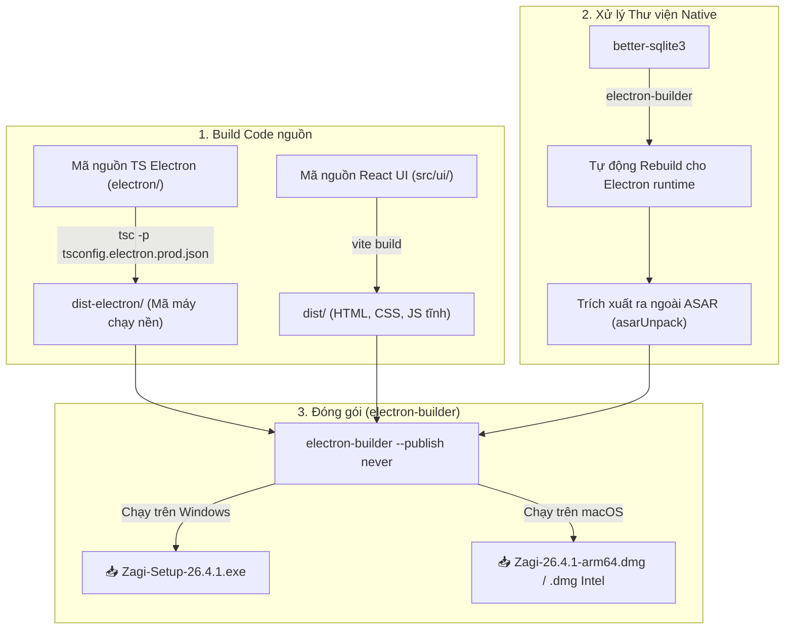

# Hướng dẫn Biên dịch (Build) & Đóng gói Ứng dụng Zagi

Tài liệu này cung cấp hướng dẫn chi tiết về cấu trúc mã nguồn, cấu hình hệ thống và các bước cụ thể để đóng gói ứng dụng **Zagi** thành tệp cài đặt chạy trực tiếp trên Windows (`.exe`) và macOS (`.dmg`).

---

## 🗺️ 1. Khảo sát Cấu trúc & Đánh giá mức độ Sẵn sàng (Build Readiness)

Mã nguồn Zagi hiện tại đã **đầy đủ và sẵn sàng 100% để biên dịch thành bản cài đặt (`.exe` / `.dmg`)**. Các file cấu hình cốt lõi của Electron, Vite, TypeScript và các kịch bản đóng gói đều được thiết lập chuẩn hóa.

### Sơ đồ luồng đóng gói thực tế:


### Các thành phần chính hỗ trợ đóng gói trong codebase:
1. **`package.json`**: Chứa toàn bộ kịch bản build (`npm run production`), danh sách thư viện phụ thuộc và cấu hình chi tiết cho `electron-builder` (bao gồm icon, định dạng tệp đầu ra, các phần không đóng gói nén `asarUnpack`).
2. **`tsconfig.electron.prod.json`**: Cấu hình TypeScript tối ưu riêng cho môi trường Production (loại bỏ source map, xóa chú thích để tối ưu dung lượng tệp).
3. **`vite.config.ts`**: Cấu hình bundle React Renderer, có hỗ trợ xáo trộn mã nguồn (obfuscator) thông qua `vite-plugin-javascript-obfuscator` và nén code bằng `Terser` để bảo vệ mã nguồn tối đa.
4. **`scripts/after-pack.js`**: Tự động chèn siêu dữ liệu (metadata) và biểu tượng (icon) vào tệp `.exe` trên Windows mà không cần ký số thương mại (code signing).

---

## 🛠️ 2. Chuẩn bị Môi trường Yêu cầu

Vì ứng dụng có sử dụng thư viện native **`better-sqlite3`** (được viết bằng C++ và biên dịch trực tiếp), máy tính của bạn cần cài đặt các công cụ phát triển để rebuild thư viện này.

### Yêu cầu chung:
- **Node.js**: Phiên bản khuyến nghị `18.x` hoặc `20.x` LTS.
- **npm**: Phiên bản `9.x` trở lên.

### Yêu cầu riêng theo hệ điều hành (Để biên dịch thư viện C++):
| Hệ điều hành | Bộ công cụ cần cài đặt | Lệnh cài đặt nhanh |
| :--- | :--- | :--- |
| **Windows** | Visual Studio Build Tools (C++ Workloads) & Python | Chạy PowerShell với quyền Admin:<br>`npm install --global --production windows-build-tools` |
| **macOS** | Xcode Command Line Tools | Chạy trong Terminal:<br>`xcode-select --install` |

---

## 🍎 3. Hướng dẫn Build Bản macOS (`.dmg`)

> [!IMPORTANT]
> Bạn **chỉ có thể build bản `.dmg` khi đang sử dụng máy tính chạy macOS**. Apple không cho phép biên dịch chéo ứng dụng macOS từ hệ điều hành khác nếu không qua môi trường ảo lập phức tạp.

### Bước 1: Cài đặt thư viện phụ thuộc
Mở Terminal tại thư mục `zagi-builder-main` và chạy:
```bash
npm install --legacy-peer-deps
```
*(Tham số `--legacy-peer-deps` giúp tránh xung đột phiên bản giữa các thư viện React 18).*

### Bước 2: Chạy thử trong môi trường Development (Tùy chọn)
Để đảm bảo ứng dụng hoạt động mượt mà trước khi đóng gói:
```bash
npm run dev
```

### Bước 3: Đóng gói bản Production
Chạy lệnh đóng gói:
```bash
npm run production
```

### Kết quả đầu ra:
Sau khi tiến trình hoàn tất, thư mục **`dist-electron-build/`** sẽ được tạo ra ở thư mục gốc chứa các tệp:
- `Zagi-26.4.1-arm64.dmg` (Dành cho máy Mac dùng chip Apple Silicon: M1, M2, M3, M4...).
- `Zagi-26.4.1.dmg` (Dành cho máy Mac dùng chip Intel).
- `Zagi-26.4.1-mac.zip` (Bản nén zip chạy trực tiếp không cần cài đặt).

---

## 🪟 4. Hướng dẫn Build Bản Windows (`.exe`)

> [!IMPORTANT]
> Bạn **nên thực hiện bước này trên máy tính Windows** để đảm bảo quá trình biên dịch thư viện native `better-sqlite3` và chạy công cụ `rcedit` để chèn icon vào file `.exe` diễn ra thành công.

### Bước 1: Cài đặt thư viện phụ thuộc
Mở PowerShell/CMD tại thư mục dự án và chạy:
```powershell
npm install --legacy-peer-deps
```

### Bước 2: Tiến hành Đóng gói
Chạy lệnh đóng gói:
```powershell
npm run production
```
Lúc này, công cụ đóng gói sẽ tự động:
1. Biên dịch TypeScript cho Electron Main process.
2. Chạy Vite để tối ưu React UI và lưu vào thư mục `dist/`.
3. Sử dụng `electron-builder` để tải xuống Electron binary phiên bản Windows (nếu chưa có).
4. Rebuild lại thư viện `better-sqlite3` tương thích với phiên bản Electron.
5. Gọi script `after-pack.js` chèn icon vào file `.exe`.

### Kết quả đầu ra:
Trong thư mục **`dist-electron-build/`**:
- `Zagi-Setup-26.4.1.exe` (File cài đặt chuẩn cho Windows 10/11).
- `win-unpacked/` (Thư mục chứa ứng dụng đã giải nén, có thể chạy trực tiếp bằng file `Zagi.exe`).

---

## 🔑 5. Lưu ý Quan trọng về Chứng chỉ Bảo mật (Code Signing)

Hiện tại cấu hình build trong `package.json` đang tắt yêu cầu ký chứng chỉ bảo mật:
```json
"forceCodeSigning": false,
"signAndEditExecutable": false
```
Việc này giúp bạn **biên dịch hoàn toàn miễn phí** mà không cần tài khoản nhà phát triển trả phí của Apple (99$/năm) hay chứng chỉ số Windows EV Code Signing (300-800$/năm). 

Tuy nhiên, điều này sẽ dẫn đến các cảnh báo bảo mật khi cài đặt lần đầu trên máy người dùng cuối:

### 1. Trên Windows (SmartScreen)
- **Cảnh báo**: Xuất hiện hộp thoại màu xanh *"Windows protected your PC / Windows đã bảo vệ máy tính của bạn"*.
- **Cách vượt qua**: Người dùng nhấp vào **"More info / Thông tin thêm"** -> chọn **"Run anyway / Vẫn chạy"**.

### 2. Trên macOS (Gatekeeper)
- **Cảnh báo**: Hộp thoại thông báo *"Ứng dụng không thể mở vì đến từ nhà phát triển không xác định"*.
- **Cách vượt qua**: 
  - *Cách 1*: Click chuột phải vào file `.dmg` hoặc ứng dụng trong Applications -> Chọn **Open** -> Chọn **Open** lần nữa.
  - *Cách 2*: Vào **System Settings** (Cài đặt hệ thống) -> **Privacy & Security** (Quyền riêng tư & Bảo mật) -> cuộn xuống phần Security -> Chọn **Open Anyway** (Vẫn mở).

---

## 📈 6. Danh sách các Lệnh chạy Hữu ích

| Lệnh | Ý nghĩa | Khi nào dùng |
| :--- | :--- | :--- |
| `npm install --legacy-peer-deps` | Cài đặt toàn bộ thư viện liên quan | Khi mới tải source code hoặc cập nhật thư viện |
| `npm run dev` | Khởi chạy ứng dụng trong môi trường phát triển (Hot reload) | Khi lập trình, sửa code hoặc kiểm thử nhanh |
| `npm run build:electron` | Chỉ biên dịch các file code nền TypeScript | Kiểm tra lỗi cú pháp/kiểu dữ liệu của Electron |
| `npm run build:renderer` | Chỉ đóng gói giao diện React UI | Kiểm tra lỗi giao diện hoặc CSS |
| `npm run production` | Biên dịch toàn bộ và xuất bản cài đặt `.exe`/`.dmg` | Khi cần phân phối ứng dụng cho người dùng cuối |
